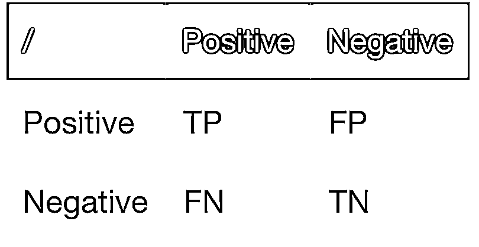
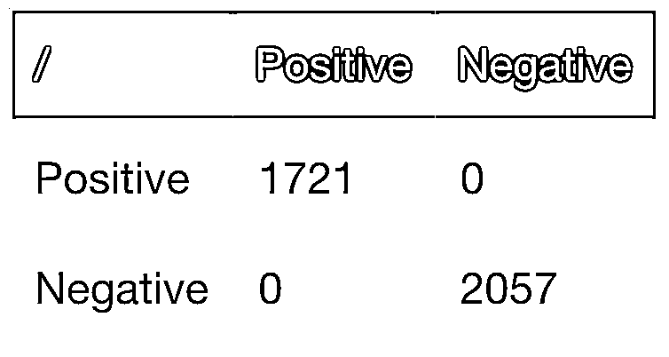
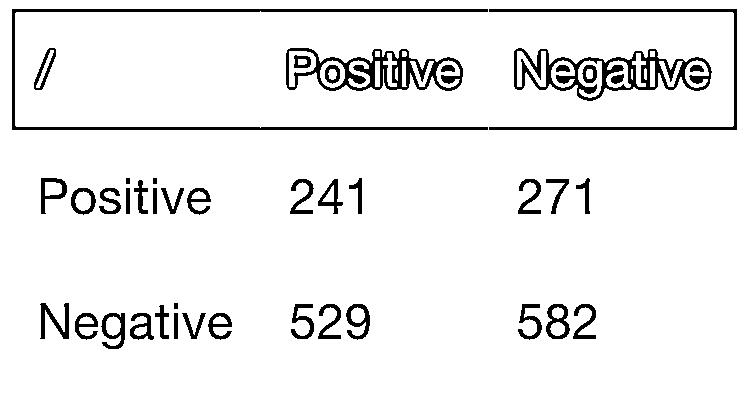

# 为什么机器学习应用交易那么难（上）

> 原文：[`mp.weixin.qq.com/s?__biz=MzAxNTc0Mjg0Mg==&mid=2653303594&idx=1&sn=933d1c648024c54a9b16cfa89a4c461c&chksm=802df13fb75a7829c0c10fb17e5d64033366ec26a2a8ff8c3834c65590249641823b73d144b1&scene=27#wechat_redirect`](http://mp.weixin.qq.com/s?__biz=MzAxNTc0Mjg0Mg==&mid=2653303594&idx=1&sn=933d1c648024c54a9b16cfa89a4c461c&chksm=802df13fb75a7829c0c10fb17e5d64033366ec26a2a8ff8c3834c65590249641823b73d144b1&scene=27#wechat_redirect)


**全网 TOP 量化自媒体**

公众号决定从 2020 年 7 月开始，**每周一**将推出一期有关全球**对冲基金、量化投研、金融机器学习、**机构招聘****等方面的周刊。为大家带来**最****新、最前沿**的**投研、资讯**内容，希望各位读者能够喜欢。


欢迎大家多提意见，我们完善到最优。

***1*** 

**前言**

今天这篇文章来自一家量化交易公司的某位研究员。他们试图通过大规模的机器学习技术来发现新颖的中频交易策略。

今天这位研究员来为大家分享一些他在工作中遇到的问题，仅供大家参考。 

在这里，我们列举一些金融数据方面的挑战，以及为什么用机器学习建模会如此困难。

**1、低信噪比**

*   标签的噪音。

*   特征和度量是有噪声的变量。

**2、特征向量非独立性**

*   许多机器学习算法要求每个样本（特征向量/标签）独立于其他样本。

*   许多特征利用了窗口，在当前样本和之前样本之间创建重叠，共享同一回测周期的部分内容，这会对训练产生毁灭性的影响，导致模型偏差和过拟合。

**3、标准损失函数不适合交易目标**

*   我们对损失（False Positives）的厌恶程度远高于机会成本（False Negative），而机器学习模型试图去平衡精确度和召回率。

*   许多监督机器学习算法需要调整到一个合适的交易目标。

**4、机会的稀疏性（对于某些策略）**

*   含义：用于监督学习的非平衡数据集。

*   一个交易机会通常是一个“异常值”，一个在数据中不那么频繁的事件。大多数机器学习算法都是面向平衡数据集的。

**5、非平稳性**

*   价格是非平稳的，收益是无记忆的，需要在两者之间寻找平衡。

*   时间窗口不是固定的。 

*   规则变化意味着基本交易模式的转变，即训练模式的复杂性。

**6、数据缺乏**

*   根据数据的频率或所需要的模型，金融数据往往不如其他领域的数据集丰富。

***2***

**例子**

假设我们想用机器学习来创建一个只做多的模型，来预测 5 天的收益率否大于某个最小收益率（比如 50bps）。

**1、创建标签，识别交易机会**

我们将标记：

5 天收益率>= 50bps with 1 和 < 50bps with 0 

**2、为模型创建特征**

请注意，我们并不主张使用技术指标，下面的特征只是为了说明，并不是有意选择的。

3、训练模型

4、评估

**5、完整代码**

```py
bars = getOHLC ("SPY")
close = bars["Adj Close"].values.flatten()

# 创建特征
df = bars.copy()
df["rsi"] = talib.RSI(close, timeperiod=14)
df["roc5"] = talib.ROC(close, timeperiod=5)
...

# 创建 { 0, 1 } 标签, where 1 means 5 day return >= 50bps
df["label"] = (df["roc5"].shift(-5) >= 0.50) * 1.0

# 特征的 columns
features = ["rsi", "roc1", "roc5", "roc10", "roc20", "oc", "hl"]

# 数据集分割
icut = int(df.shape[0] * 0.70)
training = df.iloc[:icut].dropna()
testing = df.iloc[icut:].dropna()

# 训练模型&特征
clf = RandomForestClassifier(n_estimators=500, random_state=1, n_jobs=-1)
model = clf.fit (training[features], training.label)

#分别用模型对训练集和测试集的标签进行预测
pred_train = model.predict(training[features])
pred_test = model.predict(testing[features]) 
```

现在让我们看一下用于通过我们训练的模型进行训练和测试的混淆矩阵。对于交易，我们希望最大化 TP（true-positive，盈利的交易）和最小化 FP（false positives，亏损的交易）：



在交易方面，我们不太关心 TN（true negative）和 FN（false negative）。false negative 意味着错过了机会，但是没有损失。

现在，让我们根据训练数据和测试数据来评估模型的混淆矩阵。我们希望样本外的测试数据能够提供类似于训练的准确性，并且 TP 与 FP 的比值较高。

```py
confusion_matrix(training.label, pred_train)
confusion_matrix(testing.label, pred_test) 
```

结果表明，我们的训练周期有一个完美的契合（FN=0 和 FP=0）。这是一个很明显的过拟迹象：



而且在样本外测试中，损失的精度很差：



***3***

**讨论**

上面的例子说明了我们将在后续文章中讨论的一些问题：

**1、标签有噪声**

*   们已经指定+1 标记的收益率>=50bps，但是其中一些收益率可能不能代表潜在的变动，而只围绕真实价格噪音的表现。例如，一段时期内的真实价格收益率可能为 0，但方差为 50 个基点或更多。

*   们已经指定 0 标记的收益率< 50bps 签，然而，在某些情况下，潜在的价格过程可能在该期间产生>= 50bps，但是由于大约 50bps+平均值的波动，样本收益率降低到 50bps 以下。

*   因此，我们在某些情况下将模型映射到噪声中，并偏离模型。

**2、特征是嘈杂的**

*   特别是 open-close 和 high-low 特征，将受到波动性。

**3、样本不是独立的**

我们的特征集中的每一行都不是独立于相邻的行。最长的特征有一个 20bar 的 lookback 窗口。因此，每个特征行将与其他 40 个特征重叠（20 个在过去+20 个在未来）。许多机器学习算法由于非独立性而利用了信息泄露模型，在训练中产生了一个过拟合模型。

**4、错误的损失目标**

我们倾向于优化 TP 和 FP（精度）之间的平衡，而不是平衡精度和召回率。

在后续的文章中，我们会更深入地讨论这些问题，并提出一些可以对算法、数据集等改进的方案。

量化投资与机器学习微信公众号，是业内垂直于**Quant、MFE、Fintech、AI、ML**等领域的**量化类主流自媒体。**公众号拥有来自**公募、私募、券商、期货、银行、保险资管、海外**等众多圈内**18W+**关注者。每日发布行业前沿研究成果和最新量化资讯。

**点赞♥ ****+ ****在看**★****