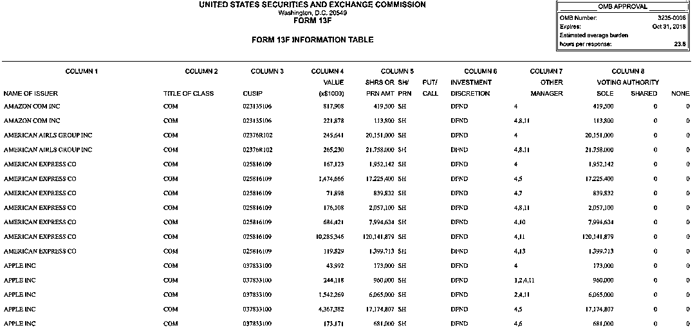

# 新专栏发布：『量化圈资讯周刊』来啦！

> 原文：[`mp.weixin.qq.com/s?__biz=MzAxNTc0Mjg0Mg==&mid=2653303572&idx=1&sn=e4661acb180255f59275cf345099b133&chksm=802df101b75a78178ec7ddffbb2bedcb9474834f31edc5f5ee5589d6bef6c41ac4ea4ec7cf8c&scene=27#wechat_redirect`](http://mp.weixin.qq.com/s?__biz=MzAxNTc0Mjg0Mg==&mid=2653303572&idx=1&sn=e4661acb180255f59275cf345099b133&chksm=802df101b75a78178ec7ddffbb2bedcb9474834f31edc5f5ee5589d6bef6c41ac4ea4ec7cf8c&scene=27#wechat_redirect)

量化投资与机器学习微信公众号，是业内垂直于**Quant、Fintech、AI、ML**等领域的**量化类主流自媒体。**公众号拥有来自**公募、私募、券商、期货、银行、保险、海外**等众多圈内**18W+**关注者。每日发布行业前沿研究成果和最新量化资讯。

**官宣**

公众号决定从今日起，**每周日**推出一期有关全球**对冲基金、量化投研、金融机器学习、**机构招聘****等方面的周刊。为大家带来**最****新、最前沿**的**投研、资讯**内容，希望各位读者能够喜欢。  

各位读者有什么好的 idea 和建议，请在**留言区**告诉我们！ 

本周主题：**对冲基金、卖方金工、最新论文、量化岗位**

**对冲基金**

# **桥水基金大规模裁员**

据彭博社报道，全球最大的对冲基金公司桥水表示，公司正计划裁员，以及新技术正在改变为客户提供服务的人员类型。在本周五（7 月 24 日）桥水的一份电子邮件声明中表示：“世界正在发生巨大变化，我们正在采取措施适应它，尽管今年离开公司的人数将超过正常水平，但不会比正常情况高出太多。我们将继续在关键领域投资和招聘”。同时，桥水表示，即将离职的员工将获得“丰厚的遣散费和延长医疗保险”。

今年上半年，桥水的的 Pure Alpha II 基金下跌了 20.6% 。

**Point72 被指控存在职场性别歧视**

# 据彭博社报道，来自史蒂芬·科恩 Point72 的一名高级女性前雇员对其进行了申诉。根据法庭文件和对康涅狄格州人权与机会委员成员的采访，在 Point72 的投资者关系部门工作的 Shannon Gitlin 近几个月向该委员会提交了申诉。设立该机构的目的是防止在住房、就业和合同遵守方面的歧视。

此前 Point72 也受到过类似的起诉：Lauren Bonner 于 2016 年 8 月加入 Point72，她管理着该公司的人才分析团队。根据 Lauren Bonner 在一份诉讼中称，Point72 聘用和晋升的女性比男性少，支付给她的薪水比承担同等或更少责任的男性同事低，只有一名女性基金经理和一名女性董事总经理。

# **黑石背景对冲基金，使用机器学习控制资金流动**

由黑石集团（Blackstone）支持的一家机器学习对冲基金在今年新冠肺炎的市场中取得了 20%的涨幅，目前正在经历一个快速增长的过程。在伦敦仅有 5 名员工的 Bayforest Capital 计划在未来一个月管理 2.35 亿美元的资产，而 2019 年底的仅为 4500 万美元。他们还计划在今年晚些时候推出一只面向机构投资者的基金。 其中一位量化分析师 Theodoros Tsagaris 曾在 Tudor Investment、GSA Capital 和 BlueCrest Capital Management 任职。Tsagaris 曾在帝国理工写了一篇关于从数据流构建自适应算法的博士论文：

**250 页**，各位慢慢看，说不定有收获！

下载地址：https://spiral.imperial.ac.uk/handle/10044/1/6117

Tsagaris 表示：“我们每天接收数十亿个数据点，并根据最新信息调整我们的算法”。他将 Bayforest 的成功归功于实时处理资金流动快速变化的算法。通过基于不同投资者行为的期货交易系统，以及平均仅 8 天的持有期。

**点评**

像 Bayforest 这样的对冲基金，我们将其成功归于较短的持仓期和更具适应性的交易信号，有些人可能会反驳：长期来看，不断调整投资组合可能不会有稳定收益。

但是，Bayforest 的优势在于它能够不断地发现新的模式，即使当市场参与者试图通过改变交易方式来隐藏自己的踪迹时，Bayforest 也能做出调整。

就像 Bayforest 所说：我们看到的是在以前不明显的领域，出现了惊人的 Alpha！

**美国证券交易委员会将提高 13F 门槛**

根据美国证券交易委员会表示：只有资产超过 35 亿美元的基金公司，才向监管机构提交 13F。目前提交公司的最低要求是 1 亿美元。

证交会 Jay Clayton 在一份声明中表示: “今天的提议将在 40 多年来首次更新 13F 报告门槛，进一步推进法定目标，即让证交会能够监控大型投资管理公司的持股情况，同时减轻小型经理公司不必要的负担，公众有 60 天的时间向证交会提交意见，之后委员们将对最终提案进行表决”。

**什么是 13F？**

13F（也叫 SEC 13F)，是一份季度报告，由机构投资经理提交给美国证监会（SEC，U.S. Securities and Exchange Commission）。SEC 规定**：****股票资产超过 1 亿美元的机构，都需要在每个季度结束的 45 天内向 SEC 提交该季度末的股票持仓报告**。它的内容包括该基金的一些基本信息，以及所持成分股的信息，例如持有股数，成分股所占头寸等等。下面是巴菲特目前最新持有的所有股票： 

**13F 文件有两个需要注意的点：**一是只要求基金披露他们的多头头寸，而很多基金都会出于风险管理的目的，同时持有同一公司的多头和空头头寸，因此 13F 文件并不能保证提供了完整的机构投资信息除此之外，有的基金也会向 SEC 申请隐瞒一部分的持股情况，以保护自己的持仓信息。例如，机构即使是在看跌的情况下仍然持有该公司的股票，但同时有持有该公司的看跌期权的情况也很正常（机构在投资某公司时同时使用了股票和期权的情况很常见）。

# **高盛建议监管机构放宽对 13F 披露的要求，**美国证券交易委员会提出的一项改变对冲基金报告要求的可能影响对冲基金的拥挤程度。这一调整将使其分析中的基金数量从 822 家削减至 59 家，并将涵盖的股票资产从 1.2 万亿美元缩减至 8150 亿美元。

# 

以 David Kostin 为首的策略师在 7 月 17 日的一份报告中称，"对冲基金申报文件减少的主要缺点是对拥挤风险缺乏清晰度。"报告的对冲基金持有量使投资者能够理解拥挤风险，并适当地对冲投资组合”。

高盛还表示，这一变化可能会促使其构建对冲基金名单的方法发生改变。该名单来自 13F 的数据，包括在对冲基金投资组合中排名前 10 位的 50 只股票。策略师说，自 2001 年以来，该篮子有 61%的季度表现优于标普 500 指数，季度平均超额收益率为 57 个基点。

# **最热门的对冲基金策略面临生存危机**

Lansdowne Partner 关闭了这因 long-short 而闻名的股票基金，引发了人们对同行未来的担忧。这些基金的倒闭，进一步证明了一个残酷的现实：近年来，这类基金抓住了市场的大部分下行风险，但只抓住了极少部分上行风险。他们还提出了这样一个问题：如果这场严重打击全球经济的致命流行病的到来不能让卖空者受益，那么还有什么可以呢？

当 3 月份市场暴跌时，根据彭博指数我们看到，有 87% 的股票对冲基金是亏损的，其中一半亏损超过 10% 。根据 7 月上旬数据显示，今年上半年 70% 的基金仍在下跌。截止 2020 年数据 5 月底。标普 500 指数收益率与对冲基金收益率对比：

根据彭博收集的数据，对冲基金研究公司追踪的股票多空对冲基金在 2020 年前五个月的平均损失超过标普 500 指数。去年，当该指数飙升 31.5%时，多空基金获得的涨幅还不到一半。2018 年，它们的跌幅也超过了该指数。

# 根据 eVestment 的数据显示，2019 年，投资者从多空基金撤出 440 亿美元，这是所有投资策略中撤资最多的一年。今年大部分时间，他们都希望空头能有好的表现，但今年 5 月，他们又撤走了 51 亿美元。

**高盛计划将把对冲基金服务转移到 Marquee 平台上**

高盛计划将其主要服务业务转移到旗舰电子平台 Marquee 上，此举将使新基金发行的融资过程数字化。该项目被称为 Marquee Connect，将包括开发电子资本引入服务，为对冲基金与潜在机构投资者建立联系提供一种新的虚拟方式。

高盛在其网站上表示，该计划将使对冲基金能够推出新基金，与感兴趣的投资者建立联系，并保持对信息共享方式的控制权。

用户还可以根据策略、地理位置、费用和业绩搜索他们希望投资的投资工具，这可能会让投资者接触到高盛大宗经纪部门的一些全球顶级经理人。

高盛全球资本引进主管 Diana Dieckman 将负责监督该项目。

# **对冲基金 Pequot Capital 创始人去世，享年 79 岁**

曾经是世界上最大的对冲基金公司 Pequot Capital Management 的创始人 Arthur Samberg 去世，享年 79 岁。Samberg 于 1941 年 2 月 6 日出生于布朗克斯，在麻省理工学院获得学士学位，在斯坦福大学获得航空工程硕士学位，在哥伦比亚大学获得工商管理硕士学位。

Samberg 在 2015 年接受彭博电台采访时表示：“我的成功之处在于，我掌握了技术方面的专业知识，并将其与金融结合起来，努力运用这两者来帮助企业积累资本、增长和创造就业”。

**Marshall Wace 出版书籍**

全球上最大的对冲基金之一的 Marshall Wace 首席投资官 Paul Marshall 近日出版一本新书：

***《10½ Lessons from Experience: Perspectives on Fund Management》***

**Lansdowne Partners 关闭规模为 28 亿美元的主要对冲基金**

总部在伦敦，欧洲最古老的对冲基金之一的 Lansdowne Partners 宣布：关闭规模为 28 亿美元的主要对冲基金。Lansdowne 表示：客户可以提取资金，或将其转移到 Lansdowne 发达市场多头基金以及投资早期阶段公司的新创立的 LDM 机会基金中。该公司其他一些基金将会继续对公司采取做空策略。2020 年上半年，Lansdowne 亏损了 23% ，原因是其航空公司股票的多头头寸受到了冠状病毒疫情的严重打击。

多年的低收益导致该公司 AUM 不断下降，其资产从 2015 年的近 220 亿美元的峰值降至 6 月的 98 亿美元。

英国《金融时报》去年报道称，自 2008 年以来，该基金的空头押注总体上没有超越市场，反映出在央行宽松政策的环境下，一些基金经理很难从空头头寸中赚钱。在去年的牛市中，该基金仅上涨了约 1% ，而在此前的 3 年中，有 2 年出现了亏损。它低估了 Brexit（对英国退出欧盟的一种戏谑说法）对英国股市的影响。

**今年表现最佳的基金之：Skye Global**

根据金融时报报道，今年上半年，总部位于纽约，管理规模为 15 亿美元的 Skye Global 上涨约 34% 。早今年第一季度，该基金在做空股票方面赚了钱。在美国市场以科技股为主导的反弹期间，Skye 还从对互联网和软件类股的大举押注中获利。根据监管备案文件，Skye 一直在微软、亚马逊、Alphabet 和 Facebook 持有大量头寸，这些公司今年的表现都远远超过了整体市场。该基金成立于 4 年前，在 2016 年下半年仅实现了微薄利润，在后面几年，该基金实现了 77% 、35% 和 54% 的年化收益。

## **十佳私募基金产品排行榜公布**

根据私募排排网最新报道：私募排排网分别以一年期、三年期、五年期私募基金产品最近一年的融智评级结果为标准，按照今年以来的收益率排名制定融智评级十佳产品前十排行榜。需要注意的是，纳入排名范围的产品最近一年的融智评级必须有 80%的月份被评为五星，方可参与排名。以下为榜单详情：

**卖方金工**

2020 年 7 月 20 日——2020 年 7 月 26 日，卖方金工团队主要报告如下，**获取具体报告详见公众号后台****【后花园】****：**

**东北证券**

1、市场大跌叠加北向出逃，聪明的资金在买什么？

2、未来半年哪些板块有确定性机会？

**华宝证券**

1、基于因子的资产配置：思路、方法及运用

**华安证券**

1、信息提纯，寻找高质量反转因子

2、偏度之外，股票收益的不对称性

3、指数增强基金跟踪模板

**申港证券**

1、宏观利率走势的因子研究

**湘财证券**

1、基于沪深 300 指数：支持向量机在股票择时中的应用

**兴业证券**

1、基本面量化视角下的大健康板块选股研究

2、西学东渐-八十六

3、利用基金仓位信息对市场择时 

**中金公司**

1、构建策略间分散化组合，抵御市场极端风险 

**光大证券**

1、专利数据，让科技指数更美

**长江证券**

1、拥抱低 beta 

2、外资扰动不大，解禁影响几何？

**国盛证券**

1、稳定型行业基本面量化，择时与选股

**华泰证券**

1、基于风险平价的 CTA 组合策略

2、利器助良工，嘉实 ESG 评分体系

**国信证券**

1、走进新时代，上证指数的第 29 次突破 3000 点

**开源证券**

1、A 股市场中如何构造动量因子？

**天风证券**

1、天风证券海外文献推荐第 143 期

**中信证券**

1、基金定投策略在财富管理中的应用 

**东吴证券**

1、兼顾收益和风险，如何在牛市中稳健投资 

**海通证券**

1、基于机器学习和知识图谱的行业轮动 

**最新论文**

**最新论文 1**

***《Which Investors Matter for Equity Valuations and Expected Returns?》***

对冲基金对股价的影响力远远超过大多数其他类别的投资者，而指数基金是影响力最小的一类。

**论文下载地址：**https://papers.ssrn.com/sol3/papers.cfm?abstract_id=3378340

“考虑到对冲基金规模相对较小，它们的影响力是显著的。”作者写道。Koijen 等人发现，规模较小的投顾对价格的影响排在第二位，而且在许多其他特征上的影响甚至更大。

这项研究并没有对未来进行推测。但它也指出，如果对冲基金转向市场指数策略，这将意味着需要更大的价格波动，才能对一个庞大的被动投资组合产生影响。这项研究还强调了一个道理，即积极的小型投顾对证券在海外的定价至关重要。

**最新论文 2**

***《Cryptocurrency Volatility Markets》***

**论文下载地址：**https://papers.ssrn.com/sol3/papers.cfm?abstract_id=3639098

每当交易员们想要评估股市情绪时，有一个真正流行且有用的指数是他们大多数人会参考的。那就是芝加哥期权交易所的 VIX 指数。如果我们想要确定**加密货币的情绪**，我们可以使用哪个指数?我们可以看看 Fabian Woebbeking 写的一篇论文，它提供了计算两个加密货币**波动指数（CVX 和 CVX76）**的方法。CVX 和 CVX76 指数也从期权价格中提取市场对未来波动性的预期。研究表明，加密货币期权市场最终达到了足够的市场规模，可以提取稳定的加密货币波动信息。

**最新论文 3**

***《Deep Learning Modeling of the limit order book》***

**论文下载地址：**https://arxiv.org/pdf/2007.07319.pdf

目前的工作针对**高频交易深度学习**领域的理论和实践问题，通过对文献和最新模型的全面回顾和分析。将随机模型、Logistic 回归、LSTM、NN-LSTMs 和 MLPs 在相同的任务、特征空间和数据集上进行比较，并根据相似度和性能指标对其进行聚类。我们可以观察到多层感知器的性能与最先进的 CNN-LSTM 架构相当，甚至更好。

**最新论文 4**

***《Fourier instantaneous estimators and the Epps effect》***

**论文下载地址：**https://arxiv.org/pdf/2007.03453.pdf

作者比较 Malliavin-Mancino 和 Cuchiero-Teichmann 傅里叶瞬时估计器，以研究瞬时估计中异步引起的 Epps 效应的影响。作者在一个模拟环境下演示了瞬时 Epps 效应，并提供了一种简单的方法来改善这种效应。作者发现，使用前面的蜱虫插值 CuchieroTeichmann 估计结果不稳定的估计处理异步时，虽然能够绕过 Malliavin-Mancino 估计量的时域允许它来产生稳定的估计，因此更适合**超高频金融**。利用约翰内斯堡证券交易所的交易和报价数据进行的实证分析说明了瞬时 Epps 效应，以及同一股票对的日内关联动态如何在不同的日子变化。

**最新论文 5**

***《Improving the Robustness of Trading Strategy Backtesting with Boltzmann Machines and Generative Adversarial Networks》***  

**下载地址：**https://arxiv.org/pdf/2007.04838.pdf

**量化岗位** 某领先对冲基金 | 量化技术岗招聘（社招+实习）

2020-07-24

 鸣熙资本，前 Optiver 背景 | 初级量化交易员招聘

2020-07-23

 国富期货资管部 | 数据分析和策略编程岗校招（双向选择）

2020-07-19

 锴量投资 | 量化策略分析师招聘（全职+实习）

2020-07-19

 太平洋证券金工团队 | 量化实习生招聘

2020-07-19

 幻方量化 | 2021 校园招聘正式开启！

2020-07-15

 光大证券金工组 | 量化多岗位招聘（实习）

2020-07-15

 道卿科技 | 量化多岗位招聘（社招）

2020-07-15

 千象资产 | 量化多岗位招聘（全职+实习）

2020-07-13

 衍盛中国 | 量化多岗位招聘（社招+实习）

2020-07-02

 央企资管量化团队 | 量化实习生招聘（长期）

2020-07-03

 顶级量化私募 | 量化多岗位招聘（社招）

2020-07-06

 财通证券金工团队 | 资深分析师招聘

2020-07-07

