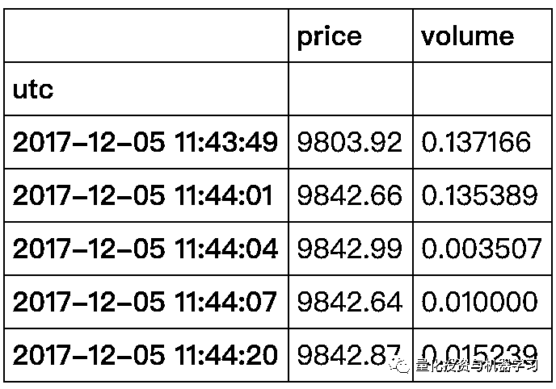

# 机器学习应用资产管理系列一：强化学习策略 （附代码）

> 原文：[`mp.weixin.qq.com/s?__biz=MzAxNTc0Mjg0Mg==&mid=2653303251&idx=1&sn=1de012482f9b077c95fe76d59bb681ad&chksm=802df3c6b75a7ad0655986e0a32f7c4a4820cb93c5ccdb5b3ec4bd11d1778d49963a323cbf10&scene=27#wechat_redirect`](http://mp.weixin.qq.com/s?__biz=MzAxNTc0Mjg0Mg==&mid=2653303251&idx=1&sn=1de012482f9b077c95fe76d59bb681ad&chksm=802df3c6b75a7ad0655986e0a32f7c4a4820cb93c5ccdb5b3ec4bd11d1778d49963a323cbf10&scene=27#wechat_redirect)


**全网 TOP 量化自媒体**

几十年来，我们看到了技术的兴起和发展。量化金融的这种循环很可能会持续下去，并且也适用于资产管理中的机器学习，但需要注意的是，机器学习实际上也是革命性的，而不仅仅是最大化 Alpha，它还使无意中听到的成本最小化。机器学习已经在许多金融领域产生了巨大的经济影响，并且有望进一步发展。先进的机器学习模型在灵活性、效率和增强的预测质量方面具有无数优势。

从今天开始，公众号将给全网读者带来**《机****器学习应用资产管理系列》，共计 20 篇文章，****由浅入深。**我们将从下图出发，为大家全面讲解此内容。希望你有所收获！


**每种交易策略最终都可以使用多种机器学习框架。每一种都利用了强化、监督、无监督或这些学习框架进行组合。**例如，技术分析和统计套利策略可以使用监督或强化学习方法或两者的组合，而因子投资策略可以使用监督或非监督学习方法。

在第一篇推文中。我们将利用梯度下降来最大化收益函数，为大家讲解基于强化学习的投资策略。开篇入门。后续会更加深入。

***2***

**正文**

夏普比率将用作收益函数。夏普比率用作衡量一段时间内投资的风险调整性能的指标。假设无风险利率为零，夏普比率可以写成：

#### <embed style="vertical-align: -2.819ex;width: 28.711ex;height: auto;max-width: 300% !important;" src="https://mmbiz.qlogo.cn/mmbiz_svg/a18XcQ1EBBiac5beoTHDXQ1YSuamR91AbtnldibIjUlzgateaZUm6jdXS6AqrDosGEOyf2icDPEyUNvqicOpp0B4YU1ogRZww5yN/0?wx_fmt=svg" data-type="svg+xml">

代码如下：

```py
def sharpe_ratio(rets):
    return rets.mean() / rets.std() 
```

使用夏普比率作为我们的收益函数，但是我们如何知道什么时候交易？我们将使用下面的函数 F 来确定：

这个函数将产生一个 0 到 1 之间的值，它将告诉我们投资组合中应该购买资产的百分比。与上一篇文章一样， 将是我们将使用梯度上升优化的参数，而将是时刻的输入向量。对于本文，我们将把输入向量分配为。

其中 是资产在时刻 和 之间的百分比变化， 是时间序列输入的数量。这意味着在每一个时间步长，模型将被输入它的最后位置和一系列历史价格变化，它可以用来计算它的下一个位置。我们可以通过下面的 Python 函数计算出给定价格 和 的所有位置：

```py
import numpy as np

def positions(x, theta):
    M = len(theta) - 2
    T = len(x)
    Ft = np.zeros(T)
    for t in range(M, T):
        xt = np.concatenate([[1], x[t - M:t], [Ft[t - 1]]])
        Ft[t] = np.tanh(np.dot(theta, xt))
    return Ft 
```

我们可以用下面的公式计算收益 在每个时间步长：

在这种情况下 是我们的交易成本率。函数如下：

```py
def returns(Ft, x, delta):
    T = len(x)
    rets = Ft[0:T - 1] * x[1:T] - delta * np.abs(Ft[1:T] - Ft[0:T - 1])
    return np.concatenate([[0], rets]) 
```

这些收益可以用来计算我们的夏普比率。

**确定梯度**

我们必须计算夏普比率的导数，或者用链式法则计算 ，我们可以将其写成：


关于上式的推导步骤看这里：


*http://cs229.stanford.edu/proj2006/Molina-StockTradingWithRecurrentReinforcementLearning.pdf*

我们可以计算梯度函数的导数：

```py
def gradient(x, theta, delta):
    Ft = positions(x, theta)
    rets = returns(Ft, x, delta)
    T = len(x)
    M = len(theta) - 2

    A = np.mean(rets)
    B = np.mean(np.square(rets))
    S = A / np.sqrt(B - A ** 2)

    grad = np.zeros(M + 2)  
    dFpdtheta = np.zeros(M + 2)  

    for t in range(M, T):
        xt = np.concatenate([[1], x[t - M:t], [Ft[t-1]]])
        dRdF = -delta * np.sign(Ft[t] - Ft[t-1])
        dRdFp = x[t] + delta * np.sign(Ft[t] - Ft[t-1])
        dFdtheta = (1 - Ft[t] ** 2) * (xt + theta[-1] * dFpdtheta)
        dSdtheta = (dRdF * dFdtheta + dRdFp * dFpdtheta)
        grad = grad + dSdtheta
        dFpdtheta = dFdtheta

    return grad, S 
```

**训练**

现在我们有了梯度函数，我们可以使用梯度上升优化参数。我们将使用 来更新 的每个 epoch，其中 是学习率。

```py
def train(x, epochs=500, M=5, commission=0.0025, learning_rate = 0.1):
    theta = np.ones(M + 2)
    sharpes = np.zeros(epochs) 
    for i in range(epochs):
        grad, sharpe = gradient(x, theta, commission)
        theta = theta + grad * learning_rate
        sharpes[i] = sharpe

    print("finished training")
    return theta, sharpes 
```

现在我们有了模型，让我们使用历史比特币数据来测试它。我将使用从（***https://api.bitcoincharts.com/v1/csv/***）下载的 Bitstamp 交易记录：


```py
%matplotlib inline
import matplotlib.pyplot as plt
plt.rcParams["figure.figsize"] = (5, 3) # (w, h)
plt.rcParams["figure.dpi"] = 200
import pandas as pd

btc = pd.read_csv("bitstampEUR.csv", names=["utc", "price", "volume"]).set_index('utc')
btc.index = pd.to_datetime(btc.index, unit='s')
rets = btc['price'].diff()[1:]
btc.head() 
```



对于这个策略，我们将在 1000 个样本上训练模型，然后在接下来的 200 个样本上交易。让我们把数据归一化，然后把它分成训练数据和测试数据。

```py
x = np.array(rets)
x = (x - np.mean(x)) / np.std(x) # normalize

N = 1000
P = 200
x_train = x[-(N+P):-P]
x_test = x[-P:] 
```

模型训练好！我们将给模型一个 5 的向后 look 窗口。

```py
theta, sharpes = train(x_train, epochs=2000, M=5, commission=0.0025, learning_rate=.001) 
```

为了看看训练的效果如何，我们可以画出每个历元的夏普比率，希望能看到它收敛到最大值。


我们可以看到，作为模型训练，它收敛于一个最大的夏普比。让我们看看模型在训练数据上的表现：

```py
train_returns = returns(positions(x_train, theta), x_train, 0.0025)
plt.plot((train_returns).cumsum(), label="Reinforcement Learning Model")
plt.plot(x_train.cumsum(), label="Buy and Hold")
plt.xlabel('Ticks')
plt.ylabel('Cumulative Returns');
plt.legend()
plt.title("RL Model vs. Buy and Hold - Training Data"); 
```


我们可以看到，通过训练数据，我们的强化学习模型大大优于简单地购买和持有资产。让我们看看它在接下来的 200 个 ticks 中是如何运行的，这是从模型中得到的。

```py
test_returns = returns(positions(x_test, theta), x_test, 0.0025)
plt.plot((test_returns).cumsum(), label="Reinforcement Learning Model")
plt.plot(x_test.cumsum(), label="Buy and Hold")
plt.xlabel('Ticks')
plt.ylabel('Cumulative Returns');
plt.legend()
plt.title("RL Model vs. Buy and Hold - Test Data"); 
```


模型表现一般！这个模型可以通过设计更多的特征（输入）来改进，大家可以试试 A 股效果如何。

量化投资与机器学习微信公众号，是业内垂直于**Quant、MFE、Fintech、AI、ML**等领域的**量化类主流自媒体。**公众号拥有来自**公募、私募、券商、期货、银行、保险资管、海外**等众多圈内**18W+**关注者。每日发布行业前沿研究成果和最新量化资讯。

**点赞♥ ****+ ****在看**★****