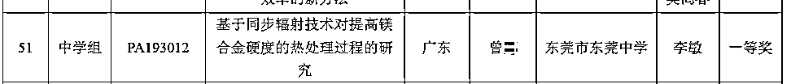
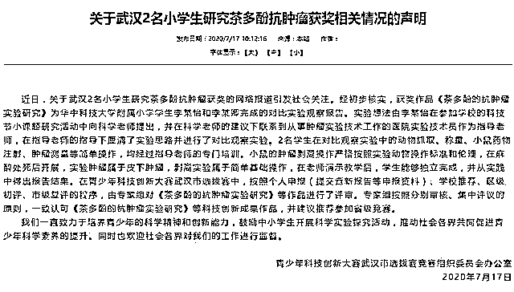

# 我的某某父亲···

> 原文：[`mp.weixin.qq.com/s?__biz=MzAxNTc0Mjg0Mg==&mid=2653303153&idx=1&sn=2b3ee1aff329c377a38a706424c3cdfe&chksm=802df364b75a7a7283e54e34a0db30ad83a653c87eb8a2808a2be70329b609888a2be64a1c1d&scene=27#wechat_redirect`](http://mp.weixin.qq.com/s?__biz=MzAxNTc0Mjg0Mg==&mid=2653303153&idx=1&sn=2b3ee1aff329c377a38a706424c3cdfe&chksm=802df364b75a7a7283e54e34a0db30ad83a653c87eb8a2808a2be70329b609888a2be64a1c1d&scene=27#wechat_redirect)

**全网 TOP 量化自媒体**

##### 金磊 白交 发自 凹非寺 
量子位 报道 | 公众号 QbitAI 

现在的中小学「后浪们」，到底强到了什么地步？

看了下**《全国青少年科技创新大赛》**的结果，我快**自闭**了。

结果简直惊掉下巴…..这都是些什么天书般的课题？ 

原来，**小学生**就已经开始搞「6-BA 细胞分裂」、「黄酮类化合物」、「C10orf67」。

**中学生**也是不甘示弱，「响应型纳米粒」、「螺吡喃-芘双色团」、「肾小管 IMCD3 细胞株」。

不禁让人想到前不久火爆全网的演讲《后浪》里的一句话：

然而，冷静思考一下，这真的是初高中，甚至小学水平的孩子，就能 hold 得住的课题吗？

翻了翻资料，挖了挖人——哦，原来这比赛，是一场**「科研亲子接力棒大赛」****。**

为什么这么说？各位看官且细品。

***1***

**超乎寻常的课题难度**

这些课题中涉及到的概念，难度系数有多高？

先来看下最近比较热议的《C10orf67 在结直肠癌发生发展中的技能与机制研究》。

根据公开资料来看，这项研究的作者，是来自昆明市盘龙区一所小学的学生，陈某石。

相信大多数人看到这个题目的第一反应都会是——什**么是 C10orf67？**

在网上查了查资料，原来，C10orf67 是人类第 10 号染色体上的一个基因。

换成简单一点的说法，这个题目的意思就是——某个基因在直肠癌发生发展中的功能与机制研究。

紧接着，第二个问题就来了——小学生就知道什么基因了？

要知道，对于「基因」这个概念，本科生都需要发给一年的时间来研究。

而根据这位陈小朋友在日记中的描述，他一开始也不是非常明白什么是基因。

然而，短短 4 天时间内，已经到了**「了解 PCR 技术的原理，知道 PCR 引物的设计」这种境界了。**

而且也了解了**「PCR 扩增 mRNA 底物和荧光基因的概念」。**

有网友评论道：

> 这项论文的水平，已经达到了博士级别。

不明觉厉……

再来看下最近热议的另一个题目——《二氢杨梅素调节肝脏脂代谢及细胞外基质生成的作用研究》。

这是第 33 届比赛的中学组一等奖研究。

单从题目上来看，也是一项难度系数极高的研究了(它下面的 2 项研究也是如此…)。

这项研究的作者，是当时还在重庆念高二的**彭某珊**同学。

虽然高中生对于生物可以说是具有一定生物知识储备，但单是这项研究的水平，应该是硕士级别。

怎么说？

因为有网友扒出来，彭某珊的研究和某篇硕士论文里的图片数据一模一样。

来感受下二者之间数据图的画风。

嗯，确实是比较明显了。

***2***

**难以置信的操作难度**

除了课题概念上的难度外，还有操作方面让人费解的点。

先看这位曾同学的研究——「基于同步辐射技术对提高镁合金硬度的热处理过程的研究」。

这个实验是在「上海同步辐射光源」做的，惹得量子位同事一阵「柠檬」：

> 我读研那会儿，老师都弄不到这个资源。

要说「同步辐射光源」，可以说是非常厉害的技术了，全国范围内只有**三家**，北京、上海、合肥。

北京的同步辐射光源被称为**「第一代」**，合肥是**「第二代」**，而「上海光源」是目前世界上性能最好的第三代中能同步辐射光源之一。

据媒体报道， 一位业内人士发文说，因为需求旺盛，上海光源的测试排期都是 24 小时连轴转，每年一堆人排队等着用。

在上海同步辐射光源官网上，有这样一个机时申请资格：**在职科研人员**，特别强调的是，目前**学生**不能独立申请。

申请时间则是全年接收课题申请，每年分两期进行专家评审。而她又是如何能够申请到呢？

进一步，就搜到了在航空材料报上刊发的论文「基于同步辐射技术的 WE54 镁合金原位时效研究」。

同样都是镁合金，同样采用「同步辐射技术」，同样进行的「原位研究」。

而第一作者正是曾同学，而二作则是来自上海交通大学的「轻合金精密成型国家工程研究中心」的周某晋同学。

嗯，同在上海，又有知名机构背书，答案就自然不言而喻了。

再来看这位段某严同学，全重庆市唯四获得一等奖的同学。他的研究是「用蛋清做个元器件——柔性忆阻器及交叉阵列的研究与制备」。

顾名思义，就是采用蛋清作为原料，利用黑色素、甘油和去离子水对蛋清蛋白质进行改性，制备出一种高柔性忆阻器。

忆阻器，就是一种有记忆功能的非线性电阻，通过控制电流的变化可改变其阻值。

用它设计的电路有仿生功能，能够实现类似人脑神经网络的结构和功能，大大提高了运算效率。

但就有网友表示，一个中学生很难有足够的能力，完成这个同时涉及**计算机、电子、物理**等专业的课题。

那他是如何做到的？

从他提供的图片显示，他在西南大学「中心图书馆」查阅资料，在西南大学「电子信息工程学院实验室」与研究生商讨实验方法和步骤，接着就在西南大学「材料与能源学院 101 实验室」完成整个实验流程。

一波未平，一波又起。

在他们之后，又有 2 名武汉小学生火了——她们，合作研究**茶多酚抗肿瘤**，在 33 届比赛中获小学组三等奖。

而在获奖时，他们分别在念小学 3 年级和 5 年级。

热议的点在于，仅仅是小学阶段的李某怡和李某卿，便能在实验室里完成动物抓取、称重、小鼠药物注射、肿瘤测量等「简单操作」。

但想一想便知，此实验的要求逻辑性强且严谨，网友们的质疑点也比较明显：

这么小就敢取小鼠的心肝脾肺肾？以及是如何进入这样的实验室的

***3***

**裙带关系、亲子接力棒大赛？**

## 那么，如此高难度的选题和操作，这些后浪们是如何实现的呢？ 

根据网上的一些爆料，初步有了眉目。

### **「高难度选题」组**

关于陈某石小朋友，7 月 13 日，中国科学院昆明研究所在其网站发布了一则声明：

在这份声明中，已然明确的指出了此次热议事件的一个关键信息——**该获奖项目系我所研究员之子。**

而在陈小朋友的日记中有写道：

> 指导老师吕某梅，带他前往中科院昆明动物研究所，和陈老师还有杨老师商量参与开展研究工作。

这里提到的陈老师和杨老师，正是陈小朋友的父母。

而担任此次云南省青少年科创大赛的资深评委，也正是其父母单位的同事。

虽然昆明动物研究所至今还未给出明确的说法，但如此看来，这件事情也就有了初步的眉目。

然后，是**彭某珊**同学。

她的研究和「撞衫」的硕士生**张某**的研究，在图表和数据上如出一辙。

并且，指导老师都是同一人——**易某**教授，并且在彭某珊的辅导教师中，也出现了张某的名字。

但是，《全国青少年科技创新成果竞赛》规则中，明确指出参赛作品应该满足「三自」原则，即自己选题、自己设计和研究、自己制作和撰写。

那么，同样的数据、同样的结果，到底是谁的结果？

若是张某的硕士论文结果，那么彭某珊的研究是如何入围这个奖项的？

若是彭某珊的原创研究，那么张某在其硕士毕业论文致谢中，为何对彭某珊只字未提？

根据澎湃新闻的报道，在对张某的培养单位多次致电却未予接通。

### **「高难度操作」组**

细看曾同学的这篇「一作」论文也是大有来头。

且不说里面的具体内容，就是放在最后的参考文献，就有**32 篇**之多，其中中文文献仅有 3 篇。

而其中两篇，都有同一个人参与——曾某勤，参考的份量也是**很高**的。

还有他的一些外文文章。

而这位曾某勤教授，目前是上海交通大学材料学院的教授，他其中的一个研究方向则是「先进镁合金设计与制备」。

这当然是一件正常不过的事情。

此外，他还是「轻合金精密成型国家工程中心」的副主任，曾采用原位同步辐射方法研究稀土镁合金变形机理取得重要进展。

而这恰好正是那篇论文二作「周某晋」同学所在的机构。

还记得《航空材料学报》吗？不管是曾同学，还有曾教授之前的文章都是在这张报纸上刊发的。

就去看了一下这个编委会，好像又发现了什么事情！

其中就有曾教授的名字。那就是说，曾教授是这份《航空材料学报》的编委。

细思极恐……

再来说这位来自「西南大学附属中学校」段某严同学。

他是「全国青少年科技创新大赛」的常客了。

在初二的时候，就已经利用数学分析、物理分析和计算机仿真，结合人工鱼群算法，对“水中叉鱼”问题进行了定量分析和智能优化，最终获得了三等奖。

初三的时候，设计的**「鹰眼」**系统，一个用于无人驾驶，可做到自动识别交通标志的 APP，获得了三等奖。

或许去特斯拉，**马斯克**会 pick 他！

而落回到他身上，在前面的叙述当中，与「西南大学」联系紧密。

而在西南大学的教授当中，正有一位段某凯教授。

现任西南大学人工智能学院教授，重庆市人工智能学会理事，IEEE 会员，此外，他还是国家自然科学基金委员会同行评议专家。

这场大赛自然科学基金会正是主办方之一。

这位教授的主要研究方向为：智能信息处理、人工神经网络、自适应控制、忆阻器（memristor）及忆阻系统(memristive system)、非易失性存储器等领域研究。

当中就有「忆阻器」这一点，这不正好就是段同学的项目相关了。

至于李某怡和李某卿的茶多酚抗肿瘤研究，似乎也有一丝眉目。

原来，小学生的父亲是武汉大学院长李某良，对此，近日这位院长父亲，甚至武汉科协都做出了回应。

院长父亲的回应是：

> 我没参与，不要伤害孩子。

武汉科协的回应是：

> 学生能够独立完成实验，并按照程序申报。

如此回应更加引起了网民的热议。

首先，依据《医学实验动物管理实施细则》，从事医学动物实验的工作人员必须持证操作！

那么这两位小学生，如此年级轻轻便真的持有「实验资格认可证书」了吗？

其次，热议的点在于武汉科协回应的「按照程序申报」。

在 2017 年全国青少年科技创新大赛比赛规则中，明确提出：

> **不接受人体或动物离体组织、器官、血液和其他体液的小学生研究项目。**

对此，有网友感慨道：

> 简直是在挑战科研工作者的智商和良知，也是在践踏科研规范的底线！

...... 

15 日，《全国青少年科技创新大赛》官网上，对近期热议事件发布了一项声明：

> 已成立专项调查工作组进行核查，责成并督导相关省市青少年科技创新大赛组织单位对有关情况进行全面认真核查，并对相关调查进展作进一步核实，相关情况将及时向社会公布。
> 
> 如发现违反大赛规则问题，将依规严肃处理，绝不姑息。

同一天，昆明「研究癌症」获奖小学生父亲对外发布了公开信，信中表示，过度参与项目书文本编撰过程，特此郑重道歉，申请上交该项目获得的奖项。

最终，第 34 届云南省青少年科技创新大赛组委会办公室发布调查和处理结果情况通报，专家组认定：

> 项目研究报告的专业程度超出了作者认知水平和写作能力，项目研究报告不可能由作者本人独立撰写。
> 
> 大赛组委会根据评委会建议，决定**撤销**该项目第 34 届云南省青少年科技创新成果项目（小学组）一等奖奖项，收回奖牌和证书。

对于这件事，网友评论：这样的竞赛本身是为了激励特殊人才，但却变成了**钻空子的漏洞。**

还有网友说，“请问如何了解前沿科技成果？”“请看「青少年科技创新大赛」。”

也有网友感慨，生错了人家。

你怎么看？

参考链接：

http://castic.xiaoxiaotong.org/AttachFile/2019/7/1011000105/636996970331745590.pdf
https://www.zhihu.com/question/406354085
https://baijiahao.baidu.com/s?id=1672249457988853890&wfr=spider&for=p

量化投资与机器学习微信公众号，是业内垂直于**Quant、MFE、Fintech、AI、ML**等领域的**量化类主流自媒体。**公众号拥有来自**公募、私募、券商、期货、银行、保险资管、海外**等众多圈内**18W+**关注者。每日发布行业前沿研究成果和最新量化资讯。

**点赞♥ ****+ ****在看**★****