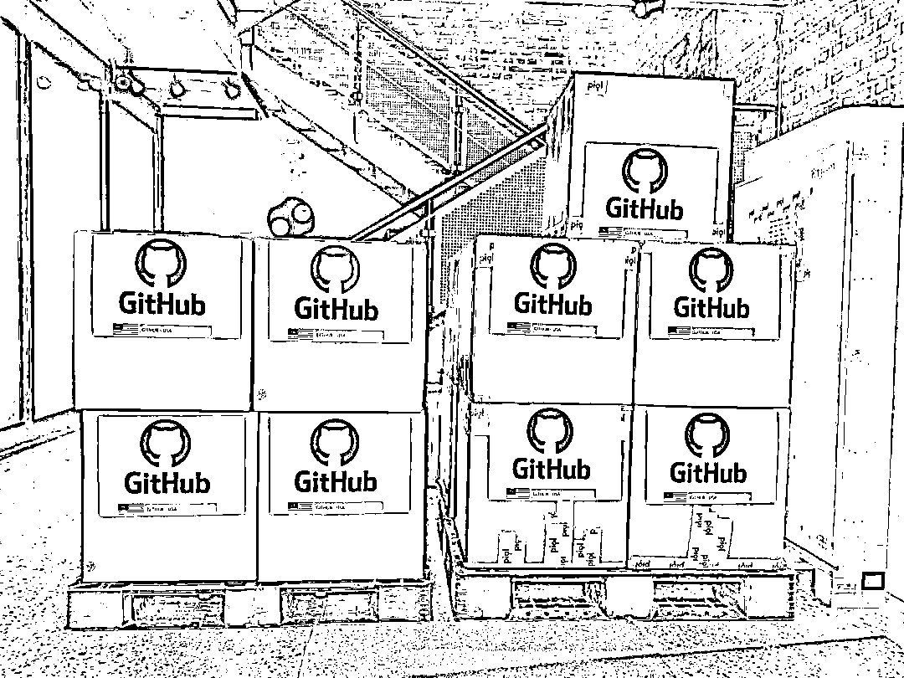
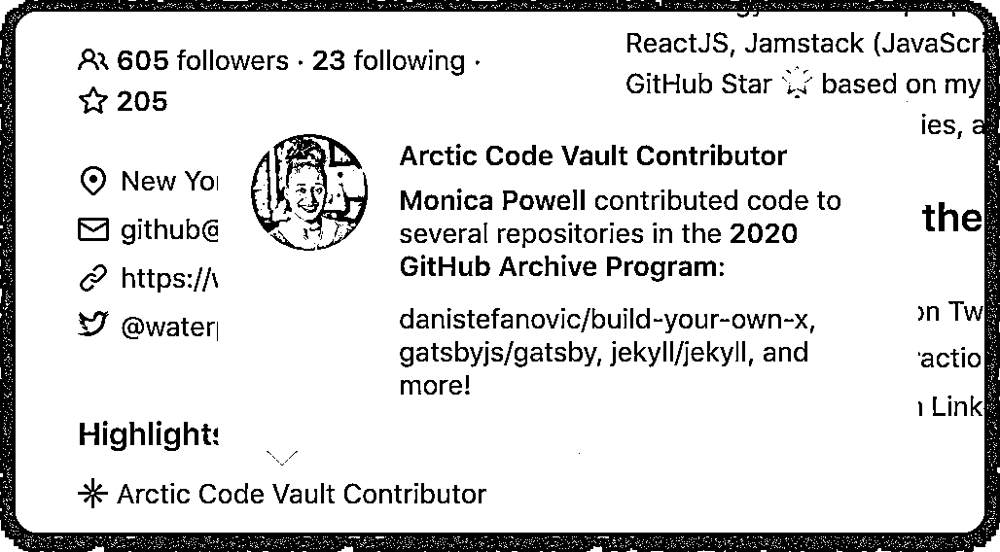
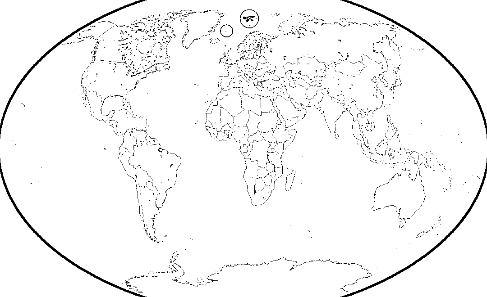
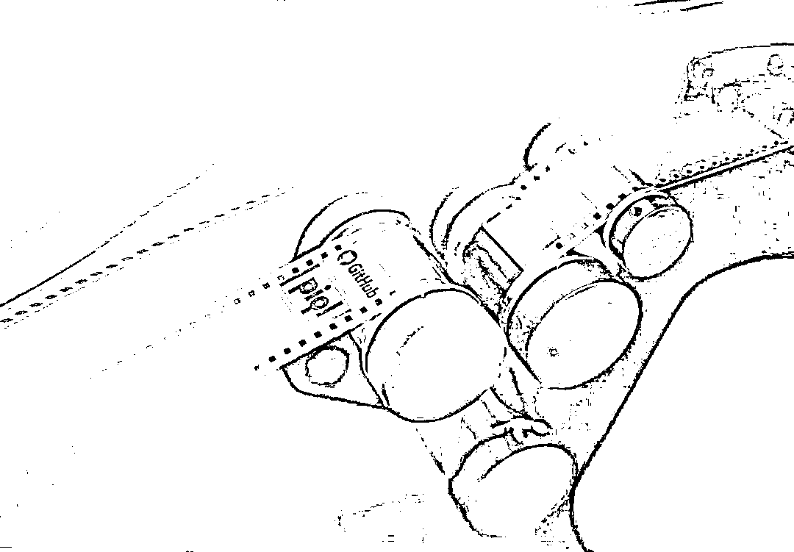
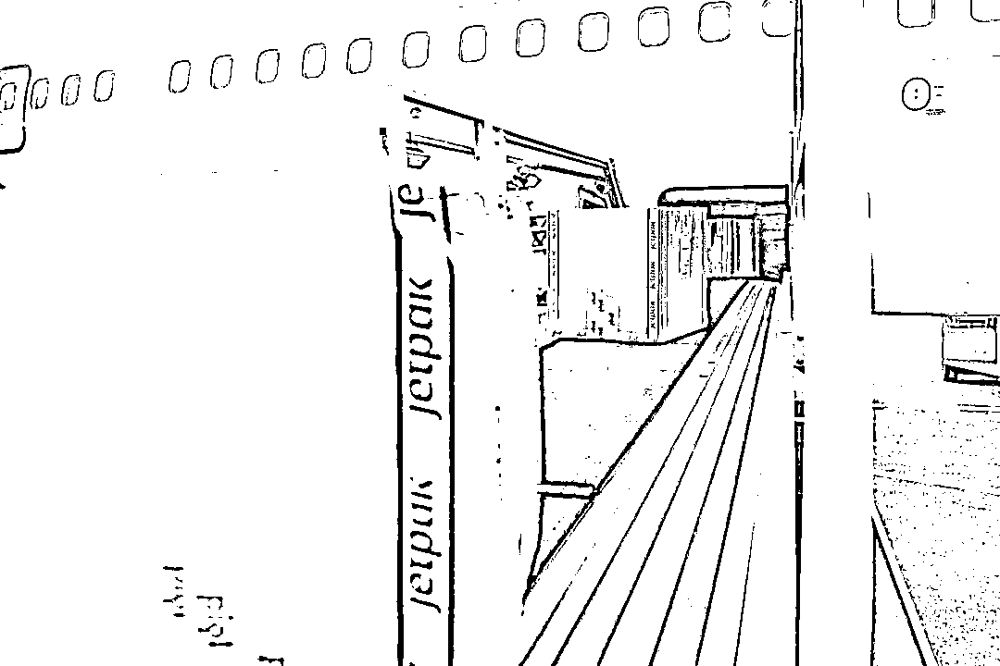
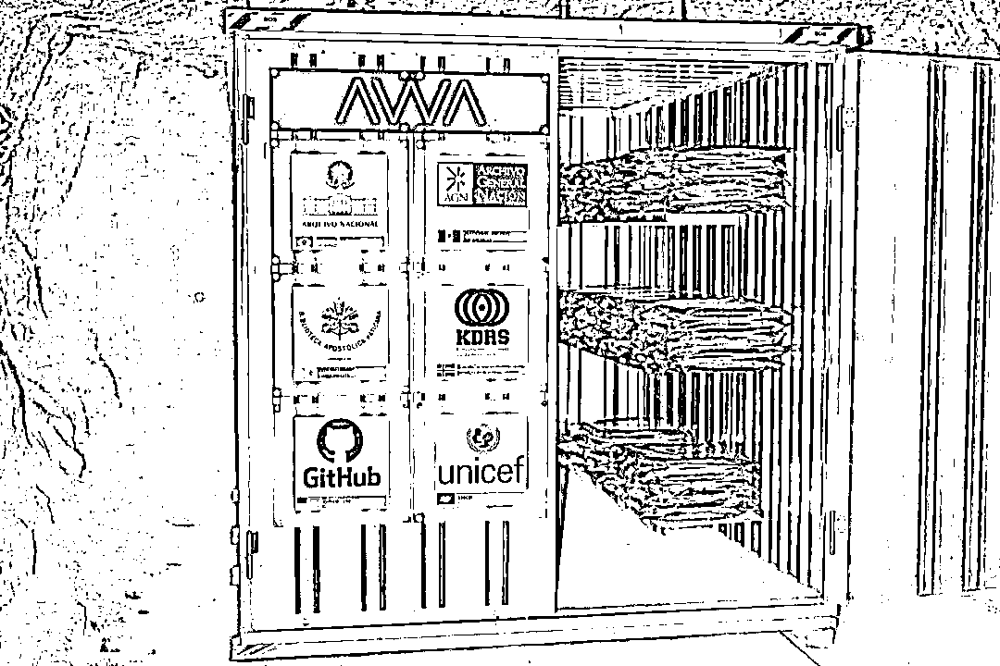
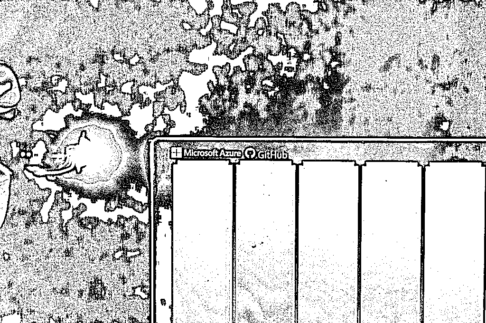

# 祖传！你的 GitHub 代码已打包运往北极，传给 1000 年后人类

> 原文：[`mp.weixin.qq.com/s?__biz=MzAxNTc0Mjg0Mg==&mid=2653302887&idx=1&sn=ccec3011e1fb33b7f16ec1b306bf62f6&chksm=802df272b75a7b64bdf97694fddc325b0e8394762fd30ee412ac47cf0bff496a1199d96a6611&scene=27#wechat_redirect`](http://mp.weixin.qq.com/s?__biz=MzAxNTc0Mjg0Mg==&mid=2653302887&idx=1&sn=ccec3011e1fb33b7f16ec1b306bf62f6&chksm=802df272b75a7b64bdf97694fddc325b0e8394762fd30ee412ac47cf0bff496a1199d96a6611&scene=27#wechat_redirect)

**全网 TOP 量化自媒体**

##### 晓查 发自 凹非寺 
量子位 报道 | 公众号 QbitAI

***1***

**程序员们，激动的消息来了！**

GitHub 刚刚公布了一组照片，你的代码上周已经被打包运往北极保存。**只要你****2 月 2 日****以前贡献过的开源代码，现在都已经被埋在北极的冰雪之下：**

**保存一千****年！**

据 GitHub 官方统计，已经有数百万的程序为这个**北极代码仓库**（Arctic Code Vault）计划做出了贡献。

为了表彰这些程序员们，GitHub 还设计了**荣誉徽章**。只要鼠标在开发者主页资料介绍部分悬停，就能看到有哪些项目被放到了北极。

***2***

**一串代码的北极之旅**

## 本来 GitHub 在去年 11 月的 Universe 2019 大会上公布了这项激动人心的计划：将开源代码作为人类文明的火种留给后台，放在一个环境稳定、远离人类战火的地方。 

具体的存放位置是在北极圈内一个岛上的地窖里，这个岛位于下面地图中最北边的红圈。

今年 2 月 2 日，GitHub 对网站上**所有开源项目**进行了一次快照存档，然后计划让团队成员亲自护送这批代码到北极。

然而万万没想到，新冠疫情爆发了。GitHub 团队只能与合作方，也就是胶片数据存储公司 Piql 保持远程联系。

他们先将**21TB**的代码数据交到这家公司位于挪威德拉门的工厂。代码被写在了**186 箱**胶片里，胶片每帧都包含 880 万个像素点，源代码以**QR 码**的形式存储其中。

然后这 186 箱胶片被运到挪威首都奥斯陆，装上飞机运往距离欧洲大陆北部 1000 公里远的**斯瓦尔巴群岛。**

代码最终降落在斯瓦尔巴群岛上一个只有几千人的小镇**朗伊尔城**。这里人迹罕至、气温寒冷，有几百米厚的冻土层，非常适宜存放胶片。

当地的山上有个退役煤矿，相当于一座人类文明的“诺亚方舟”，许多国际组织在这里存放重要物品，还有一个保存全世界农作物种子的全球种子库，GitHub 的代码就被安放在这里，预计可以保存 1000 年以上。

***3***

**未来将用玻璃存代码**

## 用胶片存代码不是 GitHub 的唯一手段。被微软收购后，GitHub 将有幸尝试微软的最新“黑科技”。 

去年微软对外公布了一个**Project Silica 项目**，就是**用激光刻蚀石英玻璃**来存储数据。石英玻璃是一种耐用的存储介质，抗电磁干扰、抗水、抗热，可提供保存数据长达几万年之久。

GitHub 说，石英玻璃是永远为后代保留世界开源软件的理想存储介质，所以将这项黑科技作为新的代码保存手段。

现在，GitHub 已经在玻璃中存档了 6000 个世界上最受欢迎的开源存储库。等到该技术成熟且成本下降后，应该会有更多的代码被写到玻璃中。

到那时你的代码可以被保存几万年，想想是不是更激动了呢？

先别想那么多，快去看看你的哪些代码被存放在北极了吧！

*官方博客：
https://github.blog/2020-07-16-github-archive-program-the-journey-of-the-worlds-open-source-code-to-the-arctic/*

量化投资与机器学习微信公众号，是业内垂直于**Quant、MFE、Fintech、AI、ML**等领域的**量化类主流自媒体。**公众号拥有来自**公募、私募、券商、期货、银行、保险资管、海外**等众多圈内**18W+**关注者。每日发布行业前沿研究成果和最新量化资讯。

**点赞♥ ****+ ****在看**★****