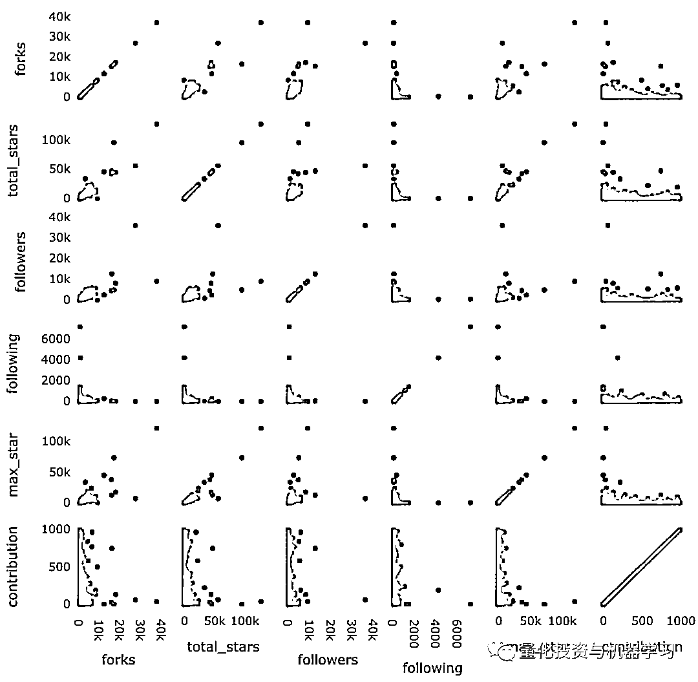

# 千帆过尽，独具只眼 | 从 1K+顶级 Github 机器学习项目中发现的秘密

> 原文：[`mp.weixin.qq.com/s?__biz=MzAxNTc0Mjg0Mg==&mid=2653302875&idx=1&sn=f0427fe1d0956ec91f18352dc9538f61&chksm=802df24eb75a7b5864cc4f7d64b6e52c201e46990f67a47ce9b62143abd86ef7ac20b09aca98&scene=27#wechat_redirect`](http://mp.weixin.qq.com/s?__biz=MzAxNTc0Mjg0Mg==&mid=2653302875&idx=1&sn=f0427fe1d0956ec91f18352dc9538f61&chksm=802df24eb75a7b5864cc4f7d64b6e52c201e46990f67a47ce9b62143abd86ef7ac20b09aca98&scene=27#wechat_redirect)


**全网 TOP 量化自媒体**

作者：Tran      编译：酸的馒头

***1***

**前言**

在 Github 上搜索关键字“**机器学习**”时，我们发现了 246632 个机器学习代码仓库。由于这些是机器学习中的 TOP 代码仓库，我们希望这些存代码仓库的所有者和贡献者能够成为机器学习方面的专家或胜任者。因此，我们决定提取这些用户的个人资料，以获得对他们的背景以及统计数据的一些有趣的见解。

***2***

**获取方式**

**工具**

我们使用三种工具：

**1、Beautiful Soup，用于提取机器学习标签下所有代码仓库的 URL。** Beautiful Soup 是一个 Python 库，可以非常轻松地从网站中抓取数据。


https://www.crummy.com/software/BeautifulSoup/bs4/doc.zh/

**2、PyGithub 提取有关用户的信息。** PyGithub 是使用 Github API v3 的 Python 库。借助它，你可以从 Python 脚本管理 Github 资源（代码仓库、用户个人资料等）。


https://pygithub.readthedocs.io/en/latest/introduction.html

**3、请求提取有关代码仓库的信息以及贡献者个人资料的链接。**


https://requests.readthedocs.io/en/master/user/quickstart/

**方法**

我们在搜索中弹出的前 90 个代码仓库中，抓取了所有者以及前 30 个贡献者：


通过删除重复项以及删除像 udacity 这样的组织的配置文件，我们获得了 1208 个用户的列表。对于每个用户，我们都会抓取 new_profile.info()下面列出的 20 个数据点：

```py
new_profile.info() 
```


具体来说，从这里获得前 13 个数据点：


其余数据点是从用户的存储库（不包括分支存储库）中获取的：

*   total_stars：是所有代码仓库的星总数

*   max_star：是所有代码仓库中的最大星级

*   forks：是所有代码仓库的 fork 总数

*   descriptions：是所有代码仓库用户的所有存储库中的描述

*   contribution：是去年内的贡献数


***3***

**可视化数据**

**条形图**

可视化数据可以使我们对数据有很多见解。我们使用 Plotly 轻松创建交互式图：

```py
import matplotlib.pyplot as plt
import numpy as np
import plotly.express as px # for plotting
import altair as alt # for plotting
import datapane as dp # for creating a report for your findings

top_followers = new_profile.sort_values(by='followers', axis=0, ascending=False)

fig = px.bar(top_followers, 
             x='user_name', 
             y='followers',
             hover_data=['followers'],
            )
fig.show() 
```

如我们所见，llSourcell（Siraj Raval）获得了大多数关注者（36261）。下一个用户获得 llSourcell（12682）的大约 1/3 关注者。


动态图演示，这个图表很难看到，因为粉丝数低于 100 的用户的尾巴很长。我们可以放大图形的最左侧部分，以便更好的查看图形：


我们可以做进一步的分析，以确定前 1％的用户获得多少关注者

```py
>>> top_n = int(len(top_followers) * 0.01)
12
>>> sum(top_followers.iloc[0: top_n,:].loc[:, 'followers'])/sum(top_followers.followers)
0.41293075864408607 
```

**1％的顶级用户获得 0.41％的关注者！**

与其他数据点（例如 total_stars，max_star，forks）的模式相同。为了更好地查看这些列，我们将这些特征的 y 轴更改为对数刻度。contribution 的 y 轴不变。

```py
figs = [] # list to save all the plots and table

features = ['followers',
               'following',
               'total_stars',
               'max_star',
               'forks',
                'contribution']
for col in features:
    top_col = new_profile.sort_values(by=col, axis=0, ascending=False)

    log_y = False  
    #change scale of y-axis of every feature to log except contribution
    if col != 'contribution':
        log_y = True

    fig = px.bar(top_col,
             x='user_name', 
             y=col,
             hover_data=[col],
             log_y = log_y
            )

    fig.update_layout({'plot_bgcolor': 'rgba(36, 83, 97, 0.06)'}) #change background coor

    fig.show()

    figs.append(dp.Plot(fig)) 
```


这些图表类似于**Zipf 定律**，即某些数据集的统计分布，如语言语料库中的单词，其中某些单词的频率与其排列成反比。

例如，英语中最常见的单词是“the”，它在典型文本中出现的次数约为十分之一，尽管它不如其他单词重要。

我们在其他排名中也看到了 Zipf 定律，比如各县市的人口排名、收入排名、购书人数排名等等。现在我们在 Github 数据中再次看到这种模式。

***4***

**相关性**

但是这些数据点之间有什么关系呢？他们之间有密切的关系吗？我们使用 scatter_matrix 来获得这些数据点之间相关性的大图！

```py
correlation = px.scatter_matrix(new_profile, dimensions=['forks', 'total_stars', 'followers',
                                 'following', 'max_star','contribution'],
                               title='Correlation between datapoints',
                               width=800, height=800)
correlation.show()

corr = new_profile.corr()

figs.append(dp.Plot(correlation))
figs.append(dp.Table(corr))
corr
```




数据点倾向于围绕左下轴聚集，因为大多数 t 用户的数据点都在这个范围内。两者之间有很强的积极关系：

*   最大星级和星总数（0.939）

*   fork 总数（来自其他）和星总数（0.929）

*   forks 的数量和关注者的数量（0.774）

*   关注者的数量和星总数（0.632）

***5***

**语言**

顶级机器学习用户最喜欢的语言是什么？Python、Jupyter Notebook、C 和 R 的百分比是多少？

我们可以用柱状图来找出答案。为了更好地了解最流行的语言，我们删除了低于 10 的语言：

```py
# Collect languages from all repos of al users
languages = []
for language in list(new_profile['languages']):
    try:
        languages += language
    except:
        languages += ['None'] 

# Count the frequency of each language
from collections import Counter 
occ = dict(Counter(languages))

# Remove languages below count of 10
top_languages = [(language, frequency) for language, frequency in occ.items() if frequency > 10]
top_languages = list(zip(*top_languages))

language_df = pd.DataFrame(data = {'languages': top_languages[0],
                           'frequency': top_languages[1]})

language_df.sort_values(by='frequency', axis=0, inplace=True, ascending=False)

language = px.bar(language_df, y='frequency', x='languages',
      title='Frequency of languages')

figs.append(dp.Plot(language))

language.show() 
```


从上面的柱状图中，我们得到了机器学习用户中语言的排名：

*   Python

*   JavaScript

*   HTML

*   Jupyter Notebook

*   Shell 等等

***6***

**Hireable**

我们使用 Altari 展示 Hireable 的用户的百分比：


```py
import altair as alt

hireable = alt.Chart(new_profile).transform_aggregate(
    count='count()',
    groupby=['hireable']
).mark_bar().encode(
    x='hireable:O',
    y='count:Q')

figs.append(dp.Plot(hireable))
hireable 
```


***7***

**位置**

为了了解用户在世界上的位置，我们的下一个任务是可视化用户的位置。我们将使用从 31%显示其位置的用户那里获得的位置。首先从 df 中提取一个位置列表，然后用 geogy.geocoders.Nominatim 来定位他们：

```py
from geopy.geocoders import Nominatim

locations = list(new_profile['location'])

# Extract lats and lons
lats = []
lons = []
exceptions = []

for loc in locations:
    try:
        location = geolocator.geocode(loc)
        lats.append(location.latitude)
        lons.append(location.longitude)
        print(location.address)
    except:
        print('exception', loc)
        exceptions.append(loc)

print(len(exceptions)) # output: 17

 # Remove the locations not found in map
location_df['latitude'] = lats
location_df['longitude'] = lons 
```

然后使用 Plotly 的 scatter_geo 创建一个地图！


https://plotly.com/python-api-reference/generated/plotly.express.scatter_geo.html

```py
# Visualize with Plotly's scatter_geo
m = px.scatter_geo(location_df, lat='latitude', lon='longitude',
                 color='total_stars', size='forks',
                 hover_data=['user_name','followers'],
                 title='Locations of Top Users')
m.show()

figs.append(dp.Plot(m)) 
```


***8***

**描述和基本知识的词汇云**

我们的数据还包括用户的基本输入输出系统以及对他们代码仓库的所有描述。我们将用这些来回答问题：他们的主要焦点和背景是什么。

生成单词云可以让我们对单词及其在描述和基本输入输出系统中的使用频率有一个大致了解。用 Python 创建单词云比用 wordcloud 容易多了！


https://amueller.github.io/word_cloud/

```py
import string
import nltk
from nltk.corpus import stopwords
from nltk.tokenize import word_tokenize
from nltk.stem import WordNetLemmatizer
from nltk.tokenize import word_tokenize
from wordcloud import WordCloud, STOPWORDS 
import matplotlib.pyplot as plt

nltk.download('stopwords')
nltk.download('punkt')
nltk.download('wordnet')

def process_text(features):
  '''Function to process texts'''

    features = [row for row in features if row != None]

    text = ' '.join(features)

    # lowercase
    text = text.lower()

    #remove punctuation
    text = text.translate(str.maketrans('', '', string.punctuation))

    #remove stopwords
    stop_words = set(stopwords.words('english'))

    #tokenize
    tokens = word_tokenize(text)
    new_text = [i for i in tokens if not i in stop_words]

    new_text = ' '.join(new_text)

    return new_text

def make_wordcloud(new_text):
  'funciton to make wordcloud'

    wordcloud = WordCloud(width = 800, height = 800, 
                background_color ='white', 
                min_font_size = 10).generate(new_text) 

    fig = plt.figure(figsize = (8, 8), facecolor = None) 
    plt.imshow(wordcloud) 
    plt.axis("off") 
    plt.tight_layout(pad = 0) 

    plt.show() 

    return fig

descriptions = []
for desc in new_profile['descriptions']:
    try:
        descriptions += desc

    except:
        pass

descriptions = process_text(bios)

cloud = make_wordcloud(text)

figs.append(dp.Plot(cloud)) 
```


用 bio 制作文字云：

```py
bios = []
for bio in new_profile['bio']:
    try:
        bios.append(bio)

    except:
        pass

text = process_text(bios)

cloud = make_wordcloud(text)

figs.append(dp.Plot(cloud)) 
```


这些关键词看起来就像我们期望从机器学习用户那里看到的。

***9***

**结论**

数据是从机器学习关键字中前 90 个最佳匹配代码仓库的用户和贡献者获得的。因此，此数据不能保证收集到 Github 中所有顶级的机器学习用户。

希望大家对数据分析和可视化有所收获！

量化投资与机器学习微信公众号，是业内垂直于**Quant、MFE、Fintech、AI、ML**等领域的**量化类主流自媒体。**公众号拥有来自**公募、私募、券商、期货、银行、保险资管、海外**等众多圈内**18W+**关注者。每日发布行业前沿研究成果和最新量化资讯。

**点赞♥ ****+ ****在看**★****