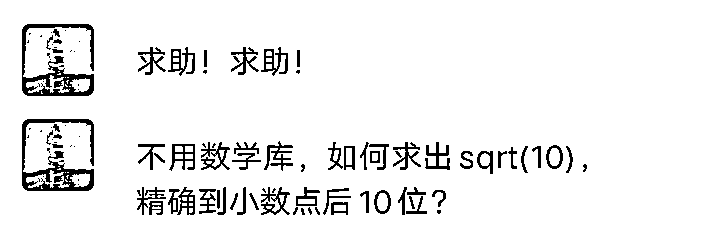
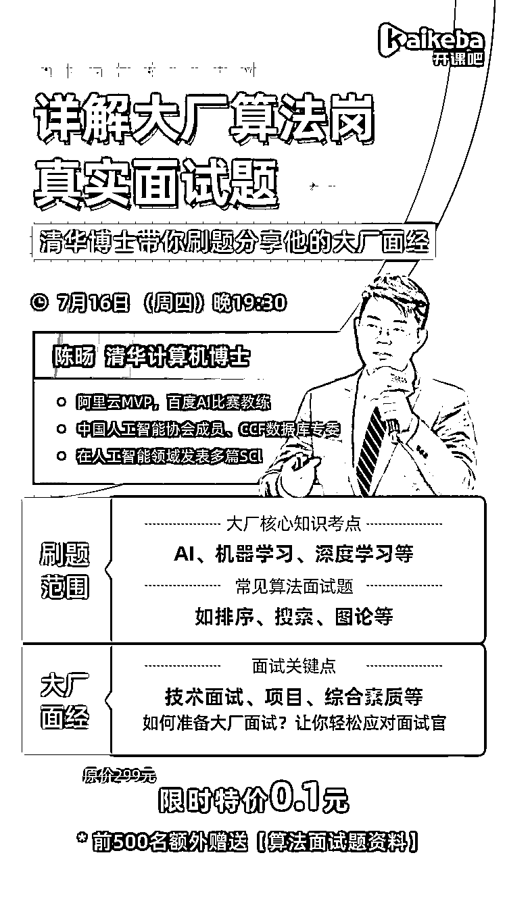

# 现在大厂面试，太难了！

> 原文：[`mp.weixin.qq.com/s?__biz=MzAxNTc0Mjg0Mg==&mid=2653302532&idx=1&sn=8322d2704ce043557d66fe95052c2e10&chksm=802ded11b75a640737bb0e39d7f59430c5956771a6cb69f67a578beed687e5d91a13aac5f702&scene=27#wechat_redirect`](http://mp.weixin.qq.com/s?__biz=MzAxNTc0Mjg0Mg==&mid=2653302532&idx=1&sn=8322d2704ce043557d66fe95052c2e10&chksm=802ded11b75a640737bb0e39d7f59430c5956771a6cb69f67a578beed687e5d91a13aac5f702&scene=27#wechat_redirect)

这是我的一个粉丝向我求助的一个大厂面试问题。很多人看到这道题第一个想到的一定是二分法，但其实不一定是往这个方向解题的。还有一部分学过数值计算的同学，能想到用牛顿迭代法，但其实这两个方法都不是最好的解法。

我来带大家分析一下本题目的考察点：

*   **基础算法的灵活应用能力；**

*   **退出条件程序的设计。**

这是大厂面试题经常考察的地方，他们不仅仅只是考察如何解题，**背后的考察点其实还附加了如何更快的让计算机运算。**

作为一名算法工程师，很多大厂的面试不仅仅是会解出正确答案就好了，**面试官其实想看到更多优化的解法以及计算机运算的速度提升。**备战金九银十逃脱不了面试官的灵魂拷问，

想要快速的回答准确，你需要扎实的基础知识，而且更要掌握的是解答问题的能力。

要想掌握这样的能力，我给大家推荐一门课程，**清华大学计算机博士陈旸，带你搞定真实一线大厂面试题**，详细解读**大厂核心知识考点**，清晰梳理大厂面试流程，并且教大家如何快速准备大厂面试，轻松答题。

距离大厂之门只差成功掌握这些面试题。报名更有大厂**80 道面试题资料包赠送（仅限前 500 名）**。快来扫描下方二维码，报名咨询吧。

 限时领取：0.1 元

（原价：¥299 元）

仅限前 500 人

👇👇👇

备注**【大厂面试】**添加👆

之前就有问过我这样类似的问题“**谈一谈大厂给你的感觉，面试大厂，面试官更注重那些方面？”**

在我看来大厂更**重注的有这么几点：**

**1.基础知识**

大厂更注重你的基础知识，如果你的基础都不扎实，那么建立于基础知识之上的实战能力、业务能力都是空中楼阁。

**2.知识深度**

大厂面试官还有一个爱好，就是对于每个知识点，都喜欢深入往下问，问到没有问题可以问，或者问到你不会为止，这样提问的目的只有一个，就是试探你对这个知识点的理解深度，如果你无法提供足够深刻的回答，结果往往就是失败。

**3.解决问题的能力**

智力题是一种常见的面试题型，这些题目可能涉及概率论、博弈论，题目本身不会很难，你应该给出你的解题思路和思考过程，面试官一般也会引导你打开思路，这类题目也很能反映一个人解决问题的能力。

要想掌握以上能力，快来报名学习吧！前 500 名还额外获取**【算法面试题资料】。**

长按添加课程顾问

**限时领取**

**仅限前 500 名**

👇👇👇

备注**【大厂面试】**添加👆