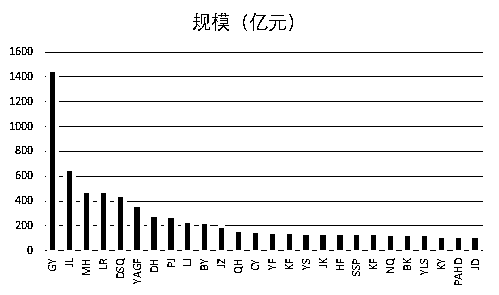
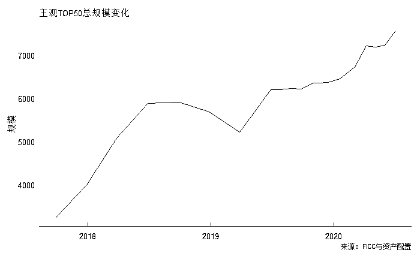
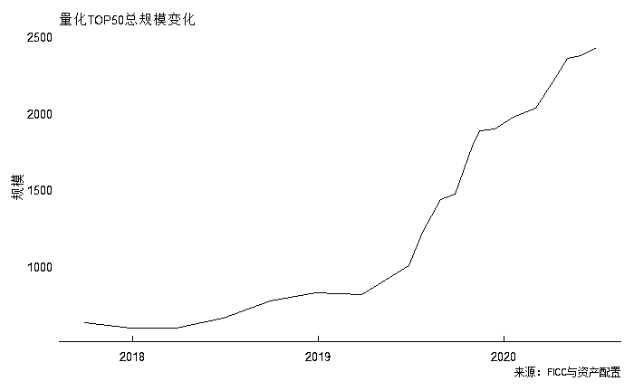
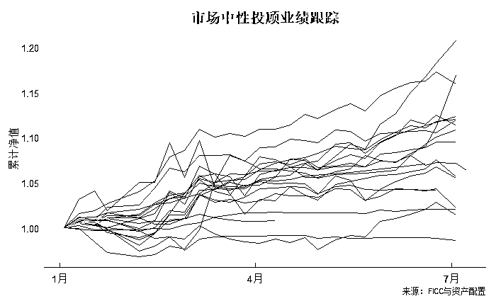
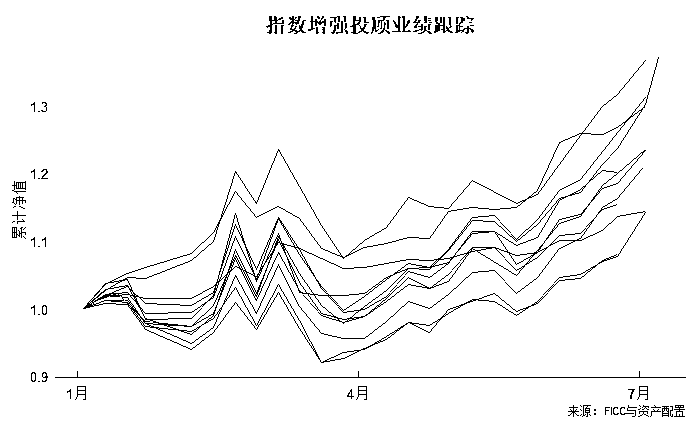
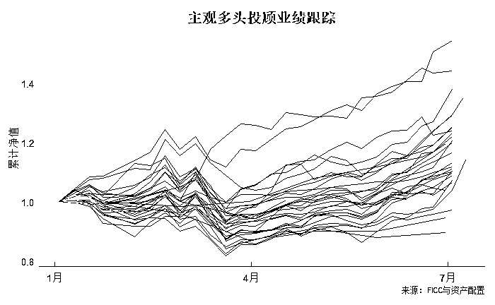
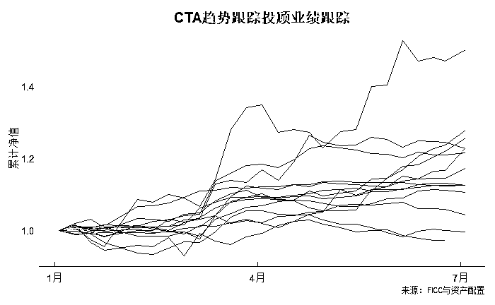
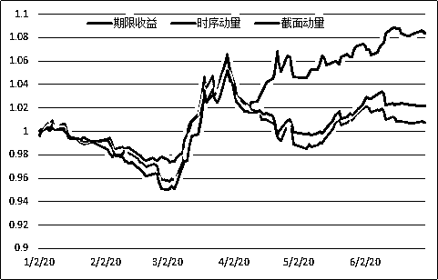

# 乘风破浪：国内头部私募上半年业绩回顾

> 原文：[`mp.weixin.qq.com/s?__biz=MzAxNTc0Mjg0Mg==&mid=2653302466&idx=1&sn=ed28c5099ea6dd1b27875a4bc9860dcb&chksm=802decd7b75a65c155e7934a36f3850ee0ec4b9eff54316a738831ad39796990a533b6ff8b51&scene=27#wechat_redirect`](http://mp.weixin.qq.com/s?__biz=MzAxNTc0Mjg0Mg==&mid=2653302466&idx=1&sn=ed28c5099ea6dd1b27875a4bc9860dcb&chksm=802decd7b75a65c155e7934a36f3850ee0ec4b9eff54316a738831ad39796990a533b6ff8b51&scene=27#wechat_redirect)

**全网 TOP 量化自媒体**

最近市场火爆，沪深两市交易频频突破万亿，我们把**部分头部私募**的上半年业绩做下回顾。

## 

***1***

**管理规模**

截止到 6 月 30 日的数据，从事**二级市场权益类规模超过百亿的私募有****26 家****左****右，合计规模****6800 亿****以上，其中量化的有****6 家**。无论是主观多头，还是量化类私募，今年以来头部 50 家的管理规模都上升很快。

## 

***2***

**业绩表现**

从跟踪各类策略的主流管理人产品来看，今年上半年可以用“乘风破浪”四个字来形容。市场中性产品由于流动性及波动性的改善，Alpha 跟 T0 都交替有不少机会，一改去年下半年的横盘颓势。指数增强跟主观多头都受益于市场 Beta 机会，今年都取得了不错的收益，其中指数增强对标多头平均超额不少。CTA 趋势跟踪受益于“危机 Alpha”及波动性，动量因子及期限因子都反弹，收益颇丰。期货套利及期权策略今年上半年都中规中矩，没有太多可圈可点。由于今年行情的特殊性，期货套利某些管理人也出现了较大的回撤，体现了一把“净值上涨爬楼梯，净值回撤坐电梯”。

| 策略类型 | 最近一年收益率均值（%） | 今年以来收益率均值（%） | 近一月收益率均值（%） | 今年以来回撤幅度均值（%） |
| 量化对冲 | 11.92 | 10.70 | 0.20 | 2.55 |
| 指数增强 | 28.36 | 26.55 | 4.98 | 10.50 |
| 主观多头 | 25.51 | 16.37 | 4.81 | 13.29 |
| 期货趋势 | 22.14 | 23.11 | 1.27 | 4.32 |
| 期货套利 | 8.13 | 5.17 | 0.29 | 1.67 |
| 期权策略 | 8.02 | 4.54 | -0.29 | 2.43 |

## 

***3***

**几点评论**

炎热的夏天，也抵不过最近二级市场的狂热。这波行情能走多远，流动性能持续多久，都还有待观察。但是，以下几点还是挺值得关注的：

**1、Beta，还是 Beta**

水大鱼大。今年上半年各类策略的表现，得益于市场大环境的改善。每一类策略都有其周期性，要敬畏市场。

**2、主观产品偏好封闭期延长**

主观多头产品越来越把产品封闭期延长，很多是封闭 3 年。对于主观多头的管理人来说，时间太短难以验证其投资理念，分析头部管理人的产品，投资者持有 3 年大概率是赚钱的。封闭期延长，从另外一个层面也是预防投资者对基金做“高买低卖”的择时操作，保护投资者。

**3、量化产品偏好指数增强**

对于股票量化的管理人来说，由于升贴水的影响，很多偏好发行指数增强的产品。指数增强产品不受升贴水影响，而且可以满仓操作，作为主观多头的有力竞争者，影响不容小觑。

**4、好资产是稀缺品**

随着头部效应的加剧，好产品越来越集中到头部管理人，好资产（产品）越发成为稀缺品。信息的通畅、财富管理净值化大趋势，好资产很容易被发现。对优质资产的追逐，将是资产管理行业未来的常态。

**相关文章阅读**

[1、策略周期](https://mp.weixin.qq.com/s?__biz=MzI4ODA4MTExMg==&mid=2647730226&idx=1&sn=67adad7e99d0dfef3db29ef1913b5517&scene=21#wechat_redirect)

[2、时间是玫瑰吗？基于主观多头产品的街头研究](https://mp.weixin.qq.com/s?__biz=MzI4ODA4MTExMg==&mid=2647730168&idx=1&sn=f152164086193f88dc31bb160c6a5509&scene=21#wechat_redirect)

[3、私募多头哪家强？指数增强当鲶鱼](https://mp.weixin.qq.com/s?__biz=MzI4ODA4MTExMg==&mid=2647730082&idx=1&sn=e1f81bb9717a34d8ba33318a3765bdbd&scene=21#wechat_redirect)

量化投资与机器学习微信公众号，是业内垂直于**Quant、MFE、Fintech、AI、ML**等领域的**量化类主流自媒体。**公众号拥有来自**公募、私募、券商、期货、银行、保险资管、海外**等众多圈内**18W+**关注者。每日发布行业前沿研究成果和最新量化资讯。

**点赞♥ ****+ ****在看**★****