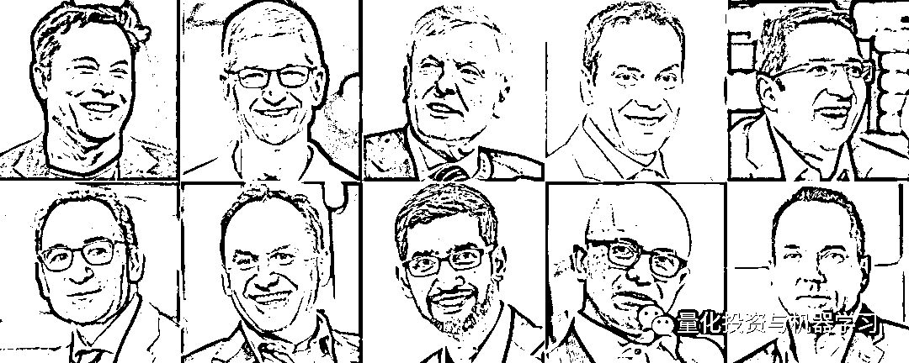
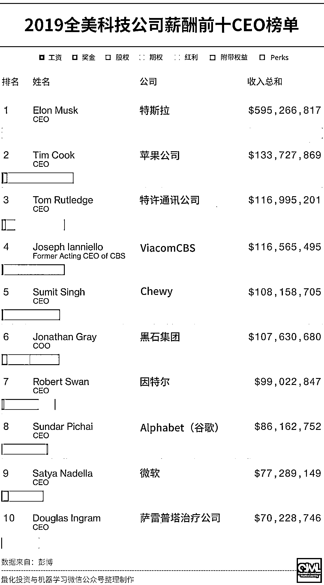
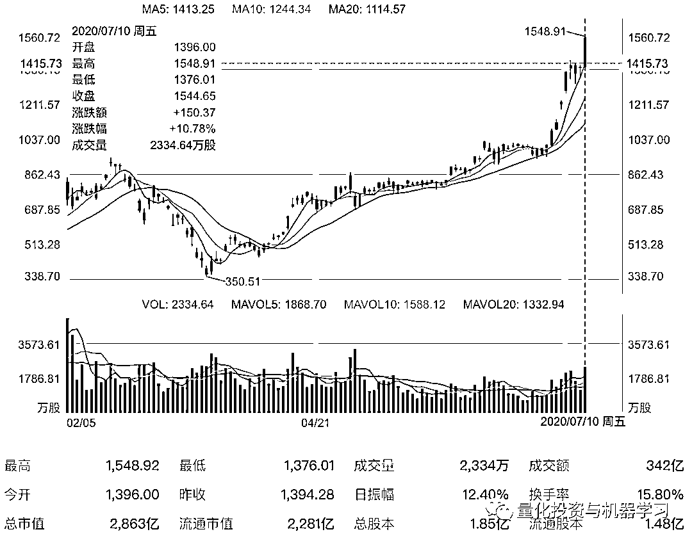
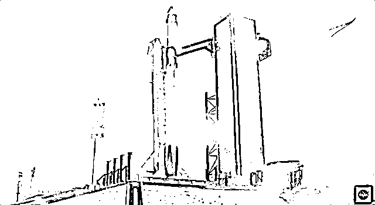
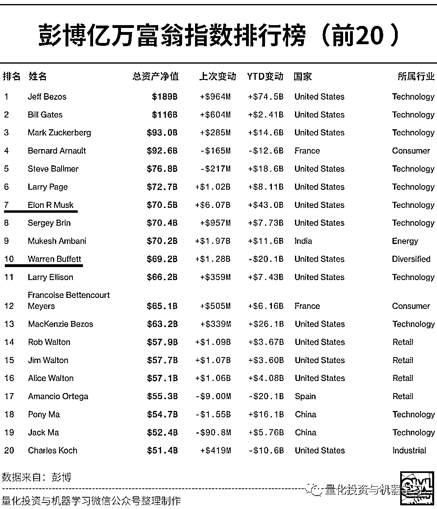
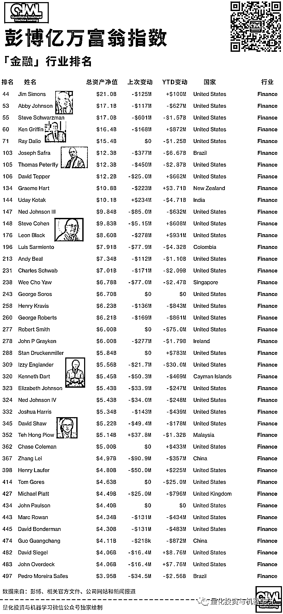
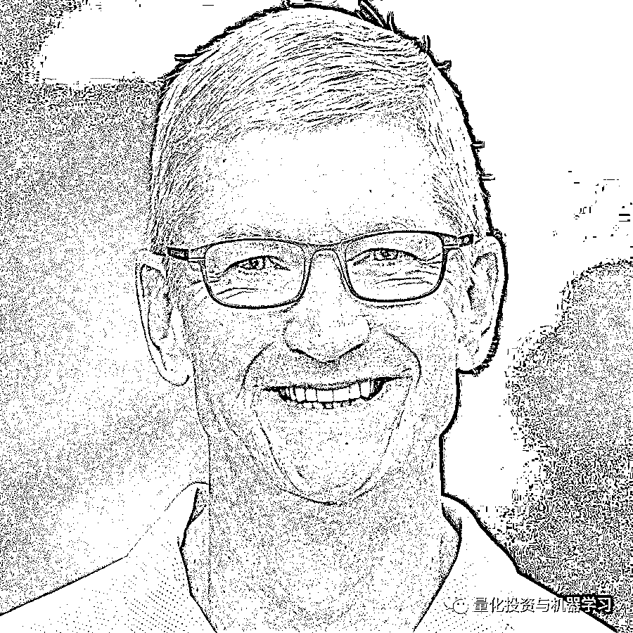
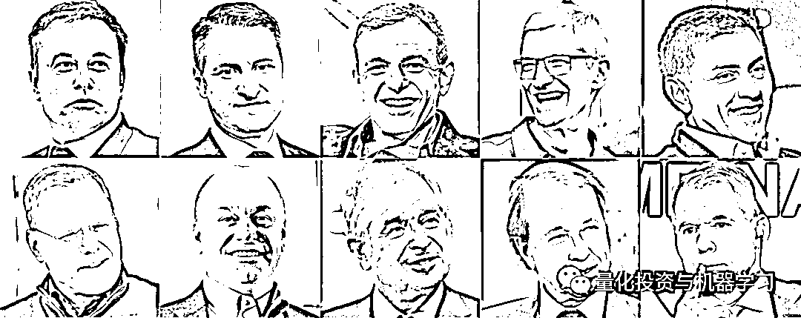
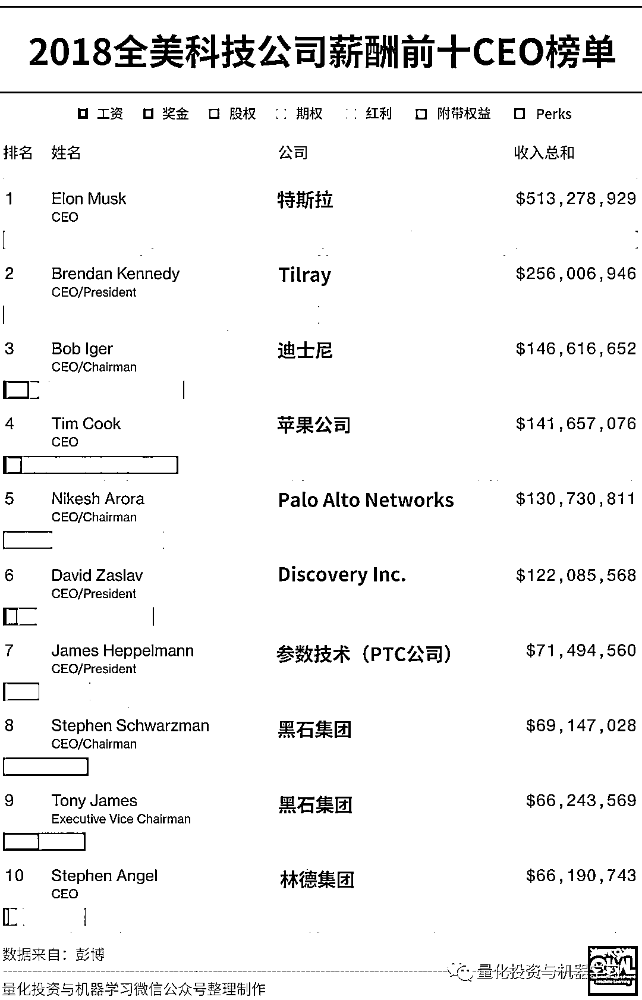

# 最新！2019 全美科技公司薪酬前十 CEO 榜单出炉

> 原文：[`mp.weixin.qq.com/s?__biz=MzAxNTc0Mjg0Mg==&mid=2653302437&idx=1&sn=6f8229e8f3e6fde15915a0d9c8982da7&chksm=802decb0b75a65a68e2279378795729b04ac34681a79e9e999a3f7eeef873fbf63f405869e0e&scene=27#wechat_redirect`](http://mp.weixin.qq.com/s?__biz=MzAxNTc0Mjg0Mg==&mid=2653302437&idx=1&sn=6f8229e8f3e6fde15915a0d9c8982da7&chksm=802decb0b75a65a68e2279378795729b04ac34681a79e9e999a3f7eeef873fbf63f405869e0e&scene=27#wechat_redirect)

**全网 TOP 量化自媒体**

量化投资与机器学习编辑部

刚刚，彭博刚刚发布了全美科技公司 CEO 的薪酬排行榜。该榜单指数追踪了向美国监管机构提交薪酬细节的 100 位薪酬最高的高管。其数据包括最近一年发放的工资、奖金和福利。

它们还包括授予可能在未来产生收益的股票期权等。为便于比较，所有此类股票奖励的估值均以每家公司财务年度结束时进行的，而不是授予它们的日期。因此，该指数可能与披露文件中的数据有所不同（有时差异很大)，这取决于股价变动和股息。

但正如监管文件中所解释的那样，任何旨在为高管提供数年薪酬的一次性奖金，都将在奖金有效期内分配。例如，马斯克没有从特斯拉公司获得任何薪酬，除了与业绩目标挂钩的大量股票期权。这些有价证券将支付他 10 年的薪水。

该指数上的大多数高管也不能保证将全部、甚至大部分薪酬收入囊中。股票奖励是他们薪酬的主要组成部分，它通常取决于业绩状况，如果业绩没有达标，奖金通常会减少或取消。另一方面，如果超额完成了目标，意外之财可能会大大超过最初的估计。

来看看榜单：

**特斯拉掌门人马斯克是 2019 年美国薪酬最高的 CEO，****收入高达 5.953 亿美元！**

这也是继 18 年之后，马斯克又荣登榜单第一名。其中，这笔钱来自于他几年前的薪酬协议: *如果特斯拉公司成为世界上最有价值的公司之一，他将获得数百亿美元的收入。*

据彭博亿万富翁指数显示，上周五，马斯克的财富增加 61 亿美元，截至昨日美股收盘，特斯拉大涨 10.78%，**市值突破 2800 亿美金（约合 2 万亿人民币）。**

**马斯克的身家现在已达 705 亿美金，约合人民币 5000 亿元**，**超越了股神巴菲特，成为全球第七大富豪！**在他 705 亿美元的财富中，持有特斯拉约五分之一的流通股占据了很大一部分。他持主要股份的 Space X 为其财富贡献了约 150 亿美元。

就在 9 号的 2020 世界人工智能大会上，马斯克还表示：目前上海工厂进展顺利，希望在中国开展研发。他称，特斯拉已经非常接近 L5 级别的自动驾驶，以特斯拉现有的硬件，特斯拉有信心在今年完成 L5 级别的基本功能 。

北京时间 2020 年 5 月 31 日，SpaceX 史上首次载人飞行任务，人类历史上第一次由商业公司把人送入太空。

硅谷钢铁侠强调：它毫无疑问也激励了我。如果没有阿波罗 11 号，可能就没有 SpaceX。现在年复一年，我期待着可以继续前进，超越 Apollo 11 号。

SpaceX 和马斯克历史性地成功，不止是一家公司和一个人的成功。

也会是一次全世界了不起的科普、深远启蒙。

或许下一个马斯克，就在这次被影响的少年中间。

人类因梦想而强大，而梦想没有国界，没有边界，一代代薪火相传，然后创造新星界。

彭博亿万富翁指数榜（**共 500 位**）每天会更新。以下是最新排名：

本周早些时候，据《财富》杂志报道。89 岁的巴菲特向慈善机构捐赠了 29 亿美元的伯克希尔哈撒韦公司股票，导致他的财富大幅缩水。目前，巴菲特的财富水平在彭博亿万富翁指数中排名第 10.公开信息显示，自 2006 年以来，巴菲特已经捐赠了伯克希尔哈撒韦公司总价值约 370 多亿美元的股票。

**附金融榜单排名：**

在薪酬前 10 榜单中，还有有 4 位也是科技界的高管（图片来自：网络）：

**苹果：库克**

**Alphabet：Sundar Pichai**

**微软：Satya Nadella**

**英特尔：Robert Swan**

**附 2018 年全美科技公司薪酬前十 CEO 榜单：**

量化投资与机器学习微信公众号，是业内垂直于**Quant、MFE、Fintech、AI、ML**等领域的**量化类主流自媒体。**公众号拥有来自**公募、私募、券商、期货、银行、保险资管、海外**等众多圈内**18W+**关注者。每日发布行业前沿研究成果和最新量化资讯。

**点赞♥ ****+ ****在看**★****