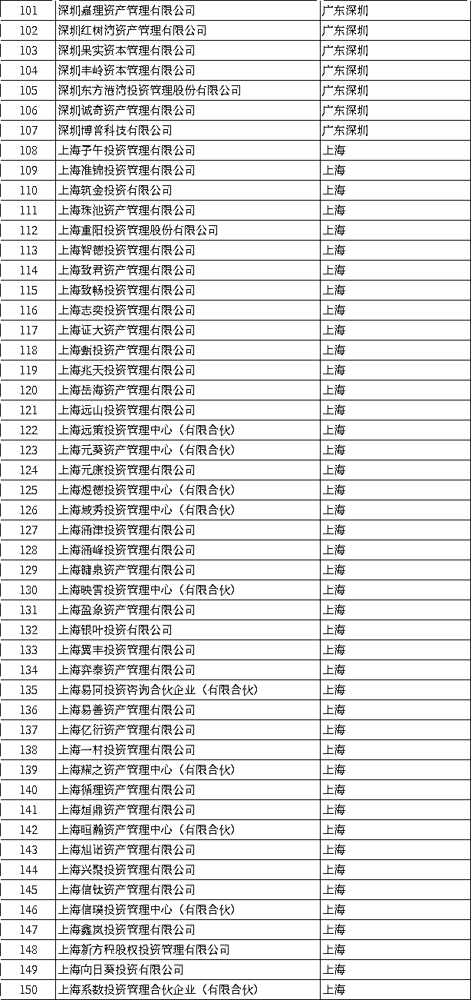

# 最新！433 家私募投顾数据画像：外资增加至 9 家（内附名单）

> 原文：[`mp.weixin.qq.com/s?__biz=MzAxNTc0Mjg0Mg==&mid=2653302317&idx=1&sn=327c9b8bd64a0d929374358fe8477642&chksm=802dec38b75a652e71b6deae2cf9c8287323774b49dea40388edc50240176cad5fd592823340&scene=27#wechat_redirect`](http://mp.weixin.qq.com/s?__biz=MzAxNTc0Mjg0Mg==&mid=2653302317&idx=1&sn=327c9b8bd64a0d929374358fe8477642&chksm=802dec38b75a652e71b6deae2cf9c8287323774b49dea40388edc50240176cad5fd592823340&scene=27#wechat_redirect)

<mpsearch class="js_mpsearch appmsg_search_iframe js_uneditable custom_select_card" data-keywords="%5B%7B%22label%22%3A%22%E9%87%8F%E5%8C%96%E6%8A%95%E8%B5%84%22%7D%2C%7B%22label%22%3A%22%E5%AF%B9%E5%86%B2%E5%9F%BA%E9%87%91%22%7D%2C%7B%22label%22%3A%22%E9%A2%84%E6%B5%8B%22%7D%2C%7B%22label%22%3A%22%E6%9C%BA%E5%99%A8%E5%AD%A6%E4%B9%A0%22%7D%5D" data-w="286" data-ratio="1.5664335664335665" data-parentclass="appmsg_search_iframe_wrp">、</mpsearch>

***1***

**前言**

二级市场的活跃度不断提升，激发了私募管理人投资的热情。投资顾问资质是很多管理人渴望而不可求的，它不仅可以节约嵌套层级，还是监管政策引导下与各大金融机构合作的门槛要求。本文与大家分享最新的私募投顾数据情况。

***2***

**投顾资质的条件**

2016 年 7 月，证监会发布《证券期货经营机构私募资产管理业务运作管理暂行规定》，正式提出“3+3”的投顾要求，对于想要申请投顾资格的私募证券投资基金管理人，需要同时符合以下条件：

**1、在中国证券投资基金业协会登记满一年、无重大违法违规记录的会员；**

**2、具备 3 年以上连续可追溯证券、期货投资管理业绩的投资管理人员不少于 3 人、无不良从业记录。**

此外，2018 年 12 月，银保监会发布《商业银行理财子公司管理办法》，规定理财子公司发行的私募理财产品的合作机构、公募理财产品的投资顾问可以为持牌金融机构，也可以为依法合规、符合条件的私募投资基金管理人。同时，对可作为理财合作机构的私募投资基金管理人提出了相关要求：

**1、在中国证券投资基金业协会登记满 1 年、无重大违法违规记录的会员；**

**2、担任银行理财子公司投资顾问的，应当为私募证券投资基金管理人，其具备 3 年以上连续可追溯证券、期货投资管理业绩且无不良从业记录的投资管理人员应当不少于 3 人；**

**3、金融监督管理部门规定的其他条件。**

此处对私募管理人担任投顾的要求与证监会对证券期货私募资管业务聘请私募证券基金管理人担任投资顾问的要求是一致的，核心要义均是“3+3”，对象仅限于证券类私募管理人，这样理财子公司的监管标准与其他资管机构总体上保持一致。

***3***

**私募投顾数据画像**

**1、433 家私募投顾占比 4.97%，以观察会员为主** 

截止到 2020 年 6 月底，已登记私募管理人共计 24385 家，其中私募证券投资基金管理人 8719 家，**具有投顾资质的共计 433 家**，占比约 4.97%，这个数量仍然比较少。

从 433 家投顾的登记时间来看，**集中在 2014 年、2015 年，共计 377 家**，占比达到 87.07%。由此可见，老牌私募仍然是投顾的生力军。

从投顾的会员类型来看，**以观察会员为主，有 361 家，占比达 83.37%**。普能会员数量较少。

从注册地来看，**上海仍然是私募投顾的集中地，达到 208 家，占比 48.04%**。其次是广东（含深圳）、北京、浙江、江苏，前 5 大地区的投顾数量共计 396 家，占比 91.45%，北上广深苏浙等沿海地区是投顾的聚集地，内陆地区相对较少。

**私募投顾注册地**

**2、外资投顾增加至 9 家**

从企业性质来看，私募投顾以内资企业为主，共计 420 家，占比达 97%。外资和中外合资企业共计 13 家，数量较少。

近年来，随着国内金融市场的不断开放，外资私募加速进入中国市场，而申请成为投顾的外资私募数量也不断增加。**截止到 2020 年 6 月底，共计 9 家外商独资私募基金管理人取得投顾资格，近一年内增加了 6 家。**

外资私募拿下投顾资格，意味着正式打开了与国内银行合作的大门，银行可以直接聘请外资私募作投资顾问，这将对本土私募产生不小的冲击。由于申请投顾需要登记满一年，随着时间的推移，相信接下来会有更多外资私募获得投资建议服务资格。

**外资私募投顾名单（2020 年 6 月）**

***4***

**433 家私募投顾名单**

量化投资与机器学习微信公众号，是业内垂直于**Quant、MFE、Fintech、AI、ML**等领域的**量化类主流自媒体。**公众号拥有来自**公募、私募、券商、期货、银行、保险资管、海外**等众多圈内**18W+**关注者。每日发布行业前沿研究成果和最新量化资讯。