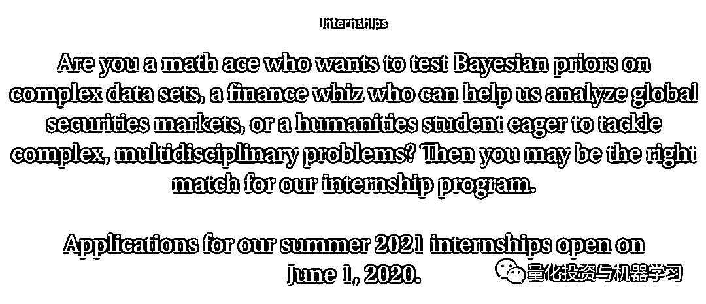
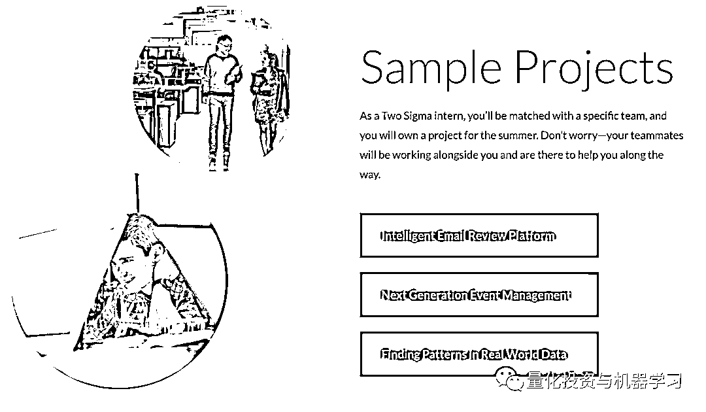
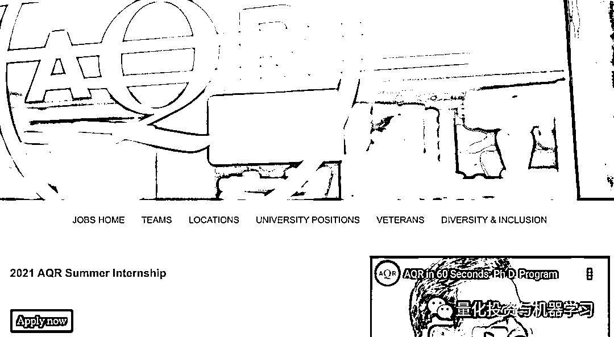
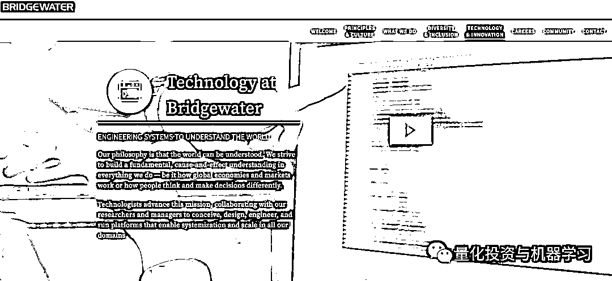
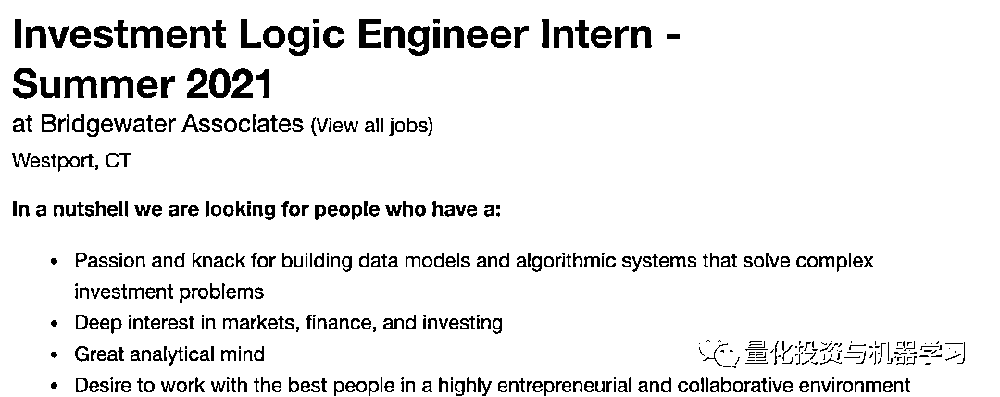
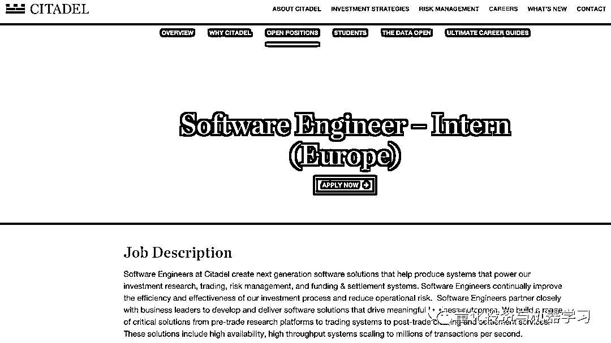

# 复合型技术人才：全球顶尖对冲基金的渴求！

> 原文：[`mp.weixin.qq.com/s?__biz=MzAxNTc0Mjg0Mg==&mid=2653302248&idx=1&sn=611bbaee4350ceb142b232b8731d03c6&chksm=802deffdb75a66ebe85928bd3646008940bc3ee975b1e91ed05cdfcac5393e688ec9dea031ca&scene=27#wechat_redirect`](http://mp.weixin.qq.com/s?__biz=MzAxNTc0Mjg0Mg==&mid=2653302248&idx=1&sn=611bbaee4350ceb142b232b8731d03c6&chksm=802deffdb75a66ebe85928bd3646008940bc3ee975b1e91ed05cdfcac5393e688ec9dea031ca&scene=27#wechat_redirect)

量化投资与机器学习编辑部

如果你正在考虑申请 2021-2022 年对冲基金行业的技术实习，那你来对了！

 2020 上半年 | 量化机构招聘汇总

2020-07-01

**DE Shaw 已经在物色 2021 年****软件开发和系统技术****方面实习生（纽约），以及在伦敦招聘软件开发人员实习生**。申请在**6 月份开始**，实习生招聘通常在冬末或春初完成。

https://www.deshaw.com/careers/internships

千禧年还**每年招聘 30 至 40 名实习生，遍布技术和核心基础设施领域**。今年，欧洲的申请截止日期似乎是 2 月份。明年的申请还没有开始。在正常情况下，该基金**为约 80%的实习生提供为期 10 周的全职工作机会**。今年，该公司进行了为期八周的虚拟实习。

Two Sigma 经营着一个**软件工程实习项目**，本月某个时候会有一些应用程序开放。你可以在这里看到一些以前的实习生做过的项目：

https://internships.twosigma.com/sample-projects

金融经验并不是必须的，但是你**必须**在**TOP 大学**有学习**计算机科学、数学、物理、统计或其他量化学科的经历**，大多数实习生都在纽约。

AQR 的 2021 年暑期实习申请已经开始：

https://careers.aqr.com/jobs/university-open-positions/greenwich/2021-aqr-summer-internship/2194349?lang=en_us#/

量化基金并不提供专业技术实习，但它承诺为学生提供：对量金融的广泛理解和其背后的技术。

桥水还开展过一项技术合作项目，不过目前还没有确定 2021 年的人选：

达里奥也亲自宣传：

https://jobs.bwater.com/explore/technology_lounge

这里也有学生黑客马拉松，技术伙伴们参与各种挑。同时还有 2021 夏季实习生的招募：

https://www.bridgewater.com/working-at-bridgewater/job-openings

Citadel 在**芝加哥、都柏林、纽约和伦敦都有软件工程实习生**，目前正在招聘。

Citadel 也在寻找一个终端用户支持工程实习生在芝加哥或纽约。

Point72 招聘技术实习生，020 年基本招满，2021 年还没有开始招聘：

https://www.point72.com/internships/

**最新消息****：****Alex Blanchard，高盛的顶级交易员加入了 Point72**。Blanchard 不是唯一加入 Point72 的高盛交易员。Point72 还聘请了高盛前美国政府交易主管 Andrew DiMaria。Millennium 的 Mo Grimeh 于 2020 年 2 月底从加入 Point72，担任宏观业务全球主管。6 月中旬，Point72 还聘用了 Capula 的 Paul Zhao。

<mpsearch class="js_mpsearch appmsg_search_iframe js_uneditable custom_select_card" data-keywords="%5B%7B%22label%22%3A%22Quant%22%7D%2C%7B%22label%22%3A%22%E5%AF%B9%E5%86%B2%E5%9F%BA%E9%87%91%22%7D%2C%7B%22label%22%3A%22%E9%87%8F%E5%8C%96%E6%8A%95%E8%B5%84%22%7D%2C%7B%22label%22%3A%22%E6%8B%9B%E8%81%98%22%7D%5D" data-w="286" data-ratio="1.5664335664335665" data-parentclass="appmsg_search_iframe_wrp"></mpsearch>

量化投资与机器学习微信公众号，是业内垂直于**Quant、MFE、Fintech、AI、ML**等领域的**量化类主流自媒体。**公众号拥有来自**公募、私募、券商、期货、银行、保险资管、海外**等众多圈内**18W+**关注者。每日发布行业前沿研究成果和最新量化资讯。