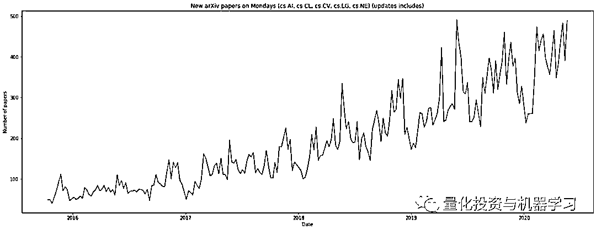
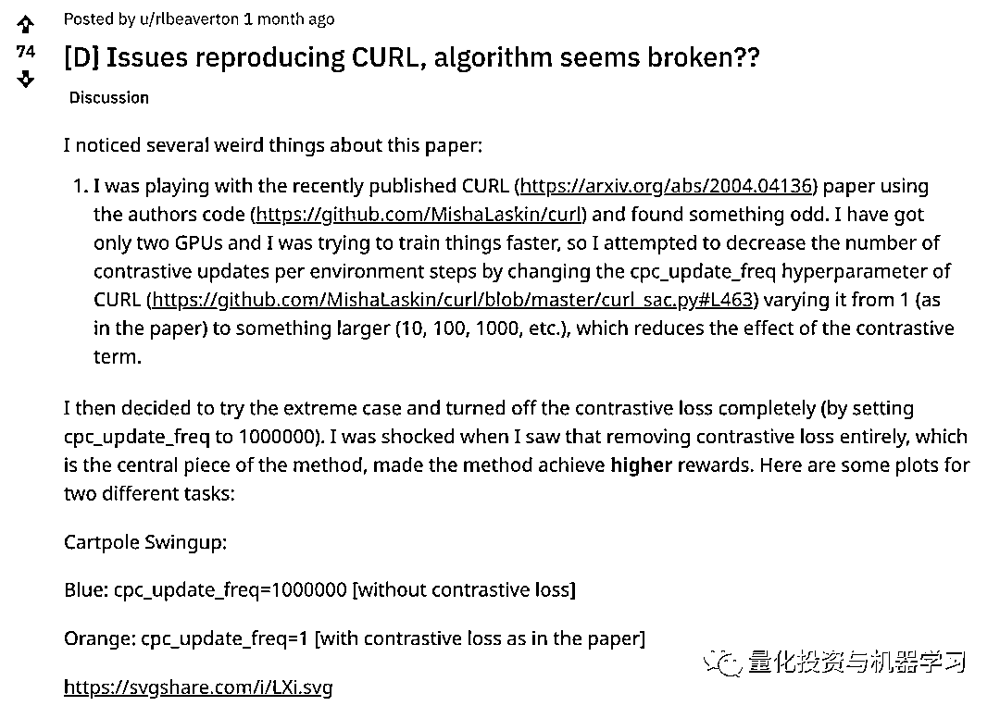
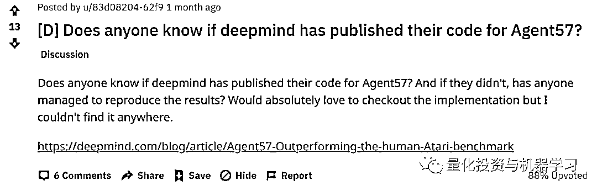
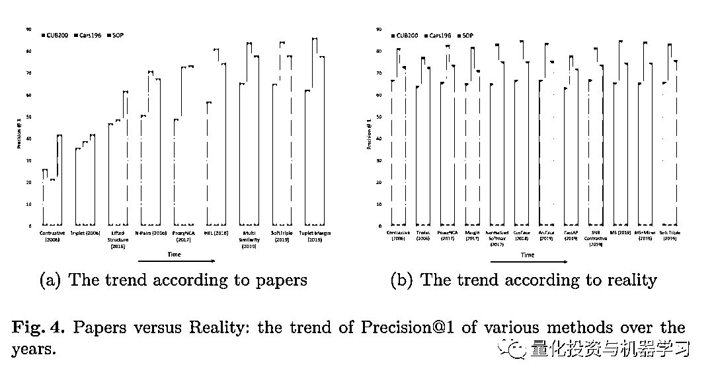
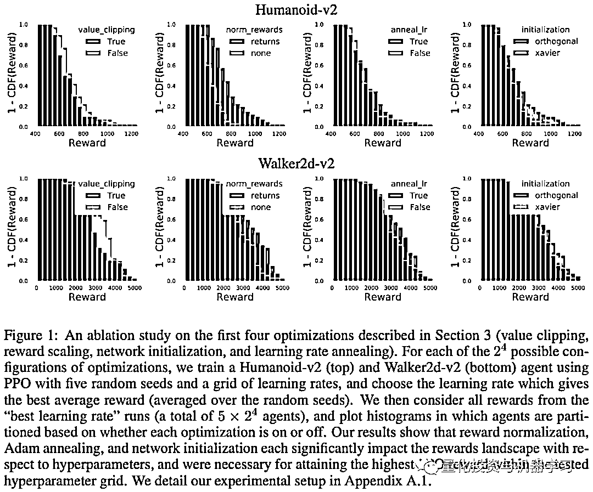
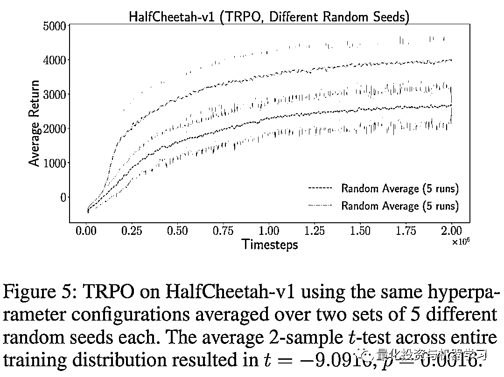
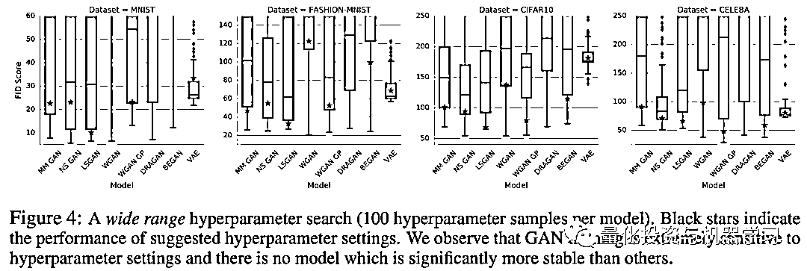
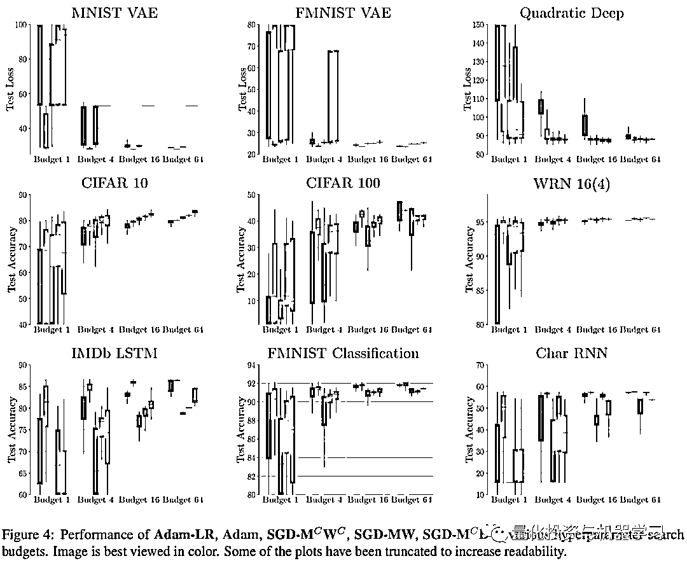
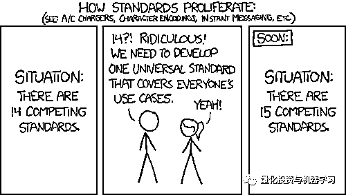
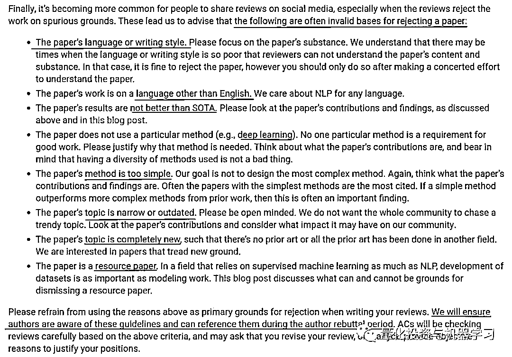

# AI 的思考

> 原文：[`mp.weixin.qq.com/s?__biz=MzAxNTc0Mjg0Mg==&mid=2653302168&idx=1&sn=9eebe31411b41485880f95005ee22953&chksm=802def8db75a669b2c9c1ec6e8c18cadf43eecccf3058062efc2ddebf961328e424a4fb835b2&scene=27#wechat_redirect`](http://mp.weixin.qq.com/s?__biz=MzAxNTc0Mjg0Mg==&mid=2653302168&idx=1&sn=9eebe31411b41485880f95005ee22953&chksm=802def8db75a669b2c9c1ec6e8c18cadf43eecccf3058062efc2ddebf961328e424a4fb835b2&scene=27#wechat_redirect)

作者：Denny Britz   编译：酸的馒头 

**如果牛市来了，不要成为韭菜！**

***1***

**引言**

从事深度学习的人数比以往任何时候都要多。在过去几年中，Journal 和 arXiv 提交的内容增加了约 5 倍。如果你考虑的是未以学术论文形式发表其结果的从业者，从事与 AI 相关的工作的人数可能会增加 10-25 倍。这是我们不久前对 arXiv 订阅进行的简要分析：

深度学习在图像识别、自然语言处理、生成模型、游戏等方面产生了惊人的结果。调查论文和经验报告表明，许多论文不是可复制的，在统计上不显著。我们经常看到从业人员发帖抱怨无法获得与声称的论文相同的结果：

深度学习的大多数经验子领域都受到了有关发表古怪论文的批评。最受欢迎的例子之一是有关度量学习（Metric Learning）的论文，该论文以平等的立场重新实施了技术，发现：

**趋势似乎是一条相对平坦的线，表明这些方法的表现彼此相似，无论它们是在 2006 年还是在 2019 年引入的。换句话说，度量学习算法并未取得他们声称取得的惊人进步。**

其他子领域也对复制性提出了相似的批评，尽管可能不那么激烈。深度强化学习可能在整篇论文[4] [22] [21] [12]和博客文章[15]中都受到了最多的关注，这些论文研究了某些结果的高度差异。

试图了解哪些结果是可信赖的、重要的并推广到现实世界中的问题已成为一种猜测游戏。在这篇文章中，我们想探讨一些有关可复制性的问题，开源和学术激励措施如何发挥作用，以及可能的解决方案是什么样的。我们距离第一个讨论这个主题还很遥远，但是我们认为我们对某些问题的看法与我们看到的其他人的提议有些不同。这些趋势的另一个很好的概述是[1]。在文章的结尾，你可以找到更多有关特定子领域中的问题的论文。

***2***

**重复与复制**

我们认为重要的是首先弄清一些术语。重复性和可复制性（Reproduction、Replication）是经常被混淆或交替使用，但它们指的是不同的东西。根据你所处的科学领域，你可能会看到略有不同的定义。有些字段甚至交换了两个术语的含义。至少可以这样说，这令人困惑。ACM 通过的标准定义大致如下：

*   可重复性是在相同的输入数据上运行相同的软件并获得相同的结果。

*   可复制性是根据原始出版物中提供的计算模型或方法的描述来编写然后运行新软件，并获得足够相似的结果以得出相同的结论。

在开放源代码软件时代，可重复性非常简单：只需运行代码即可。有时候“仅仅运行代码”说起来容易做起来难，但是，如果代码在那里并且你付出了一些努力，通常是可能的。另一方面，可复制性几乎从来都不容易。但是稍后会更多。在本文中，我们仅关注可复制性——根据一篇论文提出的观点得出相同的高级结论。这并不一定意味着获得与论文完全相同的结果，而是获得足够相似的结果以令人信服。

***3***

**为什么复制很难**

**软件框架**

有人会认为，在两个不同的框架中实施相同的模型会导致相同的结果。但是事实并非如此。框架实现、文档不足、隐藏的超参数以及错误中的细微差异可能会层叠并导致不同的结果。如果你浏览热门的深度学习框架的 Github 问题和论坛，则可以找到许多研究人员获得意外结果的示例。从我们所看到的情况来看，像 Keras 这样的高级框架隐藏了低级的实现细节，并且已经为你提供了隐式的超参数选择，这是最常见的混乱之源。

**细微的实现差异**

由于深度学习算法和管道的复杂性，论文并未描述每个实现细节。这样做会分散整体叙述的注意力并使读者不知所措。作者可能还只是忘记了撰写论文时几个月来一直在反复使用的大型代码库的一些细节。

使用纸质格式传达高级想法和最重要的决定似乎是一个好主意。但是并不总是很明显哪些部分很重要。有时这很违反直觉。研究人员可能不了解自己，甚至可能不知道自己不知道。细小的实施细节有时会产生巨大的影响。而且，由于本文未对它们进行重点介绍，因此很少有人会在进一步的实验中考虑这些细节。

我们发现，PPO 带来的收益回报的大部分改进可能来自对核心算法的细微修改，我们称之为代码级优化[12]：

**随机种子**

研究人员经常坚持使用自己喜欢的随机种子，并且不进行足够多次的实验来获得置信区间。并非总是出于恶意目的。作者可能没有意识到方差有多大，有时重新进行实验是不可行的。当模型需要花费数天、数周或数月的时间来训练并且实验花费数万至数十万美元时（训练 GPT-3 的费用估计为 10—20M 美元），这是有道理的，并不是每个人都拥有可重复性的奢侈。误差区间不是纸质验收的要求，也不一定是必须的。

但是，更换随机种子会导致明显不同的结果是有问题的：

*   我们证明了运行之间的方差足以从不同的随机种子中创建统计上不同的分布[4]

*   仅通过对具有相同超参数但随机种子的不同运行进行平均，就可以获得完全不在同一分布内的训练曲线。[21]，

**超参数**

控制训练过程但不直接属于模型的参数称为超参数。这通常包括诸如优化器、学习率进度表、模型大小、激活功能等选择。研究表明，与使用功能更强大的模型相比，对简单模型的超参数进行适当的调整可以带来更好的结果。例如，[3]表明，经过良好调整的 LSTM 基准可以胜过最新模型。在 GAN 研究中，我们发现，大多数模型可以通过足够的超参数优化和随机重启来达到相似的分数。这表明，与基本算法的变化相比，更高的计算预算和更多的调整可以带来改进。[16]

除了过度调整的问题外，选择什么是超参数都是任意的。从最严格的意义上讲，不是模型（或归纳偏差）一部分的优化算法未更改的所有内容都是超参数。这将包括你的代码中所有可能有所不同的小决定，但这些决定并不是你争论的中心部分。例如，如果你提议对该体系结构进行特定扩展（例如新的关注机制），则不会将网络体系结构视为超参数。但是，如果你提议一种新的强化学习算法，则可以将体系结构视为超参数，如[4]所示。

正如我们在上面的实现差异部分中简要提到的那样，有成千上万个这样的微小决定。通过使用高级框架，你还引入了其他超参数，这些超参数可能被隐藏，因为它们被设置为默认参数。找到所有超参数并进行改变是不可行的。它们的范围应该是什么，或者它们如何相互作用也不是很明显。大多数作者对哪些参数很重要做出了有根据的猜测，将它们与他们认为归纳性偏差分开了。但是这些主要是基于直觉的猜测，有时它们是错误的。

**路径依赖性和中奖彩票**

在报告基准测试结果时，论文通常会声称找到了一种算法，该算法可以泛化到看不见的数据。泛化归根到底是目标。通常，这些发现伴随着一些令人费解的故事，这些故事是事后发现的，说明了该算法为何起作用。无论多么聪明，我们都是好故事的吸引者，尤其是我们自己的故事。

实际上，研究人员可能已经发现了某种彩票，它恰好在一组特定的超参数下解决了特定问题。在稍微不同的数据分布上可能无法很好地工作[24]。在已发表的论文和代码中，你只会听到有关中奖票证的信息，而不是有关不起作用的 100 张丢失票证的信息——作者尝试但未通过的架构和超参数变化，可能是在测试集上对其进行了评估。如果你知道这 100 个失败的变体，这是否会让你对获胜变体的泛化能力持怀疑态度？

研究是取决于路径的，但是你只能以抛光纸的形式看到最终结果。这就像从上周收到中奖彩票一样 ——有人中奖了真是令人惊讶，但对未来却没有太大用处。在理想的世界中，你会知道论文的生成过程及其代码——研究人员为得出结论而采取的全部方法。但这不切实际，也不会使作者在同行评议中看起来不错。

**在从事金融工作期间，我们发现公司在回测（根据历史数据评估模型）时非常清楚这些陷阱，并尝试根据所采用的路径来调整结果。例如，在某些对冲基金中，记录了对测试集的每次访问，并且对最终绩效指标进行了数学调整，以考虑研究团队触摸数据的次数。**

**计算预算**

学习曲线可能会欺骗（除了上瘾）。训练过程收敛时，这并不明显。你可能停止得太早，尤其是在实验的计算预算受到限制时。

计算预算也会影响你可以搜索的超参数的空间。在[11]中，作者发现优化器超参数在评估更大的计算预算对优化器表现的影响时至关重要。如果你不使用似乎最容易调整但并不总是最佳的 Adam 优化器，则较大的调整预算可能会导致截然不同的结果：

尽管如此，论文中很少报告用于实验的计算预算。

一些研究是如此密集的计算，以至于几乎没有实验室能够做到。对于像 GPT-3 这样的巨大模型，对于像神经架构搜索这样的子字段，这都是正确的：

**神经架构搜索（NAS）的最新进展要求巨大的计算资源，这使得难以重现实验，并且对无法访问大规模计算的研究人员构成了进入壁垒[13]。**

**评估协议**

评估协议也可能不明确。作者可以轻推评估标准，以稍稍赞成他们。例如，在 NLP 中，可以使用不同的标记化方案和度量的实现（例如 BLEU），而无需明确提及此类细节。在强化学习中，可以通过多种方式报告绩效。

**一些作者报告说，每 n 次部署后，学习阶段本身的表现，而另一些作者报告说，一旦停止训练，平均得分超过 k，而另一些报告则报告了训练期间未发现的环境变化得分[22]。**

指标选择和基线比较也有些随意。在某些领域，研究人员可以选择使模型看起来最佳的任何比较——可能会有数十种指标可供选择。

**很少有论文可以相互比较，而且论文之间的方法学如此不一致，以至于我们无法自己进行这些比较。例如，有四分之一的论文没有其他修剪方法，有一半的论文最多有其他修剪方法，而数十种方法从未被任何后续工作进行比较。此外，即使在三分之一的论文中也没有出现数据集/网络对，评估指标差异很大，超参数和其他混杂因素也有所不同或不确定。[6]**

**测试装置泄漏**

大多数机器学习从业者都知道，应该将数据分为训练、验证和测试集，并且不应使用测试集来指导训练决策。实际上，故事要复杂得多。虽然训练算法不应该使用测试集，但是尚不清楚研究人员可以在多大程度上使用它。研究人员只是学习算法调整模型超参数的扩展。他们是元学习者，他们的学习过程被戏称为研究生血统。

由于基准表现是在测试集上报告的，因此研究人员必须最终检查以确保其算法运行良好，足以证明发表论文是正确的。而且由于该测试仪是公开可用的，因此没有什么可以阻止研究人员不断地对其进行窥视。我们的经验是：

我们见过由顶尖高科技公司的研究人员设计的 ML 系统，它们在训练期间显示测试集错误。你甚至通过阅读其他报告测试结果的研究也已经从测试集中收到信号。测试集只是一个工具，对其的保护越好，它的有效性就越高。充分利用它来学习有关你的模式的知识。

在度量学习领域，研究人员发现几个直接通过测试集反馈训练的代码库：

在训练过程中，定期检查模型的测试集准确性，并报告最佳测试集准确性。换句话说，没有验证集，并且通过来自测试集的直接反馈来完成模型选择和超参数调整。一些论文没有定期检查表现，而是在训练了预定的迭代次数后报告准确性。在这种情况下，尚不清楚如何选择迭代次数，并且仍会根据测试集表现来调整超参数。这违反了机器学习的最基本的诫命之一。使用度量集反馈进行训练会导致对度量集的过度拟合，因此，如度量学习文章中所述，随着时间的推移，准确性的稳步提高令人质疑。[2]

每个人都以一种或另一种方式偷看。你只是通过阅读研究人员的报告结果来窥视。问题是，偷看多少才合适？一次结束？每次超参数调整运行之后？一天一次？你什么时候偷看太多，应该调整结果以考虑测试集的反馈？你将如何调整呢？如上文路径依赖部分所述，有时会根据触摸测试数据的频率来调整量化金融中的基准结果，但是这样的系统在开放式研究中将很难实现。

还不清楚这种测试装置泄漏在多大程度上真正重要。研究人员发现[10] [9]，尽管多年的研究人员都使用相同的测试集，但图像识别模型可以很好地推广到看不见的数据。

因此，至少在 CIFAR-10 和 ImageNet 上，经过多年竞争的测试集适应性并没有导致准确性数值下降。[10]和[9]

***4***

**数据管道、预处理和扩充**

数据是另一个可能出现复制性问题的地方。训练示例的改组可能会对表现产生影响，尤其是在数据不是完全独立且分布不均（IID）的情况下。研究人员可以在分布式基础结构上进行实验，以便即使使用相同的随机种子，数据输入的顺序也始终是随机的，从而导致结果略有不同。

随着使用自我们监督目标和数据扩充的方法（例如对比学习）变得越来越主流，越来越多的复杂性可能会转移到数据管道本身中。由于研究人员倾向于将更多的精力放在模型细节上，而不是在撰写文章时进行数据处理，因此这可能会导致变异性的另一个来源。图像增强可以直接进入数据管道，但是实现细节可能略有不同。在 NLP 中，令牌化方案就是这种情况。有时不清楚在预处理和后处理期间使用了哪种标记程序和标记化方案。

***5***

**Bug**

在传统软件工程中，错误通常很明显。你的程序崩溃或产生意外的输出。在实施复杂的深度学习模型时，错误会更加微妙。有时它们是看不见的。你的模型可能学习得很好，而错误可能只会稍微影响收敛速度和最终结果。有时甚至可以充当正则器！你永远不会知道！最近的论文[23]研究了深度学习模型和框架中最常见的错误类型。

***6***

**开源被误解**

开源对研究界产生了巨大影响。会议和研讨会开始要求将代码作为论文提交的一部分，并且带有代码的论文之类的网站都会汇总开源结果。开源虽然很棒，但我们认为它不能解决某些人认为的那样多的问题。

首先，**开源代码提供可再现性，但不提供可复制性**。代码包括作者的超参数和归纳偏差。如上所述，这些代码级优化可能对算法的表现至关重要，而在本文中没有提到。只有迫使研究人员从头开始重复研究结果，我们才能发现此类问题。

**除非有人阅读并理解，否则发布代码不会做任何事情**。这听起来似乎很明显，但是除了原始作者以外，其他人可能从未阅读过许多已发布的代码。至少没有详细。开源并不意味着没有错误，也不意味着作者没有训练测试数据。我们记得有几次人们在已发布的代码中发现错误或测试集泄漏。有时，这会导致论文撤回，但有时，这些证据被已经转向其他项目的作者所忽略。没人真正关心。

当然，在已发布的代码中发现错误是很棒的——这表明发布代码是一件好事。但是，这也提出了一个问题，即开放源代码回购中仍然有多少错误不会被任何人发现。研究代码通常很难理解，并且往往缺乏代码质量和文档，只有少数选择的人才能阅读研究代码，他们甚至没有强烈的动机去寻找和报告错误。

开源代码还鼓励复制和粘贴 SOTA 追逐思维。当你拥有一段接近最新技术的代码时，可以很容易地对其进行复制，调整一些超参数和架构选择，并且幸运的是，你将获得足够好的结果来发表论文。这是研究生的方式。通过这种方法，你更有可能过分适应基准测试并发现了无法泛化的增量改进。如果没有可用的代码，则你可能被迫从首要原则开始，深入思考问题，并提出新的见解。

如前所述，代码从不讲述完整的故事。你看到的发布的代码只是作为元学习者的作者发现运行良好的最终设置。你不知道导致作者编写该代码的学习过程。代码本身只是一个超参数设置，从根本上说，它与配置文件中的学习率没有太大不同。唯一的区别是元学习者的超参数设置，而学习率是学习者的设置。

我们并不是想反对开源研究代码。积极大于消极。但是重要的是要认识到这些缺点。公开代码真正发挥作用的地方是充当论文的其他文档。当论文有歧义时，你不再需要向作者发送电子邮件。相反，你可以查看代码以消除混乱。

开源代码也是一个很好的否定过滤器。没有开放源代码的结果应立即引起注意。但是这种代码的存在并没有说明结果的可复制性、有效性或普遍性。

***7***

**激励自身利益**

这里讨论的大多数问题似乎都有直接的技术解决方案。你可能想知道，为什么研究人员不仅仅研究通用的共享代码库，该代码库实现标准化的数据加载、跟踪和基准测试，对 forks 和 pull 请求做出贡献，并使用与 Kaggle 相似的，保持私有的测试数据？这不是很容易构建吗？对。没有人这样做的原因是由于缺乏动力和现有的学术文化。技术可行性并不重要。

行业和学术界的研究人员经常使用已发表论文的数量、引文计数、发表地点、h 指数等指标（用于职位申请和晋升）进行评估。这鼓励了论文的快速生产，最大程度地增加了期刊的机会验收。有时，这是通过过度拟合基准以获得最新的结果来完成的，这似乎是克服怀疑的人类审阅者的一种行之有效的方法。毕竟，很难反驳带有好故事的数字。除非这些激励措施发生变化，否则技术解决方案不太可能有效，社区可能会忽略。我们都已经看到了这样的事情：

另一个问题可能是缺少自身利益在其中。发表论文没有太大的下行风险，但研究人员保留了上行空间。如果研究没有提出异想天开的主张，但有一点缺陷或对测试集的过度拟合，则对研究人员没有任何后果。它可能仍会被期刊引用或发表。即使发现错误，也经常会忽略它们，因为修复已经发表的论文不值得付出努力，而且收回的机会很少。虽然某些下行保护对于创新很重要（科学很难，我们不想劝阻冒险的想法），但接近零的下行可能会导致大量不必要的噪音和怪异的主张。鼓励人们随意扔东西墙 arXiv。

***8***

**把研究作为艺术**

在更多地讨论激励措施之前，让我们退后一步，思考一下研究的内容。我们所讨论的大多数问题都是针对以基准为基础的经验研究。此类研究非常重要，我们相信在良好的标准化基准上进行竞争是深度学习快速发展的主要推动力之一。但是，还有其他一些不依赖基准的研究也同样重要：理论结果、元研究和调查以及尚不能很好发挥作用的新颖思想。让我们谈谈最后一个。

**科学中重要的事情不是获得新事实而是发现新的思考方式。**〜William Bragg 爵士

可复制性和可重复性既不是影响研究的充分条件，也不是必要条件。即使没有进行实验或取得良好结果，新颖的想法也会产生巨大的影响。神经网络很长时间没有工作，使用它们的论文在很大程度上被忽略了。如果激励研究人员继续研究它们，也许我们可以更早地发现它们的潜力？同样，由于每个人都在努力使 NNs 超越现在的最新基准，因此我们可能忽略了 AI 其他领域的巨大潜力，这些潜力可以利用我们为深度学习创建的庞大数据集和新基础架构。JürgenSchmidhuber 以其在 LSTM 方面的工作而闻名，他以发表有趣的想法而闻名，而没有大量的实验或经验结果。这样的研究比经验科学更接近于艺术，痴迷于可量化的事实和数字。两种类型的研究都是需要的，但是目前的激励措施似乎倾向于基准爬坡而不是新颖的想法。

同行评议在一定程度上应归咎于此——难以评估疯狂的想法并为其分配数值分数。评论者也有自己的自我挑战。在撰写评论时依靠标准基准度量指标是舒适且低风险的。整个历史上的其他科学领域都是如此，突破性的想法有时被标准的同行评审过程所拒绝：

**你可以根据《科学》 或《自然》杂志拒绝发表的论文写出过去 50 年的整个科学史〜Paul Lauterbur**

Max Planck 将他对 Annalen der Physik 的编辑哲学描述为爱因斯坦在那儿发表了他的论文，并且其接受率约为 90％，如下：

**要避免压制奇怪的意见而不是对评估意见太温和的责备。**

强迫所有人遵守可复制性标准可能会使学术界进一步朝着这个方向发展，从而导致艺术性和大胆的研究减少。也许解决方案是相反的——不再沉迷于措施并将研究视为一门艺术。让思想的自由市场决定泡沫的产生。这还需要改变激励机制和文化，也许甚至比强迫复制更具挑战性。

***9***

**自上而下的激励变化**

改善学术动机的一种方法是强迫自上而下的变革。这就需要来自不同市场参与者的支持：期刊可以根据同行评审和接受标准来更改准则。大学可以改变录取、毕业和升职过程。公司可以更改在雇用和晋升过程中查看凭据和出版物的方式。有影响力的学术领袖可能会承担一些风险，并会推广一个新系统。EMNLP 审核策略的最新更改是此类更改的一个示例：

 

自上而下的更改可能很慢。为了进行启动类比，自上而下的变更就像进行企业销售一样——你必须说服某个大型老派组织的管理团队以新的工作方式创造价值。从长远来看，不一定要为客户或生态系统带来价值，而对于仍在从中受益的公司和管理团队中的人们而言，它们却是有价值的。没有人会喜欢购买那些会增加其投资组合风险，但只会给离职后很长一段时间的下一代人带来好处的东西。他们宁愿坚持现状。

***10***

**自下而上的激励变化**

解决激励问题的另一种方法是自下而上。让我们继续使用启动类比。在这种情况下，你将跳过企业销售并提供对个人或小型团队有用的产品。一旦达到临界数量，大型组织便被迫采用它。在开发人员领域，很多产品都遵循这种模式。Github 就是一个例子。许多组织曾经拥有自己的内部版本控制系统，但是单个员工发现 Github 的表现要好得多，即使没有高层的明确许可，他们也开始在内部使用它。现在，这些组织通过企业计划向 Github 支付费用，但是 Github 并没有开始与试图说服他们的管理团队达成交易。由于文化压力，老牌公司别无选择，只能采用它。

对于学术界而言，从下至上改变激励机制意味着为人们提供退出或规避传统学术体系的替代选择。这已经以各种方式发生。除了发表论文之外，一些研究人员现在还选择通过博客，具有交互式可视化效果的项目页面、YouTube 视频、Github 代码、实时演示或其他媒体来促进他们的研究。正如该 HN 用户所说的那样，这使他们可以覆盖更广泛的受众并建立个人投资组合：

无论是否增加引用，研究界确实应该更好地与更广泛的世界互动。例如，我们在 Hotnets 2019 中有这篇论文，大约 80 人看了我们的展示。但是我们也花了一些时间，将它变成了一个小视频，然后放到了 YouTube 上。那里有 360,000 人看过它。现在，这些人中的许多人可能失去了精妙之处，但是如果其中只有少数人从中受益，那么它可能会比原始论文产生更大的影响。

在当今环境下，即使没有学术论文和引文，受欢迎的项目也可以直接导致在工业实验室中找到工作。在大学环境中，情况则更是如此，后者更多地依赖于传统指标。这是替代系统的开始。开源为计算机科学做了类似的事情。如今，很少有公司对计算机科学学位有苛刻的要求——现实世界的项目可以取代这个学位。

研究的发现和传播方式也在发生变化。过去，研究人员过分依赖期刊、会议和同行关系来发现相关研究。现在，每个人都在 arXiv 上进行发布、发现和管理也发生在社交媒体（如 Reddit 和 Twitter）以及独立站点（如 arxiv-sanity）上。尽管大多数研究人员的目标仍然是在期刊上发表论文，但似乎很少有人依靠（或信任）他们来策划和发现研究。现在，他们的行为更像是获得批准的印记——类似于大学学位。

我们希望我们会看到更多的另一趋势是独立研究人员。传统的系统具有很高的政治性，并青睐大型实验室和大学的研究人员。像 gwern 这样的独立研究人员已经证明，你无需拥有任何附属机构即可从事有趣的事情。不幸的是，似乎很少有结构化的方法来谋生进行独立研究。

为 21 世纪从头开始设计一个新的学术激励系统将是一个有趣的工作。当前的许多过程来自互联网不存在或不是主流的时代。就个人而言，我们很好奇像学术预测市场之类的东西是否能起作用，能够为批判性讨论和结果审查提供激励的东西。我们对此有一些想法，我们可能会写在单独的文章中。这个已经太长了！

**参考文献**

[1] Troubling Trends in Machine Learning Scholarship Zachary C. Lipton, Jacob Steinhardt (2018) [http://arxiv.org/abs/1807.03341v2] [Semantic Scholar] [Google Scholar]

[2] A Metric Learning Reality Check Kevin Musgrave, Serge Belongie, Ser-Nam Lim (2020) [http://arxiv.org/abs/2003.08505v1] [Semantic Scholar] [Google Scholar]

[3] On the State of the Art of Evaluation in Neural Language Models Gábor Melis, Chris Dyer, Phil Blunsom (2017) [http://arxiv.org/abs/1707.05589v2] [Semantic Scholar] [Google Scholar]

[4] Deep Reinforcement Learning That Matters Peter Henderson, Riashat Islam, Philip Bachman, Joelle Pineau, Doina Precup, David Meger (2017) [http://arxiv.org/abs/1709.06560v3] [Semantic Scholar] [Google Scholar]

[5] The Neural Hype and Comparisons Against Weak Baselines Jimmy Lin (2019)

ACM SIGIR Forum [https://doi.org/10.1145/3308774.3308781] [Semantic Scholar] [Google Scholar]

[6] What Is the State of Neural Network Pruning? Davis Blalock, Jose Javier Gonzalez Ortiz, Jonathan Frankle, John Guttag (2020) [http://arxiv.org/abs/2003.03033v1] [Semantic Scholar] [Google Scholar]

[7] Neural Text Summarization: A Critical Evaluation Wojciech Kryściński, Nitish Shirish Keskar, Bryan McCann, Caiming Xiong, Richard Socher (2019) [http://arxiv.org/abs/1908.08960v1] [Semantic Scholar] [Google Scholar]

[8] Deep Dominance - How to Properly Compare Deep Neural Models

Rotem Dror, Segev Shlomov, Roi Reichart (2019)

Proceedings of the 57th Annual Meeting of the Association for Computational Linguistics

[https://doi.org/10.18653/v1/p19-1266] [Semantic Scholar] [Google Scholar]

[9] Identifying Statistical Bias in Dataset Replication

Logan Engstrom, Andrew Ilyas, Shibani Santurkar, Dimitris Tsipras, Jacob Steinhardt, Aleksander Madry (2020)

CoRR

[http://arxiv.org/abs/2005.09619v1] [Semantic Scholar] [Google Scholar]

[10] Do Imagenet Classifiers Generalize To Imagenet?

Benjamin Recht, Rebecca Roelofs, Ludwig Schmidt, Vaishaal Shankar (2019)

CoRR

[http://arxiv.org/abs/1902.10811v2] [Semantic Scholar] [Google Scholar]

[11] Optimizer Benchmarking Needs To Account for Hyperparameter Tuning

Prabhu Teja Sivaprasad, Florian Mai, Thijs Vogels, Martin Jaggi, François Fleuret (2019)

CoRR

[http://arxiv.org/abs/1910.11758v3] [Semantic Scholar] [Google Scholar]

[12] Implementation Matters in Deep Policy Gradients: A Case Study on Ppo and Trpo

Logan Engstrom, Andrew Ilyas, Shibani Santurkar, Dimitris Tsipras, Firdaus Janoos, Larry Rudolph, Aleksander Madry (2020)

CoRR

[http://arxiv.org/abs/2005.12729v1] [Semantic Scholar] [Google Scholar]

[13] Nas-Bench-101: Towards Reproducible Neural Architecture Search

Chris Ying, Aaron Klein, Esteban Real, Eric Christiansen, Kevin Murphy, Frank Hutter (2019)

CoRR

[http://arxiv.org/abs/1902.09635v2] [Semantic Scholar] [Google Scholar]

[14] Benchmarking Graph Neural Networks

Vijay Prakash Dwivedi, Chaitanya K. Joshi, Thomas Laurent, Yoshua Bengio, Xavier Bresson (2020)

CoRR

[http://arxiv.org/abs/2003.00982v1] [Semantic Scholar] [Google Scholar]

[15] Deep Reinforcement Learning Doesn’t Work Yet

Alex Irpan (2018)

[https://www.alexirpan.com/2018/02/14/rl-hard.html] [Semantic Scholar] [Google Scholar]

[16] Are GANs Created Equal? A Large-Scale Study

Mario Lucic, Karol Kurach, Marcin Michalski, Sylvain Gelly, Olivier Bousquet (2018)

arXiv:1711.10337 \[cs, stat\]

[http://arxiv.org/abs/1711.10337] [Semantic Scholar] [Google Scholar]

[17] The Ladder: A Reliable Leaderboard for Machine Learning Competitions

Avrim Blum, Moritz Hardt (2015)

arXiv:1502.04585 \[cs\]

[http://arxiv.org/abs/1502.04585] [Semantic Scholar] [Google Scholar]

[18] Fantastic Generalization Measures and Where to Find Them

Yiding Jiang, Behnam Neyshabur, Hossein Mobahi, Dilip Krishnan, Samy Bengio (2019)

arXiv:1912.02178 \[cs, stat\]

[http://arxiv.org/abs/1912.02178] [Semantic Scholar] [Google Scholar]

[19] Winner’s Curse? On Pace, Progress, and Empirical Rigor

D. Sculley, Jasper Snoek, Alex Wiltschko, Ali Rahimi (2018)

[https://openreview.net/forum?id=rJWF0Fywf] [Semantic Scholar] [Google Scholar]

[20] Reproducibility vs. Replicability: A Brief History of a Confused Terminology

Hans E. Plesser (2018)

Frontiers in Neuroinformatics

[https://www.ncbi.nlm.nih.gov/pmc/articles/PMC5778115/] [Semantic Scholar] [Google Scholar]

[21] Reproducibility of Benchmarked Deep Reinforcement Learning Tasks for Continuous Control

Riashat Islam, Peter Henderson, Maziar Gomrokchi, Doina Precup (2017)

arXiv:1708.04133 \[cs\]

[http://arxiv.org/abs/1708.04133] [Semantic Scholar] [Google Scholar]

[22] RE-EVALUATE: Reproducibility in Evaluating Reinforcement Learning Algorithms

Khimya Khetarpal, Zafarali Ahmed, Andre Cianflone, Riashat Islam, Joelle Pineau (2018)

[https://openreview.net/forum?id=HJgAmITcgm] [Semantic Scholar] [Google Scholar]

[23] A Comprehensive Study on Deep Learning Bug Characteristics

Md Johirul Islam, Giang Nguyen, Rangeet Pan, Hridesh Rajan (2019)

arXiv:1906.01388 \[cs\]

[http://arxiv.org/abs/1906.01388] [Semantic Scholar] [Google Scholar]

[24] Shortcut Learning in Deep Neural Networks

Robert Geirhos, Jörn-Henrik Jacobsen, Claudio Michaelis, Richard Zemel, Wieland Brendel, Matthias Bethge, Felix A. Wichmann (2020)

arXiv:2004.07780 \[cs, q-bio\]

[http://arxiv.org/abs/2004.07780] [Semantic Scholar] [Google Scholar]

量化投资与机器学习微信公众号，是业内垂直于**Quant、MFE、Fintech、AI、ML**等领域的**量化类主流自媒体。**公众号拥有来自**公募、私募、券商、期货、银行、保险资管、海外**等众多圈内**18W+**关注者。每日发布行业前沿研究成果和最新量化资讯。