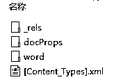
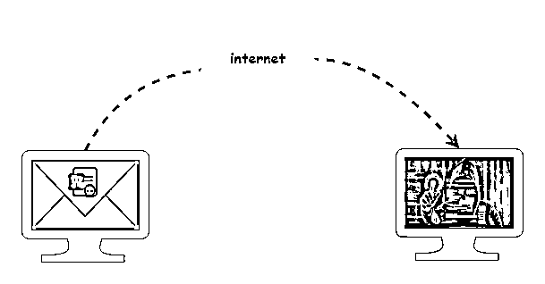
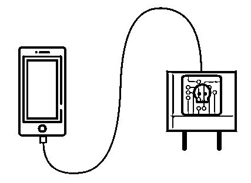

# 如果张东升是个程序员

> 原文：[`mp.weixin.qq.com/s?__biz=MzAxNTc0Mjg0Mg==&mid=2653302053&idx=1&sn=7f4c0ad9de55fc6503a4722fa5a8787f&chksm=802def30b75a66265d93e95cf85d5ea52730587e09790a263f01c2ddeaccc4d0ca4509df856c&scene=27#wechat_redirect`](http://mp.weixin.qq.com/s?__biz=MzAxNTc0Mjg0Mg==&mid=2653302053&idx=1&sn=7f4c0ad9de55fc6503a4722fa5a8787f&chksm=802def30b75a66265d93e95cf85d5ea52730587e09790a263f01c2ddeaccc4d0ca4509df856c&scene=27#wechat_redirect)


张东升是一家互联网公司的程序员，一直以来都勤勤恳恳老实工作。

可最近一段时间，老板接了几个项目回来，不但开启了 996 的工作模式，更要命的是频频更改需求，弄得大家是敢怒不敢言。

时间一久，东升慢慢开始消极怠工，晚上也不怎么加班了。终于有一天，和老板在会议室吵了起来，老板决意让其忙完手头的项目就离职。

老板看大家最近一段时间都很辛苦，决定组织一次团建，在群里询问大家有什么活动建议。

这时，张东升提议：“最近大家都工作挺累，也没有什么机会锻炼，身体要紧，要不一起去爬六峰山吧”

东升的提议获得了不少人的赞同，团建活动就这么定了下来。

团建这天，爬至半山腰，东升问老板：“您看我还有机会吗？”


老板看了他一眼，没有说话，继续抽烟。

爬至山顶，大家三三两两都在拍照发朋友圈。

这时东升拉住老板到一旁说给他拍照，老板知道东升是为讨好自己，也就没有拒绝。

东升举起手机，却说老板衣服有褶皱，上前为其整理，竟趁其不备将其推下山崖···

晚上，张东升还在电脑前调试着代码，突然，一封主题为“警告”的邮件窗口从侧边弹了出来。

东升的心跳立刻加速，小心翼翼的点开了这封邮件，正文只有四个字：“请看附件”

附件是一个 word 文档，东升并没有立即打开，职业习惯让他打开了 VMware 虚拟机，在虚拟机中打开了这个文件。

原来以为白天的事无人知晓，没想到这一幕正好被对面山头正在拍摄抖音短视频的三个小孩用手机录了下来。

三个小孩看到了张东升 T 恤上的公司名字，并在公司网站上找到了他的邮箱，这才给他发了这封邮件。

张东升看到后，大惊失色，想找到对方，却不知道对方是什么来头。

这时他注意到附件是一个 docx 文件，想到 office2007 及其以后的版本才用这个格式，其实际上是一个压缩文件格式 zip。

东升思索片刻将其重命名为一个 zip 文件，然后解压，想看看是否能发现些什么信息。



接着在 docProps 目录下找到了 app.xml：

```py
...
<AppVersion>15.0000</AppVersion>
...
```

版本号是 15，看来对方用的是一个 Office2013 版本的 word。  

东升很快在网络上搜到了一个漏洞：CVE-2017-11882，这是一个可以远程执行代码的漏洞，字符串拷贝没有对长度进行校验导致栈溢出。

说干就干，东升打开了 metasploit，通过它很快生成一段包含恶意代码的 word 文件，将其作为附件回复给了对方。

三个小孩此刻正聚集在朱朝阳的家里，自从他们发送了警告邮件，心里就忐忑难耐，一直盯着电脑屏幕，看看是否会有回复。

一看到邮件弹窗，就赶紧点了开来。邮件正文也只写了一句话：我想说的都在附件中。

朱朝阳没有犹豫，又立刻点了附件。电脑上的 Word 进程随即启动，解析附件 doc 文件时，触发了漏洞，执行了张东升事先编写的恶意代码。而此时，朱朝阳却一无所知。



恶意程序很快和张东升的电脑建立了网络连接，并开始收集朱朝阳电脑的信息，IP 地址、MAC 地址、电脑文件等等。

东升不愧是经验丰富的程序员，为了躲过电脑防火墙的拦截，他编写的恶意代码通过 ICMP 协议的负载字段进行数据传输。

朱朝阳正瞅着空白的 word 文档感到疑惑，突然电脑屏幕上出现了一个视频聊天窗口，一陌生男子的画面突然出现吓得朱朝阳惊出了一身冷汗。

定睛一看，这男子不是别人，正是推人的张东升。

张东升先开口了：“没想到竟然是个小孩。我已经知道你电脑的 IP 地址，也知道你家住在哪里，明天上午出来聊聊，就在你家巷子口的面馆”，说完就切断了视频信号。

张东升的突然出现，显然吓坏了朱朝阳。一旁的严良问到：“什么是 IP 地址？他又是怎么知道你家的位置，连面馆都知道，这简直太可怕了。”

朱朝阳镇定了两分钟，缓过神来，说到：“一定是刚才的邮件附件有问题，我的电脑已经被他控制。IP 地址是电脑接入网络分配的通信身份证号码，通过 IP 地址就能锁定电脑的位置，再用地图一看就能知道附近的街道布局和街景画面，知道面馆也就不足为奇了”。

这一夜注定是个不眠之夜。

第二天，双方如约相见。张表示可以用钱买下手机，严良威胁张东升，要卖可以，必须 30 万。

东升愣了一下，“你们小小年纪，要这么多钱做什么？”

严良顶了一句：“不关你的事”

东升无奈，表示要先看到手机视频再说。

朱朝阳拿出手机，刚打开视频，手机竟然没电。张见状拿出自己手机的充电器给朱朝阳。

待手机充电，张看到了视频。张表示他一个程序员，挣得不多，要等到四月份发了年终奖才凑得齐。

三小孩却只给了他一个星期时间。

一个星期过去，见东升未曾联系，三小孩主动联系张。张却不以为意，说让他们去报警吧。

三小孩不解，正想拿着手机去报警，却发现手机竟然已经死机无法打开了。

原来张东升拿出的那个充电器是事先精心准备，充电器里面内置了一个小型芯片，数据线一旦连接到手机就植入病毒程序，等待时机进行手机数据破坏。



不过，让张东升没有想到的是，朱朝阳竟然提前备份了数据，再次发来邮件威胁。

夜晚，洗完澡的张东升看着镜子里在自己，回想这些年多少次熬夜加班，不记得何时竟已经秃头，戴上了假发。


怒从心中起，恶向胆边生。张东升决定把这三个小孩一并收拾了。

东升跟踪数日，终于找到另外两个小孩原来住在海边浅滩的破船上，一天夜里洒满汽油纵火焚烧。

随即又潜到朱朝阳的住处，竟发现虽然已是深夜，朱朝阳还在电脑旁写着代码，旁边的书桌上放满了 C/C++编程、数据结构与算法、操作系统等书籍。不禁想起了当年挑灯学习编程的自己。没想到一失足成千古恨，如今自己再也回不了头了。

不知何故，张东升竟改变主意，悄然离开了。

第二天，张向朱朝阳的电子邮箱里发送了一份学习资料，什么剑指 offer、分布式计算、云计算、微服务、Dubbo、高并发、数据库实战，琳琅满目，应接不暇，足足有 100 多 G。

不久，海边纵火一事案发，警方通过在电信局部署的网络流量采集中心的木马警报日志，溯源恢复了之前的邮件来往信息，很快锁定了程序员张东升。

张东升再次来到朱朝阳家，挟持了朱，警方随后赶到。

朱问张：你杀了我的小伙伴，为什么却给我发了一堆学习资料？

张东升笑着说：“杀了你有什么意思，我要你像我一样，成为一个程序员。”

朝阳却说：“那你干嘛给我放网盘，100 多 G 的资料，60KB/s，你知道要下多久吗？”

东升一听大怒，举起手中利器便要作势刺向朝阳，只听一声枪响，东升应声倒下。

量化投资与机器学习微信公众号，是业内垂直于**Quant、MFE、Fintech、AI、ML**等领域的**量化类主流自媒体。**公众号拥有来自**公募、私募、券商、期货、银行、保险资管、海外**等众多圈内**18W+**关注者。每日发布行业前沿研究成果和最新量化资讯。

**♥****点赞+在看**，谢谢你的支持！