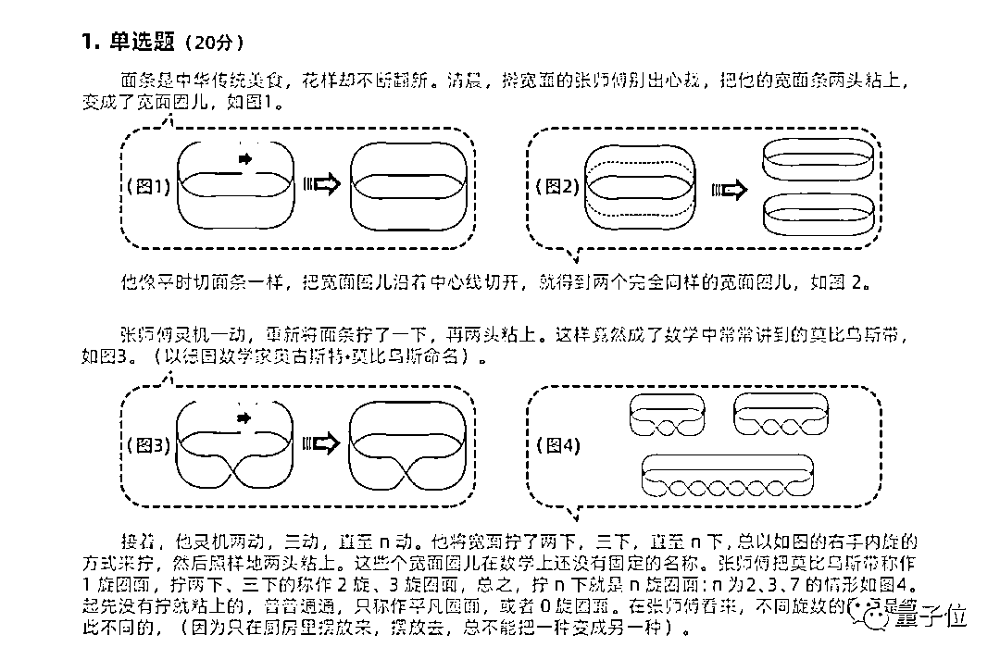

# 阿里全球数学竞赛落幕：全球最强 73 人出炉，北大获奖人数第一！

> 原文：[`mp.weixin.qq.com/s?__biz=MzAxNTc0Mjg0Mg==&mid=2653302015&idx=1&sn=2de99bf935050b422d2f8025af9ecb94&chksm=802deeeab75a67fca994978bc8b1f10ad9fd289370b665e6f4dd5b400143d7975783b4a93c7a&scene=27#wechat_redirect`](http://mp.weixin.qq.com/s?__biz=MzAxNTc0Mjg0Mg==&mid=2653302015&idx=1&sn=2de99bf935050b422d2f8025af9ecb94&chksm=802deeeab75a67fca994978bc8b1f10ad9fd289370b665e6f4dd5b400143d7975783b4a93c7a&scene=27#wechat_redirect)

##### 边策 金磊 发自 凹非寺 
量子位 报道 | 公众号 QbitAI

***1***

**又是一场学霸的盛宴**

阿里达摩院举办的第二届数学竞赛今天顺利结束，这场号召全民参与的数学竞赛，初赛的题目画风是这样的：  

是不是感到题目看懂了，但就是不会做？别着急，残酷的还在后面呢！

初赛总共设置 2 场，总共 200 分，获得 100 分就能晋级决赛，结果只有**1%**，也就是**516 人**能晋级决赛。

而就算你能打进决赛，打开的题目又是这样的：

你觉得你还能拿到分？

就是在这样的残酷竞争下，来自北大、MIT、普林斯顿、斯坦福等顶尖高校的学霸们最终脱颖而出，获得奖牌。

在决赛的 73 名获奖者中，有金奖 4 人、银奖 6 人、铜奖 12 人、优秀奖 51 人，来自中国高校和美国高校的人数同为 32 人，北京大学获奖者最多，共 20 人。

今年的榜单被全球各大顶尖高校的学生霸占，包括北大（20 人）、MIT（12 人）、普林斯顿大学（5 人）、剑桥大学（3 人）、中科大（2 人）等知名学府。

决赛总分 140 分，得分最高的是 120 分，共有 5 名选手得分在 100 分以上。

麻省理工学院的**王东皞**、普林斯顿大学的**郑凡**、新加坡国立大学的**Yap Jit Wu**、加利福尼亚大学伯克利分校的**张钺**带走了 4 座金奖奖杯。

参赛选手年龄分布也是亮点，「乘风破浪」的 95、90 后选手成为主力军，00 后也崭露头角。

***2***

**四位 90 后大牛斩获金牌**

**今年获金奖的选手总共****4 位****，清一色是****90 后****。**

其中三位来自中国大陆，一位来自新加坡。

### **王东皞**

第一位金奖得主是王东皞，出生于 1994 年，2012 年保送至北京大学数学科学学院。

王东皞可谓是大学霸，在本科即将毕业的录取季，便收到了全球 5 个顶级院校的录取通知书，包括哈佛大学、MIT、普林斯顿大学、斯坦福大学、加州伯克利大学。

最终，在赴美亲身考察后，决定去 MIT 继续深造。并且，与本科时选择的方向一样，他仍然选择了**基础数学**作为自己博士阶段攻读的方向。

王东皞对数学的热爱，应该说是从小就开始的，用他的话说就是：

> 在某种意义上，数学参与了我人生重要的转折。

在这个领域钻研多年的他，对数学也有了自己独到的体会，他认为：

> 数学是基础，数学的发展能影响其他学科的发展，进而影响社会发展。因此，数学对人类的影响是间接的，却是最重要的。

而王东皞一直以来便有个梦想，就是**推动数学的进步：**

> 中国的数学进步空间很大，需要培养更多的数学人才。
> 
> 我现在就想像我小学数学老师一样，走进校园，帮助热爱数学的少年找到更好的教育资源。

### **郑凡**

1992 年出生的他已经从**普林斯顿大学**毕业一年，获得博士学位后，进入西班牙数学科学研究院做博士后。

早在 12 岁的时候，郑凡就对数学产生了浓厚的兴趣，2004 年的印尼海啸带给他很大的触动。一个偶然的机会，郑凡发现，数学居然能用来解决海啸问题。

通过对偏微分方程求解，可以得知地震如何扰动海洋，从此数学的种子就在他心里种下了。

因为对数学感兴趣，郑凡高二参加了 IMO（国际奥数竞赛），并拿下了金牌，因此获得了北大数学院的保送资格。

不过在北大学习一年后，他在课余时间对 MIT 教程产生了兴趣，之后转学去 MIT，在那里完成了本科学业，之后他进入了普林斯顿大学攻读博士学位。

在接受量子位采访时，郑凡说，本科阶段培养兴趣是最重要的，要多尝试，才能知道自己到底喜欢什么，自己的研究生生涯也不会感到难熬。

### **张钺**

张钺是一位 95 年出生的小伙子，2014 年入学北京大学数学科学学院，而后在加州大学伯克利分校读数学博士，两年就顺利毕业。

张钺也是从小便发现了对数学的热爱——别人睡前都是听童话故事，而他睡前是在做算术游戏。

2013 年，还在读高中的他参加了 CMO（中国数学奥林匹克），并拿到了金牌。除此之外，斩获的奖项也不计其数：丘成桐数学竞赛几何与拓扑银牌、全国大学生数学竞赛第一名、全俄罗斯数学奥林匹克金牌等等。

并且，在第一届阿里巴巴数学竞赛中，也拿到了金牌成绩。

对于数学，张钺表示：

> 数学是一切科学的基础，比如说颇具前瞻性的量子计算机，就和拓扑息息相关，有一个数学方向叫拓扑量子场论，它用来搭建量子计算机的数学模型，并通过不同的拓扑工具进行研究。

对于数学的梦想，张钺认为：

> 我曾经的梦想是做一个数学家，但是现在想先去工作，因为我一直都是在学习纯数学，所以也没怎么能看到它的应用，我很想将数学运用在实际问题上，用自己的能力解决现实生活的难题。

### **Yap Jit Wu**

最后一名金牌是来新加坡的选手，叫 Yap Jit Wu，出生于 1995 年，新加坡国立大学。

Yap Jit Wu 上学比较晚，因为他当过 2 年的兵。平时的爱好除了数学之外，便是打 Dota 和看漫画。

对于参加此次阿里举办的数学竞赛，他表示一是觉得在线这种形式非常的方便，二是大赛不分年龄、职业，全民都可参与，更具有国际性和多元化。

Yap Jit Wu 的梦想是成为一名数学教授，他也非常希望中国的学生可以多来新加坡交流数学。

***3***

**银奖选手**

*   张盛桐，中国大陆，2000 年出生，曾获得 IMO 金牌，现就读于 MIT。

*   唐珑珂，中国大陆，1999 年出生，曾获 2017 年、2018 年丘成桐大学生数学竞赛四项金奖，北京大学本科毕业，正申请去普林斯顿深造。

*   Allen Liu，美国，1999 年出生，曾 3 次获得 IMO 金牌，其中一次满分，现就读于 MIT。

***4***

**00 后崭露头角**

除了多位斩获金银牌的数学大牛，“后浪”们也相当可畏。超过半数的获奖者都是 95 后。

在 73 名获奖选手中，**年龄最大的是 36 岁，最小是 19 岁。**

21 岁获奖选手人数最多，共有 12 名。

除此之外，据阿里提供的资料，今年虽未获奖，但有多位中学生入围决赛中，其中最小的才 15 岁。

*   李天尧，成都市教科院附中，2004 年出生

*   星羽，福州延安中学，2005 年，预赛 104 分

*   曹炫明，上海市民办华育中学，2005 年，预赛 102 分

*   聂天骄，复旦大学附属中学，2004 年，预赛 102 分

*   叶敬楠，浙江省义乌中学，2002 年

虽然这些选手的决赛分数不高，也没有获奖，但是如果你看过决赛试题，那么才知道能拿分是多么的不容易。

***5***

**看不懂的决赛试题**

阿里数学竞赛的初赛内容更多是取自生活，比如拧面圈做面条、蚂蚁森林种树等。

而决赛赛题均为理论数学题，包含**几何与拓扑、数论与代数、数学分析与方程、应用数学与计算数学**4 大赛道，参赛选手可以根据自己熟悉的领域选择其一。

出题组的专家则来自于北京大学、剑桥大学、浙江大学等高校的顶尖数学教师。

如果没有一定的数学基础，想看懂这些题目都很困难。

这些题目一般都需要接受数学本科教育才能入手，所以那几位 00 后能够拿分真是实属不易。

***6***

**马云：我们要感谢数学**

此次颁奖典礼中，马云也表达了对数学的高度赞美：

我们要感谢数学。因为没有那些伟大的数学家，就不会有计算机，也不会有我们现在的互联网。不敢想象今天的疫情下没有计算机和互联网，我们会如何生存。

数学很重要，生活中无处不在。无时不刻的都离不开数学，数学的用处是无用之用。数学学的是不同之同。

数学是一切的基础。但是基础学科不能看不起应有科学，同样的应用科学也不能看不懂基础学科。基础学科只有变成应用，才能真正发挥无穷的作用。

通过这个竞赛在年轻人心中种下数学的种子。

最后，阿里达摩院院长**张建锋**表示，第三届还会继续采用在线参加的形式，让更多爱好数学的人加入进来。

**所以明年你会参加吗？**

量化投资与机器学习微信公众号，是业内垂直于**Quant、MFE、Fintech、AI、ML**等领域的**量化类主流自媒体。**公众号拥有来自**公募、私募、券商、期货、银行、保险资管、海外**等众多圈内**18W+**关注者。每日发布行业前沿研究成果和最新量化资讯。

**点赞+在看**，谢谢你的支持！