# 独家解读 | 新闻分析数据哪家强？

> 原文：[`mp.weixin.qq.com/s?__biz=MzAxNTc0Mjg0Mg==&mid=2653301990&idx=1&sn=3d7e7bad9b19ba97d8a774d7dafbe2f3&chksm=802deef3b75a67e59398c563cdb7676332a4cbc4a16be4d5fd2e0cd721d8654a465f482b2b27&scene=27#wechat_redirect`](http://mp.weixin.qq.com/s?__biz=MzAxNTc0Mjg0Mg==&mid=2653301990&idx=1&sn=3d7e7bad9b19ba97d8a774d7dafbe2f3&chksm=802deef3b75a67e59398c563cdb7676332a4cbc4a16be4d5fd2e0cd721d8654a465f482b2b27&scene=27#wechat_redirect)

量化投资与机器学习编辑部

***1***

**综述**

数据是量化投资的根本，传统的量价数据、基本面数据已经被玩坏的时候，越来越多的机构意识到另类数据的重要性。说到**另类数据**，卫星数据、GPS 数据、航运数据等另类数据届的高富帅就会浮现在小伙伴的脑海里。今天小编不谈高富帅，小编准备带大家捋一捋另类数据界的元老：**新闻分析数据。看看国内外有哪些主要的数据提供商，以及各家数据的异同**。 

我们先给新闻分析数据下个定义：

新闻分析是指基于非结构化的新闻文本，运用机器学习相关算法对新闻文本进行标签提取、事件识别及情感分析等，转换为结构化数据的处理方法。新闻分析数据使得新闻等文本类数据应用于量化投资及风险管理等场景成为可能。

新闻分析数据的提供商非常之多，本文主要选取了三家**海外**主要的提供商：

*   **彭博**

*   **路透**

*   **RavenPack**

以及**国货之光**，**以 A 股为主的新闻分析数据提****供商：**

*   **数库 SmarTag**

我们将从**覆盖度、主要字段、情绪算法**等维度，带领各位读者详细的了解每家数据的特点及他们之间的区别。

在介绍每家数据之前，我们先大体了解以下新闻分析数据的处理流程，一般包括：

*   **原始新闻的获取：**主要有爬取和直接采购两种模式。爬取是指，数据提供商利用爬虫去各大新闻网站爬取新闻。直接采购是指数据提供商直接从第三方采购新闻原始数据。

*   **标签识别：**主要有主体识别和事件识别，也有的数据提供商会提供更丰富的标签体系。

*   **情绪识别：**计算新闻中主体的情绪，每个提供商都有不同的角度去计算情绪值。比如彭博会计算每篇新闻中每个公司的情绪。RavenPack 则会站在事件的角度，计算每篇新闻中每个事件关联的主体的情绪。

*   **其他指标：**包括新闻的新鲜度，对于公司影响程度的量化指标。

***2***

**彭博：Event-Driven Feeds**

彭博的原始新闻数据来自于爬虫、第三方数据提供商等，**覆盖了 100000 多新闻源，每天产生 600000 增量新闻，覆盖 75000 多家公司，超过 10000 多个主题标签**。主要的来源分布及地区覆盖如下表所示：

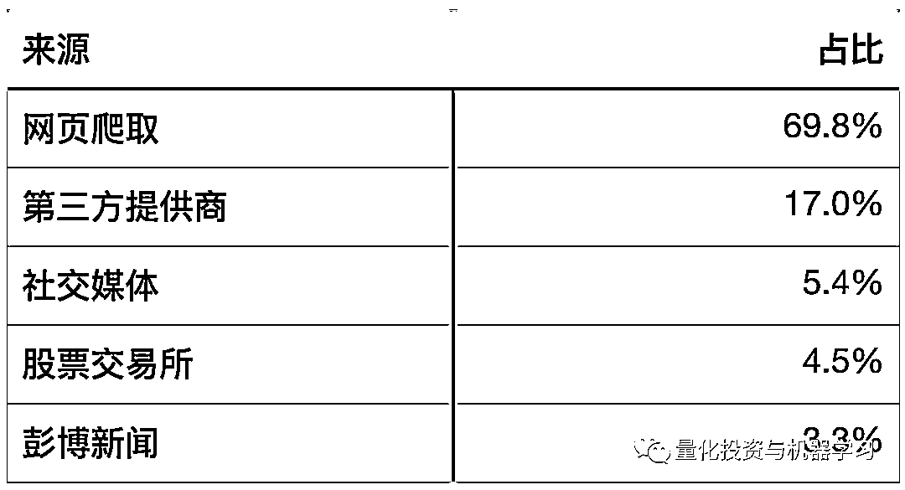

*图片来自：公众号独家整理

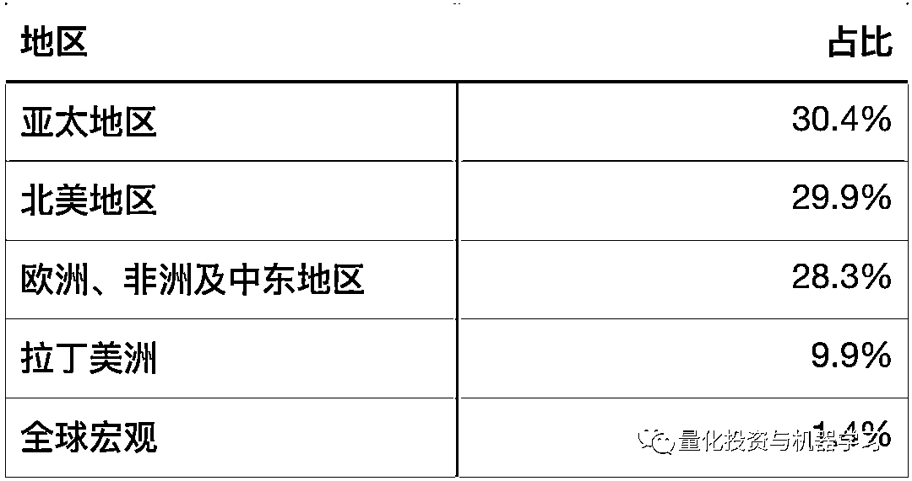

*图片来自：公众号独家整理

彭博的新闻分析数据分为两个维度提供（如下图），**第一层是结构化的新闻数据**，该数据主要是对原始新闻文本的结构化处理，主要包括新闻的基础信息，相关标签（包括人物、公司、主题等）；**第二层是基于结构化数据的分析加工**，主要分为新闻层面的分析及公司层面的分析。分析数据提供的主要字段如下表所示：

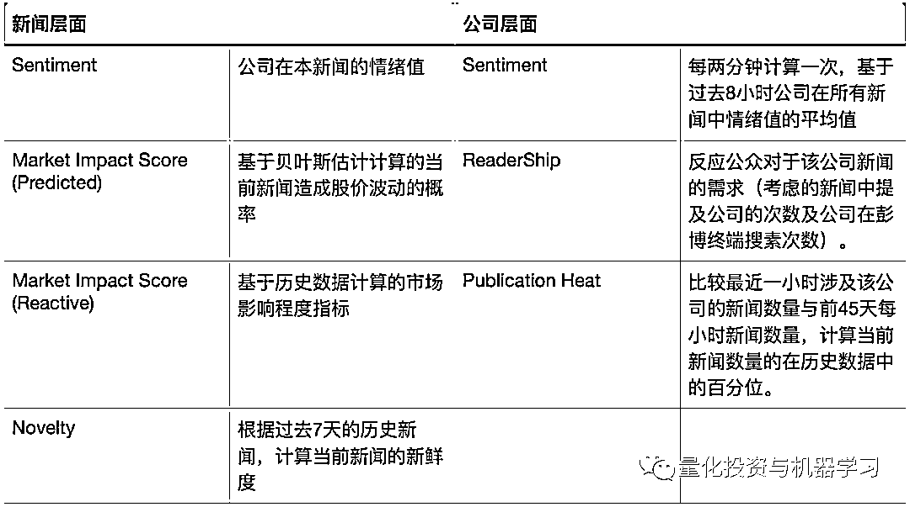

*图片来自：公众号独家整理

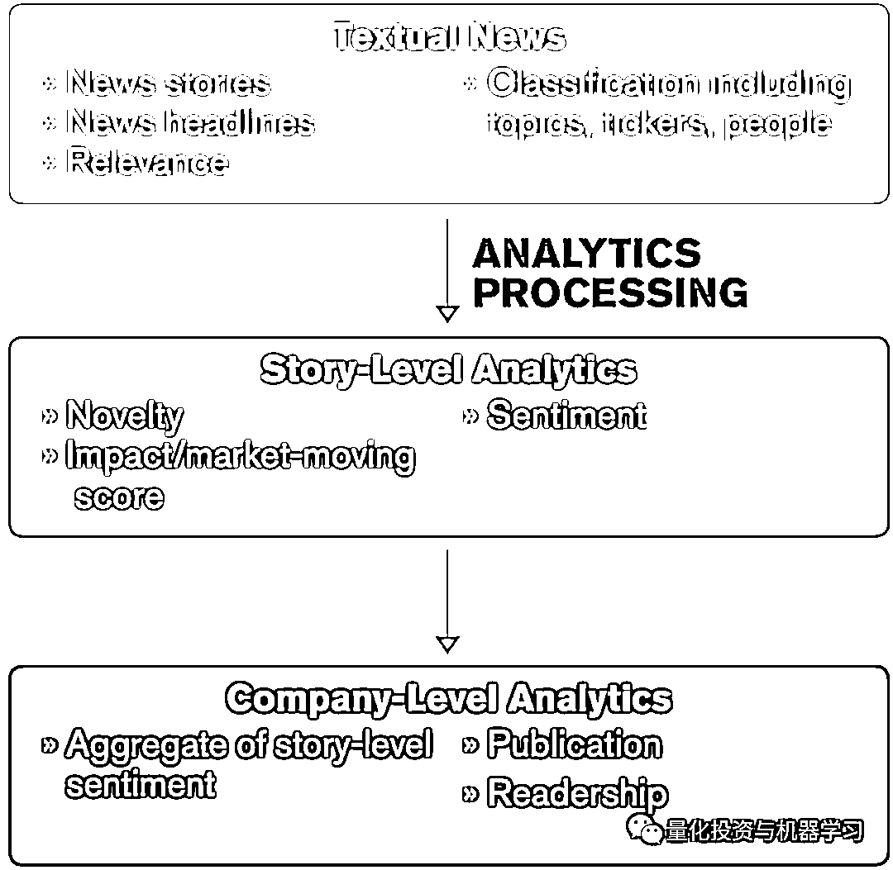

*图片来自：公众号独家整理

最后，关于数据提供的方式，**实时数据可以通过 API 的形式获取，每日数据也可以通过 FTP 的形式进行下载。PIT 历史数据最早可以从 2008 年开始，基于历史新闻数据的重新计算可以最早追溯到 1992 年。**

***3***

**路透 Thomson Reuters News Analytics**

**路透 TRNA 新闻分析数据的原始数据来源主要是路透新闻，覆盖了 35000 多个上市公司及 40 个大宗商品及能源**。分析的维度也是由情绪，相关度及新鲜度组成。结构化的数据有超过 90 个字段，主要包括公司标签，主题标签及板块地域标签。历史数据可从 2003 年开始提供。**前两年 Two Sigma 在 Kaggle 上举办的新闻数据量化大赛就是用的路透提供的新闻数据。**

TRNA 新闻分析从以下几个维度进行：

*   情绪 Sentiment/author tone 

*   相关度 Relevance

*   新鲜度 Novelty

*   新闻量 Volume

*   新闻主题 Headline analysis 

比较关键的数据字段如下图所示：

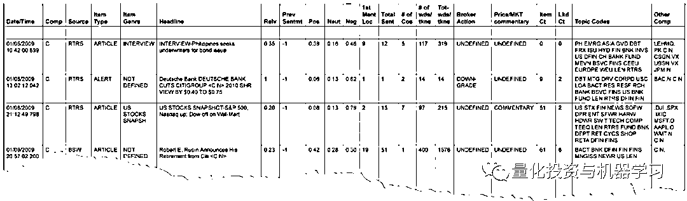

*图片来自：公众号独家整理

其中各字段说明如下：

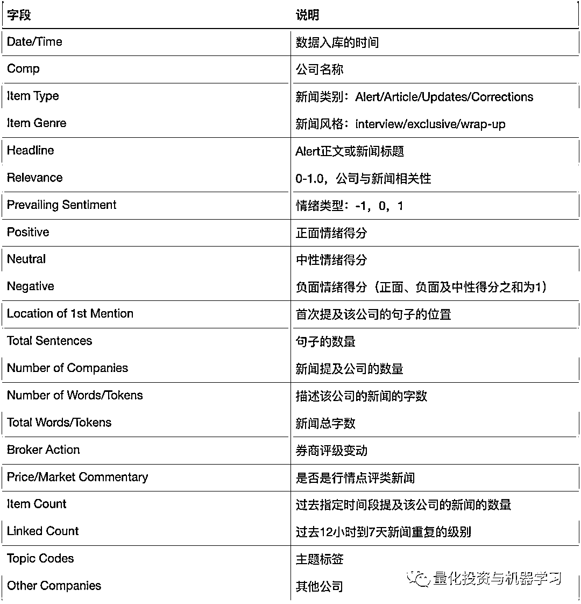

*图片来自：公众号独家整理

***4***

**RavenPack News Analytics**

前面两家都是世界上数一数二的金融数据提供商。

RavenPack 是一家创立于 2003 年的**专注于新闻分析数据的提供商**。RavenPack 的原始新闻数据绝大部分来自于第三方直接提供，有少量了自产的新闻，并没有通过爬虫获取原始新闻文本数据。

主要第三方提供商如下：

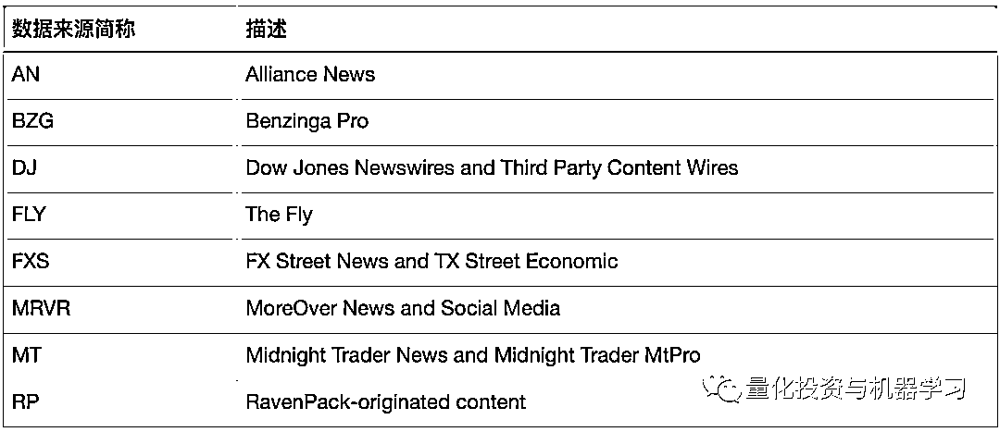

*图片来自：公众号独家整理

RavenPack 新闻分析数据覆盖了 200 多个国家超过 17500 个主体，覆盖了 98%的可投资市场。**该新闻数据分析的角度与前两家有明显的区别，它是站在实体与事件的角度进行分析。一篇新闻中可能有多个主体和多个事件，每个事件可能对应多个主体，每个主体也可能发生多个事件。RNA 新闻分析数据是站在事件与主体对应的角度，其提供的每一条数据都阐述了“谁（主题）在什么时间发生了什么事（事件），这件事是好事还是坏事（情绪分析），这件事对它有什么影响（影响度分析），过去有没有类似的事件发生（新鲜度）”。**

RavenPack 对于主体的定义，不仅包括公司/组织，还包括了人物、货币、运动球队、产品、国家、商品及地理位置等，具体数量如下：

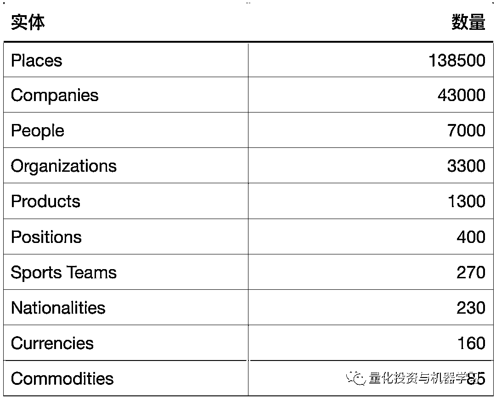

*图片来自：公众号独家整理

其中上市公司实体的地域分布如下：

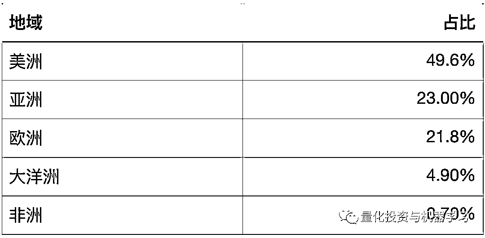

*图片来自：公众号独家整理

对于事件，RavenPack 也有一套详细完整的分类体系，按 business/economy/environment/politics/society 五个大类及上百个细分类别进行分类，总共有 6800 多个事件。

RavenPack 的新闻数据最早到 2000 年，总共有 50 个字段，我们把其中核心的一些字段列举说明：

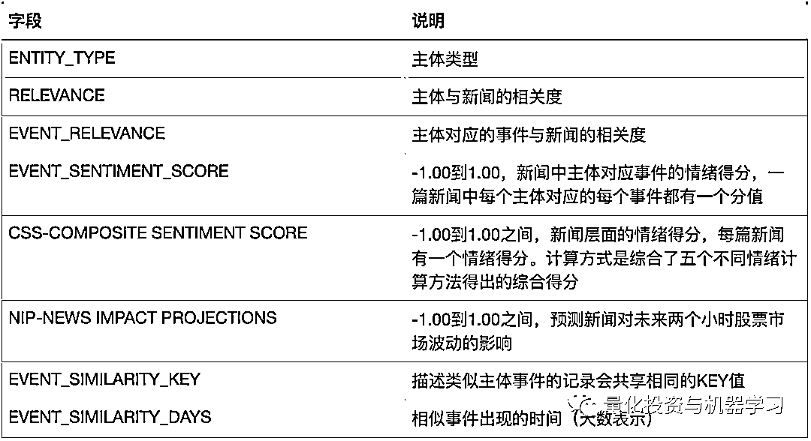

*图片来自：公众号独家整理

RavenPack 数据最大的特点就是情绪的计算是站在“主体-事件”的角度，不仅在新闻层面给出的情绪得分，也在事件的维度计算情绪得分。但需要注意的是，与彭博新闻层面的情绪得分及路透的情绪得分区别在于：彭博及路透是新闻里每只股票的情绪分，而 RP 的 CSS 是新闻本身的情绪得分。以下为 RavenPack 的样例数据：

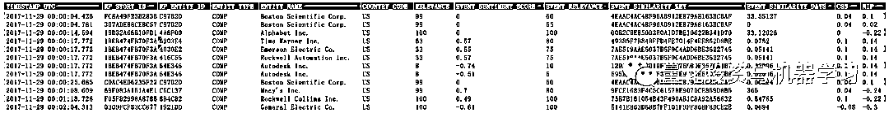

*图片来自：公众号独家整理

以上三家都是来自海外的新闻数据提供商，他们的数据覆盖是全球市场，当然也包括了 A 股，但据小编了解，**这三者的 NLP 都是基于英文的分析引擎，并没有针对 A 股中文新闻的分析数据**。所以**即使是 A 股的中文新闻，他们也要先把中文翻译成英文在进行分析**。那有没有针对 A 股的专业的新闻分析数据提供商了，经过小编一番搜索及研究，发现在国内有一家名叫数库科技的公司，他们有一套 SmarTag 智能资讯数据还不错，下面介绍一下：

***5***

**数库 SmarTag 智能资讯数据**

数库科技是一家成立于 2009 年的金融数据提供商，主要为机构提**供产业链、供应链及新闻分析数据**。他们的 SmarTag 数据，经小编一番研究，发现专业性特色性可以与前面三位大佬媲美。我们来详细了解一下数库的 SmarTag 数据。

SmarTag 新闻分析数据的原始数据来源是数库自主爬取的新闻网站的文本数据，**主要覆盖了 280 多个网站 3200 多个版面，主要涉及经济、金融、宏观、行业及公司等版面**。由于专注于中文文本的分析，所以全球覆盖度上无法和海外数据商相比，但**特点就是 A 股的覆盖度更完整。历史数据可以提供到 2008 年，每天的新闻增量在 25000 篇左右。**

关于原始新闻数据的分析处理主要分为两个步骤，一个是标签的提取，再就是情绪的分析。数库丰富的标签体系，也是 SmarTag 的一大特点，一共分为 7 类标签：

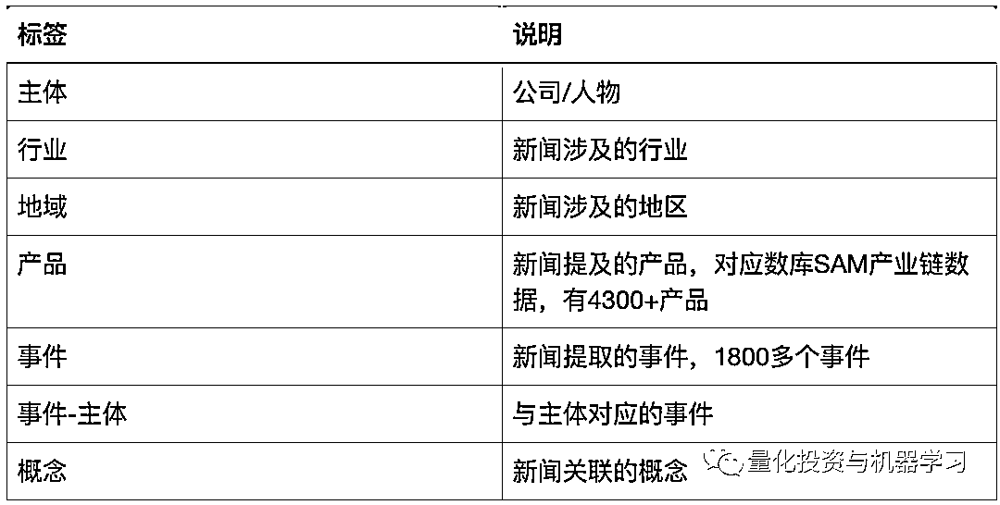

*图片来自：公众号独家整理

**其中产品标签是 SmarTag 数据的一大特色，产品标签的体系来自于数库另一核心数据：数库产业链数据**。比如一篇新闻中识别出了“半导体设备”，我们可以通过半导体设备产业链找到对应上下游的新闻，也可以找到生产半导体设备的公司的新闻。 

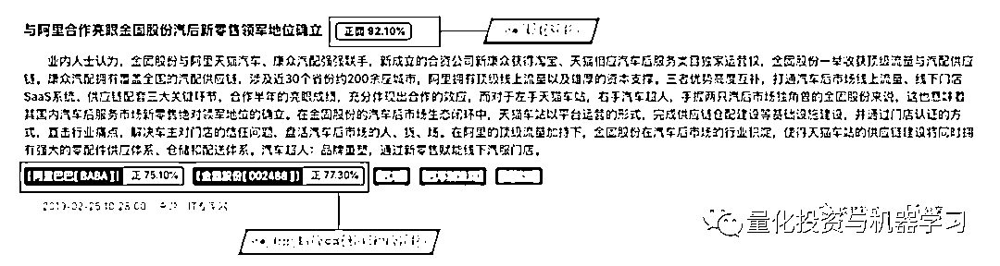

*图片来自：公众号独家整理

情绪打分方面，数库的做法和海外三个大佬的做法相似，但更像是各家做法的结合。数库在追踪情感分值技术方面结合了极性情感词典与监督式机器学习两种不同方式，情绪分值的解析同时兼顾两个层次：

*   新闻整体情绪值

*   新闻中提到的公司及人物主体专属情绪值

但数库对于主体的定义和 RavenPack 不同，或者说范围更小，只包括公司（组织）和公众人物。情绪的类型也分为三类，中性、正面及负面，三者之和为 1。

由于数库的数据形式是 Json 格式的，所以我们结合样例数据对于一些核心的字段做说明：

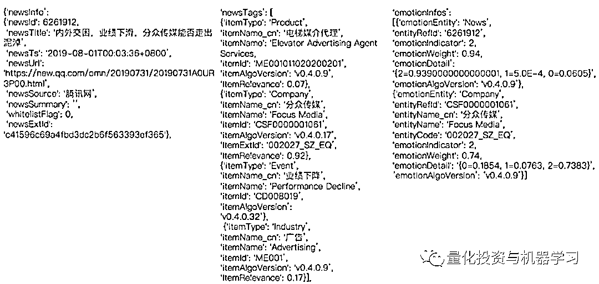

*图片来自：公众号独家整理

数据从左到右分为三个部分，分别是**新闻的基础信息，标签数据及情绪数据**。基础信息中给出了新闻的 ID，处理时间，来源等基础信息。标签数据是文章所有能识别出来标签的集合，每个标签都有对应的类型、代码及算法的版本。如果是主体、产品或者行业标签，还有字段 ItemRelevance 表示该标签与新闻的相关度。情绪数据中，emotionEntity 表示情绪的主体类型，emotionDetail 表示情绪的具体分值。

***6***

**数据对比**

由于各家数据资料的详细程度不一样，所以我们只能基于这些资料给各位小伙伴做数据的解读，**如果大家对其他另类数据感兴趣，可以在文末留言或者私信我们（WeChat：lhtjqxx），小编尽量去搜集研究！**

下面我们基于有限的资料对各家数据做一个对比：

*图片来自：公众号独家整理

量化投资与机器学习微信公众号，是业内垂直于**Quant、MFE、Fintech、AI、ML**等领域的**量化类主流自媒体。**公众号拥有来自**公募、私募、券商、期货、银行、保险资管、海外**等众多圈内**18W+**关注者。每日发布行业前沿研究成果和最新量化资讯。

**点赞+在看**，谢谢你的支持！