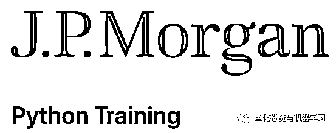
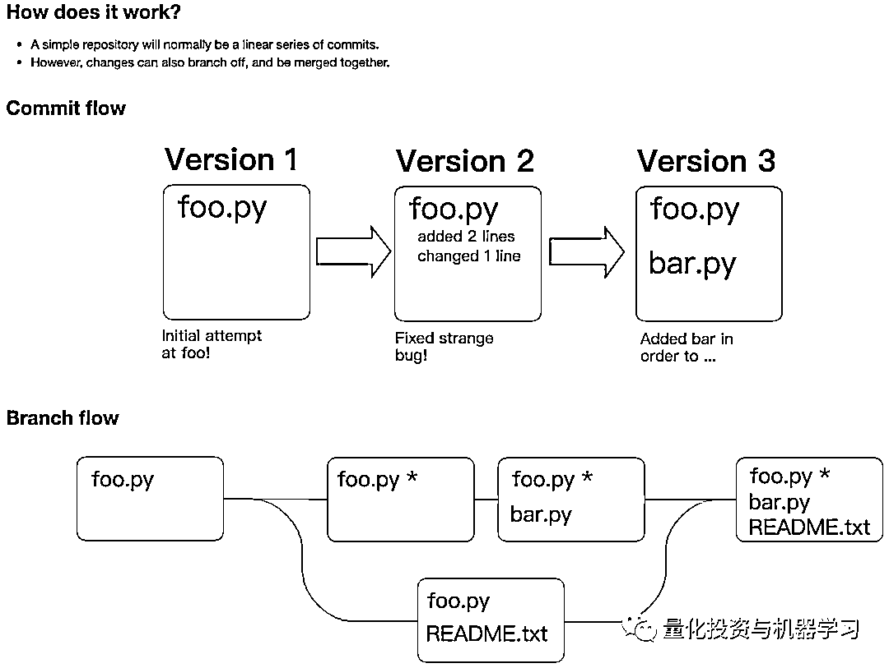
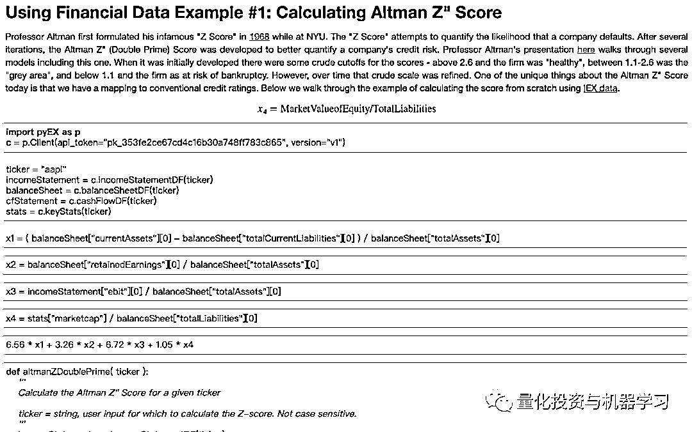
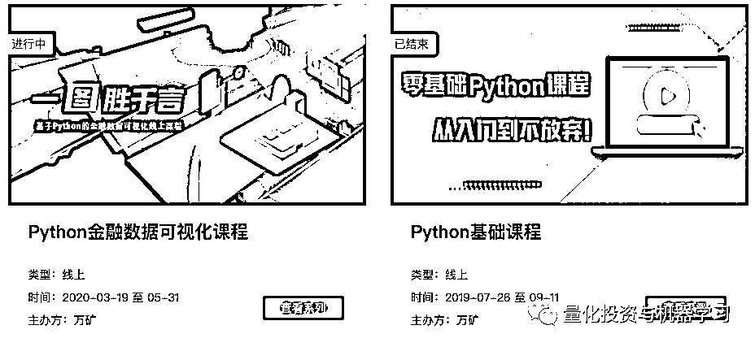
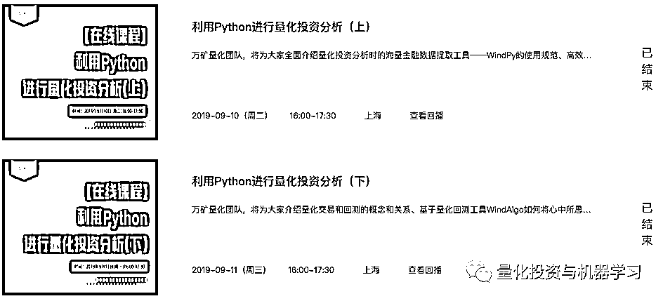
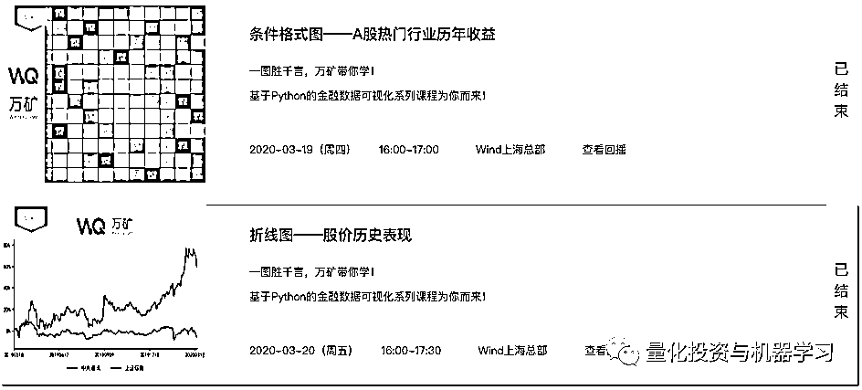
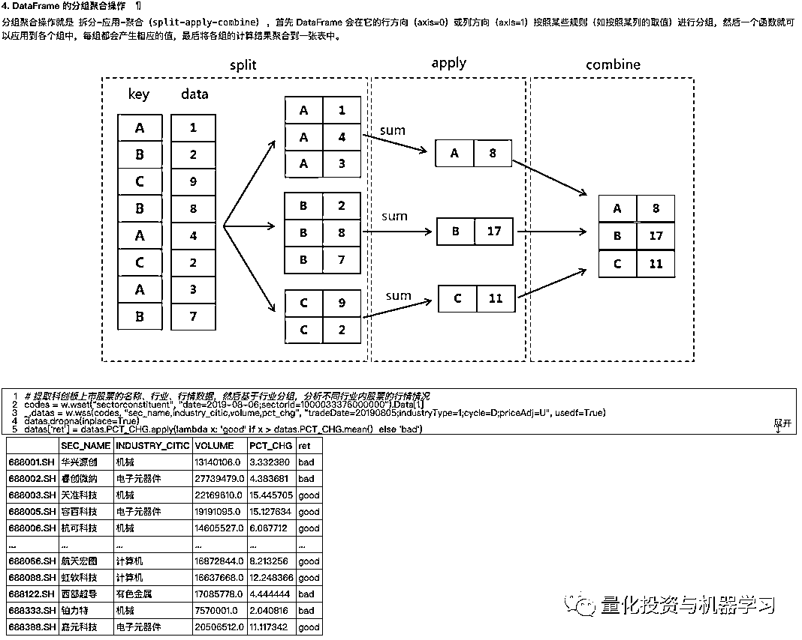

# 一份来自 J.P.Morgan 的 Python 训练题库！

> 原文：[`mp.weixin.qq.com/s?__biz=MzAxNTc0Mjg0Mg==&mid=2653301835&idx=1&sn=9decf6903ae1d52f8bbbab7406d6774c&chksm=802dee5eb75a6748108b226fcb2bde1a594d368b9392c206fbf8167a26fd437162b5d74c4777&scene=27#wechat_redirect`](http://mp.weixin.qq.com/s?__biz=MzAxNTc0Mjg0Mg==&mid=2653301835&idx=1&sn=9decf6903ae1d52f8bbbab7406d6774c&chksm=802dee5eb75a6748108b226fcb2bde1a594d368b9392c206fbf8167a26fd437162b5d74c4777&scene=27#wechat_redirect)

量化投资与机器学习编辑部

这是一份由 J.P.Morgan 纽约办公室所开发的 Python 训练课程。**你可以通过这些课程知道 J.P. Morgan 希望其分析师和交易员知道什么。**

主要作者 Paine 在《Zen of Python》的开篇文章说道：

*   Simple is better than complex

*   Complex is better than complicated

*   Flat is better than nested

*   Sparse is better than dense

同样，如果你不能很好的解释你的代码，Paine 说这不是一个好事情。在这套训练课程中，**他们把正确和错误的代码都做了举例。**

**课件在文末获取**

部分课件展示： 

当然，这套 Python 训练课程没有那么高深，作者将这门训练课程描述为：基于 Python 的数值计算和数据可视化初阶课程，为那些没有正儿八经编程背景的人所准备。

在国内，如果你想**基于 Python 学习金融数据分析和量化投资**，公众号在这里给大家推荐一套全免费的课程，由**Wind**出品。公众号认为这万得的这套课程相对于其他课程来说，在内容和质量上，都很不错。还有有视频讲解，每节课 1 小时左右。**最主要是免费！**

课件地址：

***https://www.windquant.com/qntcloud/activity***

部分课程内容： 

课件地址：

***https://www.windquant.com/qntcloud/activity***

希望大家有所收获！ 

**获取 JPMorgan 课件**

后台回复（注意大小写） 

***JP-Python***

量化投资与机器学习微信公众号，是业内垂直于**Quant、MFE、Fintech、AI、ML**等领域的**量化类主流自媒体。**公众号拥有来自**公募、私募、券商、期货、银行、保险资管、海外**等众多圈内**18W+**关注者。每日发布行业前沿研究成果和最新量化资讯。

**点赞+在看**，谢谢你的支持！