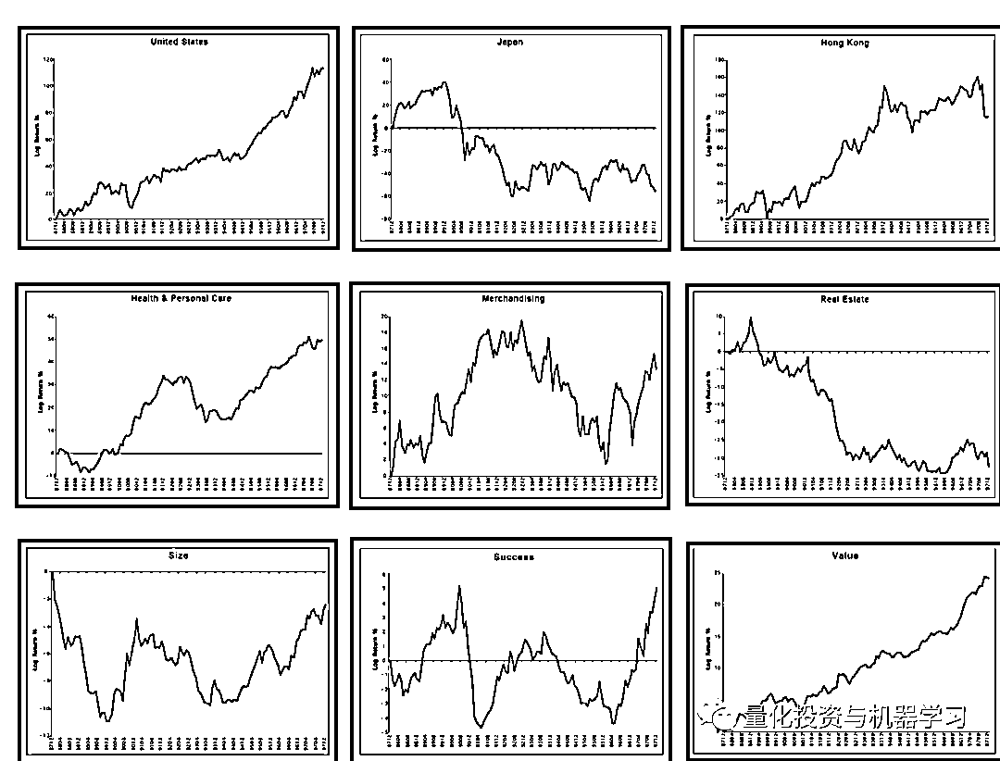
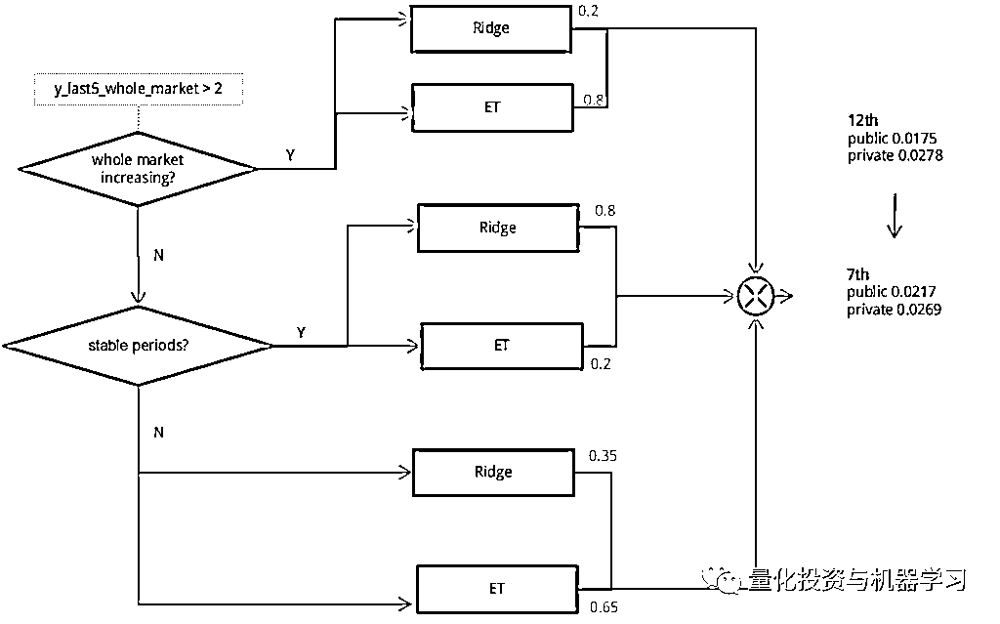

# 有人说：机器学习应用量化投资没啥用，给你看看有用的！

> 原文：[`mp.weixin.qq.com/s?__biz=MzAxNTc0Mjg0Mg==&mid=2653301805&idx=1&sn=38c06c381803b6aa0fd776469a93cf64&chksm=802dee38b75a672e994dcfe9a7da6a2c7c3515f6dfce692353076c7e22dd6c383dbd443d5d42&scene=27#wechat_redirect`](http://mp.weixin.qq.com/s?__biz=MzAxNTc0Mjg0Mg==&mid=2653301805&idx=1&sn=38c06c381803b6aa0fd776469a93cf64&chksm=802dee38b75a672e994dcfe9a7da6a2c7c3515f6dfce692353076c7e22dd6c383dbd443d5d42&scene=27#wechat_redirect)

***1***

**Numerai**

想必很多人还不知道**Numerai**吧，**有志于从事量化方向的同学可以重点关注下**。Numerai 是一家初创公司，以举办专业数据锦标赛（类似 kaggle）为其对冲基金寻找最佳交易策略而闻名。同时，它能将世界各地数据学家的股市预测模型“众包”出去。同时，Numerai 创建了自己的加密货币，名为 Numeraire（**NMR**）。近日，Numerai 通过 ICO 完成了 300 万美元融资，Placeholder、Union Square 等公司参投。

https://numer.ai/homepage/

纵观大多数华尔街对冲基金的模型，开放、协作绝不是它们的核心。电影《华尔街》充分描述了 Gordon Gekko 的贪婪，《华尔街之狼》更是展现了权利和金钱所带来的堕落和颓废，揭露了那些自负的资本家鲜为人知的一面。Numerai 的创始人兼首席执行官 Richard Craib 想要改变这一切。

Craib 想要为对冲基金创造一个更加开放和去中心化的环境。这个环节不会限制你对数据的访问，在与全球数据科学家分享之前，**Craib 会对这些数据进行加密，这能防止数据被窃取。这些数据科学家会利用这些共享的信息为对冲基金打造预测模型。**

为了通过预测赚钱，卖家需要在智能合约中抵押一笔 NMR 代币。Numerai 会没收误差较大的预测者的抵押资金并奖励预测准确的人（抵押越多代币，获得的奖励也越多）。**你为你的预测下的赌注越大，你可能获得的奖励也越多。**

从提交截止日期后的第一个周四到 4 周后的周三，每一份提交都会收到每天更新的分数。例如，如果你在星期日 7 号提交了（蓝色），你将在星期四 11 号收到你的第一个分数，并在下个月的星期三 7 号收到你的最终分。

简单来说，**在 Numerai 上，参与者下载真实的金融数据数据，训练相应的机器学习模型，Numerai 会将其整合为最终的交易策略，并投入到真实的市场中**。根据这些预测在现实中的表现，**Numerai 会给予用户相应的报酬，以美元和虚拟货币的形式给出**。值得一提的是，在传统的机器学习竞赛中，大多数情况下只有前三名的选手才能获得奖金。而在 Numerai 中，**只要符合一定的标准，就有希望获得或多或少的奖金。**

[`mp.weixin.qq.com/mp/readtemplate?t=pages/video_player_tmpl&action=mpvideo&auto=0&vid=wxv_1406422634543415297`](https://mp.weixin.qq.com/mp/readtemplate?t=pages/video_player_tmpl&action=mpvideo&auto=0&vid=wxv_1406422634543415297)

**视频要看哦！大佬云集**

Numerai 的支持者包括 Howard Morgan（文艺复兴的联合创始人）、Paul Tudor-Jones、Union Square Ventures 和其他著名的风投公司，**迄今为止，参与者获得的奖金总额超过了 3400 万美元！**

*****2*****

******Erasure******

**信息是一种独特的商品，它的独特之处在于它经过不可预知地方法被创造出来，在拥有它之前你无法判别它的好坏，并且任何知道这条信息的人都可以零成本地复制它。这使得市场难以对其定价和分配它的价值。**

**但加密资产可以解决这个问题。**Erasure 是一个用于在互联网上交易信息的的协议，它使用加密，智能合约和抵押 NMR 代币创造了一个可信的，去中心化的信息交易市场。****

****

**https://erasure.world/**

**实践证明，抵押（资产）是一种过滤信息的有效手段。但 Numerai 是一个只关注金融数据的中心化服务商。**既然这种方法在股票预测市场行之有效，那么在其他信息市场，它应该也能发挥作用。所以 Numerai 决定将这种机制转化为一个开放协议，就这样，Erasure 诞生了。******最新近况：**

*   **使用初始应用程序 Erasure Quant 启动 Erasure 协议。**

*   **将 Numerai 锦标赛迁移到 Erasure 协议，使协议中的抵押资金额增加 306％。**

*   **在旧金山举办首届 ErasureCon。**

*   **举办在线黑客马拉松引导技术社区，以构建出色的工具。**

*****3*****

****传统量化投资方法****

**当前量化分析的原型可能是 Barr Rosenberg 提出的风险模型***《The prediction of investment risk: Systematic and residual risk》***。关于这一点，有很多理论，但要了解华尔街在这一领域的历史，大家应该读读 Peter Bernstein 的***《Capital ideas: The improbable origins of modern Wall Street》*****

**目前，Barra 模型是最著名的风险模型，其他风险模型包括 Axioma 等。虽然 Barra 模型种类繁多，但 BARRA Global Equity Model（GEM）是全球主要股票市场的股票风险模型：**

****

**因子收益是一种衡量投注于这个市场中的风险因子所期望的收益率的方法。因子风险敞口是指股票暴露于该风险因子的程度，而且风险敞口越大，该因子的收益就越大。从下面的方程式可以看出，回归模型是一个特定时期的横截面模型，在实际的测试过程中，我们将其随着时间（如月度）累积并观察其特征。**

****

**下图是 Barra GEM 文档中的因子收益的一个示例。如果一个因子收益显著地向右，这意味着只要你在这个因子上下注，你就能获得稳定的收益。如果它将显著下降，那么你可以在这个因子上下注（切换多头和空头）。在今年（2020），几乎没有什么因子的收益在一个方向上是显而易见的。因此，我们应该考虑每只股票的因子暴露，在多种因子下构建多元化的投资组合。**

****

**由于因子收益是回归系数，它们可以通过客观变量和解释变量的波动性转换为相关关系。**

****相关性在风险模型中是一个非常重要的指标**，从下面这张图中，我们可以一眼看出这些特征本身具有多大的解释力。** 

****

**值得注意的是，这些因子的收益包含了由于随机性而产生的变化。下面是 Correlation=0.0 和 Correlation=0.005 情况下的 Monte-Carlo 模拟（100 次试验）。我们应该始终记住，这种程度的变化可能是由于随机性而发生的。在 120 左右的样本周期内确定统计显著性是一个非常困难的问题。**

**当我们这样想的时候，我们就能明白为什么 Numerai 使用相关性来评估了。**每个参赛者提交的预测本身就是一个丰富的超级因子**：一个包含了比典型因子更多信息的信号。然后，Numerai 就开始从这些由参与者独立产生的超级因子中寻求丰厚的收益。如果这些因子的收益非常好，Numerai 可以简单地将它们结合起来，或者在某些情况下，可以从收集的单个因子中进一步学习，以提高它们的表现。**

*****4***** 

****风险因子：国家特征****

**在 Numerai 的比赛的数据集中，个别股票的 ID 是加密的，我们没有办法知道这一点。不过，由于 Numerai Signals 公布了一份目标股票清单，所以我们编制了这份清单。从股票总数来看，我们怀疑这和本届 Numerai 锦标赛是一样的。共有 41 个国家上榜，其中美国的股票最多，其次是日本、韩国和英国。**

**它们可能不是简单地按国家合并，而是按地区（北美、南美、太平洋等）合并。**

****

**在通常的风险模型中，国家特征作为 0/1 分类变量引入。然而，Numerai 数据集基本上是 5 分位数，每个分位数的数量在大多数特征是相同的。因此，如果**我们以这种方式创建一个特征，对每个国家（或每个地区）的指数进行多重回归，然后使用 Beta 作为该特征的分位数。****

****

**例如，日本股票相对于东京市场指数将有一个更高的 Beta，并且将在较大（或较小，取决于分类符号）分位数的特征中聚集。然后，如果 Numerai 中有一个国家特征，那么最大的分位数只提供信息，其余的分位数没有信息。Numerai 的 analysis_and_tips 报告了一些特征在特征值为 0 或 1 时具有显著的特征，我们认为可能是这样的。**

**为了参考，我们给大家展示自 2010 年以来每个国家的相对收益趋势。**

****

*****5*****

****风险因子：行业特征****

**行业特征也很重要。在《Stock Market Wizards》一书中，Steve Cohen 指出，**40%的股价波动是由市场决定的，30%是由行业决定的，剩下的 30%是由人为因素决定的**。没有理由不将这一行业特征纳入其中。行业的定义各不相同：**

*   **BARRA GEM 定义了 38 个行业**

*   **GICS 定义了 60 个行业**

*   **FactSet 的 RBICS 定义了 12 个经济体、31 个行业和 89 个细分行业**

**国内这块，**数库的行业分类更细：****

*   **SAM 行业细分数据最深可细分至 12 层级**

*   **覆盖 4300 多个细分产品节点**

*   **可以对公司的经营业务进行详细的划分**

**以下是按经济状况划分的美股各个行业的股票数量。**

****

**行业特征也可以通过对行业指数的多元回归贝塔来量化，就像国家特征一样。同样在这种情况下，只有最大的分位数提供信息，其他分位数没有信息。**

****

**为了参考，我们向大家展示了自 2010 年以来美国市场上每个行业的相对收益趋势。**

****

*****6*****

****风险因子：风险指数特征****

**风险指数可能会将 BARRA 使用的风险指数纳入其中。它们是规模、价值、动量和波动。这些可以简单地合并，但考虑到国家和行业通常按类别进行规范化。**

**对于规模指数，可以考虑销售额、总资产、员工人数以及市值等因素。对于价值指数，可以考虑市净率、市盈率、股价与现金流比率。其他风险指数包括流动性、增长、股息和财务杠杆。除了这些传统的风险指数之外，还可以纳入分析师修正数据和从新闻中提取的情绪指数等替代变量。**

**为了参考，我们向大家展示了自 2010 年以来美国市场各风险指数的相对收益趋势。**

****

*****7*****

****树模型****

**在本章中，我们将讨论如何使用机器学习来提高传统量化分析的性能。** 

**Barra 模型只是单个风险因子的加权组合。有一种简单易行的方法可以改善这种情况。即考虑个体风险因子之间的相互作用。**

**举个简单的例子，有些行业更倾向于价值取向，而另一些行业则不然。如果我们观察一下股票的规模，有一个因子对大票最有效，而另外一个因子对小票最有效。此外，不同的行业在不同的国家表现更好。**

**为了考虑这种相互作用，线性模型是不够的。在线性模型中，交互变量必须由人指定并设置为特征。对于基于树的模型，模型可以自己学习交互，而没有任何特定的意图。另一方面，基于树的模型不能很好地理解原有 Barra 模型的风险溢价，因为网格状的划分不善于进行线性分类。**

**解决这个问题的方法是：**线性模型和树模型的集合或叠加**。事实上，在 Kaggle 上，由 Two Sigma 赞助，用新闻来预测股价走势的比赛中，**岭回归和极端随机树**（ExtraTrees，简称 ET）组合获得了很好的名次。**

**ET 算法与随机森林算法十分相似，都是由许多决策树构成。**ET 与随机森林的主要区别是：****

**1、随机森林应用的是 Bagging 模型，ET 使用的所有的样本，只是特征是随机选取的，因为分裂是随机的，所以在某种程度上比随机森林得到的结果更加好**

**2、随机森林是在一个随机子集内得到最佳分叉属性，而 ET 是完全随机的得到分叉值，从而实现对决策树进行分叉的。**

**首先，给大家看一篇有关此次比赛的研究文章：**

**** 

**针对第五名获奖队伍，他们的方法就是刚才说的：**岭回归和极端随机树**的结合。公众号大概给读者介绍一下这个队伍的方法。**

**首先他们在特征选择上使用了 4 个特征：**

*   ****基本特征：**来自 Two Sigma 数据集的原始特征。**

*   ****计算特征和滞后特征：**如 abs、log、标准差等等。还有几个时间戳特性，称为 lag-N 特征。**

*   ****预测特征：**从一级模型预测到二级模型。**

*   ****市场特性：**从整个市场获取信息。**

****

**作者意识到他们的模型不能识别市场环境，因为资产价格随着整个市场的波动和变动。可以发现下图有两个不稳定的周期。 **

****

**因此，他们在每个时间戳中加入 t _ 20 和 t _ 30 的平均值，并将其应用到 ET 模型中。 排名提高了很多。**

**他们发现，发现**ET 模型在动荡时期有更好的表现，特别是在市场上涨的时候。而岭回归模型在相对平稳时期有更好的表现。****

**他们还发现，岭回归模型可以更好地预测 y 信号，但它预测的值很小，如果市场处于波动时期，R 的 reward 报也会很小，尽管信号是正确的。**

****

****

**他们也尝试了很多方法，包括强化学习，但都不能找到一个非常稳定的 reward，所以最终，他们选择了一个基于规则的方法。** 

**他们必须得让模型知道市场是在增长还是不稳定，平静还是波动，因此他们定义了一些衡量标准，例如，统计最近 5 个时间戳的 y_mean 信号，并将它们作为一个指示器动态的集成岭回归模型和 ET 模型。**

****

**随着性能的稳步改善。模型的效果都在逐步提升，且不会过拟合。**

****

*****8*****

****深度因子模型****

**在传统的量化投资中，基金经理根据自己的经验来创建和选择因子，而深度因子模型的目的是通过深度学习来取代人的判断来捕捉单个因子的非线性。**

****该方法使用 80 个因子来预测每月的收益，并被证实能够超过线性模型和其他机器学习方法（SVR 和随机森林）的预测。****

****

****

**简要介绍一下：**

**虽然深度学习的表现很好，但它也有明显的缺点，比如缺乏透明性，预测的可解释性受到限制。因此，作者**利用可解释的深度学习构造了一个多因子模型。将深度学习作为一个收益模型来预测不同因子下的股票收益。然后，应用 Layer-wise Relevance Propagation（LRP）将预测收益的属性分解为风险模型。****

****

**LRP 模型**

****通过将 LRP 应用于个股或投资组合，我们可以确定哪个因子有助于预测**。我们称这个模型为深度因子模型。**

****

**具体论文查看：***https://arxiv.org/pdf/1810.01278.pdf*****

**顺便给大家介绍几个 LRP 的开源学习代码：**

*****1、******https://github.com/sebastian-lapuschkin/lrp_toolbox*****

****

*****2、https://github.com/albermax/innvestigate*****

****

*****3、https://github.com/VigneshSrinivasan10/interprettensor*****

****

*****4、https://github.com/ArrasL/LRP_for_LSTM*****

**********

**以上这些都是我们看到应用成功的例子，希望能给大家一些启迪。**

**量化投资与机器学习微信公众号，是业内垂直于**Quant、MFE、Fintech、AI、ML**等领域的**量化类主流自媒体。**公众号拥有来自**公募、私募、券商、期货、银行、保险资管、海外**等众多圈内**18W+**关注者。每日发布行业前沿研究成果和最新量化资讯。**

********点赞+在看**，谢谢你的支持！**