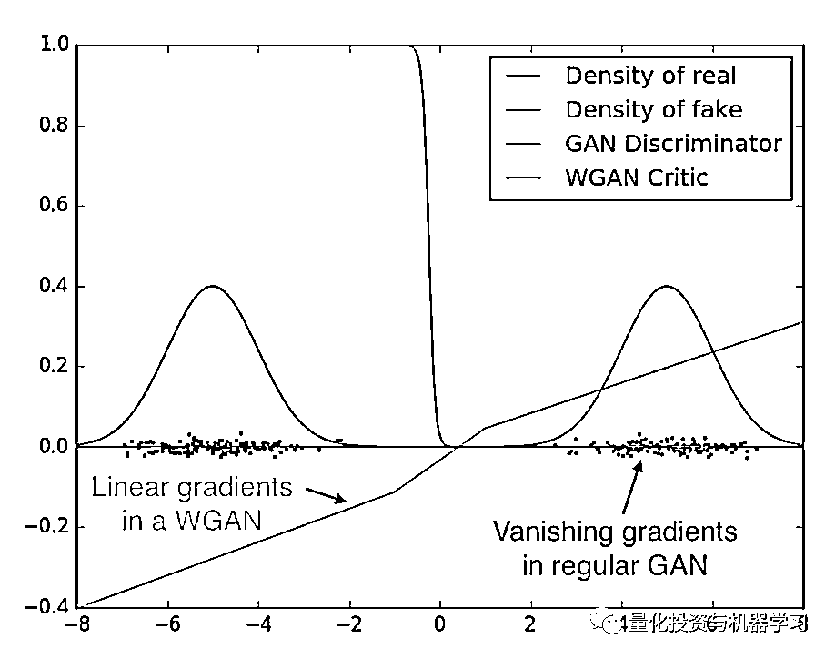

# 生成对抗网络(GAN)系列：WGAN 与金融时序（附代码）

> 原文：[`mp.weixin.qq.com/s?__biz=MzAxNTc0Mjg0Mg==&mid=2653301526&idx=1&sn=6a90c9774f72312713b1e9052ada230d&chksm=802de903b75a60151b9e68cba625692c66bdd4901f1bd25a8b30f8355de5f29b124d6ba1885e&scene=27#wechat_redirect`](http://mp.weixin.qq.com/s?__biz=MzAxNTc0Mjg0Mg==&mid=2653301526&idx=1&sn=6a90c9774f72312713b1e9052ada230d&chksm=802de903b75a60151b9e68cba625692c66bdd4901f1bd25a8b30f8355de5f29b124d6ba1885e&scene=27#wechat_redirect)


作者：Mirko      编译：酸的馒头


端午安康

**生成对抗网络应用量化投资系列（一）**

**获取完整代码，见文末**

***1***

**引言**

过拟合是我们试图将机器学习技术应用于时间序列时遇到的问题之一。出现这个问题是因为我们使用我们所知道的唯一时间序列路径来训练我们的模型：已实现的历史。

特别是，并非所有市场机制或事件都能在我们的数据中得到很好的体现。事实上，非常不太可能发生的事件，如异常高波动的时期，通常都没有得到充分的代表性，这使得模型训练不够好。因此，当这些经过训练的算法面对新的场景时，它们可能会失败；如果我们在没有任何预防措施的情况下让它们在生产中保持足够长的时间，这种情况就会发生。

**现在，如果我们可以训练一个模型来为相同的资产生成新的数据呢？如果我们有一个工具，可以产生替代的实际时间序列，与原始时间序列具有相同的统计特性，会怎么样****？**有了这样一个工具，我们可以用不太可能发生的事件或罕见的市场机制的数据来扩充我们的训练集；因此，我们将能够建立更好概括模型，从业者将执行更好的模拟和交易、回测。*《**Journal of Financial Data Science》***最近发表的一篇论文的作者展示了**在合成数据上训练深度模型如何减少过拟合并提高性能。**


事实证明，**生成对抗网络（GANs）可以做到这一点**。

*生成对抗网络是一种深度学习模型，是近年来复杂分布上无监督学习最具前景的方法之一。模型通过框架中（至少）两个模块：生成模型（Generative Model）和判别模型（Discriminative Model）的互相博弈学习产生相当好的输出。原始 GAN 理论中，并不要求 G 和 D 都是神经网络，只需要是能拟合相应生成和判别的函数即可。但实用中一般均使用深度神经网络作为 G 和 D 。一个优秀的 GAN 应用需要有良好的训练方法，否则可能由于神经网络模型的自由性而导致输出不理想。*

***2***

**本文要告诉大家的**

我们在这里的目的不是深入研究 GANs 理论（网上大把资料），虽然我们的最终目标是使用一个或多个训练有素的发生器来同时产生多个时间序列，但我们选择从简单的开始逐步进行。在这方面，我们首先检查 GANs 能不能学习系列的数据生成过程（DGP）。

***3***

**模型**

我们首先编写一个 Pytorch 数据集来产生不同的正弦函数。Pytorch 数据集是方便的实用程序，可以使数据加载更容易，并提高代码的可读性。看看这里。

**获取完整代码，见文末**

```py
from typing import Sequence
from torch.utils.data import Dataset
import numpy as np

class Sines(Dataset):

    def __init__(self, frequency_range: Sequence[float], amplitude_range: Sequence[float],
                 n_series: int = 200, datapoints: int = 100, seed: int = None):
        """
        Pytorch Dataset to produce sines.
        y = A * sin(B * x)
        :param frequency_range: range of A
        :param amplitude_range: range of B
        :param n_series: number of sines in your dataset
        :param datapoints: length of each sample
        :param seed: random seed
        """
        self.n_series = n_series
        self.datapoints = datapoints
        self.seed = seed
        self.frequency_range = frequency_range
        self.amplitude_range = amplitude_range
        self.dataset = self._generate_sines()

    def __len__(self):
        return self.datapoints

    def __getitem__(self, idx):
        return self.dataset[idx]

    def _generate_sines(self):
        if self.seed is not None:
            np.random.seed(self.seed)

        x = np.linspace(start=0, stop=2 * np.pi, num=self.datapoints)
        low_freq, up_freq = self.frequency_range[0], self.frequency_range[1]
        low_amp, up_amp = self.amplitude_range[0], self.amplitude_range[1]

        freq_vector = (up_freq - low_freq) * np.random.rand(self.n_series, 1) + low_freq
        ampl_vector = (up_amp - low_amp) * np.random.rand(self.n_series, 1) + low_amp

        return ampl_vector * np.sin(freq_vector * x) 
```

然后我们选择**Wasserstein GAN（WGAN**），因为这一类特殊的模型有强有力的理论基础，并显著提高训练的稳定性；此外，损失与生成器的收敛性和样本质量相关，这非常有用，因为研究人员不需要经常检查生成的样本来了解模型是否在改进。最后，WGANs 比标准的 GANs 对模式崩溃和架构变化更加健壮。

**知识点**

要知道自从 2014 年 Ian Goodfellow 提出以来，GAN 就存在着训练困难、生成器和判别器的 loss 无法指示训练进程、生成样本缺乏多样性等问题。从那时起，很多论文都在尝试解决，但是效果不尽人意。而 Wasserstein GAN（下面简称 WGAN）成功地做到了以下爆炸性的几点：

*   彻底解决 GAN 训练不稳定的问题，不再需要小心平衡生成器和判别器的训练程度；

*   基本解决了 collapse mode 的问题，确保了生成样本的多样性；

*   训练过程中终于有一个像交叉熵、准确率这样的数值来指示训练的进程，这个数值越小代表 GAN 训练得越好，代表生成器产生的图像质量越高；

*   以上一切好处不需要精心设计的网络架构，最简单的多层全连接网络就可以做到。

**一定要看这两篇论文：**


https://arxiv.org/pdf/1701.04862.pdf


https://arxiv.org/pdf/1701.07875.pdf

***4***

**WGANs 与 GANs 有何不同？**

标准 GANs 中的损失函数量化了训练和生成的数据分布之间的距离。实际上，GANs 是基于这样的思想，即随着训练的进行，模型的参数逐渐更新，由 G 学习的分布收敛于真实的数据分布。这种收敛必须尽可能平滑，并且必须记住，**这种分布序列的收敛方式取决于我们如何计算每对分布之间的距离。**

现在，WGANs 和标准 GANs 在如何量化这个距离上有所不同。常规 GANs 通过詹森-香农（Jensen–Shannon）分歧来实现，而 WGANs 使用 Wasserstein 距离，这种距离具有更好的特性。特别地，Wasserstein 度量是连续的，在任何地方都具有良好的梯度，**因此即使真实分布和生成分布的支持位于非重叠低维流形中，也允许分布更平滑地收敛。**



上图显示了标准 GAN 的鉴别器如何饱和并导致梯度消失，而 WGAN 的鉴别器在空间的所有部分提供了非常清晰的梯度。

***5***

** Lipschitz 约束**

单个 Wasserstein 距离是相当棘手的；因此需要运用一个聪明的技巧：**Kantorovich-Rubinstein duality**——来克服障碍，获得我们问题的最终形式。理论上讲，Wasserstein 度量新形式中的函数 f_w 必须是**K-Lipschitz 连续**的。f_w 属于参数化函数序列；w 代表一组参数，即权重。


目标函数的最终形式——Wasserstein 度量。第一期望是相对于真实分布计算的，而第二期望是相对于噪声分布计算的。z 是潜在张量，g_theta(z)代表由 G 产生的假数据。这个目标函数表明 critic 不直接归因于概率。相反，它被训练来学习一个 K-Lipschitz 续函数来帮助计算我们的 Wasserstein 距离的最终形式。

我们说一个可微函数是 K-Lipschitz 连续的，当且仅当它在任何地方都有模至多为 K 的梯度。k 叫做 Lipschitz 常数。**Lipschitz 连续性是改进 GANs 训练的一种有前途的技术**。不幸的是，其实施仍然具有挑战性。事实上，这是一个活跃的研究领域，并且有几种方法来加强约束。最初的 WGAN 论文提出了权重剪裁，但是我们采用了“梯度惩罚函数”（GP）方法，因为权重剪裁会导致容量问题，并且需要额外的参数来定义权重所在的空间。另一方面，GP 方法能够在几乎没有超参数调整的情况下实现更稳定的训练。

***6***

**架构一**

我们的第一个架构来自于这个论文：


https://repository.tudelft.nl/islandora/object/uuid%3A51d69925-fb7b-4e82-9ba6-f8295f96705c

其中，提出了一个 WGAN-GP 架构来产生单变量综合金融时间序列。**所提出的架构是线性和卷积层在 G 和 D 中的混合，并且它是开箱即用的**。不幸的是，尽管最初的 WGAN-GP 文件明确规定了**“无 critic 批量标准化”**，但在这种设置下，训练看起来并不十分稳定，并且使用批处理规范化(BN)来实现 D。

因此，我们去掉了 BN，转而进行频谱归一化。简单地说，SN 确保 D 是 K-Lipschitz 连续的。为了做到这一点，它逐渐地作用于你 critic 的每一层，以约束它的 Lipschitz 常数。请参考下面两篇文章，了解更多细节：


https://christiancosgrove.com/blog/2018/01/04/spectral-normalization-explained.html


https://arxiv.org/pdf/1802.05957.pdf

虽然从理论上讲，有了 SN，我们就可以在损失中去掉 GP 过程项——信噪比和高斯过程都应该被认为是增强 Lipschitz 连续性的替代方法——但是我们的测试并不支持这个命题。然而，SN 提高了训练的稳定性，加快了收敛速度。因此，我们在 G 和 d 中都采用它

最后，最初的 WGAN-GP 论文建议在 G 和 D 中使用 Adam 优化器，但是我们根据经验发现 RMSprop 更符合我们的需要。

**获取完整代码，见文末**

```py
from torch import nn
from torch.nn.utils import spectral_norm

class AddDimension(nn.Module):
    def forward(self, x):
        return x.unsqueeze(1)

class SqueezeDimension(nn.Module):
    def forward(self, x):
        return x.squeeze(1)

def create_generator_architecture():
    return nn.Sequential(nn.Linear(50, 100),
                         nn.LeakyReLU(0.2, inplace=True),
                         AddDimension(),
                         spectral_norm(nn.Conv1d(1, 32, 3, padding=1), n_power_iterations=10),
                         nn.Upsample(200),

                         spectral_norm(nn.Conv1d(32, 32, 3, padding=1), n_power_iterations=10),
                         nn.LeakyReLU(0.2, inplace=True),
                         nn.Upsample(400),

                         spectral_norm(nn.Conv1d(32, 32, 3, padding=1), n_power_iterations=10),
                         nn.LeakyReLU(0.2, inplace=True),
                         nn.Upsample(800),

                         spectral_norm(nn.Conv1d(32, 1, 3, padding=1), n_power_iterations=10),
                         nn.LeakyReLU(0.2, inplace=True),

                         SqueezeDimension(),
                         nn.Linear(800, 100)
                         )

def create_critic_architecture():
    return nn.Sequential(AddDimension(),
                         spectral_norm(nn.Conv1d(1, 32, 3, padding=1), n_power_iterations=10),
                         nn.LeakyReLU(0.2, inplace=True),
                         nn.MaxPool1d(2),

                         spectral_norm(nn.Conv1d(32, 32, 3, padding=1), n_power_iterations=10),
                         nn.LeakyReLU(0.2, inplace=True),
                         nn.MaxPool1d(2),

                         spectral_norm(nn.Conv1d(32, 32, 3, padding=1), n_power_iterations=10),
                         nn.LeakyReLU(0.2, inplace=True),
                         nn.Flatten(),

                         nn.Linear(800, 50),
                         nn.LeakyReLU(0.2, inplace=True),

                         nn.Linear(50, 15),
                         nn.LeakyReLU(0.2, inplace=True),

                         nn.Linear(15, 1)
                         )

class Generator(nn.Module):
    def __init__(self):
        super().__init__()
        self.main = create_generator_architecture()

    def forward(self, input):
        return self.main(input)

class Critic(nn.Module):
    def __init__(self):
        super().__init__()
        self.main = create_critic_architecture()

    def forward(self, input):
        return self.main(input) 
```

为了尝试一下，你还需要一段代码来计算损失、向后传递、更新模型权重、保存日志、训练样本等等：

```py
import argparse
import os
import torch
from tqdm import tqdm
from torch.autograd import Variable
from torch.autograd import grad as torch_grad
import matplotlib.pyplot as plt
from torch.utils.tensorboard import writer, SummaryWriter
from torch.utils.data import DataLoader
from math import pi
from datasets.datasets import Sines
from models.wgangp import Generator, Critic

class Trainer:
    NOISE_LENGTH = 50

    def __init__(self, generator, critic, gen_optimizer, critic_optimizer,
                 gp_weight=10, critic_iterations=5, print_every=200, use_cuda=False, checkpoint_frequency=200):
        self.g = generator
        self.g_opt = gen_optimizer
        self.c = critic
        self.c_opt = critic_optimizer
        self.losses = {'g': [], 'c': [], 'GP': [], 'gradient_norm': []}
        self.num_steps = 0
        self.use_cuda = use_cuda
        self.gp_weight = gp_weight
        self.critic_iterations = critic_iterations
        self.print_every = print_every
        self.checkpoint_frequency = checkpoint_frequency

        if self.use_cuda:
            self.g.cuda()
            self.c.cuda()

    def _critic_train_iteration(self, real_data):

        batch_size = real_data.size()[0]
        noise_shape = (batch_size, self.NOISE_LENGTH)
        generated_data = self.sample_generator(noise_shape)

        real_data = Variable(real_data)

        if self.use_cuda:
            real_data = real_data.cuda()

        # Pass data through the Critic
        c_real = self.c(real_data)
        c_generated = self.c(generated_data)

        # Get gradient penalty
        gradient_penalty = self._gradient_penalty(real_data, generated_data)
        self.losses['GP'].append(gradient_penalty.data.item())

        # Create total loss and optimize
        self.c_opt.zero_grad()
        d_loss = c_generated.mean() - c_real.mean() + gradient_penalty
        d_loss.backward()
        self.c_opt.step()

        self.losses['c'].append(d_loss.data.item())

    def _generator_train_iteration(self, data):
        self.g_opt.zero_grad()
        batch_size = data.size()[0]
        latent_shape = (batch_size, self.NOISE_LENGTH)

        generated_data = self.sample_generator(latent_shape)

        # Calculate loss and optimize
        d_generated = self.c(generated_data)
        g_loss = - d_generated.mean()
        g_loss.backward()
        self.g_opt.step()
        self.losses['g'].append(g_loss.data.item())

    def _gradient_penalty(self, real_data, generated_data):

        batch_size = real_data.size()[0]

        # Calculate interpolation
        alpha = torch.rand(batch_size, 1)
        alpha = alpha.expand_as(real_data)
        if self.use_cuda:
            alpha = alpha.cuda()
        interpolated = alpha * real_data.data + (1 - alpha) * generated_data.data
        interpolated = Variable(interpolated, requires_grad=True)
        if self.use_cuda:
            interpolated = interpolated.cuda()

        # Pass interpolated data through Critic
        prob_interpolated = self.c(interpolated)

        # Calculate gradients of probabilities with respect to examples
        gradients = torch_grad(outputs=prob_interpolated, inputs=interpolated,
                               grad_outputs=torch.ones(prob_interpolated.size()).cuda() if self.use_cuda
                               else torch.ones(prob_interpolated.size()), create_graph=True,
                               retain_graph=True)[0]
        # Gradients have shape (batch_size, num_channels, series length),
        # here we flatten to take the norm per example for every batch
        gradients = gradients.view(batch_size, -1)
        self.losses['gradient_norm'].append(gradients.norm(2, dim=1).mean().data.item())

        # Derivatives of the gradient close to 0 can cause problems because of the
        # square root, so manually calculate norm and add epsilon
        gradients_norm = torch.sqrt(torch.sum(gradients ** 2, dim=1) + 1e-12)

        # Return gradient penalty
        return self.gp_weight * ((gradients_norm - 1) ** 2).mean()

    def _train_epoch(self, data_loader, epoch):
        for i, data in enumerate(data_loader):
            self.num_steps += 1
            self._critic_train_iteration(data.float())
            # Only update generator every critic_iterations iterations
            if self.num_steps % self.critic_iterations == 0:
                self._generator_train_iteration(data)

            if i % self.print_every == 0:
                global_step = i + epoch * len(data_loader.dataset)
                writer.add_scalar('Losses/Critic', self.losses['c'][-1], global_step)
                writer.add_scalar('Losses/Gradient Penalty', self.losses['GP'][-1], global_step)
                writer.add_scalar('Gradient Norm', self.losses['gradient_norm'][-1], global_step)

                if self.num_steps > self.critic_iterations:
                    writer.add_scalar('Losses/Generator', self.losses['g'][-1], global_step)

    def train(self, data_loader, epochs, plot_training_samples=True, checkpoint=None):

        if checkpoint:
            path = os.path.join('checkpoints', checkpoint)
            state_dicts = torch.load(path, map_location=torch.device('cpu'))
            self.g.load_state_dict(state_dicts['g_state_dict'])
            self.c.load_state_dict(state_dicts['d_state_dict'])
            self.g_opt.load_state_dict(state_dicts['g_opt_state_dict'])
            self.c_opt.load_state_dict(state_dicts['d_opt_state_dict'])

        if plot_training_samples:
            # Fix latents to see how series generation improves during training
            noise_shape = (1, self.NOISE_LENGTH)
            fixed_latents = Variable(self.sample_latent(noise_shape))
            if self.use_cuda:
                fixed_latents = fixed_latents.cuda()

        for epoch in tqdm(range(epochs)):

            # Sample a different region of the latent distribution to check for mode collapse
            dynamic_latents = Variable(self.sample_latent(noise_shape))
            if self.use_cuda:
                dynamic_latents = dynamic_latents.cuda()

            self._train_epoch(data_loader, epoch + 1)

            # Save checkpoint
            if epoch % self.checkpoint_frequency == 0:
                torch.save({
                    'epoch': epoch,
                    'd_state_dict': self.c.state_dict(),
                    'g_state_dict': self.g.state_dict(),
                    'd_opt_state_dict': self.c_opt.state_dict(),
                    'g_opt_state_dict': self.g_opt.state_dict(),
                }, 'checkpoints/epoch_{}.pkl'.format(epoch))

            if plot_training_samples and (epoch % self.print_every == 0):
                self.g.eval()
                # Generate fake data using both fixed and dynamic latents
                fake_data_fixed_latents = self.g(fixed_latents).cpu().data
                fake_data_dynamic_latents = self.g(dynamic_latents).cpu().data

                plt.figure()
                plt.plot(fake_data_fixed_latents.numpy()[0].T)
                plt.savefig('training_samples/fixed_latents/series_epoch_{}.png'.format(epoch))
                plt.close()

                plt.figure()
                plt.plot(fake_data_dynamic_latents.numpy()[0].T)
                plt.savefig('training_samples/dynamic_latents/series_epoch_{}.png'.format(epoch))
                plt.close()
                self.g.train()

    def sample_generator(self, latent_shape):
        latent_samples = Variable(self.sample_latent(latent_shape))
        if self.use_cuda:
            latent_samples = latent_samples.cuda()

        return self.g(latent_samples)

    @staticmethod
    def sample_latent(shape):
        return torch.randn(shape)

    def sample(self, num_samples):
        generated_data = self.sample_generator(num_samples)
        return generated_data.data.cpu().numpy()

if __name__ == '__main__':
    parser = argparse.ArgumentParser(prog='GANetano', usage='%(prog)s [options]')
    parser.add_argument('-ln', '--logname', type=str, dest='log_name', default=None, required=True,
                        help='tensorboard filename')
    parser.add_argument('-e', '--epochs', type=int, dest='epochs', default=15000, help='number of training epochs')
    parser.add_argument('-bs', '--batches', type=int, dest='batches', default=16,
                        help='number of batches per training iteration')
    parser.add_argument('-cp', '--checkpoint', type=str, dest='checkpoint', default=None,
                        help='checkpoint to use for a warm start')

    args = parser.parse_args()

    # Instantiate Generator and Critic + initialize weights
    g = Generator()

    g_opt = torch.optim.RMSprop(g.parameters(), lr=0.00005)
    d = Critic()

    d_opt = torch.optim.RMSprop(d.parameters(), lr=0.00005)

    # Create Dataloader
    dataset = Sines(frequency_range=[0, 2 * pi], amplitude_range=[0, 2 * pi], seed=42, n_series=200)
    dataloader = DataLoader(dataset, batch_size=args.batches)

    # Instantiate Trainer
    trainer = Trainer(g, d, g_opt, d_opt, use_cuda=torch.cuda.is_available())
    # Train model
    print('Training is about to start...')
    # Instantiate Tensorboard writer
    tb_logdir = os.path.join('..', 'tensorboard', args.log_name)
    writer = SummaryWriter(log_dir=tb_logdir)

    trainer.train(dataloader, epochs=args.epochs, plot_training_samples=True, checkpoint=args.checkpoint) 
```

***7***

**结果**

好消息是我们的模型学会了生成真实的正弦样本；坏消息是，正弦不是资产收益！那么，下一步是什么来增加我们对这种模式的信任？


用训练好的模型产生不同的真实正弦波

为什么我们不去掉简单的正弦函数，用我们知道其参数的 ARMA 过程的样本来填充 GAN 呢？

我们选择一个简单的 ARMA(1,1)过程，p=0.7，q=0.2，用一个新的 Pytorch 数据集生成真实样本，并训练模型。

**获取完整代码，见文末**

```py
class ARMA(Dataset):

    def __init__(self, p: Sequence[float], q: Sequence[float], seed: int = None,
                 n_series: int = 200, datapoints: int = 100):
        """
        Pytorch Dataset to sample a given ARMA process.

        y = ARMA(p,q)
        :param p: AR parameters
        :param q: MA parameters
        :param seed: random seed
        :param n_series: number of ARMA samples in your dataset
        :param datapoints: length of each sample
        """
        self.p = p
        self.q = q
        self.n_series = n_series
        self.datapoints = datapoints
        self.seed = seed
        self.dataset = self._generate_ARMA()

    def __len__(self):
        return self.datapoints

    def __getitem__(self, idx):
        return self.dataset[idx]

    def _generate_ARMA(self):

        if self.seed is not None:
            np.random.seed(self.seed)

        ar = np.array(self.p)
        ma = np.array(self.q)
        ar = np.r_[1, -ar]
        ma = np.r_[1, ma]
        burn = int(self.datapoints / 10)

        dataset = []

        for i in range(self.n_series):
            arma = smt.arma_generate_sample(ar=ar, ma=ma, nsample=self.datapoints, burnin=burn)
            dataset.append(arma)

        return np.array(dataset) 
```

我们现在生成一百个假样本，估计 p 和 q，看看下面的结果。p 和 q 是我们 DGP 的唯一参数。


用训练模型生成的合成 ARMA(1,1)样本


可以看出，这个模型很好地学习了 DGP。事实上，这些分布的模式接近 DGP、p 和 q 的真实参数，分别为 0.7 和 0.2。

***8***

****损失应该是什么样的？****

在我们的第一次实验中，不停地问自己，从我们的损失中会得到什么。当然，一切都取决于你选择的训练数据、优化算法和学习率，但我们根据经验发现，成功的训练的特点是损失，尽管开始时不稳定，但随后逐渐向较低的值收敛。在其他条件相同的情况下，降低学习速度可以稳定训练。


生成器损耗示例 


Critic 损失示例

**如何检查 Mode collapse（模型奔溃）？**

为了检查模型崩溃，我们每次在训练过程中生成假样本时都使用不同的潜在张量。通过这样的过程，我们可以检查在对噪声空间的不同部分进行采样时会发生什么。如果你对不同的随机张量进行采样，并且 G 继续产生相同的系列，那么你正在经历模型崩溃。

**知识点**

Mode collapse 是指 GAN 生成的样本单一，其认为满足某一分布的结果为 true，其他为 False，导致以上结果。

自然数据分布是非常复杂，且是多峰值的（multimodal）。也就是说数据分布有很多的峰值（peak）或众数（mode）。每个 mode 都表示相似数据样本的聚集，但与其他 mode 是不同的。

在 mode collapse 过程中，生成网络 G 会生成属于有限集 mode 的样本。当 G 认为可以在单个 mode 上欺骗判别网络 D 时，G 就会生成该 mode 外的样本。     


上图表示 GAN 的输出没有 mode collapse。下图则出现了 mode collapse。

判别网络最后会判别来自该 mode 的样本是假的。最后，生成网络 G 会简单地锁定到另一个 mode。该循环会无限进行，就会限制生成样本的多样性。

**GANs 提供了优于其他生成机制的优势吗？**

这是一个很重要的问题，我们想通过进一步的实验来回答：**GANs 的复杂性必须通过效果更好的性能来证明。**

**GP 限制**

根据这篇论文：


https://arxiv.org/pdf/1904.01184.pdf

标准的 GP 方法可能不是 Lipschitz 正则化的最佳实现。此外，频谱标准化可能会不必要地限制 critic，并削弱其为 G 提供声音梯度的能力。作者提出了一种在标准方法失败时使用的替代方法。在该系列后续的文章中，我们将会验证他们的建议。

**为什么我们应该训练 D 多于 G？**

一个训练有素的 D 在 WGAN 环境中是至关重要的，因为 critic 估计了真实和虚假分布之间的 Wasserstein 距离。一个最佳的 critic 将提供我们距离度量的良好估计，这反过来将导致梯度是健康的！

***9***

**代码获取**

后台回复 

***WGAN-1***

欢迎大家继续关注该系列的后续文章···

**参考文献**

[2019] Towards Efficient and Unbiased Implementation of Lipschitz Continuity in GANs — Zhou, Shen et al

[2019] Enriching Financial Datasets with Generative Adversarial Networks, de Meer Pardo

[2018] Spectral Normalization for Generative Adversarial Networks — Miyato, Kataoka et al

[2017] Improved Training of Wasserstein GANs — Gulrajani, Ahmed et al

[2017] Wasserstein GAN — Arjovsky, Chintala et al

量化投资与机器学习微信公众号，是业内垂直于**Quant、MFE、Fintech、AI、ML**等领域的**量化类主流自媒体。**公众号拥有来自**公募、私募、券商、期货、银行、保险资管、海外**等众多圈内**18W+**关注者。每日发布行业前沿研究成果和最新量化资讯。

你点的每个“在看”，都是对我们最大的鼓励