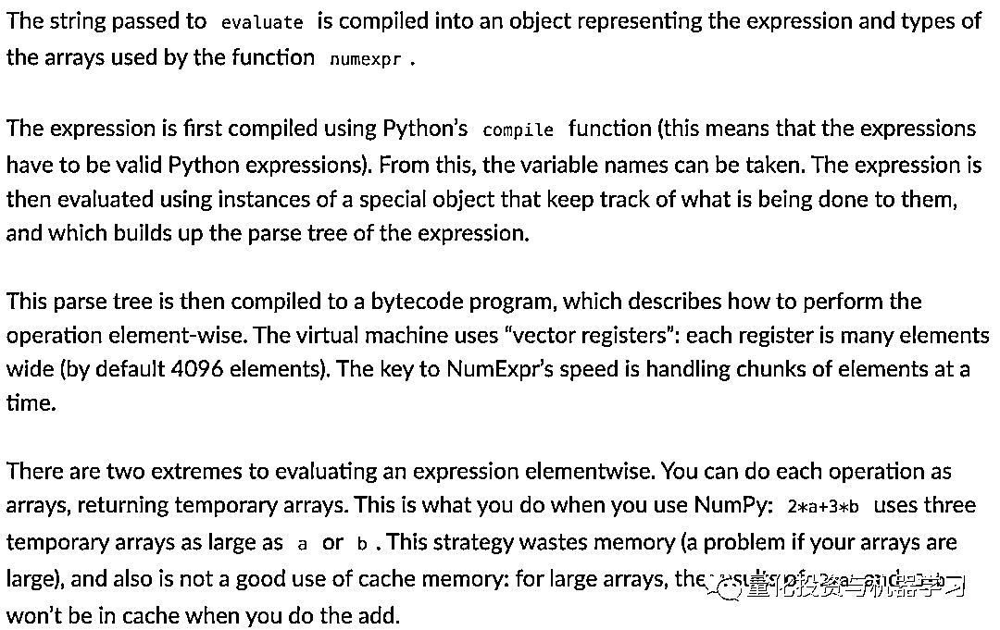
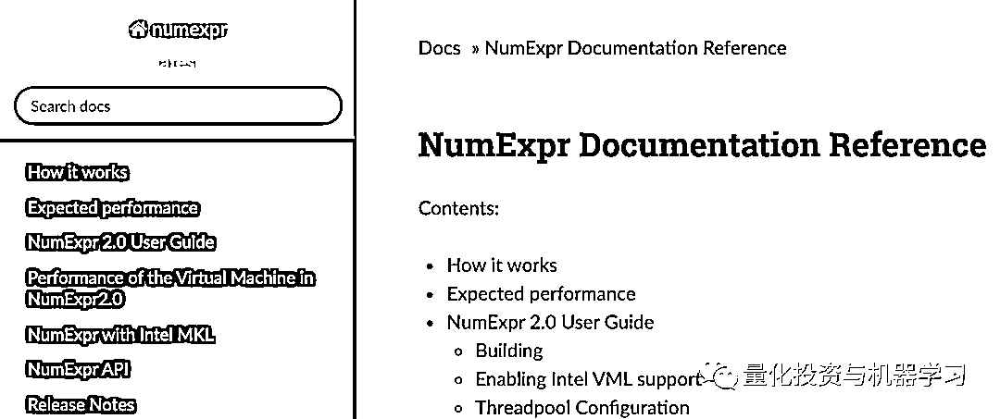

# NumExpr：加速 Numpy、Pandas 数学运算新利器！

> 原文：[`mp.weixin.qq.com/s?__biz=MzAxNTc0Mjg0Mg==&mid=2653301495&idx=1&sn=b3a701df21572d1be13a3eef4f07650d&chksm=802de8e2b75a61f4febd98d116fee81b475c5681b812c852a8104877e99605a3f75e05f3749c&scene=27#wechat_redirect`](http://mp.weixin.qq.com/s?__biz=MzAxNTc0Mjg0Mg==&mid=2653301495&idx=1&sn=b3a701df21572d1be13a3eef4f07650d&chksm=802de8e2b75a61f4febd98d116fee81b475c5681b812c852a8104877e99605a3f75e05f3749c&scene=27#wechat_redirect)


作者：Sarkar       编译：1+1=6

***1***

**前言**

Numpy 和 Pandas 可能是用于数据科学（DS）和机器学习（ML）任务的两个最广泛使用的核心 Python 库。毋庸置疑，计算数值表达式的速度对于这些 DS/ML 任务至关重要，这两个库在这方面不会令人失望。


公众号在此之前也介绍过很多关于两者加速的工具和技巧： 

**相关文章**

**[1、30 倍！使用 Cython 加速 Python 代码](http://mp.weixin.qq.com/s?__biz=MzAxNTc0Mjg0Mg==&mid=2653293723&idx=1&sn=8fcb3effaffd583882d5ffe13b330fe2&chksm=802dce8eb75a4798bcb14f9f9cb19b1333c2e31d78fc837448b8a4c8990da9ad083c7fe5ecee&scene=21#wechat_redirect)**

**2、[CuPy：将 Numpy 提速 700 倍！](http://mp.weixin.qq.com/s?__biz=MzAxNTc0Mjg0Mg==&mid=2653294102&idx=1&sn=5dc9d21b3497fe6e1c8df98ee61e02c7&chksm=802dcc03b75a4515a630076cbbe4d116ba1897f4fbb961b0811a888272f9e12953c3ca967c3c&scene=21#wechat_redirect)**

## **[3、71803 倍！](https://mp.weixin.qq.com/s?__biz=MzAxNTc0Mjg0Mg==&mid=2653294130&idx=1&sn=42756891c73ab8b1ecbd6395efef4aba&chksm=802dcc27b75a4531d81719002ac6e62affe4c8e19b56347200bff0502ea44f6edddbbfdffdba&token=607437153&lang=zh_CN&scene=21#wechat_redirect)[超强 Pandas 循环提速攻略](https://mp.weixin.qq.com/s?__biz=MzAxNTc0Mjg0Mg==&mid=2653294130&idx=1&sn=42756891c73ab8b1ecbd6395efef4aba&chksm=802dcc27b75a4531d81719002ac6e62affe4c8e19b56347200bff0502ea44f6edddbbfdffdba&token=607437153&lang=zh_CN&scene=21#wechat_redirect)**

**[4、10 个提高工作效率的 Pandas 小技巧](http://mp.weixin.qq.com/s?__biz=MzAxNTc0Mjg0Mg==&mid=2653293923&idx=2&sn=3c344ab8661a2d9d6b79caa6f253f35d&chksm=802dcf76b75a466080145f290dc01ddc5775906e16e04cec5d48a10f1356b37b2644fd67a38a&scene=21#wechat_redirect)**

**5、[CPU 靠边站！使用 cuDF 在 GPU 加速 Pandas](https://mp.weixin.qq.com/s?__biz=MzAxNTc0Mjg0Mg==&mid=2653294764&idx=1&sn=bcd1c5396ea631f2b15a64cf19fe0108&scene=21#wechat_redirect)** 

**6、[1000+倍！超强 Python『向量化』数据处理提速攻略](https://mp.weixin.qq.com/s?__biz=MzAxNTc0Mjg0Mg==&mid=2653296308&idx=1&sn=254bcaa023ac25e883a2b2b44293b3f3&scene=21#wechat_redirect)** 

**7、[Datatable：Python 数据分析提速高手！](https://mp.weixin.qq.com/s?__biz=MzAxNTc0Mjg0Mg==&mid=2653297525&idx=1&sn=c57fe41418041fcc10186f3b48bdbf53&scene=21#wechat_redirect)**

**8、[仅需 1 秒！搞定 100 万行数据：超强 Python 数据分析利器](http://mp.weixin.qq.com/s?__biz=MzAxNTc0Mjg0Mg==&mid=2653300441&idx=1&sn=53926172a6739e2c7a33fe74c79e5489&chksm=802de4ccb75a6dda4fa8dbe08586540a8864791bf5593845a2ff368897b99b4e13d57cfc15e2&scene=21#wechat_redirect)** 

**今天，我们又要给大家推荐一款利器：**NumExpr**。用来提高由 Numpy 和 Pandas 所产生的数学运算速度。**

****NumExpr**的运算机制是怎么样的呢？**

**通常，表达式是使用 Python 编译函数编译的，提取变量并构建解析树结构。然后，这个树被编译成一个字节码程序，该程序使用所谓的“向量寄存器”（每个 4096 个元素宽）来描述基于元素的操作流。提高速度的关键是 Numexpr 一次处理元素块的能力。**

****

****它跳过了 Numpy 使用临时数组的做法**，因为临时数组会浪费内存，而且对于大型数组，甚至无法装入缓存内存中。**

**另外，**虚拟机完全是用 C 编写的**，这使得它比本机 Python 更快。它也是**多线程**的，允许在合适的硬件上更快地并行化操作。**

**NumExpr 支持在表达式中使用大量的数学运算符，但不支持条件运算符，如 if 或 else。**

****

**你也可以通过设置环境变量 NUMEXPR_MAX_THREAD 来控制你想要生成的线程的数量，以便用大型数组进行并行操作。目前，最大可能的线程数是 64 个，但是如果线程数高于底层 CPU 节点上可用的虚拟核数，就没有什么实际好处了。**

**下面是官方给出的解释：**

****

**GitHub 地址：***https://github.com/pydata/numexpr***。 **

*****2*****

****安装 NumExpr 库****

**和其他库一样：**

```py
`pip install numexpr` 
```

**根据源代码，“NumExpr 是 NumPy 的快速数值表达式求值器。使用它，对数组进行操作的表达式可以得到加速，并且比在 Python 中进行相同的计算使用更少的内存。此外，它的多线程功能可以使用所有的内核——这通常会导致与 NumPy 相比性能的大幅提升。”(来源)**

**下面是具体文档，大家可以自行查看：**

****

**https://numexpr.readthedocs.io/projects/NumExpr3/en/latest/**

*****3*****

****标量-向量运算****

**从简单的数学运算开始。向 Numpy 数组添加一个标量，比如 1。为了使用 NumExpr 包，我们所要做的就是将相同的计算包装在符号表达式中的特殊方法 evaluate 下：**

```py
`a = np.arange(1e6)
b = np.arange(1e6)

%%timeit -n200 -r10
c = a+1
3.55 ms ± 52.1 µs per loop (mean ± std. dev. of 10 runs, 200 loops each)

%%timeit -n200 -r10
c = ne.evaluate("a + 1")
1.94 ms ± 86.5 µs per loop (mean ± std. dev. of 10 runs, 200 loops each)` 
```

**速度有显著提升：从 3.55ms 提高到 1.94ms！**

*****4*****

****两个数组运算****

**如下：**

```py
`%%timeit -n100 -r10
c = 2*a+3*b
11.7 ms ± 177 µs per loop (mean ± std. dev. of 10 runs, 100 loops each)

%%timeit -n100 -r10
c = ne.evaluate("2*a+3*b")
2.14 ms ± 130 µs per loop (mean ± std. dev. of 10 runs, 100 loops each)` 
```

**平均而言，计算时间从 11.7 ms 提高到了 2.14 ms。**

*****5*****

****多数组复杂运算****

**让我们更进一步，在一个复杂的有理函数表达式中加入更多的数组。假设，我们想计算下面涉及 5 个 Numpy 数组的值，每个数组都有 100 万个随机数（从正态分布抽取）：**

### **<embed style="vertical-align: -4.118ex;width: 22.007ex;height: auto;max-width: 300% !important;" src="https://mmbiz.qlogo.cn/mmbiz_svg/a18XcQ1EBBiac5beoTHDXQxXKZrWW7j045LzGNVibEZnd2eTUpiaaTicrFsmwAp4ravYNmZjAe2qwDT4s36kuR0eKGRdEFicHb6ibl/0?wx_fmt=svg" data-type="svg+xml">**

**我们创建一个形状（1000000，5）的 Numpy 数组，并从中提取 5 个向量（1000000，1）用于有理函数：**

```py
`a = np.random.normal(size=(1000000,5))
a1,a2,a3,a4,a5 = a[:,0],a[:,1],a[:,2],a[:,3],a[:,4]

%%timeit -n100 -r10
c = (a1**2+2*a2+(3/a3))/(np.sqrt(a4**2+a5**2))
47 ms ± 220 µs per loop (mean ± std. dev. of 10 runs, 100 loops each)

%%timeit -n100 -r10
ne.evaluate("(a1**2+2*a2+(3/a3))/(sqrt(a4**2+a5**2))")
3.96 ms ± 218 µs per loop (mean ± std. dev. of 10 runs, 100 loops each)` 
```

**巨大的速度提升！直接从 47ms 下降到 4ms。实际上，这是一个趋势，你会观察到：**表达式变得越复杂，涉及的数组越多，使用 Numexpr 的速度提升就越快！****

*****6*****

****逻辑表达式 / bool 过滤****

**我们并不局限于简单的算术表达式。Numpy 数组最有用的特征之一是直接在包含逻辑运算符（如>或<）的表达式中使用它们来创建布尔过滤器或掩码。**

**我们可以用 NumExpr 做同样的操作，并加快过滤过程。我们检测欧氏距离测量涉及的 4 个向量是否大于某个阈值：**

```py
`x1 = np.random.random(1000000)
x2 = np.random.random(1000000)
y1 = np.random.random(1000000)
y2 = np.random.random(1000000)

%%timeit -n100 -r10
c = np.sqrt((x1-x2)**2+(y1-y2)**2) > 0.5
23.2 ms ± 143 µs per loop (mean ± std. dev. of 10 runs, 100 loops each)

%%timeit -n100 -r10
c = ne.evaluate("sqrt((x1-x2)**2+(y1-y2)**2) > 0.5")
1.86 ms ± 112 µs per loop (mean ± std. dev. of 10 runs, 100 loops each)

%%timeit -n100 -r10
c = ne.evaluate("2*a+3*b > 3.5",optimization='moderate')
763 µs ± 85.4 µs per loop (mean ± std. dev. of 10 runs, 100 loops each)` 
```

**在数据科学、机器学习 pipeline 中，这种过滤操作经常出现，你可以使用 NumExpr 表达式有策略地替换 Numpy 计算，这样可以节省很多计算时间。**

*****7*****

****复数****

**NumExpor 也可以很好地处理复数，Python 和 Numpy 本身就支持复数。这里有一个例子：**

```py
`a = np.random.random(1000000)
b = np.random.random(1000000)

cplx = a + b*1j

%%timeit -n100 -r10
c = np.log10(cplx)
55.9 ms ± 159 µs per loop (mean ± std. dev. of 10 runs, 100 loops each)

%%timeit -n100 -r10
c = ne.evaluate("log10(cplx)")
9.9 ms ± 117 µs per loop (mean ± std. dev. of 10 runs, 100 loops each)` 
```

*****8*****

****数组大小的影响****

**接下来，我们研究 Numpy 数组的大小对速度改进的影响。为此，我们选择一个简单的条件表达式，其中包含 2*a+3*b < 3.5 这样的两个数组，并绘制各种大小的相对执行时间（平均运行 10 次之后）。结果如下：**

```py
`from time import time

result_np = {'Size':[],'Time':[]}
for i in [int(10**(j/5)) for j in range(25,40)]:
    a = np.random.random(size=i)
    b = np.random.random(size=i)
    times = [0]*10
    for j in range(10):
        t1 = time()
        c = (2*a+3*b > 3.5)
        t2 = time()
        times[j]=(t2-t1)*1000
    times = np.array(times)
    result_np['Size'].append(i)
    result_np['Time'].append(times.mean())

result_ne = {'Size':[],'Time':[]}
for i in [int(10**(j/5)) for j in range(25,40)]:
    a = np.random.random(size=i)
    b = np.random.random(size=i)
    times = [0]*10
    for j in range(10):
        t1 = time()
        c = ne.evaluate("2*a+3*b > 3.5")
        t2 = time()
        times[j]=(t2-t1)*1000
    times = np.array(times)
    result_ne['Size'].append(i)
    result_ne['Time'].append(times.mean())

def speed_benchmark(result1,result2,leg_text):
    """
    Plots timing results
    """
    plt.semilogx(result1['Size'],result1['Time'],c='blue',marker='o')
    plt.semilogx(result2['Size'],result2['Time'],c='k',marker='^')
    plt.grid(True)
    plt.legend(leg_text,fontsize=14)
    plt.xticks(fontsize=13)
    plt.yticks(fontsize=13)
    plt.xlabel('Number of elements in the array',fontsize=15)
    plt.ylabel("Time (milliseconds)",fontsize=15)
    plt.show()

speed_benchmark(result_np,result_ne,leg_text=['Just NumPy','With numexpr'])` 
```

****

*****9*****

****pandas eval 方法****

**这是一个对 Python 符号表达式（作为字符串）求值的 Pandas 方法。默认情况下，它使用 NumExpr 引擎来实现显著的加速：**

****

**https://pandas.pydata.org/pandas-docs/stable/reference/api/pandas.eval.html** 

**使用以下代码，我们做一个简单的例子：构造四个 DataFrame，每个数据包含 50000 行和 100 列（均匀随机数），并计算了一个涉及这些 DataFrames 的非线性变换。在一种情况下使用 Pandas 表达式，在另一种情况下使用 pd.eval()方法。**

```py
`nrows, ncols = 50000, 100

df1, df2, df3, df4 = [pd.DataFrame(np.random.randn(nrows, ncols)) for _ in range(4)]

%%timeit -n20 -r10
c=2*df1 - (df2/2) + (df3/df4)
55.8 ms ± 1.8 ms per loop (mean ± std. dev. of 10 runs, 20 loops each)

%%timeit -n20 -r10
pd.eval('2*df1 - (df2/2) + (df3/df4)')
17.3 ms ± 539 µs per loop (mean ± std. dev. of 10 runs, 20 loops each)` 
```

*****10*****

****DataFrame 大小的影响****

**我们对 DataFrame 的大小（行数，同时保持列数固定：100）对速度改进的影响进行了类似的分析。结果如下：**

```py
`cols=100
result_no_eval = {'Size':[],'Time':[]}
for i in [int(10**(j/5)) for j in range(15,32)]:
    df1, df2, df3, df4 = [pd.DataFrame(np.random.randn(i, ncols)) for _ in range(4)]
    times = [0]*10
    for j in range(10):
        t1 = time()
        c = df1+df2+df3+df4
        t2 = time()
        times[j]=(t2-t1)*1000
    times = np.array(times)
    result_no_eval['Size'].append(i)
    result_no_eval['Time'].append(times.mean())

ncols=100
result_eval = {'Size':[],'Time':[]}
for i in [int(10**(j/5)) for j in range(15,32)]:
    df1, df2, df3, df4 = [pd.DataFrame(np.random.randn(i, ncols)) for _ in range(4)]
    times = [0]*10
    for j in range(10):
        t1 = time()
        c = ne.evaluate("df1+df2+df3+df4")
        t2 = time()
        times[j]=(t2-t1)*1000
    times = np.array(times)
    result_eval['Size'].append(i)
    result_eval['Time'].append(times.mean())

def speed_benchmark_pd(result1,result2,leg_text):
    """
    Plots timing results
    """
    plt.semilogx(result1['Size'],result1['Time'],c='blue',marker='o')
    plt.semilogx(result2['Size'],result2['Time'],c='k',marker='^')
    plt.grid(True)
    plt.legend(leg_text,fontsize=14)
    plt.xticks(fontsize=13)
    plt.yticks(fontsize=13)
    plt.xlabel('Number of rows in the DataFrame',fontsize=15)
    plt.ylabel("Time (milliseconds)",fontsize=15)
    plt.show()

speed_benchmark_pd(result_no_eval,result_eval,
                   leg_text=['Normal boring Pandas','With pd.eval'])` 
```

****

**NumExpr 可能不适用与所有操作，但是大部分的数据科学、统计建模等都有应用之处。而且对代码的修改也很小。希望大家可以有所收获！**

**量化投资与机器学习微信公众号，是业内垂直于**Quant、MFE、Fintech、AI、ML**等领域的**量化类主流自媒体。**公众号拥有来自**公募、私募、券商、期货、银行、保险资管、海外**等众多圈内**18W+**关注者。每日发布行业前沿研究成果和最新量化资讯。**

******你点的每个“在看”，都是对我们最大的鼓励**