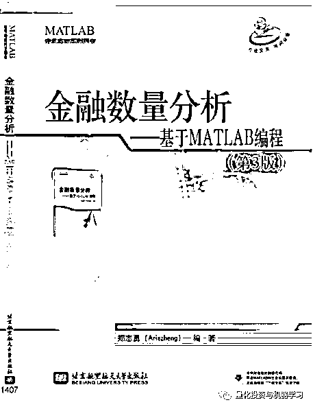
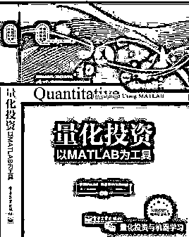
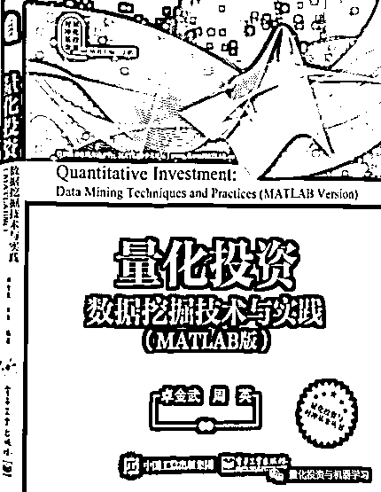
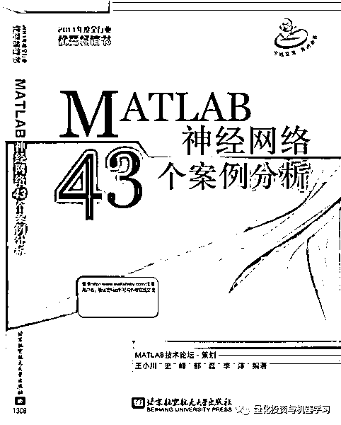
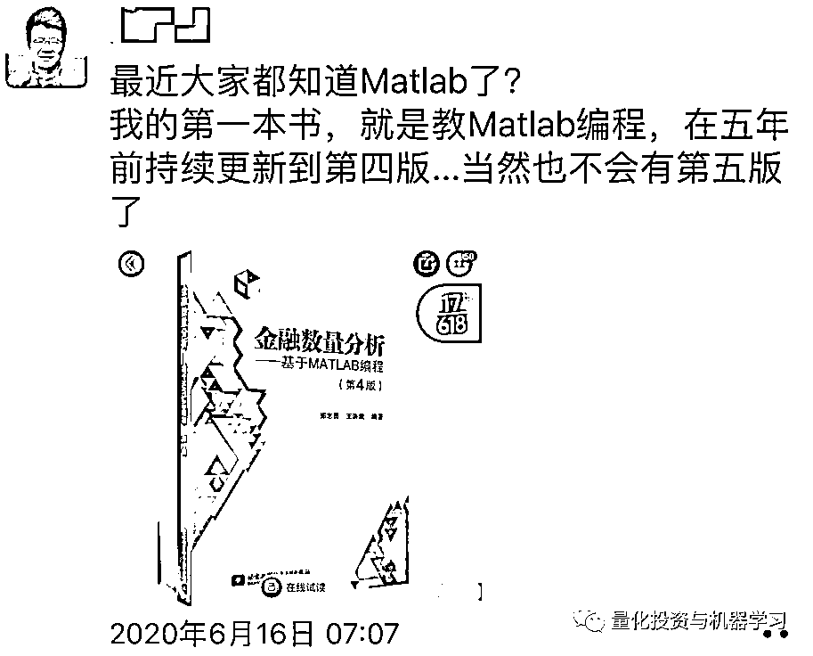

# 那些年，使用 MATLAB 的 Quant 们！

> 原文：[`mp.weixin.qq.com/s?__biz=MzAxNTc0Mjg0Mg==&mid=2653301423&idx=1&sn=62e529123d1f7186711d6c6f5ccbab5b&chksm=802de8bab75a61ac7b6a9ba5786ad0071347d72b222ea47080ec3d2d36bb8784f99abae500ec&scene=27#wechat_redirect`](http://mp.weixin.qq.com/s?__biz=MzAxNTc0Mjg0Mg==&mid=2653301423&idx=1&sn=62e529123d1f7186711d6c6f5ccbab5b&chksm=802de8bab75a61ac7b6a9ba5786ad0071347d72b222ea47080ec3d2d36bb8784f99abae500ec&scene=27#wechat_redirect)

标星★**置顶**公众号     爱你们♥   

前几天哈工大被禁用 MATALB 的事在网上闹得沸沸扬扬。今天我们来说说量化圈的 MATLAB 近况。

要说前几年，MATLAB 在量化圈的使用度还是很高的：

  1、相关书籍和圈子的普及；

2、Python 在那时候还没有火起来；

3、很多做量化的老一辈都是理工科出身，在科研和工作中基本都在使用 MATLAB。

所以一来二去，MATLAB 就渐渐成为了大家的首选。

首先，我们调查一下各位 Quant 们（匿名）：

 /mp/newappmsgvote?action=show&__biz=MzAxNTc0Mjg0Mg==&supervoteid=470068431#wechat_redirect 

那些年，**李洋、郑志勇（现在的望京博格）、卓金武、王小川**等人的名字几乎在 MATLAB 圈众所周知，主要是因为他们为国内量化爱好者编写了很多 MATLAB 结合量化投资的相关书籍。读者们，是否对这些封面很熟悉：

前几天志勇兄还在朋友圈发了一条消息：

**不免让人觉得有些惋惜。**

****现如今，因为机器学习、AI 的兴起，再加上 Python 天然的优势，身边使用 MATLAB 的人越来越少了。你是否也有同样的感受呢？****

****语言本事并没有错，**工具万千，实用为王！******

****祝大家周末快乐！****

******各位 Quant 们，欢迎留言******

******谈谈你对 MATLAB 现状的看法******

****量化投资与机器学习微信公众号，是业内垂直于**Quant、MFE、Fintech、AI、ML**等领域的**量化类主流自媒体。**公众号拥有来自**公募、私募、券商、期货、银行、保险资管、海外**等众多圈内**18W+**关注者。每日发布行业前沿研究成果和最新量化资讯。****

************你点的每个“在看”，都是对我们最大的鼓励****