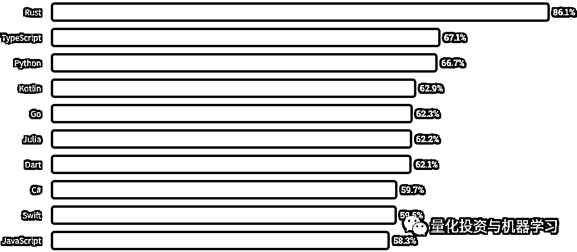
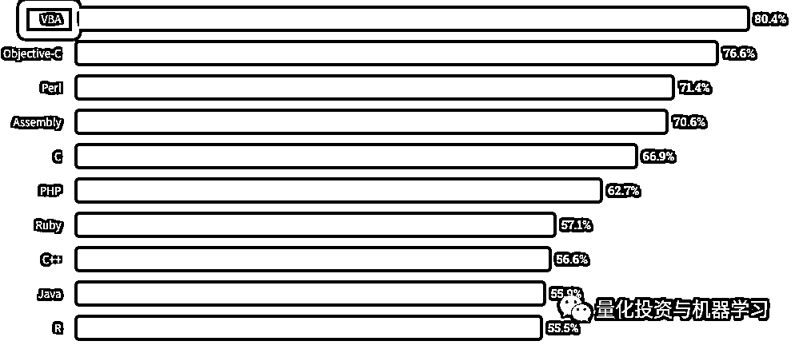
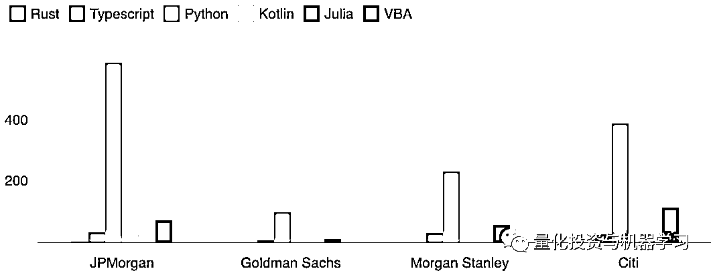
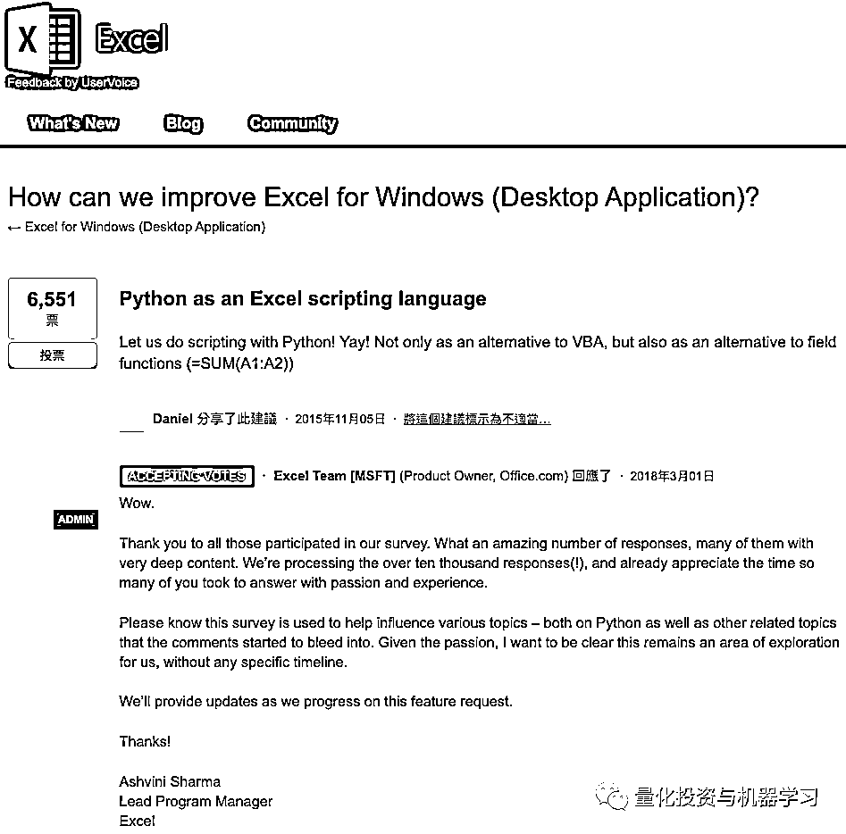

# VBA

> 原文：[`mp.weixin.qq.com/s?__biz=MzAxNTc0Mjg0Mg==&mid=2653301386&idx=1&sn=b282ec6e0f0a9efefaabb298ba19ac93&chksm=802de89fb75a6189124666af9723e6e0279a104f2e7e593d402e0c66d7aba4edd478b5dc3dcc&scene=27#wechat_redirect`](http://mp.weixin.qq.com/s?__biz=MzAxNTc0Mjg0Mg==&mid=2653301386&idx=1&sn=b282ec6e0f0a9efefaabb298ba19ac93&chksm=802de89fb75a6189124666af9723e6e0279a104f2e7e593d402e0c66d7aba4edd478b5dc3dcc&scene=27#wechat_redirect)

标星★**置顶**公众号     爱你们♥   

——  仅此纪念那些年使用 VBA 的日子！—— 

2020 进度：▓▓▓▓▓▓▓░░░░░░░░ 46% 

今天正好在看 StackOverflow 的最新报告：

https://insights.stackoverflow.com/survey/2020#community-visiting-stack-overflow

其中报道了开发人员**最喜爱**的编程语言，前十是：Rust、Typescript、Python、Kotlin、Go、Julia、

最让他们**头皮发麻**的前十编程语言是： 

**VBA 排第一！**

公众号今天特别想说说这门当年叱咤风云的编程语言（我们也曾用过），**没有广告！**

现在的情况是，除了 Python 之外，很多金融机构，像投行（这个会多一些）、对冲基金等金融机构现在已经很少使用 VBA 了。

下面的图表说明了这个问题。在美国顶尖的投行中（代表性样本），目前几乎没有关于 Kotlin 的招聘广告，也没有 Julia 的招聘广告，Typescript 就更别说了。相比之下，**被 StackOverflow 列为最头皮发麻的 VBA 招聘信息则相当多。**

不知道公众号的读者们是否有用过它。我们来做个调查：

 /mp/newappmsgvote?action=show&__biz=MzAxNTc0Mjg0Mg==&supervoteid=470068071#wechat_redirect 

具公众号了解，还是有一部分人热衷于 VBA，对于非计算机相关专业的人来说，VBA 是一种最简单的程序语言了。它可以实现高效的自动化办公。

网上也有很多呼声说：**VBA 已经过时了吗？VBA 是不是很快就要被淘汰了？**  

我们先给答案：

**VBA 在未来 10 年仍然会被广泛使用****VBA 虽然老，但不**会完全消失******它还可以学，还可以学很久**根据微软社区的一个投票可以看出，微软正考虑添加 Python 为官方的一种 Excel 脚本语言，如果获得批准，Excel 用户将能够像目前使用 VBA 脚本一样，使用 Python 脚本与 Excel 文档、数据以及一些 Excel 核心函数进行交互。目前为止，有**6551 人赞同将 Python 集成到 Excel 中**。从 15 年到现在也少的可怜······

从上面的截图，我们可以看到 2 个事情：

*   **微软有在考虑这个事情**

*   **这个事情进展非常缓慢**

所以大家也能看到，直到目前为止，最新的 Office 365 版本仍然是支持使用 VBA 语言。

其实远在 07 年，Office2007 版刚推出的时候，就有大神发声说 VBA 要死了，他们认为 VBA 严重阻碍了 Excel 结构化革新，阻碍了 Excel 开源，在下一个版本，微软肯定不会再支持 VBA。然后十几年过去了，VBA 还活得好好的。 

不知道从什么时候开始，微软市场部也有了谁火就蹭谁热点的尿性，JS 火的时候，它就跳出来说我们 Excel 要支持 JS 了，R 火的时候，它就跳出来说我们 Excel 要全面支持 R 了，后来 Python 火的一塌糊涂，它“理所当然”又跳出来说我们 Excel 要全面深入支持 Python 了。甚至当时有传言微软将在最后一个单机版本 2019 版中彻底放弃 VBA，全面支持 Python……

后来呢，2020 年了，你懂得。 

在计算机专业的眼里 VBA 一直都没地位，许多高级程序员瞧不上 VBA，因为程序员的鄙视链是：

**汇编 > C > C++ > Python > Java 及 C#及 PHP（这三者相互撕）> VB > HTML**

在这长长的鄙视链中甚至都没有 VBA 的位置。

但在金融、财务等诸多其他领域，VBA 也是一枚神器。基本任何企业的绝大多数部门都会用到 Excel，都会需要处理数据。当处理大型运算、重复操作、机械性的工作时，Excel VBA 的自动化就成为了提升工作效率的完美工具。

最后引用杨博士的话说：这些争论永远存在，但其实都没有任何实际意义，最后也都是不了了之。道理很简单：**工具技术各有特色，适用于不同场合，没有任何一种技术可以自称是“万灵丹”。所以互相之间无所谓优劣，只有适用性的不同。**

**工具万千，实用为王。**不必把自己拘泥于某一个技术上，而是根据工作需要，什么方便用什么。在可以预见的几年里，VBA 不会被替代；即使有一天 VBA 会被替代，你也可以通过学习 VBA 所积累的经验也会帮助你迅速转到新工具中。

**Quant 们，你还再用 VBA 吗？如果有，欢迎留言！**

量化投资与机器学习微信公众号，是业内垂直于**Quant、MFE、Fintech、AI、ML**等领域的**量化类主流自媒体。**公众号拥有来自**公募、私募、券商、期货、银行、保险资管、海外**等众多圈内**18W+**关注者。每日发布行业前沿研究成果和最新量化资讯。

你点的每个“在看”，都是对我们最大的鼓励