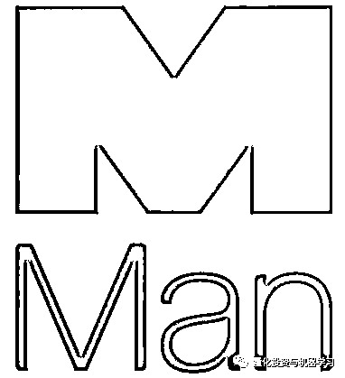
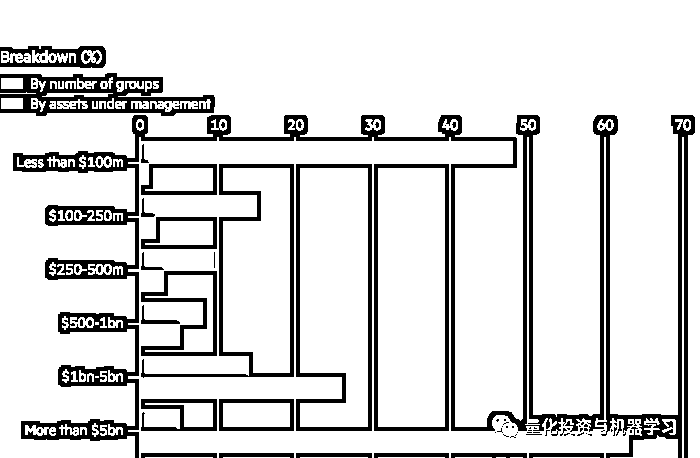
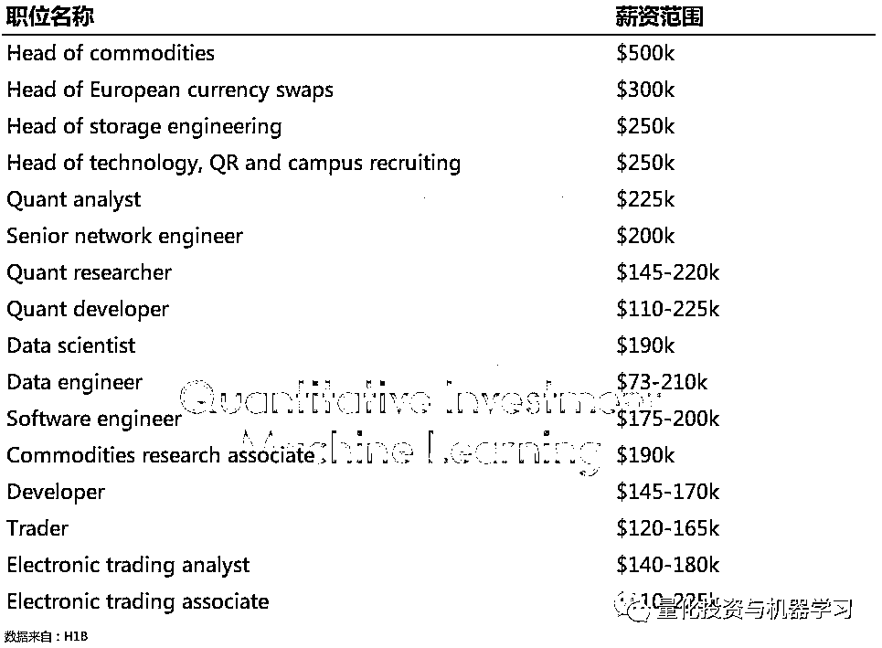

# 对话 Man Group：对冲基金的达尔文式竞争

> 原文：[`mp.weixin.qq.com/s?__biz=MzAxNTc0Mjg0Mg==&mid=2653301348&idx=1&sn=47b148ea4d9f33ab50bfbbceb8421580&chksm=802de871b75a616731d5674eaa4141fcff3d338508586eea3240a1eac4399c16dbc5d69c20ee&scene=27#wechat_redirect`](http://mp.weixin.qq.com/s?__biz=MzAxNTc0Mjg0Mg==&mid=2653301348&idx=1&sn=47b148ea4d9f33ab50bfbbceb8421580&chksm=802de871b75a616731d5674eaa4141fcff3d338508586eea3240a1eac4399c16dbc5d69c20ee&scene=27#wechat_redirect)

标星★**置顶**公众号     爱你们♥   

量化投资与机器学习编辑部独家报道

**近期疫情又有反弹态势，大家要带好口罩，保护好自己！**

如果你对算法交易，对冲基金，大数据感兴趣，那么，今天的推文你一定会感兴趣。Man Group 首席执行官 Luke Ellis 做客《Masters in Business》进行了 3 个多小时的对话访谈。

*图片来自：网络

Luke Ellis 表示：

**随着研发费用（技术）和人力成本（人才）方面的上升****，对冲基金正处于一场达尔文式的竞争中。这个行业已经成为了****赢家通吃****的竞争，只留下了有少数明星机构和大批失败者。**

**Man Group 是全球顶尖的对冲基金之一，专注于主动管理投资，**AUM 达 1042 亿美**。**

****

**下面就让我们看看本次访谈最精彩的部分吧！同时，公众号也会在文章中间，插入一下独家解读。**

****▍看点一****

**Ellis 在访谈中说道，童年时对赛马和扑克的热爱让他改变了对风险的看法；赌博和投资的统计模式非常相似。**

**---**

****▍看点二****

****问题：****对于一个刚刚毕业想从事量化投资的大学生来说，你会给他们什么样的建议呢? ****

****花点时间学习 Python**。**

**如果你可以对现有的工作有深刻的理解，你就不必从头到尾造轮子，抓住核心是关键。**

**** 

****我认为这是非常重要的，因为 Man Group 的员工已经掌握了 52 种不同的第一语言，****第二大语言是汉语，****666********

**所以，如果我们有 1400 名员工，其中 1000 人的第一语言可能是英语，150 人的第一语言可能是汉语。但我们有大约 600 人用 Python 编程。因此，Python 正变得越来越普及，我认为对于任何对这类领域感兴趣的人来说，这是一个必须要掌握的东西。**

**关于 Python，公众号报道过无数次，真的太火了，大势所趋吧！** 

**据英国《金融时报》报道，今年摩根大通已经开始要求其资产管理部门的所有员工参加强制性编程课程学习。目前该集团的分析师和员工中，有 1/3 已经接受过 Python 编程培训，而数据科学和机器学习课程也在制定之中。*****图片来自：Financial Times****摩根大通资管经理 Mary Callahan Erodes 表示“**现代资产管理的唯一语言是编程语言**”。因为强制普及编程语言，现在<ai type="7" parm="{}" style="caret-color: rgb(51, 51, 51);font-family: -apple-system-font, BlinkMacSystemFont, &quot;Helvetica Neue&quot;, &quot;PingFang SC&quot;, &quot;Hiragino Sans GB&quot;, &quot;Microsoft YaHei UI&quot;, &quot;Microsoft YaHei&quot;, Arial, sans-serif;letter-spacing: 0.544px;text-size-adjust: auto;">摩根大通</ai>的资管部门员工可以和科技部门一样使用编程语言，这样有助于开发更好的理财产品服务客户。**

**高盛发布了一份调查报告中显示：针对全球 2500 名在高盛的夏季实习生调查， 当问到你认为“哪个语言在未来会更重要”时，在被调查的全球 2500 名 80、90 后优秀年轻人中，**72%选了 Python**。** 

****

***报告来自：高盛**

**同时，根据彭博报道：花旗希望分析师将 Python 语言加入简历：** 

**** 

***图片来自：彭博**

**金融公司已经转向数字工具来帮助削减成本，提高交易和投行收入。**他们越来越重视良好的编程技能，其重视程度几乎与精英商学院的金融学位不相上下。****

**拿英国来做具体分析，我们对 2019 年 9 月和 2019 年 5 月在英国各大投行网站上发布的工作岗位进行了分析。在这两个时期**Java 和 Python 主导**了招聘列表，C++，Javascript 和 C#紧随其后。** 

****

***图片来自：公众号自制**

**另一个我经常告诉人们的是，**不要因为这是你认为能赚最多钱的岗位而去选择一份工作，要根据你的兴趣去选择。**这样，你会欣然的接受狠多挑战，我从未见过任何人能够预测哪些工作应该是 10 年内最赚钱的工作。**

****如果你只是为了钱去做一件事，你永远不会成功！而如果你带着激情，带着兴趣去做一件事，你会做得很好！****

****试着让每件事都成为一个学习的经历：****

*   ****当你和某人交谈时，不是试图弄清楚他们出了什么问题，而是要了解他们所问你却不知道的。****

*   ****当你看到一个问题，试图找出你可以从中学到什么。****

**从长远来看，你会做得非常非常好！这也是公众号想告诉大家的：**

****很多人想转行量化，觉得高大上，能挣大钱，其实不然。难道学了 MFE 就一定要做 Quant？Quant 没有什么光环，请放下身段，选择适合自己的！****

**---**

****▍看点三****

****问题：****在过去的十多年里，很多对冲基金都面临着巨大的挑战。但 Man Group 为什么能够一直长青？****

****Ellis：**我认为很多行业都是随着科技的兴起逐步变强。而且现在的局面就是，强者变得更强，弱者苦苦挣扎。**对冲基金也是一个非常符合达尔文观点（优胜劣汰、适者生存）的行业。**全球大型的对冲基金公司实际上在过去 5 到 10 年间的表现一直都还不错，而且 AUM 不断扩大，以至于让他们创造更大的壁垒，从而创造了竞争优势，使得小型对冲基金更加难以进入这个圈子。**

****

***图片来自：公众号自制**

**从 AUM 来看，根据 preqian 的 2019 最新数据显示：*********图片来自：量化投资与机器学习公众号独家整理**

**根据 Aurum 的数据显示，今年 3 月，管理逾 50 亿美元资产的对冲基金亏损 6.2%。这在一定程度上超过了 AUM 在 20 亿至 50 亿美元、10 亿至 20 亿美元、5 亿至 10 亿美元或不超过 5 亿美元的基金表现。这意味着，在截至 4 月底，**AUM 最大的对冲基金是 5 个类别中唯一赚钱的。****

****

***图片来自：Aurum**

****Alpha 集中在那些有能力投资技术的人身上，那些有能力投资最优秀人才的人身上，而小的机构则被挤出去。****

**H1B 签证数据显示，Citadel 向其**交易主管**支付了**50 万美元**的薪酬。** 

**值得注意的是，**H1B 数字不包括奖金**，如果你是一明投资交易人员并能产生 Alpha 收益，那么，上面的数字是相当可观的。在许多情况下，基本工资只占总薪酬的一小部分。**

****

***图片来自：公众号自制**

**文艺复兴也是很多对冲基金中薪酬最高的机构之一。然而，值得注意的是，**工资并不是大多数人为西蒙斯工作的原因。真正的吸引力是他们向 Medallion 基金投资的机会**，该基金只对员工开放，自 1988 年成立以来，每年的回报率约为 40%。**

****

***图片来自：公众号自制**

**再比如**Point72 的研究院**：Point72 研究院招募和培训大学毕业生，以速成的培训方式将其培养成为多/空股票投资专业人士。在 12 个月的金融分析师课程期间，学院课程学员将花费 2500 多个小时的时间学习创建和完善金融模型，开展初级研究，策划股票建议，并有效地传递其理念。**

****

***图片来自：Point72**

**同时，一年一度的全球案例大赛让你有机会与你的团队一起向 Point72 展示你们的投资技巧。你还有机会将获得一次全额费用的旅行，向 Point72 的顶级投资专业人士展示你们的案例。还向竞赛获胜者颁发了超过**2.4 万美元的现金和奖品**。**

****

***图片来自：Point72**

**随着越来越多的大型对冲基金在亚洲的扩张，亚洲地区管理资产的增长速度超过了美国和英国，大家抢人才也是拼了:**

**近年来的新进入者包括 ExodusPoint Capital Management LP，Schonfeld Strategic Advisors LLC 和 Polymer Capital Management，Polymer Capital Management 由 Point72 前亚洲主管 Angus Wai 创立。该地区目前至少有八家大型对冲基金平台，规模是 2013 年的两倍，管理着全球总计 1000 亿美元的资金。Polymer 是从亚洲竞争对手那里挖来人才的公司之一，同时从从 Point72 和 Izzy Englander 旗下的 Millennium Management LLC 聘请了基金经理。**

**知情人士表示，随着对冲基金提高薪酬以吸引顶级候选人，亚洲的薪酬方案正在增加。求职者现在可以为其薪酬中的业绩部分争取到更有吸引力的条款。绩效部分通常占他们薪酬的大部分，并以投资产生的利润百分比来表示。**

**知情人士说：**

****如果计入业绩奖金，亚洲的****顶级基金经理****每年可以拿到****1500 万- 2000 万美元****；****

****初级基金经理****每年可以拿到****200 万- 300 万美元****。****

**通常在对冲基金的道路上，从初级分析师到完全成熟的投基金经理，可能需要 10 年以上的时间。这是一个漫长而不确定的回报期，**但像 Point72 这样的公司，却很愿意把资源投入到他们认为有巨大增长潜力的地方。****

**在国内，这样的事情正在发生在我们周围：**

****幻方萤火一号的建立**** 

**** 

**幻方也一直在努力招聘深度学习科学家，提供高达 200 万元的薪水，**这样的薪酬可以跻身市场最优厚薪酬**的前 20%****。**

****

***图片来自：幻方量化招聘** 

**还有像国内的九坤也做的不错！还有就是 WorldQuant···**

**回到访谈，Ellis 表示：但当你从整个行业的角度来看，实际上，它还是相当健康的。只是好的健康状况可能集中在前 500 名，前 100 名或者是前 20 名。**

**当然在国内，现阶段的格局还没有达到一种**寡头垄断阶段（马太效应）**，在走向这个过程中还存在不少变数。**

**哥伦比亚大学前计算机科学教授 David Shaw 创立的 D.E. Shaw 是量化对冲基金的先驱，他带领的计算机革命改变了整个金融业，通过全面的数据挖掘和分析进行“量化投资”是 D.E.Shaw 的投资特色。D.E. Shaw 最开始曾被人们视为一家古怪的公司，他们的第一个办公室在与人头窜动的华尔街相距甚远的破旧街区上，里面却安置了两台太阳微系统，这可是当时全世界运行速度最快、最精密的电脑系统，是极其罕见的高档货。** 

**那时虽然也有基金经理通过数学公式来捕捉微小的价差，但 David Shaw 通过数学、计算机，把交易水平提升到一个全新的层次。**“他们准备低价买入、持有、高价卖出。区别在于：你想要抓到什么。我们会使用计算机自动地大量做这种****事。” **David Shaw 曾对应聘者说。（此段来自新全球资产配置）**

****

***图片来源：网络**

**所以，还是回到技术上。只要你花时间并且确保它正在对的事。 那么，你就可以把 90%的时间投入到新的研究中（效率）。**

**比如**人工智能和机器学习**。**

**在 Man Group，**工程师设定参数：敞口上限、资产类别、波动性、交易成本等。合规和风险管理规则根植于金融体系的 DNA 中，防止它失控或违法，成为获利的快车道。这些约束设置了机器工作的边界。然后系统寻找模式，将人类看不到的数据连接起来。人工智能根据过去发生的事情做出有根据的预测，当机会对它有利时进行交易。****

**Man Group 对人工智能的研究是在牛津大学的一幢高楼里进行的。该公司的工程师、统计学家和程序员与研究算法、人工智能和相关进展如何应用到金融领域的学者和研究人员共享这个空间。这一名为 Oxford-Man Institute of Quantitative Finance 的合作伙伴关系最初获得了 Man Group1420 万美元的捐款。这个研究所很安静，人没惹你工作的一个核心重点是采用机器学习技术，这些技术是为图像识别等领域而创造的，而不是金融或贸易。对冲基金已经建立了自己的代码库——有些是由自己的人编写的，有些是从公开的数据库中改编的。Man Group 的首席科学家、牛津大学实验室的负责人 Anthony Ledford 表示，工程师们在开发新的人工智能技术时可以从中汲取经验。**

**对 Man Group 来说，全球的的投资者越来越相信他们把钱投向了技术。计算机驱动的量化基金是去年对冲基金行业中唯一增长的部分。其它利用人工智能的公司包括文艺复兴科技、Two Sigma 和桥水。据报道，美国亿万富翁投资者 Paul Tudor Jones 在经历了收益率低迷之后，正在采用部分技术。管理亿万富翁 Steven Cohen 财富的家族理财 Point72 也一直在聘请该领域的专家。**

****

***图片来自：彭博**

**下表给出了人工智能/机器学习对冲基金与其他几种基金的相关矩阵。依据该表，我们可以得出一个有趣的结论：人工智能/机器学习对冲基金与普通对冲基金之间为负相关关系（-0.267），而与 CTA/管理期货基金和趋势跟踪策略之间则为正相关关系，相关系数介于零和零点几之间。这表明，人工智能/机器学习对冲基金的分散投资可以使整个投资组合实现正收益。**

****

***图片来自：Eurekahedge2017**

**---**

****▍看点四****

****问题：****在第一季度市场大幅下跌的时候，Man Group 只有 11%的跌幅。许多对冲基金的表现要比这糟糕得多。你们是怎么做到这一点的？****

****Ellis：**Man Group 严谨的量化方法帮助公司度过了 3 月份的大跌。其 60%的投资用于对冲，40%用于多头。被对冲的部分表现十分出色。在今年第一季度，Man Group 的总收益率仅下降了 11%，降幅约为大盘的三分之一。**

**当你看第一季度的收益时，长期收益策略下降了，也就是说我们有一些不错的 Alpha 表现，但它们与市场成比例下降。实际上，我们的对冲基金策略在第一季度平均赚到了钱，但赚的不多。**

****我们花了很多时间和精力在****风险管理****上**，特别是这样一种强烈的信念，即：**如果你不喜欢某个头寸，不要试图找到一些复杂的对冲策略，放弃就好。**** 

**为了做到这一点，你必须在执行过程中花费大量的时间和精力（这里也是人才和技术的体现）。我们现在的系统能够很快识别错误的定位。以至于让我们在 3 月份就着手这些事情。**

**---**

****▍看点五****

****问题：**谈谈你作为 CEO。你负责投资吗？你是否负责投资者关系，管理日常业务？什么是最需要你注意的?**

****Ellis：**我把 10% 的时间在公司事务上，但我与股东相处的时间很少。把 0%的时间花在客户身上，10%的时间花在商业管理的其他方面。**

**我会花了很多时间在同事身上。我对市场有强烈的看法。随着时间的推移，我和不同的人在工作中谈论市场。但我不会影响任何人的投资过程。我花了很多时间让他们好好工作，确保他们在工作中快乐，确保那些遇到困难的人能得到帮助。**

****要确保那些做得很好的人不会骄傲自大**，狠狠地戳他们，这样他们就不会对你傲慢，因为我们会知道你的投资风格是什么，在不同的时刻，市场会喜欢你的投资风格，你看起来真的很聪明，但有时候市场会厌恶你的投资风格。**

**我的工作就是激励他们，因为归根结底，很多业务都与你的员工息息相关。**

**最后，Ellis 还推荐了几本他最喜欢看的书籍：**

********

**感谢各位读者的收看。最近北京的疫情有所升级，**所以大家要带好口罩。保护好自己！**** 

**量化投资与机器学习微信公众号，是业内垂直于**Quant、MFE、Fintech、AI、ML**等领域的**量化类主流自媒体。**公众号拥有来自**公募、私募、券商、期货、银行、保险资管、海外**等众多圈内**18W+**关注者。每日发布行业前沿研究成果和最新量化资讯。**

******你点的每个“在看”，都是对我们最大的鼓励**