# 推荐系统算法工程师培养计划

> 原文：[`mp.weixin.qq.com/s?__biz=MzAxNTc0Mjg0Mg==&mid=2653301215&idx=1&sn=7a189a572415c112f384fbafb2b84c17&chksm=802debcab75a62dce0035d440107973c1d5f2ae12a1b84080cf218c6e4a723519ad000e95034&scene=27#wechat_redirect`](http://mp.weixin.qq.com/s?__biz=MzAxNTc0Mjg0Mg==&mid=2653301215&idx=1&sn=7a189a572415c112f384fbafb2b84c17&chksm=802debcab75a62dce0035d440107973c1d5f2ae12a1b84080cf218c6e4a723519ad000e95034&scene=27#wechat_redirect)

由于近些年深度学习技术的飞速发展，大力加速推动了 AI 在互联网以及传统各个行业的商业化落地，其中，推荐系统、计算广告等领域彰显的尤为明显。由于推荐系统与提升用户量以及商业化变现有着密不可分的联系，各大公司都放出了众多推荐系统相关职位，且薪水不菲，目前发展势头很猛。

但是，这里存在几个问题，很多欲从事推荐系统的同学大多数学习的方式是自学，1、往往是学了很多的推荐算法模型，了解些推荐里常用的算法，如：协同过滤、FM、deepFM 等，但是却不清楚这些模型在工业界推荐系统中是如何串联、如何配合、有哪些坑，哪些 trick 的，导致无论面试还是真正去业界做推荐系统，都会被推荐领域的”老枪老炮“们一眼识别出小白属性。2、对于算法原理理解不深刻，这就会导致实际应用时不能很好地将模型的性能发挥出来，另外面试时对于大厂面试官的刨根问底，只能是眼睁睁的丢掉 offer。

CF、FM、DSSM、DeepFM 等这些推荐业界明星模型，你真的清楚他们的内部运行原理以及使用场景吗，逻辑回归为什么用 sigmoid 函数？有确切的理论推导吗？FM 模型与 SVM 有什么相似之处吗？FM 固然可以用作为打分模型，但它可以用来做 matching 吗，如果可以，如何做？item2Vec 模型在业界是如何缓解冷启动的问题的？双塔模型优势在哪？深度模型到底是如何做 matching 的，是离线计算好结果还是实时的对网络进行前向计算？DeepFM 具体实现时，wide 端和 deep 端的优化方式是一样的吗？基于 Graph 的推荐方法在业界的应用目前是怎样的？基于上述的目的，贪心学院一直坚持跑在技术的最前线，帮助大家不断地成长。

**为什么选择贪心学院的推荐系统训练营？**

首先，全网不可能找得到另外一门系统性的训练营具备如此的深度和广度，所以从内容的角度来讲是非常稀缺的内容。

其次，即便网络上的资源非常多，学习是需要成本的，而且越有深度的内容越难找到好的学习资源。如果一门课程帮助你清晰地梳理知识体系，而且把有深度的知识点脉络讲清楚，这就是节省最大的成本。

另外，作为一家专注在 AI 领域的教育科技公司，教研团队的实力在同行业可以算是非常顶尖的，这里不乏顶会的最佳论文作者、美国微软总部推荐系统负责人等大咖。

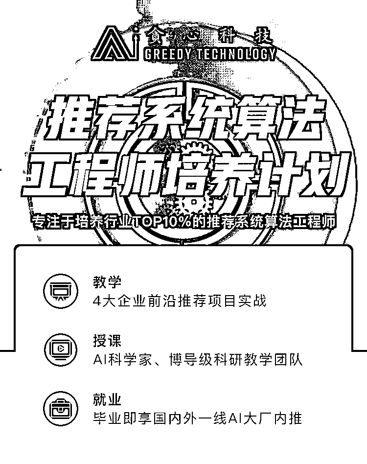

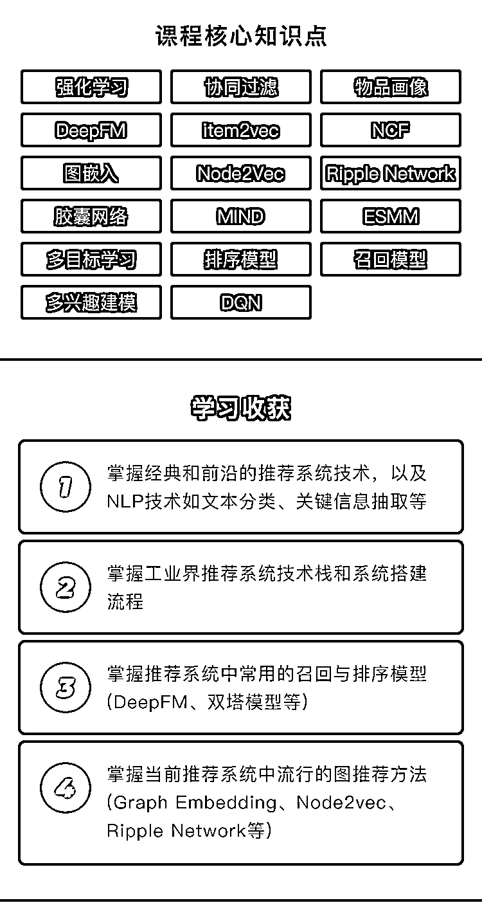

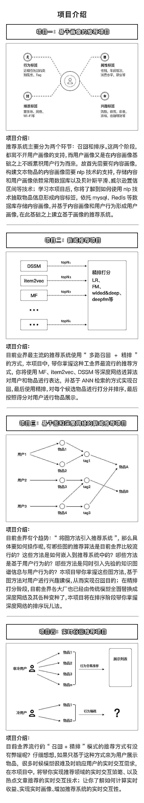

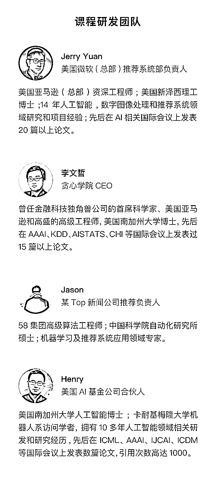

**《****推荐算法工程师培养计划****》****专注于培养行业 TOP10%的推荐算法工程师**

**对课程有意向的同学**

**添加课程顾问小姐姐微信**

**报名、课程咨询**

**👇👇👇**

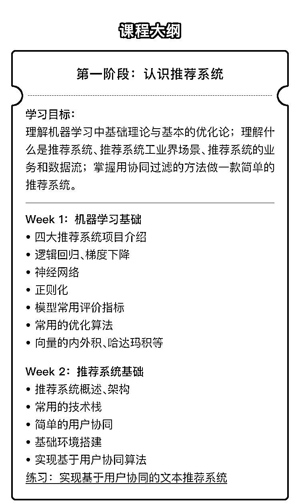

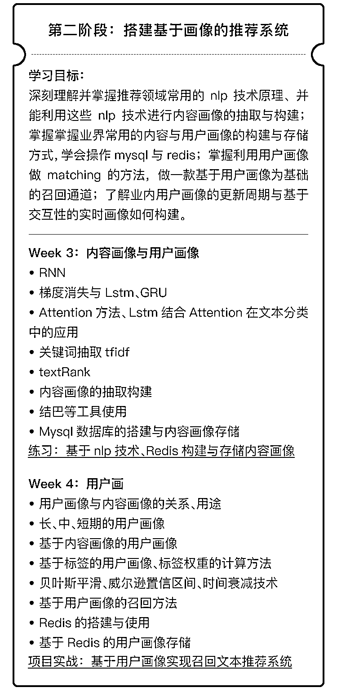

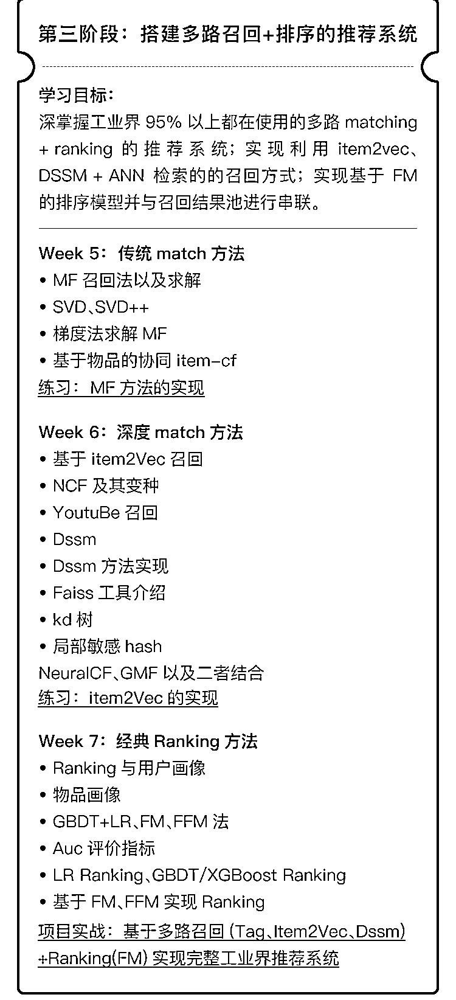

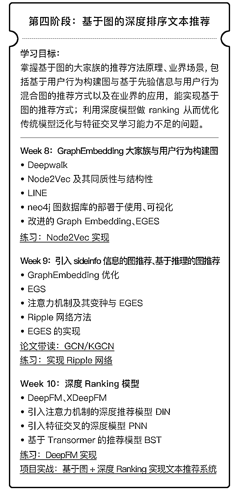

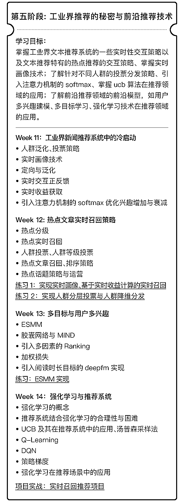

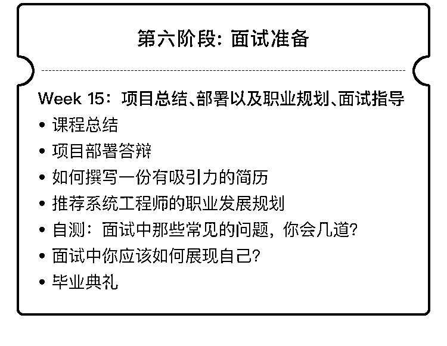

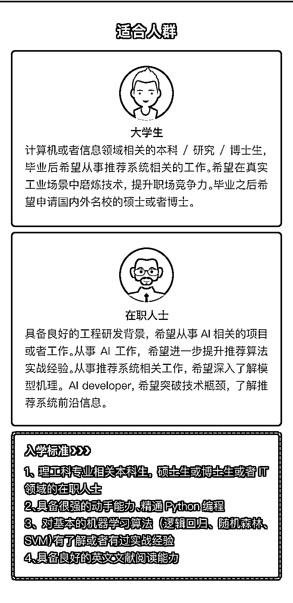

**《****推荐算法工程师培养计划****》****专注于培养行业 TOP10%的推荐算法工程师**

**对课程有意向的同学**

**添加课程顾问小姐姐微信**

**报名、课程咨询**

**👇👇👇**

