# 价值因子已死？争论与启示

> 原文：[`mp.weixin.qq.com/s?__biz=MzAxNTc0Mjg0Mg==&mid=2653301199&idx=1&sn=83d269c0b8bc8825e4a765a02de643cc&chksm=802debdab75a62cc4670e6db4beb8b71ea074cd53e4c506948a97e92a3aafd626fb67fda85e3&scene=27#wechat_redirect`](http://mp.weixin.qq.com/s?__biz=MzAxNTc0Mjg0Mg==&mid=2653301199&idx=1&sn=83d269c0b8bc8825e4a765a02de643cc&chksm=802debdab75a62cc4670e6db4beb8b71ea074cd53e4c506948a97e92a3aafd626fb67fda85e3&scene=27#wechat_redirect)

# 

***1*** 

**价值因子已死？**

**薛定谔的猫**

奥利地著名物理学家薛定谔提出过一个有趣思想实验。将一只猫关在装有少量镭和氰化物的密闭容器里，由于镭的衰变具有不确定性，如果发生了衰变，会触发机关打碎装有氰化物的瓶子，猫咪就会命丧黄泉；如果镭没有发生衰变，那么猫咪就会安然无恙。根据量子力学理论，由于放射性的镭处于衰变和没有衰变两种状态的叠加，猫就理应处于死猫和活猫的叠加状态。这只既死又活的猫就是所谓的“薛定谔的猫”。

当前美股市场的价值因子[1]，就是一只薛定谔的猫。

## **糟糕表现**

价值因子是因子投资的老队员，早在上世纪 70 年代和 80 年代，就有研究发现估值指标能够预测股票未来收益，Basu(1997)发现 pe[2] 和股票未来收益有关，Rosenberg et al.(1985)发现使用 pb 选股能带来超额收益。最广为人知当属 Fama and French(1992, 1993)，他们发现 pe、pb 和股息率在横截面上均具有解释能力，其中 pb 包含的信息最多，在此基础上将 HML 加入到定价模型，提出了经典的 Fama-French 三因子模型，风靡了几十年至今也没有过时。不仅如此，价值因子像幽灵一样无处不在，Asness et al.(2013)在多个资产类型中，均发现估值指标具有较好的效果，能获得正的超额收益和较高的夏普比率。

图 1 展示了美股价值因子 2000 以来的走势。可以看到，从 2006 年底开始，价值因子表现有点力不从心，呈现缓慢下跌态势，截止到 2020 年一季度，回撤已经超过 13 年；今年以来的新冠病毒疫情，更是让其雪上加霜，致使最大回撤超过了 50%。

**图 1 HML 表现**

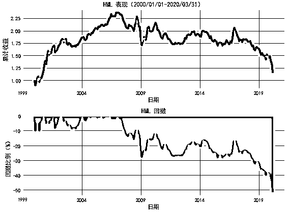

数据来源：Kenneth French 网站

图 2 展示了规模最大的 5 个价值类 ETF 和成长类 ETF[3] 2013 年来的走势。可以看到，价值类 ETF 大幅跑输标普 500 指数，尤其是 2020 年以来几近崩溃；相反，成长类 ETF 几乎都能跑赢标普 500 指数，风光一时赚足了眼球。

**图 2 价值和成长 ETF**

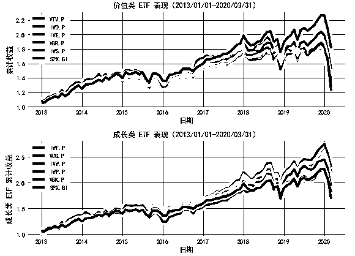

数据来源：wind

由于价值因子持续的萎靡，关于价值因子是否死的讨论越来越多，观点也分为两派：幸灾乐祸派和忧心愁愁派。前者可能避免了低估值股票的低迷，甚至搭上了科技股的快车，认为价值因子这么多年连指数都没有跑赢，价值因子已经过时了。尤其是不明真相的媒体，最喜欢用夸张的标题，报道价值投资已死。另一派别是因子投资的信徒，一直坚定不移地践行价值投资，面对持续萎靡不振，一方面忧心愁愁忍受来自客户的压力，另一方面不得不反思到底哪里出错了。

# 

***2***

**可能的原因？**

看热闹不嫌事大，反思才能进步。关于价值因子为什么如此凌乱不堪，目前业界和学界给出了各种各样的解释。每一种解释看起来都有几分道理，但总能够找出其中的破绽，没有一种解释能够完全让人心悦诚服。这也不奇怪，科学的研究方法是证伪，只有深入的研究才能增加信仰。

深入来看，对于价值因子的失效，大致存在 9 个解释，包括逻辑被破坏、因子过度拥挤、忽略无形资产、科技产业的兴起、大盘股在作妖、低利率环境、回购带来的扭曲、私有化减少了价值股和不用找理由等，下面进行具体阐述。

## **逻辑被破坏**

在评判一个因子时，最重要的标准就是存在逻辑性。如果没有底层逻辑，纯粹是数据拟合而来，样本内结果好得不得了，样本外立刻死翘翘。价值因子在不同国家和不同资产长期有效，表明价值因子不太可能是数据拟合的产物。

所有异象在解释价值因子的收益来源时，一般都会从两个角度入手：风险溢价和错误定价，价值因子也不例外。从风险的角度讲，Fama and French(1992, 1993) 认为价值因子的有效是因为承担了某种风险（如财务困境）的补偿；从错误定价的角度来看，Lakonishok et al.(1994) 则认为，由于投资者过度追求成长股，导致价值股被低估成长股被高估。

那么，就算是价值因子逻辑性很强，不排除它会一直很强，毕竟世界是变化的。如果发生了某种结构性变化，支撑逻辑发生了根本性改变，以前说服力很强的解释现在说不通了，价值因子也就失效了。Israel et al.(2020) 对此进行了反驳，虽然错误定价可以通过套利减缓甚至消除，但是风险溢价将会长期存在。因此，投资逻辑其实没变，价值因子表现失利可能另有别因。

## **知道的人多**

## 如果一个策略知道的人多了，是不是就容易失效？这个问题的经典回答当属 McLean and Pontiff(2016)。如果一个异象的来源是投资者的行为偏差，那么聪明的投资者就会积极地利用这种错误定价，只要套利限制不是很大就有利可图，直到异象消失。McLean and Pontiff(2016)研究了 97 个因子，发现相比于发表前，因子的发表会导致收益下降 32%。

因此，价值因子失效的可能原因是，由于价值因子在学术上和实践上，均获得了巨大成功，吸引了大量资金涌入，造成其过度拥挤，从而推高了价值股使得其变得昂贵。如果这一推断成立，那么价值因子未来的表现依然不容乐观。

Arnott et al.(2020) 发现事实并非如此，低估值没有被资金推高，反而高估值股票变得越来越贵。Israel et al.(2020) 的分析更加详实，如果资金涌入负主要责任，那么势必会使得估值价差[4]缩小，即低估值更加贵高估值更加便宜。实际情况却相反，如图 3 所示，估值价差近年来呈扩大走势，低估值的股票相对高估值的股票越来越便宜，资金并没有追逐低估值股票，而是追逐了高估值的股票。上面的反驳还不过瘾，最后还补了一刀，之前有研究（Green et al., 2011）认为应计异象消失了，原因也是知道的人多了；之后的故事却反转了，应计异象 2010 年代表现还不错，真是杀人又诛心。

**图 3 价值因子的 value spread**

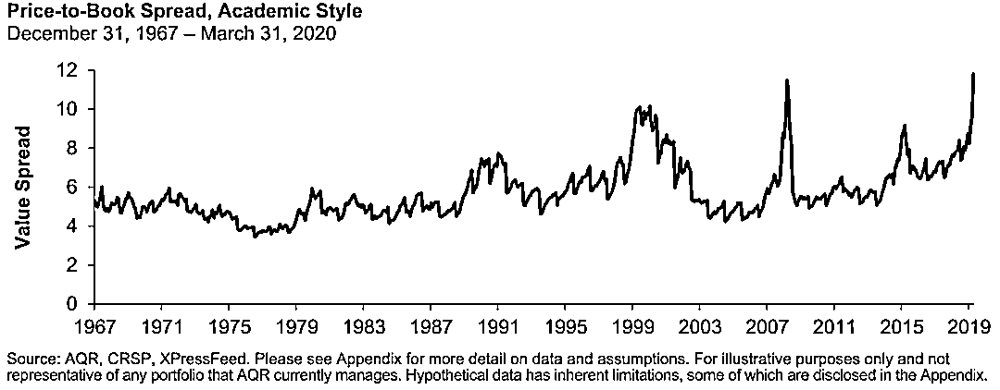图片来源：Asness(2020)

关于价值因子是否真的便宜，Lev and Srivastava(2019)有不同的看法。首先，低估值组合和高估值组合 PB 中位数之差并未处于历史极端水平，没有证据表明高估值股票贵的离谱、低估值股票便宜得不行；其次，只要低估值股票基本面有改善，或者高估值股票基本面恶化，都可能导致价值因子起死回生，但短期看不到这样的迹象。

**无形资产**

Lev and Srivastava(2019)认为，以 pb 为基础的价值因子之所以表现不好，是因为新经济时代保守的会计准则存在缺陷。

1990 年之前，经济结构还比较传统，公司投资主要集中在有形资产，即土地、厂房和设备等，在会计处理上也以资本化处理为主，因此净资产相对来说能度量公司的内在价值。1990 年以来，越来越多的新兴产业产生，不同于传统行业，这些新兴公司在研发、广告、软件、商标和人力资源等方向进行了大量投入，根据保守的会计处理原则，这些投入大多进行了费用化处理，问题就出在这个地方。

这些无形资产投资大行其道，不仅仅影响当前的营收、利润和现金流，和公司未来的发展也紧密相连。以医药行业的研发为例，在产品成功面世之前，需要长期持续不断的投入，这些都不能产生当期的利润；但是将时间拉长了看，那些研发管线丰富，研究投入较多的公司，能够为未来的爆发打好基础。因此，和未来利润增长有关的无形资产投入，也可以看做是净资产的一部分；将所有无形资产的投入进行费用化处理并不恰当，过于保守导致净利润和净资产被低估，从而 pb 和 pe 被高估。

为了应对会计准则的缺陷，Lev and Srivastava(2019)对已有的 pb 指标进行了改进，对所有公司的全部研发开支和一部分销售管理费用作了资本化处理[5]。结果表明，使用调整后的 pb，在最近几年使大约 40%-60%股票分组发生了变化；在 1970 年到 2018 年的大多数年份，调整后 pb 表现更好，能实现更高的多空收益率；在 90 年代，原始 pb 表现相当差劲，低估值股票最终跑输了高估值股票，但是调整后的 pb 改善明显，低估值股票大幅跑赢高估值；即使在最近 10 年，调整后的 pb 多空收益也依然有效，只是改善程度不是很惊艳。这些结果表明，考虑了无形资产后的 pb，能有效改善原始指标的效果。

除了 Lev and Srivastava(2019)之外，Park(2019)、Liu et al.(2019)、Amenc et al.(2020)以及 Arnott et al.(2020)也讨论了无形资产对 pb 的改进。基本结论都一样，如图 4 所示，无形资产调整的 pb 能在一定程度上改进原始 pb 的效果，遗憾的是并不完美，不能完全解决过去 10-12 年价值因子的困窘。

**图 4 传统 HML 和无形资产调整 HML**

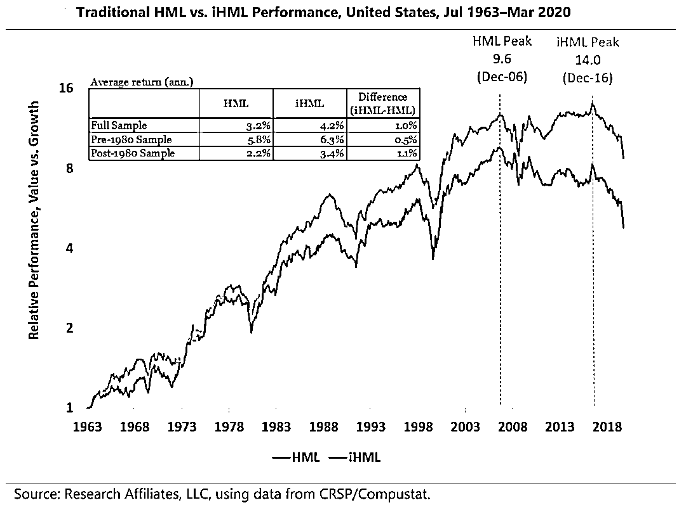

图片来源：Arnott et al.(2020)

Israel et al.(2020)不是很认可上述改进，原因有三。第一，早在 1970 年代，当研发投入可以被费用化，就有类似的批评出现，但之后 pb 依然长期表现卓越。第二，假如原始 pb 存在这一问题，那么通过行业中性化在一定程度上可以降低甚至消除这一问题，因为不同行业的无形资产投入相似。然而考虑行业无形资产差异性后的 pb，并没有带来明显的提升，因此无形资产的批评并不合理。最后，使用 Credit Suisse HOLT 的调整 CF/EV 数据，也没有看到它和其他普通的估值指标有啥区别，表明无形资产角度难以解释和改善传统的估值指标。

## **新经济时代**

过去 20 年，以 FANMAG 为代表的高新科技公司成长壮大，取得了巨大的成功，同时对传统的实体经济带来了较大的冲击，图 5 对比了标普 500 指数和 FANMAG 走势。截止到 2020 年 3 月末，FANMAG 总市值达到 4.59 万亿美元[6]。在技术革命的存在下，新技术领袖可以获得巨大的垄断利润，而传统的实体价值公司则被扼杀在无关紧要的境地。因此，从表象来看，价值因子表现萎靡，是由于传统行业拖后腿、科技行业大爆发引起的。

**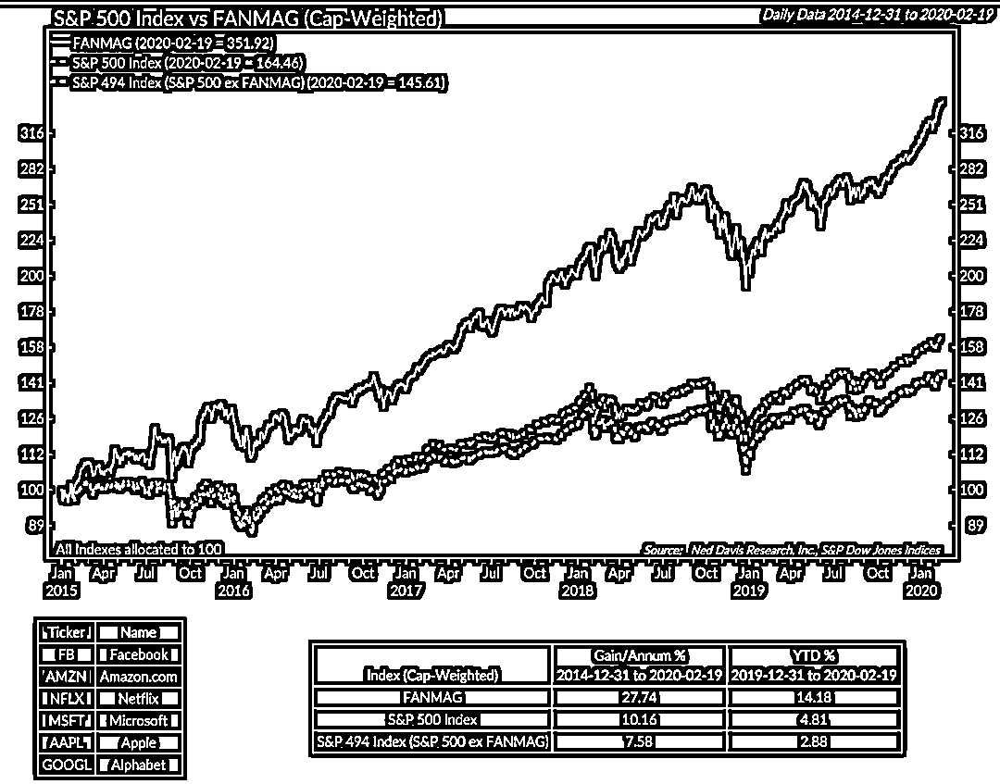**

图 5 标普 500 指数和 FANMAG

Brown(2020)分析了 2019 年和 2020 年初为什么价值指数 STOXX USA 900 Ax Value 跑输基准，从持仓的角度来看，主要是超配了传统行业股票（如福特、飞利浦和通用汽车），低配了科技股（如苹果、亚马逊、微软）。

MSCI 的 Rao and Gupta(2019)也写了一篇博客文章，主要解释了为什么美国价值指数跑输了市场宽基指数。由于价值指数低配了科技行业，而科技行业是近年来表现最为亮眼的行业，因此明显跑输了宽基指数。进一步分析可知，科技行业在盈利因子和成长因子上有明显的暴露，表明这类公司增长强劲并且盈利能力较强；相反，在 bp 和 ep 等价值因子上暴露为负，表明这些公司估值往往较高。按照构建规则，价值指数会超配低 pb 和 pe 的公司，低配高 pb 和 pe 的公司，这拖累了价值指数的业绩。

为什么传统行业和新兴行业表现差异这么大，Lev and Srivastava(2019)给出了更加深入的分析。

首先，2008 年国际金融危机对银行、零售、保险、批发和公用事业造成了长久影响，这些行业构成了 50%~60%的大盘价值股。在银行贷款长期收缩和消费者需求下降的共同作用下，低估值公司业绩和估值提升压力较大，长期保持在低估值水平，直接导致了低估值策略的失效。

其次，2008 金融危机后，以商业服务(主要是软件)、制药(包括生物技术)和电子为代表的新兴科技产业，拥有丰富的专利积累和强大的品牌保护，保证了持续稳定的盈利和增长。较高的进入壁垒让这些公司长期维持在高估值水平，因此，卖空这些股票进一步拉了价值因子的后腿。

总结上面低估值股票的困窘和高估值股票的风光，就刻画出了价值因 2007 年以来失败的原因。大多数低估值因子集中在传统行业，深受金融危机的泥潭，要想走出低估值困境，需要大量的无形资产投入或者重构商业模式，在融资困难和需求下降的打击下，心有余而力不足。相比之下，高估值股票更多是新兴产业，商业模型更多地依赖于无形资产，这种模式能够使企业长久经营并获得高收益。因此，在 2007 年开始，通过做多低估值做空高估值，两边被打脸。

## **大盘股作怪**

简单回顾一下，Fama and French(1993)在构建 HML 时，给与大盘股和小盘股同样的权重，即超配了小盘股，这为价值因子失效提供了另一个解释。已有的研究表明，pb 指标在大盘股中效果会被打折扣，如表 1 所示，在小盘股中价值因子市场调整年均收益率 5.5%，而在大盘股中为 1.7%，因此价值因子失效可能是大盘股作怪导致的。

**表 1 大盘股 HML 和小盘股 HML**

**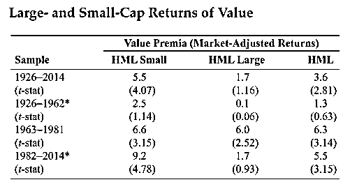**

图片来源：Asness et al.(2015)

Israel et al.(2020)也坦率地承认，pb 在大市值股票中确实表现不尽人意，但这只是大象的一面，因为这些研究清一色的使用了 pb 作为价值因子指标。一般来说，大市值的公司更加成熟，盈利稳定，现金流充沛，用 pe 和 pcf 估值更加合理；相反，pb 更加适用于盈利增长预期较高且增长具有较大不确定性的股票，这类公司往往也是小盘股。因此，在实际衡量估值的相对高低时，使用 pb、pe 和 pcf 等多个指标构建综合估值因子，能够尽量规避单一指标的缺陷，有助于提升估值指标的表现。

Miller(2019)的分析更进了一步。pb 指标衡量估值水平高低存在诸多缺陷，其中一个重要的点就是不适合在大盘股中。由于 pe 在大盘股和小盘股中没有什么差异，因此是 pb 的一个较好补充。测试结果表明，虽然 pe 最近 10 年比 pb 表现更好，但基于 pe 构造的价值因子依然没有走出价值泥沼，因此大盘股作怪这个解释说不过去。

## **低利率环境**

由于 2010 年代低利率环境，不禁让人遐想，价值因子失效的原始难道不成是低利率。这一想法并不是没有依据，以往的研究表明利率和价值因子存在关联。首先，价值股久期较短，成长股久期较长，这样 long/short 策略久期为负，那么当利率下行时，不利于价值因子的表现。其次，价值股对短期利率比较敏感，因为价值股的短期债务较多；成长股对长期利率比较敏感，因为成长股的长期债务较多。因此收益率曲线变得更平时，有利于成长股不利于价值股。

Maloney and Moskowitz(2020)对上面的猜想进行了详实的分析，见表 2。首先，从理论上进行推导，发现价值因子和利率之间的关系比较复杂，并没有一个清晰的关系。其次，检验价值因子和同期（以及滞后期）利率变量之间的关联，发现两者之间的关系非常脆弱和不稳定，不同的利率变量、不同的估值指标、不同的样本区间以及不同的市场会得出不一样的结果。因此，从低利率环境角度解释价值因子失效，并没有强有力的证据。

**表 2 价值因子和利率变量    **

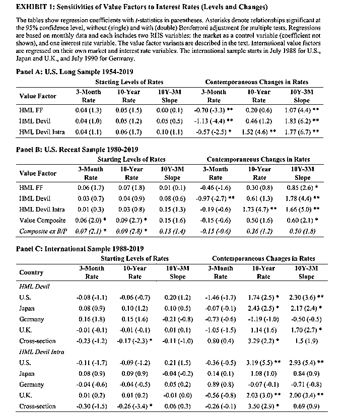数据来源：Maloney and Moskowitz(2020)

## **大规模回购**

增发和回购是改变总股本的常见方式，有一种观点认为，近年来持续不断的回购是价值因子失效的重要原因，这一观点的代表是 Meredith(2016)和 Fairchild(2018)。

一方面，很多公司通过发债的方式进行回购，导致净资产为负，典型的如星巴克和麦当劳。按照传统的投资流程，净资产为负的股票会被纳入黑名单，在组合构建的第一步就会被剔除。根据 Fairchild(2018)的统计，从 1993 年到 2017 年，账面价值为负值的公司有 57%的表现优于大盘，因此回购导致净资产为负，会导致投资范围错失掉一波优秀的公司。另一方面，就算净资产不为负，大规模回购也会降低净资产，导致 pb 指标的含义被扭曲，把一些优秀的公司被错误地划分为高估值股票。

虽然上面的观点看起来有几分道理，但 Israel et al.(2020)觉得压根儿站不住脚。首先，净资产为负的股票毕竟是少数，大约占比 2%，不足以影响整个价值因子的表现。其次，将股票分为高回购和低回购两组，如表 3 所示，并没发现 pb 在高回购组表现更差。因此得出结论，大规模回购不应该背锅。

**表 3 价值因子和回购分组**

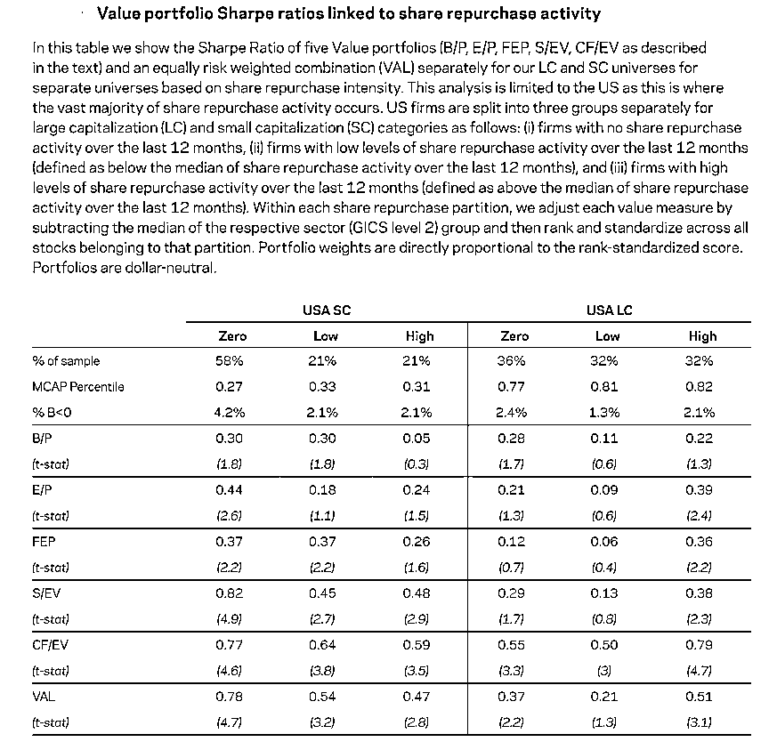

图片来源：Israel et al.(2020)

## **公司私有化**

这一观点出现在 Arnott et al.(2020)，逻辑是这样的，投资者买入严重被低估的公司，然后进行私有化退市，这样就减少了价值股数量和机会。Arnott et al.(2020)觉得这个推断压根儿没有道理，在退市之前，私有化的买入会推高股票价格，其实有利于价值股的表现，因此这一观点说服力很低。

## 2.9 太正常不过

最后一种解释比较淡然，认为目前价值因子回撤再正常不过，在以前又不是没有发生过，在历史的洪流中不属于例外，只是持续时间长了一点而已，不必惊慌也不要紧张。

Swedroe(2018)认为，虽然价值因子已经失效了 10 年，其基本逻辑并没有发生改。唯一的解释就是，在历史的长河中，10 年并不算长，持续这么久是随机事件，一切都是运气不好，只要耐心等待终究会收获价值风险溢价。正如巴菲特老人家所言，成功的投资需要的不是智力而是耐心[7]。

Israel et al.(2020)在分析并反驳了几个常见的解释之后，得出如下结论。价值因子有效的前提是价格和基本面匹配，两者不可能出现长期的偏离。当价格相对基本面过低或者过高，则会出现均值回归，这就是价值因子的运行机理。通过将收益进行分解，可以发现最近几年价格和基本面关联在变弱，价格并没有完全反映基本面，这也是最近几年价值因子表现不好的原因。不过这属于正常现象，并不是最近几年特有的，以前也出现过，例如 2000 年左右互联网泡沫时期，以后也还是会发生。也就是说，价值因子最近些年表现不好是周期性现象，任何因子都不是一直有效，只要逻辑没有发生根本性改变，长期持有并坚持即可。

Meredith(2019)则从科技革命的历史视角，剖析了为什么价值因子会阶段性失效。大多数人关注的历史太短，导致简单地得出价值已死的结论。如果将历史拉长，可以看到 1926 年至 1941 年也出现了类似的情况，价值股持续跑输成长股。不同的是，1926 年这一次价值股主要是公共事业股和铁路，成长股主要是制造业（例如通用汽车和通用电气等）；2007 年来这一次价值股主要是金融和公共事业，成长股主要是科技行业股票。从历史上来看，科技创新革命一般分为两个阶段：初始准备期和高速发展期，前者为新技术的萌芽、产生和初步应用阶段，后者为大规模应用的爆发阶段。两者的转折点，就是价值因子持续失效的时候，成长股持续占优，直到进入下一阶段。

# 

***3***

**有哪些启示**

资本市场只要出现高关注度的涨跌，就会有不同的声音进行解释。上面汇总了 9 个观点，用来解释为什么价值因子近年来表现持续差劲，有的观点比较淡然，有的观点比较隐忧，有的让人无法反驳，也有的明显没有道理。尽管存在多种想法和实证，但还是找不到一个完全心悦诚服的答案。

本文的目的也不是为了获得某个确定的结论，金融市场的特性就是充满了不确定性。如图 6 所示，在 A 股市场，自从 2017 年低估值股票风光了一把后，2019 年开始就陷入了无尽的凄凉；相反，成长股这几年始终保持着进攻性，在赚钱的路上勇往直前。虽然不清楚 A 股风格确切的走向，但是通过美股的梳理，确实也能获得一些“重要性的感受”。

**图 6 中证 800 价值指数和成长指数累计超额收益**

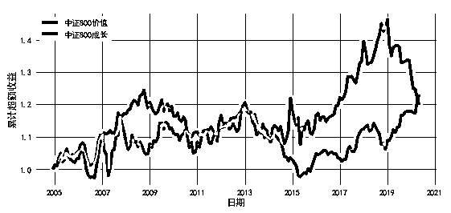

数据来源：wind

## **历史是一面镜子**

以铜为鉴，可以正衣冠；以人为鉴，可以明得失；以史为鉴，可以知兴替。金融分析师在大坦阔论时，最常用的方法之一就是在历史上找到相似的情形。基本假设就是，历史会重复发生，通过分析历史上类似事件的前因后果，可以用来推断未来的演绎方向。

从价值因子的历史长河中，兴许能得到一些启发。Fama and French(1993)的数据集从 1926 年开始，这也是大多数价值因子研究的起点；有很多看得更短的，只看最近 20 年。Samonov(2020)将数据进行了拓展，构建了一个具有 200 年历史的价值因子。为了构建这个长期价值因子，用了三段数据集，起始日为 1826 年，结束日为 2020 年。多头和空头超额收益见图 7，多空组合见图 8，价值因子回撤见图 9。

**图 7 长期价值因子多头和空头超额收益**

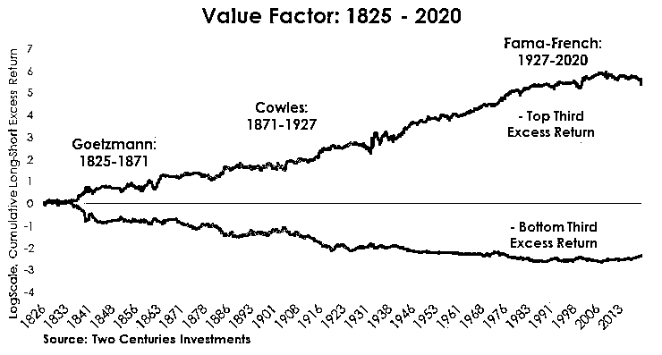

图片来源：Samonov(2020)

**图 8 长期价值因子**

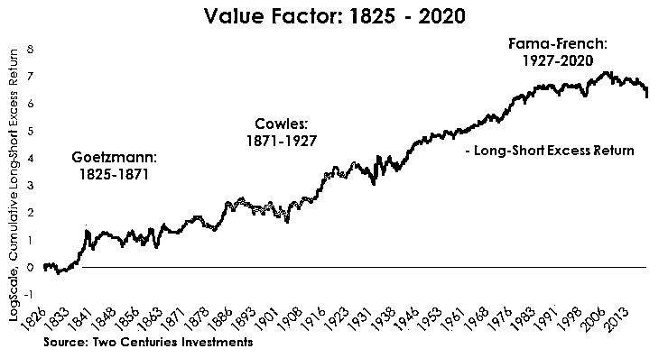

图片来源：Samonov(2020)

**图 9 长期价值因子回撤**

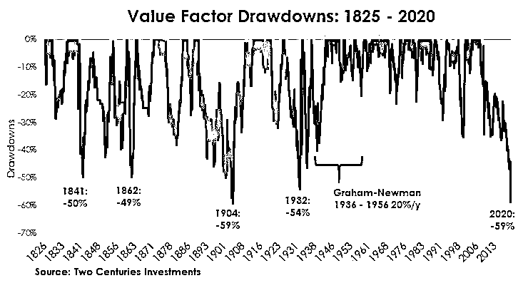

图片来源：Samonov(2020)

基于上述数据，Samonov(2020)得到了 5 个结论，非常值得借鉴。第一，2020 年价值因子最大回撤达到-59%，这在 200 年的数据中出现了至少 4 次，属于少见但确实存在的现象。第二，如果没有漫长历史的帮助，在当前的下跌之前，投资者可能会把价值投资误认为是安全的。也就是说，较短的历史数据容易给人错误的判断，较长的数据让历史更加清晰完整。第三，1940 年至 2006 年是价值因子表现最为顺畅的区间，成就了巴菲特在内的大量价值投资大师，但从 2006 年开始，噩梦就开始了，巴菲特的表现也开始一蹶不振。第四，所有 2332 个月中，只有 266 个月没有处于回撤之中；但是从累计收益来看，不会在意这些回撤。第五，站在当前，价值投资已经回撤历史最大水平，如若相信价值因子依然有效，那么价值因子很快会再次大放光芒。

## **择时没那么简单**

大师们常说，投资的诀窍无非 6 个字“低买高卖”，这个诀窍对于因子投资也一样。如果具有某种特异功能，在因子爆发之前买入，在因子困境之前逃出，那么就不会陷入“价值投资已死”的迷思了。这就是择时的魅力，前赴后继的研究员为之倾心。理想很丰满，成为先知几乎不可能，只能通过各种技术方法尽量逼近完美预测，这些预测技术包括因子动量、因子估值、因子波动、市场状态和宏观环境等。

择时是否有效，目前存在较大争议，拥泵者认为前途一片光明，反对者认为此路完全不通。以 value spread 为例，争论主要分为两个阵营：以 AQR Asness 为代表的悲观派和以 Research Affiliate Arnott 为代表的乐观派。前者观点比较保守，认为因子择时几乎是在做无用功，最好的方式还是选择有效的因子，忽略短期波动坚持长期分散化配置；后者则比较看好 value spread，不仅认为其具有预测能力，还通过构造择时策略说明因子估值择时确实可行。更多讨论，可以见刀疤连(2018)的介绍，非常精彩。

无论乐观还是悲观，有一个基本结论是：择时没那么简单。事实上，早在 2019 年 11 月，AQR 的 Asness(2019)就通过各种版本的 value spread 分析，认为当时价值因子已经处于极端便宜水平。虽然 AQR 之前的研究认为因子择时很难，但 Asness 还是认为从中长期看，可以适当地超配价值因子了。抄底的后果就是，2020 年价值因子进一步崩溃，这也是前段时间被 Taleb 手撕的地方之一[8]。

## 3.3 分散是免费午餐

在投资领域，常常听到的一句话是，投资没有捷径，分散才是免费的午餐。在衡量股票的估值水平高低时，人们习惯了用 pb 或 pe，这样的好处是简单直接，缺点就是过于依赖于单一指标。改进的方向就是同时考虑多个指标，这些指标既包括同一类型不同计算方式的估值指标，又包括不同类型的风格指标。

不同估值指标关注点存在差异，如 pe 侧重盈利，pb 侧重净资产，pcf 侧重现金流，将这些相似但又各异的指标进行结合，能有效提升价值因子的表现。Rabener(2018)比较了 pb、pe、pcf 和 ev-to-ebit 四个指标在美国、欧洲以及日本市场的表现，如图 10 所示。结果表明，2000 年以来，pb 在美国和欧洲表现最差，但在日本表现最好；将四个指标合成一个综合估值指标，能够克服单一指标的缺陷，效果往往更好，三个市场均能有效战胜宽基指数。

**图 10 不同估值指标比较**

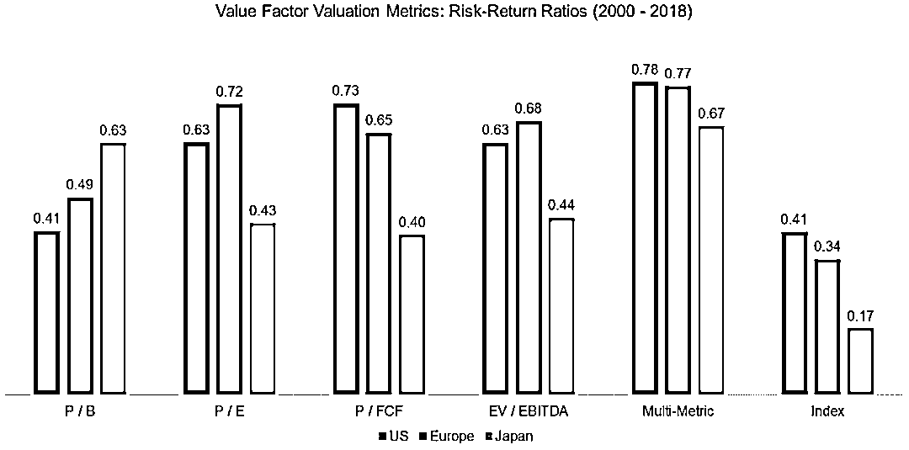

图片来源：Rabener(2018)

不同类型的因子和价值因子相关性低，典型的如质量和动量，结合在一起能实现一加一大于二的效果。

Kok et al.(2017)发现，基于简单价值指标识别出的“价值”股可能只是由于会计数字膨胀产生“价值”。这种虚假的价值股，其价值指标也会出现价值回归，但该现象更多来源于迟滞财务指标的恶化，而不是由价格上升驱动。加入动量指标，能改善价值指标的效果。具体来说，相比于弱动量价值股，强动量价值股财务恶化现象大幅减少甚至消失，此时由价格上升驱动的价值指标回归占比扩大。因此，在结合动量指标后，能够淘汰一些由于对已恶化业务的延迟会计处理而使基础指标暂时膨胀的股票，从而提升识别出低价股的能力。

除了动量外，公司质量也是价值因子的常见伴侣，刀疤连(2020)对此有详尽讨论。纯粹用估值指标选出来的价值股，容易陷入低估值陷阱；引入基本面信息，包括盈利能力、成长能力和财务安全等，能对价值股进行一道过滤，只有基本面好并且估值不贵的公司，才能进入目标组合。刀疤连(2020)利用 F-SCORE 衡量公司质量，pb 衡量估值高低，在 A 股市场进行了测试，结果如图 11 所示。可以看到，基本面最好估值最低的组合，具有绝对优势，等权重下夏普比率超过 0.7，市值加权下夏普比率超过 0.6。

**图 11 F-SCORE 和 pb**

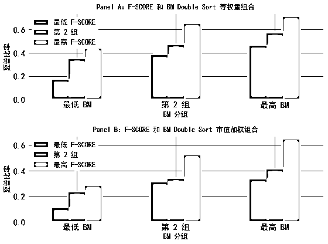

图片来源：刀疤连(2020)

## **细节和与时俱进**

在讨论价值因子为什么失效时，有一个广为传播的原因：新经济规模的壮大导致会计准则无法准确反映净资产。这也给了我们一个启发，在计算因子指标的时候，在逻辑合理的情形下，可以对已有指标进行重构。以 pb 为例，搞事情小组(2019)在 A 股测试了 8 个版本的 pb 指标，如表 4 所示。可以看到，虽然传统的 pb 指标在 A 股表现尚可，但是考虑了研发费用和广告支出等无形资产后，pb 的信息含量有明显提升。

**表 4 8 个不同类型的 pb**

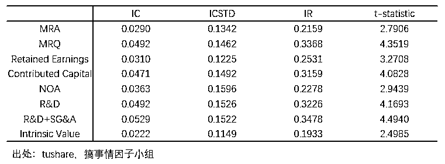

数据来源：搞事情小组(2019)

## **唯有时间和信仰**

在做因子研究时，时间越长结论越可靠。例如，Ilmanen et al.(2019)将数据长度进行了拓展，在尽量长的样本里测试了 4 个因子（价值、动量、利差和防御）在 6 个资产类型中的表现。主要结论有三：因子溢价长期存在；套利活动没有侵蚀掉因子收益；因子择时非常困难。既然因子溢价长期存在，策略又不容易失效，择时又没有多大用，那么长期持有不就可以了。要是这么简单，就不会有这么多质疑价值因子的声音了。

 一方面，只要数据可靠易得，研究回溯到一万年前都没有问题。投资者的生命有限，耐心更是稀缺，一年就是长久，三年就是一辈子，面对动辄好几年的低迷，一般人难以不动摇，这是人之常情。

另一方面，投资者会面临相对偏差（relativism），喜欢和人进行比较。要是都是亏损，亏得比较少就会比较开心；要是都是盈利，获利少一些就会有些失落。和成长、动量甚至宽基指数相比，持有价值指数的投资者难免有些心塞，时间一久便会心生失落和怀疑。

# 

***4***

**结尾**

本文围绕“价值投资已死”这个话题，回顾了美股市场价值因子历史表现，梳理了各种各样的争论和解释，由此思考了这些讨论带来的启发。投资获利取决于三个要素：本金、策略和时间。选择几个长期可靠的因子，低成本地进行复制和跟踪，剩下的交给时间和信仰。

***5*** 

**备注与参考文献**

1\.   这里有个重要的概念需要厘清。本文的讨论的对象是价值因子，简单来说，它根据某个估值指标（如 bp）进行排序分组，选择估值最低的一篮子股票做多，选择估值最高的一篮子股票做空，多空收益率即为价值因子。价值因子和价值投资是两个相关但是不同的概念，前者仅仅利用估值相关的信息（bp、ep 和 cfp 等）；后者还会考虑公司的基本面，并且多数指的是多头组合，在合理的价格买入高质量的公司就是价值投资。关于价值因子和价值投资详细讨论，可以参考 Kok et al.(2017)，刀疤连(2020)； ↩ 

2\.    常见的估值指标有 pb、pe、pcf、pe 和股息率等，本文也会混合使用 bp（pb 的倒数）和 ep（pe 的倒数）。 ↩

3\.    关于“成长股”的定义，学术界和业界存在明显差异。学术界主要从估值指标的角度进行定义，将估值高（如 pb 大）的股票定义为成长股；业界则主要关注基本面，将收入和利润持续增长的公司定义为成长股。两种方法含义存在交叉，但又明显不同，成长类 ETF 属于后者。 ↩

4\.    估值价差（value spread），常用来衡量一个因子的估值水平高低，计算方法为因子空头组的 pb 除以（或相减）多头组的 pb，该值越大表明因子越贵，更多讨论可以见刀疤连(2018)； ↩

5\.    需要强调的是，无形资产调整更多的是用在成长股上，因为成长股往往会有大量的无形资产支出，尤其是规模还不大时。这样，无形资产调整主要是针对成长股，而不是价值股； ↩

6\.    数据来源于 Arnott et al.(2020)的统计； ↩

7\.    原话是：successful investing has a lot more to do with temperament (meaning discipline and patience) than intellect； ↩

8.    Taleb 属于典型的吃瓜看热闹派，更精彩的介绍可以见王韬(2020); ↩

## **参考文献**

Amenc, N., Goltz, F., & Luyten, B. (2020). Intangible Capital and the Value Factor: Has Your Value Definition Just Expired?. The Journal of Portfolio Management.

Arnott, R. D., Harvey, C. R., Kalesnik, V., & Linnainmaa, J. T. (2020). Reports of Value’s Death May Be Greatly Exaggerated. Available at SSRN 3488748.

Asness, C., Frazzini, A., Israel, R., & Moskowitz, T. (2015). Fact, fiction, and value investing. The Journal of Portfolio Management, 42(1), 34-52.

Asness, C. S., Moskowitz, T. J., & Pedersen, L. H. (2013). Value and momentum everywhere. The Journal of Finance, 68(3), 929-985.

Asness, C. S. (2019). It’s Time for a Venial Value-Timing Sin. AQR.

Asness, C. S. (2020). Is (systematic) Value Investing Dead?. AQR.

Basu, S. (1977). Investment performance of common stocks in relation to their price‐earnings ratios: A test of the efficient market hypothesis. The journal of Finance, 32(3), 663-682.

Brown, M. (2020). Value Takes a Beating as Tech Stocks Surge. from https://www.axioma.com/blog/post/value-takes-a-beating-as-tech-stocks-surge/

Fairchild, T. (2018). Negative equity, veiled value, and the eErosion of price-to-book. O’Shaughnessy Asset Management.

Fama, E. F., & French, K. R. (1992). The cross‐section of expected stock returns. the Journal of Finance, 47(2), 427-465.

Fama, E. F., & French, K. R. (1993). Common risk factors in the returns on stocks and bonds. Journal of.

Green, J., Hand, J. R., & Soliman, M. T. (2011). Going, going, gone? The apparent demise of the accruals anomaly. Management Science, 57(5), 797-816.

Ilmanen, A., Israel, R., Moskowitz, T., Thapar, A., & Wang, F. (2019). Do factor premia vary over time? A century of evidence. Working Paper, AQR Capital Management. https://papers. ssrn. com/sol3/papers. cfm.

Israel, R., Laursen, K., & Richardson, S. A. (2020). Is (systematic) value investing dead?. Available at SSRN.

Kok, U. W., Ribando, J., & Sloan, R. (2017). Facts about formulaic value investing. Financial Analysts Journal, 73(2), 81-99.

Lakonishok, J., Shleifer, A., & Vishny, R. W. (1994). Contrarian investment, extrapolation, and risk. The journal of finance, 49(5), 1541-1578.

Lev, B., & Srivastava, A. (2019). Explaining the Recent Failure of Value Investing. Available at SSRN 3442539.

Liu, Y., Shi, C., & Lian, X. (2019). Refined Book-to-Market Ratio and the Cross-Section of Stock Returns in China. Available at SSRN 3466909.

Maloney, T., & Moskowitz, T. J. (2020). Value and Interest Rates: Are rates to blame for value’s torments?. Available at SSRN.

McLean, R. D., & Pontiff, J. (2016). Does academic research destroy stock return predictability?. The Journal of Finance, 71(1), 5-32.

Meredith, C. (2016). Price-to-Book's Growing Blind Spot. O’Shaughnessy Asset Management.

Meredith, C. (2019). Value is dead, long live value. O’Shaughnessy Asset Management.

Miller, A. (2019). Large-Cap Price-to-Book Investing: What is Dead May Never Die. from https://alphaarchitect.com/2019/06/25/large-cap-price-to-book-investing-what-is-dead-may-never-die/

Park, H. (2019). An Intangible-adjusted Book-to-market Ratio Still Predicts Stock Returns.

Rabener, N. (2018). Value Investing Portfolios are Not Dead, But Some Have Done Better than Others. from https://alphaarchitect.com/2018/05/03/value-investing-portfolios-not-dead-done-better-others/.

Rao, A., & Gupta, A. (2019). Value investing is down. But is it out?. from https://www.msci.com/www/blog-posts/value-investing-is-down-but-is/01619618276

Rosenberg, B. , Reid, K. , & Lanstein, R. . (1985). Persuasive evidence of market inefficiency. Journal of Portfolio Management, 11(3), 9-16.

Samonov, M. (2020). Value Investing: Even Deeper History — Two Centuries Investments. from https://www.twocenturies.com/blog/2020/5/11/value-investing-even-deeper-history

Swedroe, L. (2018). Is the Value Premium Really Dead?. from https://thebamalliance.com/blog/is-the-value-premium-really-dead/

刀疤连. (2018). 你家因子便宜吗？——基于 value spread 的因子择时研究. CQR. from [`mp.weixin.qq.com/s/sSvpCnTcRDFM4vUdDj0Kag`](https://mp.weixin.qq.com/s?__biz=MzI3Mjk5OTU1Ng==&mid=2247483923&idx=1&sn=dd5e368d21c71137a7d2fd971af7c970&scene=21#wechat_redirect).

刀疤连. (2020). 估值高低重要吗？. CQR. from [`mp.weixin.qq.com/s/LhReGRQKrxHW0ECBXacV-g`](https://mp.weixin.qq.com/s?__biz=MzI3Mjk5OTU1Ng==&mid=2247484255&idx=1&sn=14675032c83e72a9cfa874101f590ee7&scene=21#wechat_redirect).

搞事情小组. (2019). Book-to-Market 整容记：哪家 BM 比较强？. from [`mp.weixin.qq.com/s/138wSRGMK8__MYclPIUILw`](https://mp.weixin.qq.com/s?__biz=MzIyMDEwNDk1Mg==&mid=2650879305&idx=1&sn=56f7218f92f7502195e4d3a9962eece1&scene=21#wechat_redirect)

王韬. (2020). 大跌眼镜！《黑天鹅》作者手撕 1400 亿对冲基金创始人. 阿尔法搬运工. from [`mp.weixin.qq.com/s/b0Oc_Xn7RJ0TD2W8FnfzZg`](https://mp.weixin.qq.com/s?__biz=MzI3NjU2Nzg0MA==&mid=2247484407&idx=1&sn=3d0a08de75210a8120c679616a71491f&scene=21#wechat_redirect).

量化投资与机器学习微信公众号，是业内垂直于**Quant、MFE、Fintech、AI、ML**等领域的**量化类主流自媒体。**公众号拥有来自**公募、私募、券商、期货、银行、保险资管、海外**等众多圈内**18W+**关注者。每日发布行业前沿研究成果和最新量化资讯。

你点的每个“在看”，都是对我们最大的鼓励