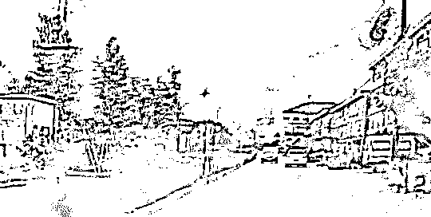
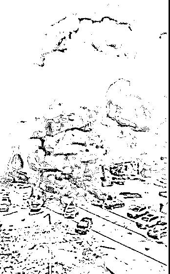
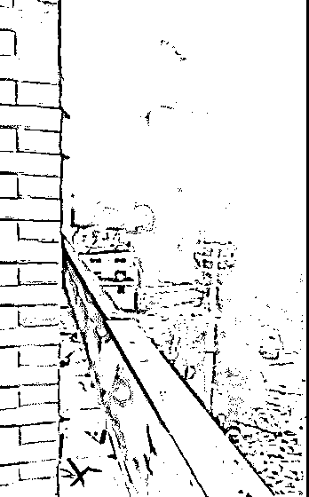
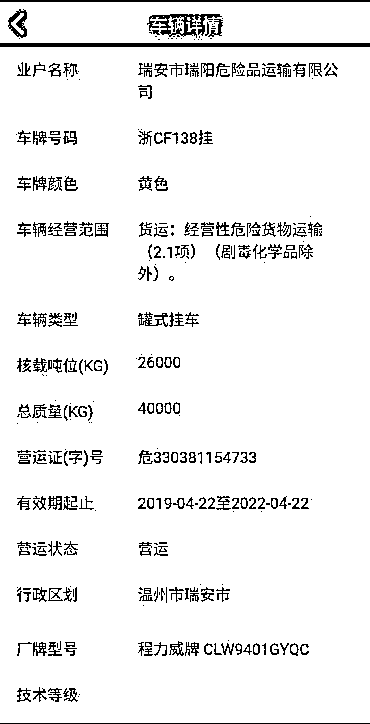
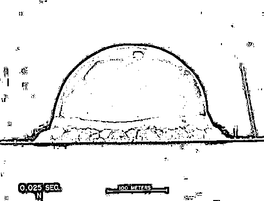

# 浙江槽罐车爆炸的能量（当能）有多大？

> 原文：[`mp.weixin.qq.com/s?__biz=MzAxNTc0Mjg0Mg==&mid=2653301058&idx=1&sn=c3247ba797d579aa73e7d41ede908514&chksm=802deb57b75a62419ead810cded713c9891f0f0e2b312bbc00a98daa34483d4022cbed957970&scene=27#wechat_redirect`](http://mp.weixin.qq.com/s?__biz=MzAxNTc0Mjg0Mg==&mid=2653301058&idx=1&sn=c3247ba797d579aa73e7d41ede908514&chksm=802deb57b75a62419ead810cded713c9891f0f0e2b312bbc00a98daa34483d4022cbed957970&scene=27#wechat_redirect)

***1***

**引言**

2020 年 6 月 13 日下午，在温岭市温岭西高速出口附近，一辆槽罐车发生爆炸，爆炸波及周边房屋及车辆。涉事车辆牌照为浙 CM9535 号—浙 CF138 号，运输液化气从宁波到温州瑞安，从高速公路出来走 104 国道时，在匝道发生爆炸冲出高速 ^([1])。

[`mp.weixin.qq.com/mp/readtemplate?t=pages/video_player_tmpl&action=mpvideo&auto=0&vid=wxv_1383829059293233152`](https://mp.weixin.qq.com/mp/readtemplate?t=pages/video_player_tmpl&action=mpvideo&auto=0&vid=wxv_1383829059293233152)

图 1: 槽罐车爆炸事故现场视频，非常惨烈

目前，事故已造成十多人死亡、上百人受伤。浙江台州市、温岭市已启动应急处置预案，伤者已被送往市人民医院等进行救治。从视频画面可以看到，槽罐车爆炸瞬间，冲击波像蘑菇云一样飞上天，油罐车旁边的一辆车直接被炸飞。

图 2: 槽罐车爆炸瞬间有不明物（车）飞出

事故现场浓烟滚滚，多辆小汽车被烧着，比电影中的场景还恐怖。

图 3: 浓烟滚滚的事故现场和燃烧着的小汽车

爆炸导致周边部分民房及厂房倒塌，周边稍远点的建筑物的窗户玻璃也全部被被爆炸产生的冲击波震碎。

图 4: 周围建筑物的窗户玻璃全部被震碎

此次爆炸到底有多大威力呢？我们可以简单做一个估算。液化气的主要成分是丙烷、丙烯、丁烷、丁烯等组成的混合物，经加压后形成的液体。1 公斤液化气的燃烧热值约为 46000 千焦 ^([2])。涉事槽罐车的核载吨位为 26 吨（图 5），目前还不清楚事发前到底装了多少液化气。假设槽罐车装有 20 吨液化气，则其爆炸产生的能量约为 920,000,000 千焦。这个能量有多大？通常，当我们不知道如何表达爆炸的能量有多“厉害”时，就和 TNT 炸药比。用释放相同能量的 TNT 炸药的质量表示，写成 TNT 当量。TNT 是最重要和用量最大的军用和民用单质猛炸药，学名 2,4,6－三硝基甲苯。1 公斤 TNT 炸药的爆炸能量约为 4200 千焦 ^([3])，也就是说 1 公斤液化石油气完全燃烧的能量，约等于 10 公斤 TNT 炸药的爆炸能量。假设 20 吨液化气爆炸时完全燃烧，产生的能量相当于 200 吨 TNT 炸药，或者说其 TNT 当量为 200 吨。顺便提一下，1945 年 8 月 9 日美国在日本长崎投掷的原子弹的 TNT 当量为 2 万吨 ^([4])。

图 5: 事故车辆信息

但能量并不等同于威力，TNT 爆炸反应的时间一般为十万分之一秒（原子弹更短），能够在极短的时间内产生巨大的压力和冲击波。TNT 爆炸速度差不多每秒 7 公里，这已经接近宇宙第一速度。爆炸产生的温度约 2600 K，产生的压力约为 17 GPa（1 GPa = 1 万个大气压）^([5])。

而液化气爆炸反应时间约为数百分之一秒至数十分之一秒，产生的压力一般为几十大气压。因此，相同质量的液化气爆炸产生的威力远小于 TNT 炸药。尽管如此，此次爆炸的威力也是巨大的，特别是当爆炸发生在房屋密集区。

上文已经简单的估计了本次槽罐车爆炸的 TNT 当量。历史最有名的爆炸当量估计是对原子弹爆炸所释放能量的估计。1945 年 7 月 16 日美国科学家在新墨西哥州阿拉莫戈多沙漠进行了三位一体核试验（Trinity），但是试爆后原子弹的某些属性却并不明朗 ^([4])。

图 6: 原子弹爆炸产生的巨大蘑菇云

负责研制核装置的项目组顾问杰弗里·泰勒是一名剑桥大学教授，他亲眼目睹了这场核实验，但是仅靠肉眼并不能估测出原子弹的威力。1947 年之后，三位一体核试验原子弹的爆炸照片逐渐被媒体公开，泰勒根据爆炸后的一系列照片建立数学模型，成功估算出原子弹爆炸时所释放的能量。本文就来展示一下泰勒估计原子弹当量的过程  ^([6])。

***2***

**模型**

泰勒假设爆炸球形冲击波的半径（）大小仅仅依赖于爆炸后的时间（）、爆炸瞬间所释放的能量（）和空气的密度（）。即 

<mjx-container jax="SVG" display="true" role="presentation" tabindex="0" ctxtmenu_counter="92" style="overflow-x: auto;outline: 0px;display: block;text-align: center;margin: 15px 0px;" data-formula="R = \textrm{C} ~ t^aE^b\rho^c"></mjx-container>其中  是无量纲的常数。利用量纲其次原则（即等式两边的量纲要相同），可以求出了 、、 的值。我们将变量替换为各自的基本量纲，例如将半径  换成它的量纲 []，本文所涉及到的基本量纲包括质量（M），长度（L）和时间（T），因此变量对应的基本量纲为：<mjx-container jax="SVG" role="presentation" tabindex="0" ctxtmenu_counter="103" style="" data-formula="[R]"></mjx-container> = L ， <mjx-container jax="SVG" role="presentation" tabindex="0" ctxtmenu_counter="119" style="" data-formula="[t]"></mjx-container> = T， <mjx-container jax="SVG" role="presentation" tabindex="0" ctxtmenu_counter="134" style="" data-formula="[E]"></mjx-container> = <mjx-container jax="SVG" role="presentation" tabindex="0" ctxtmenu_counter="136" style="" data-formula="\rm  ML²T^{-2}"></mjx-container>， <mjx-container jax="SVG" role="presentation" tabindex="0" ctxtmenu_counter="148" style="" data-formula="[\rho]"></mjx-container> = <mjx-container jax="SVG" role="presentation" tabindex="0" ctxtmenu_counter="150" style="" data-formula="\rm ML^{-3}"></mjx-container> 。将变量各自的量纲代入上式，整理后可得到： 

<mjx-container jax="SVG" display="true" role="presentation" tabindex="0" ctxtmenu_counter="87" style="overflow-x: auto;outline: 0px;display: block;text-align: center;margin: 15px 0px;" data-formula="\textrm{L}¹ = \textrm{M}^{(b+c)}\textrm{L}^{(2b-3c)}\textrm{T}^{(a-2b)}"></mjx-container>由于等式两边的量纲相同，因此 <mjx-container jax="SVG" display="true" role="presentation" tabindex="0" ctxtmenu_counter="98" style="overflow-x: auto;outline: 0px;display: block;text-align: center;margin: 15px 0px;" data-formula="\begin{aligned}
1b+1c&amp;=0\\
2b-3c&amp;=1\\
1a-2b&amp;=0
\end{aligned}"></mjx-container>联立以上三式即可得到 ，，，所以

<mjx-container jax="SVG" display="true" role="presentation" tabindex="0" ctxtmenu_counter="11" style="overflow-x: auto;outline: 0px;display: block;text-align: center;margin: 15px 0px;" data-formula="R = \textrm{C}(Et²/\rho)^{1/5}"></mjx-container>其中  是一个无量纲的常数，是热容比（，或者称作绝热指数）的低阶函数，因此在任何条件下都近似为 1。可以推出爆炸所释放的能量 

<mjx-container jax="SVG" display="true" role="presentation" tabindex="0" ctxtmenu_counter="7" style="overflow-x: auto;outline: 0px;display: block;text-align: center;margin: 15px 0px;" data-formula="E = \rho R⁵/t²"></mjx-container>泰勒选择了原子弹爆炸后  毫秒后产生的冲击波的照片，其中标尺长度为 100 m。

图 7: 原子弹爆炸后 25 毫秒后产生的冲击波

测量上图并通过比例尺计算可以得出冲击波的半径大约为 132 m。空气的密度为 1.2  ，代入上面的公式，可以得到原子弹爆炸产生的能量  约为  J，**这一能量相当于 18.4 千吨 TNT**。这个简单的计算得到的结果同官方数据（二万吨 TNT）相差仅 10 %。

***3***

**结论**

*   温岭市温岭西高速出口附近发生的槽罐车爆炸的 TNT 当量约为 200 吨，对附近车辆和建筑都造成了严重的损毁，也造成了很多人的伤亡。任何人，任何单位都要重视安全生产！

*   量纲能够有效地估计出原子弹爆炸所释放的能量。1945 年美国的科学家在新墨西哥州阿拉莫戈多沙漠进行了三位一体核试验的当量约为 2 万吨。

### 

***4***

**参考资料**

[1]

痛心！温岭槽罐车爆炸已致 10 死 117 伤: *https://www.thepaper.cn/newsDetail_forward_7833637* [2]

百度百科，液化石油气: *https://baike.baidu.com/item/液化石油气* [3]

TNT. From Wikipedia, the free encyclopedia: *https://en.wikipedia.org/wiki/TNT* [4]

Nuclear weapon. From Wikipedia, the free encyclopedia: *https://en.wikipedia.org/wiki/Nuclear_weapon* [5]

1 公斤液化气的威力，真的相当于 10 公斤 TNT 吗? 惠州消防: *http://static.nfapp.southcn.com/content/201707/24/c565593.html* [6]

Nuclear weapon yield. From Wikipedia, the free encyclopedia: *https://en.wikipedia.org/wiki/Nuclear_weapon_yield* [7]

陈奎孚，浙江液化气槽罐车,爆炸威力有多大. 图形公式不烦恼: *https://mp.weixin.qq.com/s/fXZS4zL9kiUblDpjsq4GwQ* 

量化投资与机器学习微信公众号，是业内垂直于**Quant、MFE、Fintech、AI、ML**等领域的**量化类主流自媒体。**公众号拥有来自**公募、私募、券商、期货、银行、保险资管、海外**等众多圈内**18W+**关注者。每日发布行业前沿研究成果和最新量化资讯。

你点的每个“在看”，都是对我们最大的鼓励