# Google Python 挑战赛：我猜你答不上来！

> 原文：[`mp.weixin.qq.com/s?__biz=MzAxNTc0Mjg0Mg==&mid=2653300990&idx=1&sn=420bdd5d512859d9515d915f89b45bac&chksm=802deaebb75a63fd64a6c87402f0aa3dec87ccbcced3fc3223cfca6adf9b3564a291553f3ce1&scene=27#wechat_redirect`](http://mp.weixin.qq.com/s?__biz=MzAxNTc0Mjg0Mg==&mid=2653300990&idx=1&sn=420bdd5d512859d9515d915f89b45bac&chksm=802deaebb75a63fd64a6c87402f0aa3dec87ccbcced3fc3223cfca6adf9b3564a291553f3ce1&scene=27#wechat_redirect)


# 作者：Hanyu、Leon     编译：1+1=6

# 这是一个来自谷歌的秘密招聘挑战（Google FooBar Invitation) ），如果你收到了谷歌的 FooBar 邀请，你应该感到高兴。谷歌的许多开发人员都是通过 FooBar 而被聘用的。

获得 Google Foobar 邀请也是一件神秘的事情，**不是每个人都能接受这个挑战**。没有人确切知道 Google Foobar 邀请资格的标准。 

当你收到邀请时，它上面写着：

***“You’re speaking our language. Up for a challenge?”***

接受邀请后，你会看到一个看起来很酷的 IDE，你可以在请求后打开右侧的代码编辑器并导航到解决方案文件 solution.py。

交互界面模仿了 UNIX Shell：你可以通过命令来请求（ request ）一个新的 Challenge、 提交（ submit ）代码、验证（ verify ）代码正确与否。

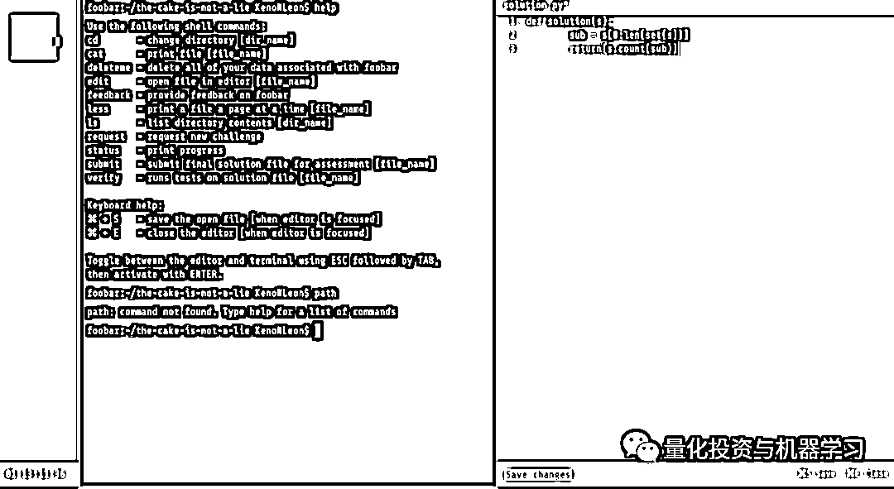

一旦你有了一个潜在的解决方案你可以验证它，你可通过测试来看看你的最终解决方案能否被接受。

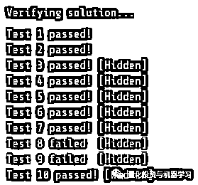

**整个挑战有 3 个 level**，level 1 有 1 道题目，level 2 有 2 道，level 3 有 3 道。

*   **level 1 和 level 2**的题目十分简单，每个题目会给**24–48 个小时**的做答时间，考的主要是一些**基础的编程概念**；

*   **level 3**会考一些**简单的算法**，每个题目会给**96 个小时**的做答时间；

*   **level 4**的题目就比较难了，会考一些不常见的算法。

让我们看看今天的这道题目吧（重点标记出来了）：

Commander Lambda has had an incredibly successful week: she completed the first test run of her LAMBCHOP doomsday device, she captured six key members of the Bunny Rebellion, and she beat her personal high score in Tetris. To celebrate, she's ordered cake for everyone - even the lowliest of minions! But competition among minions is fierce, and if you don't **cut **exactly **equal slices of cake** for everyone, you'll get in big trouble.

The cake is round, and decorated with M&Ms in a circle around the edge. But while the rest of the cake is uniform, the M&Ms are not: there are multiple colors, and every minion must get exactly the same sequence of M&Ms. Commander Lambda hates waste and will not tolerate any leftovers, so you also want to make sure you can serve the entire cake.

**To help you best cut the cake, you have turned the sequence of colors of the M&Ms on the cake into a string: each possible letter (between a and z) corresponds to a unique color, and the sequence of M&Ms is given clockwise** (the decorations form a circle around the outer edge of the cake).

**Write a function called solution(s) that, given a non-empty string less than 200 characters in length describing the sequence of M&Ms, returns the maximum number of equal parts that can be cut from the cake without leaving any leftovers.**

我们来把问题进行可视化：

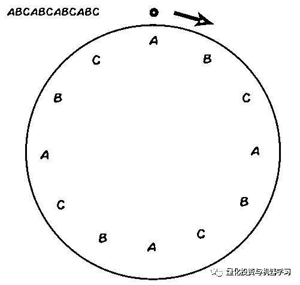

再看看每个字母的划分：

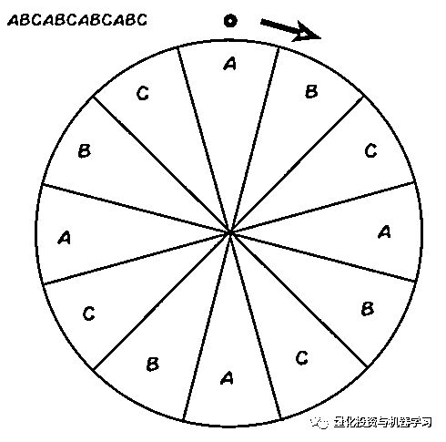

最后是重复模式的划分：

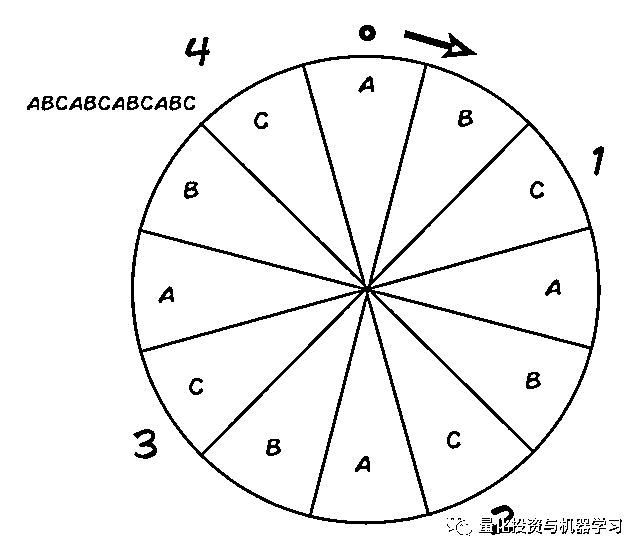

我们将在后面讨论边界情况，但至少现在我们或多或少对这个问题有了一个想法，让我们开始进行编程，我们需要构造一个函数，设置一个参数，找到一个模式，展示重复出现的模式次数，这是我们最初的解决方案：

```py
def solution(s):
        sub = s[0:len(set(s))]
        return(s.count(sub))
print(solution('abcabcabcabc'))
>> 4
print(solution('abccbaabccba'))
>> 2 
```

不幸的是，这个方法没有通过所有的测试，所以我们需要更创建一些额外的边界情况，以找到剩余的解决方案。

现在，我们首先需要找出模式中字符的数量是奇数还是偶数：

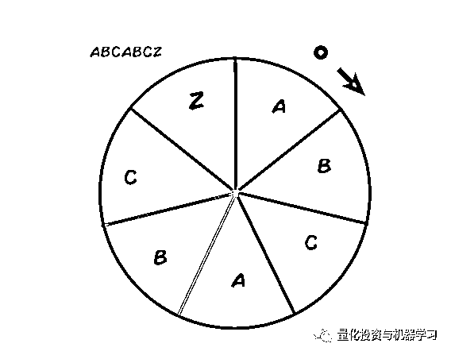

对于偶数个切片没有落单的，但是对于不均匀数量的切片，我们可以有一些额外的切片。但请记住，**这个问题要求的是等分的最大数量（the maximum number of equal parts**），让我们使用**取模运算**（Modulus Operation）就可以很容易的识别奇数/偶数：

```py
def solution(s):
    if (len(s) % 2 != 0):
        print('Odd')
    else:
        print('Even')

solution('abcabcN')
>> ODD
solution('abcabc')
>> EVEN 
```

在这里给大家科普一下**取模运算（mod）和取余运算（rem）**两个概念，他们的主要区别在于对负整数进行除法运算时操作不同。

**取模和取余的区别**

*   取余运算 在计算商值时 商值向 0 方向舍入；靠近 0 原则

*   取模运算 在计算商值时 商值向负无穷方向舍入；尽可能让商值小的原则(不超多商值的最大值)

## **计算步骤**

## 假设有整数 a 和 b，那么取模/取余运算可以分为两步运算：

## 1、求整数商：c = a/b;

## 2、计算模/余数：r = a - (c*b);

## 3、总计算模/余数：a mod b = a - b[a/b]   ([a/b]表示整数商)

回到主题。列表上的下一个项目是找到完整的模式，这可以通过查找模式重复的索引来完成。

```py
def solution(s):
    print('INPUT:' + s)
    i = (s+s).find(s,1, -1)
    sub = s[:i]
    print('Substring:', sub)

solution('abccbaabccba')
>> INPUT:abccbaabccba
>> Substring: abccba

solution('xyztxyztxyzt')
>> INPUT:xyztxyztxyzt
>> Substring: xyzt 
```

这里唯一奇怪的是 find()方法上的-1 索引，它将用于捕捉模式不是偶数的情况，考虑以下两种情况：

```py
def solution(s):
    print('INPUT:' + s)
    i = (s+s).find(s,1, -1)
    sub = s[:i]
    print("i:", i)
    print('Substring_1:', sub)
    s2 = s
    s2 = s2[:-1]
    sub2 = s2[0:len(set(s2))]
    print('Substring_2:' +  sub2)

solution('wewewe')
>> INPUT:wewewe
>> i: 2
>> Substring_1: we
>> Substring_2:we

solution('weweweT')
>> INPUT:weweweT
>> i: -1
>> Substring_1: wewewe
>> Substring_2:we 
```

**给大家科普一下****find()****方法：** 

find()方法从字符串中找出某个子字符串第一个匹配项的索引位置，该方法与 index()方法一样，只不过如果子字符串不在字符串中不会报异常，而是返回-1。

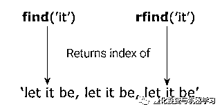

```py
S.find(sub[,start=0[,end=len(S)]]) 
```

*   sub -- 指定检索的子字符串

*   S -- 父字符串

*   start -- 可选参数，开始索引，默认为 0。（可单独指定）

*   end -- 可选参数，结束索引，默认为字符串的长度。（不能单独指定）

返回子字符串第一个匹配项出现在字符串中的索引位置，如果没有匹配项则返回-1。例如：

```py
quote = 'Let it be, let it be, let it be'
result = quote.find('let it')
print("Substring 'let it':", result)

Substring 'let it': 11 
```

回到主题。另一个需要考虑的边界情况是单字符重复模式，像这样：

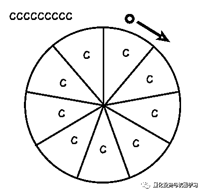

加一行代码就行：

```py
if len(set(s)) == 1: 
```

看看最终的一个解决方案：

```py
def solution(s):
    print('-------')
    print('INPUT:' + s)
    i = (s+s).find(s, 1, -1)
    print (i)

if (len(s) % 2 != 0):
        print('ODD')
        if(len(set(s)) == 1):
            print("CASE: ODD SINGLE CHARACTER")
            print('pattern:' +  (s[0]))
            print('Divisions:' + str(len(s)))
            return
        else:
            s = s[:-1]
            if len(set(s)) == 1:
                print('pattern:' +  (s[0]))
                print("CASE: ODD SINGLE CHARACTER EXTRA CHARACTER")
                print('Divisions:' + str(len(s)))
                return
            elif i == -1:
                sub = s[0:len(set(s))]
                print('pattern:' +  sub)
                print('Divisions:' + str(s.count(sub)))
                print("CASE: MULTI CHARACTER EXTRA CHARACTER")
                return
            else:
                sub = s[:i]
                print('pattern:' +  sub)
                print('Divisions:' + str(s.count(sub)))
                print("CASE: ODD MULTI CHARACTER")
                return
    else:
        print('EVEN')
        if len(set(s)) == 1:
            print('pattern:' +  (s[0]))
            print('Divisions:' + str(len(s)))
            print("CASE: EVEN SINGLE CHARACTER")
            return
        else:
            sub = s[:i]
            print('pattern:' +  sub)
            print('Divisions:' + str(s.count(sub)))
            print("CASE: EVEN MULTI CHARACTER")
            return 
```

有 6 个测试案例：

```py
solution('a')
solution('aa')
solution('abcabc')
solution('abcabcabc')
solution('aaT')
solution('ababT') 
```

对应的输出：

```py
------
INPUT:a
-1
ODD
CASE: ODD SINGLE CHARACTER
pattern:a
Divisions:1
-------
INPUT:aa
1
EVEN
pattern:a
Divisions:2
CASE: EVEN SINGLE CHARACTER
-------
INPUT:abcabc
3
EVEN
pattern:abc
Divisions:2
CASE: EVEN MULTI CHARACTER
-------
INPUT:abcabcabc
3
ODD
pattern:abc
Divisions:2
CASE: ODD MULTI CHARACTER
-------
INPUT:aaT
-1
ODD
pattern:a
CASE: ODD SINGLE CHARACTER EXTRA CHARACTER
Divisions:2
-------
INPUT:ababT
-1
ODD
pattern:ab
Divisions:2
CASE: MULTI CHARACTER EXTRA CHARACTER 
```

一旦我们完成一个更小、更简洁的脚本，并且通过了所有的测试，你的页面会出现一只兔子，然后你就可以进行下一挑战了！

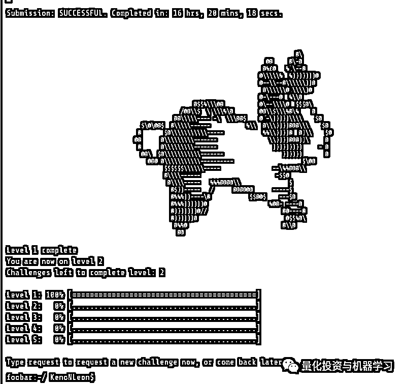

有些人可能已经注意到，第 4 个 casebabcabc 有问题，这个留给读者们发挥你的聪明才智！

你们可以看看**Stack Overflow**上的回答：

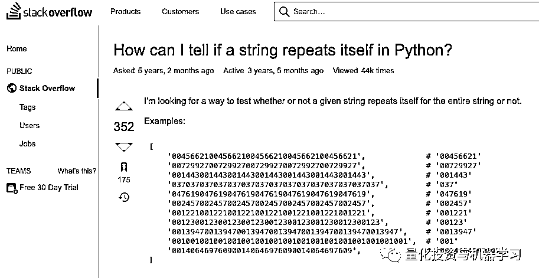

https://stackoverflow.com/questions/29481088/how-can-i-tell-if-a-string-repeats-itself-in-python

在你完成所有的题目后，你会填写一张信息表，一两天后，你会收到谷歌的电话或邮件，并得到面试邀请：

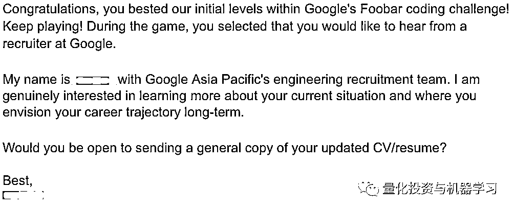

接下来 Google recruiter 会问你个人倾向于什么岗位，可选 SRE 或者 SWE。然后会收到了 Google recruiter 的电话，大概内容是：

*   了解个人情况

*   一些关于计算机基础知识的题目

*   **即便是 Google FooBar 通过了，还要有两轮电话面试……**

电话聊完之后，recruiter 还会发送了一个 self-rating form ，让你自助式地评估下自己的技术水准，形式如下：

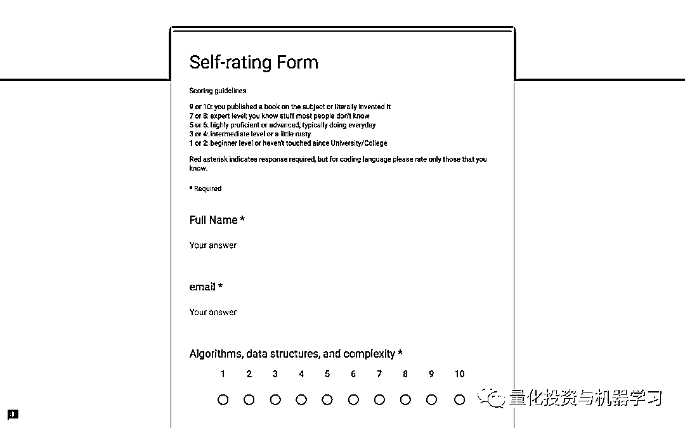

与此同时，recruiter 还发送了一份长达 6 页的非常详尽的求职面试指南文档《Guide to Getting an SRE job with Google》，内容包含了岗位需求、面试要求、考查题目范围、样例面试题目等等。

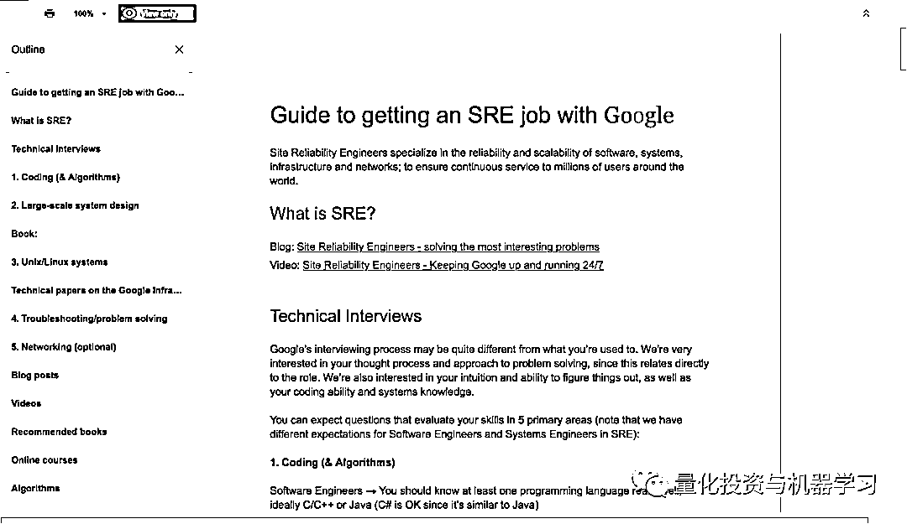

两轮电话面试后，如果通过，你就可以去 Sydney office onsite 了。

说下具体的 onsite 面试流程吧。**Google 的 onsite 面试共有 5 轮，每轮 45 分钟，一般会从上午 10 点开始，上午 2–3 轮，然后 recruiter 会带你去 Google 那天下闻名的食堂吃个午饭，让你休整下放松下心情，饭后回到会议室再面 2–3 轮。**

SRE 岗 5 轮面试大致考查如下方向：

*   **Coding & Algorithm**

*   **System Design**

*   **Troubleshooting**

*   **Networking**

*   **Linux/UNIX system**

其中，Coding & Algorithm 方面，编程语言不限，选择自己擅长的就好（推荐用 Python，写起来比 C++/Java 要快很多）；Linux/UNIX system 方面，文件系统、内存、系统调用、进程调度方面都有可能考，而且几乎没有办法准备，也没有办法刷题，靠的是平时的积累；SRE 岗还会考一些 Shell Script 方面的细节问题；Networking 方面考的不多，需要你对 Web Application 的常见网络架构有一个基础的理解，经典的题目有“从浏览器输入一个 URL 到页面渲染完成，其中发生了什么？”、“DNS 的基本原理”等等；Troubleshooting 考查的是现实工作场景中如何 debug 的能力；System design 会考查在 45 分钟之内从无到有写一个具有良好 API 接口、满足基础性能要求的一个 library/class 层面上的小程序。

## **总结一下**

1、1 轮 foo.bar，2.5 轮电话面试，5 轮 onsite 面试，持续 4 个月，总体耗时 3–4 周。

2、**整个应聘的流程，至少接触了 4 位 recruiter，8 个面试官，2 个第三方服务者**，算上人力的时间成本，加上 onsite 的机票酒店餐饮签证成本，最后再考虑下 onsite 的通过率，估计 **Google 要招聘到一个合格的员工，成本至少是在十万人民币级别的。可见顶尖的人才是相当昂贵的，这还仅仅只是招聘成本。**

3、就现在的 IT 技术招聘体制而言，大多数公司采用的无非就是在一定的时间和资源限制下，解决一些面试官心中有明确标准答案的 puzzles——但是这种选拔真得能很好的反应一个面试者在实际工作中的能力么？值得探讨···

4、你要知道，改善随着时间的推移，你的领域知识（语言和问题本身）和你的回答会变得更好。如果你不能在一开始就不能很好地理解题目，也不能快速地想出一个很好的解决方案，不要气馁，**总有量变到质变的那一刻，你会感受到的！**

量化投资与机器学习微信公众号，是业内垂直于**Quant、MFE、Fintech、AI、ML**等领域的**量化类主流自媒体。**公众号拥有来自**公募、私募、券商、期货、银行、保险资管、海外**等众多圈内**18W+**关注者。每日发布行业前沿研究成果和最新量化资讯。

你点的每个“在看”，都是对我们最大的鼓励