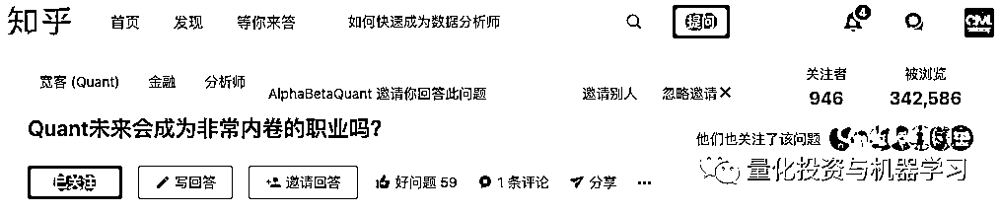

# Quant 内卷化，知乎吵翻天！

> 原文：[`mp.weixin.qq.com/s?__biz=MzAxNTc0Mjg0Mg==&mid=2653300870&idx=1&sn=8ffdb117268b1a34be872feb6de02941&chksm=802dea93b75a6385e24577d07c3af6b39f6606ef2dbe4182dad26bcaf7937cc63b147370fd31&scene=27#wechat_redirect`](http://mp.weixin.qq.com/s?__biz=MzAxNTc0Mjg0Mg==&mid=2653300870&idx=1&sn=8ffdb117268b1a34be872feb6de02941&chksm=802dea93b75a6385e24577d07c3af6b39f6606ef2dbe4182dad26bcaf7937cc63b147370fd31&scene=27#wechat_redirect)

前几天知乎有个问题被邀请，混迹量化版块的各大博主也都相继回答了该问题：  

**竞争激烈就得了，非要搞个看起来高大上的名词**

**所有行业都一样！**

一定要认清自我，有能力就上，不行就赶紧换方向或去弥补。

难道学了 MFE 就一定要做 Quant？不干这行感觉对不起自己，面子上挂不住。Quant 没有什么光环，请放下身段，**选择适合自己的！**

没什么好讨论的！

量化投资与机器学习微信公众号，是业内垂直于**Quant、MFE、Fintech、AI、ML**等领域的**量化类主流自媒体。**公众号拥有来自**公募、私募、券商、期货、银行、保险资管、海外**等众多圈内**18W+**关注者。每日发布行业前沿研究成果和最新量化资讯。

你点的每个“在看”，都是对我们最大的鼓励