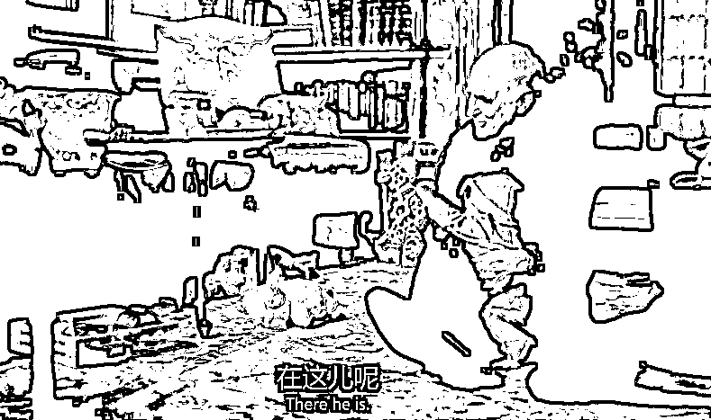

# 扒一扒 Billions 第五季：你必须知道的投资秘密（1-5 集）

> 原文：[`mp.weixin.qq.com/s?__biz=MzAxNTc0Mjg0Mg==&mid=2653300830&idx=1&sn=343000c474bb31111c7dcfbef06ac941&chksm=802dea4bb75a635d29444cff91f50f56635188e828e6466a6eb706288e6b0cb781f7ffeeb834&scene=27#wechat_redirect`](http://mp.weixin.qq.com/s?__biz=MzAxNTc0Mjg0Mg==&mid=2653300830&idx=1&sn=343000c474bb31111c7dcfbef06ac941&chksm=802dea4bb75a635d29444cff91f50f56635188e828e6466a6eb706288e6b0cb781f7ffeeb834&scene=27#wechat_redirect)

**标星★****置顶****公众号     **爱你们♥   

来自：加里敦蹲哥（ID：stocktrader88）作者：蹲哥<mpsearch class="js_mpsearch appmsg_search_iframe js_uneditable custom_select_card" data-keywords="%5B%7B%22label%22%3A%22%E9%A2%84%E6%B5%8B%22%7D%2C%7B%22label%22%3A%22%E5%AF%B9%E5%86%B2%E5%9F%BA%E9%87%91%22%7D%2C%7B%22label%22%3A%22%E6%9C%BA%E5%99%A8%E5%AD%A6%E4%B9%A0%22%7D%2C%7B%22label%22%3A%22%E9%87%8F%E5%8C%96%E6%8A%95%E8%B5%84%22%7D%5D" data-w="286" data-ratio="1.5664335664335665" data-parentclass="appmsg_search_iframe_wrp"></mpsearch>

**One man's enemy is another man's ally.**

今天**蹲哥**为大家扒一扒 Billions 第五季那些你必须知道的投资知识！**超精彩！**

本期带来第 1 集~第 3 集，**文末附第五季****1-6 集（中英字幕）观看、下载****。**

***1***

**第一集**

第一集，bobby 这边，在上一季搞定了 Taylor，暂时没有了对手，也没有官司缠身的 bobby 进入了一种即使身价佰亿也不快乐的状态，也许这是一个从前梦寐以求的目标，但等到真的达到了这个目标，就会感觉到满足感明显**边际效益**递减了，远不如最初赚的**第一个 100 万美****元**带来的刺激感（无论是成就感和幸福感），毕竟到这个量级多赚一点少赚一点，生活上也不会有什么特别大的变化了。可能是 wendy 推荐的？bobby 摆脱这种懈怠状态的方式是和 wags 跑去 Ayahuasca（喝死藤水），这是来自南美洲亚马逊热带雨林中的一种药用植物，因其中含有 DMT 成分-会致幻，喝这个死藤水呢还要在萨满巫师在场的宗教仪式下进行，一般不能自己喝，喝之前要禁酒禁糖禁性 xx 生活（所以某人回来直接点名杂志模特？）...这玩意比较小众，可能有朋友觉得看不懂他们这段有点搞笑是在干嘛，以上简单介绍下。

不是说没有对手么？这不马上出现了一个实力非常强大的对手 mike，bobby 这种性格不就需要强劲的对手来刺激战斗欲吗？这个对手呢自己也经营实体也做投资，做得还是量化投资(机器学习）和社会责任投资（impact investing），前者不多说，后者所谓社会责任投资就是带点公益性质的，比如环保啦扶贫啦社会治理啦之类的，这个对手很不给面子，不仅抢了杂志封面，还直接在杂志上 diss Bobby 你这种传统投资者已经过时啦，其实我觉得这是不懂 bobby 公司的内部结构了：我 bobby 是不懂量化投资，可我有王牌 taylor manson 啊！然后也就有了 bobby 和 taylor 后面推心置腹的交谈，bobby 明白必须拉上 taylor 干大事对付 Mike,还有说不定后面什么 impact investing，bobby 这种看起来“唯利是图”的人也要去搞搞了，bobby to taylor 话术翻译：你的人生不可能就是搞搞这些勾心斗角，把谁谁投入监狱吧？投**资交易主战场才是你的 passion 所在啊**！也是，他们 geek 除非逼不得已，**整人这种事热爱是不可能热爱得......**

wendy 搞定两方团队融合的手法，我看不出特别高明的地方，请了个 wwe 女明星（这人 wwe 当红炸子鸡，实名出场），那么快就好了？双方的矛盾无非是搞量化得和搞传统投资得互相不服气看不惯，就像 mike diss Bobby 那样，但是我上面说了，现在 bobby 需要 taylor 了.....

chuck 这边好像没什么花头，反正还是那样-继续保持自己小受的隐秘游戏习惯，他妈妈出场了，进一步证明了我在上季分析 chuck 的原生家庭出身背景，他的童年有个特别特别强势专制的父亲，其实他妈也是受压迫者，没自尊到老头子娶娇妻自己还要出场祝贺和 wendy 终于破裂了，破裂了好，他俩的感情戏我也不大想看了...

我特别理解结尾 taylor 释放自我的那种状态，这也是我在某些时刻会想做的事情。

总之第一集不算特别出彩，可能在铺垫？希望 mike 这条线之后能玩出什么花样吧。话说回来，庚子年我们地球人民经历得还挺多，编剧要想编出让我们观众显得没见过世面的样子，还挺不容易得，宽容吧！之前我在朋友圈说，就这几个月现实世界发生的事情，后人都可以拍好多部片子了

替粉丝朋友问问万能网友：开头婚礼，wendy 穿得裙子是什么牌子？

那个游泳池，搜索 endless  pools......中国市场已经有！

***2***

**第二集**

上一集提到的死藤水没想到还是主线，第一集死藤水部分，看到很多网友觉得很不可思议，大佬会去弄这个？这玩意有用？这是一般人思维闭塞、故步自封的表现，而且随口就评论自己不了解的东西？事实上目前这玩意是有很多严肃的科学家在研究得，早在 80 年代美国就有个科学家把这个向美国专利局申报为植物专利（其中含 DMT 成分），还遭到了亚马逊印第安人的抵制-这明明是我们的传统饮料啊，目前起源地-巴西人应用在抗抑郁症领域的效果测试走在比较前面，所以你以为 bobby 他们是去搞“迷信”活动，其实这是一次对冲基金-生物科技领域的调研活动啊...

mike 对这个领域也非常感兴趣，而且投入很深，回忆下第一集 bobby 在被 mike 在杂志上 diss 以后就答应要去 mike 的围炉夜谈，他应该是提前获得情报在做死藤水商业化尝试的医药公司的那个人也要去参加，而这个人呢马上要去监管机构-FDA 任职，根据 FDA 的规定---**FDA 的职员必须公开其当前的商业利益关系，只要与其监管审批的行业有关联，无论是上市公司还是私人公司，无论是董事、高管、顾问还是股票期权持有者，都必须如实公开并逐一清理。**所以 mike、bobby 肯定是必须要拿下这个股份得，而且搞这个还需要医院的病人做各种双盲测试，所以 bobby 还盯上了那个医院的老大，但是无论是医药公司的这人还是医院的老大，他们都只认 longriver 萨满，bobby 觉得自己肯定赢了啊，我特么刚见过啊，然而被 mike 在这局绝杀了...

围炉谈话那部分的台词写得很好，这是这两年美国的热点话题-new capitalism，去年 10 月份的时候 Salesforce 老板 Marc Benioff 在 NYT 发了篇文章，大意：***It’s time for a new capitalism** — a more fair, equal and sustainable capitalism that actually works for everyone and where businesses, including tech companies, don’t just take from society but truly give back and have a positive impact*（现在是时候建立一个新的资本主义了--一个更加公平、平等和可持续的资本主义，真正为每个人服务，包括科技公司在内的企业不只是从社会上拿走东西，而是真正地回馈社会，产生积极的影响）,而且 Benioff 本人也在身体力行的做慈善事业，比如捐款给无家可归者和儿童教育、改善社区治理等等,从台词来看，我觉得编剧基本上是从 benioff 那篇文章来的灵感，那么**new-capitalism**这个话题的美国现实背景是什么？这里我推荐最近刚看完的一本书，美国西北大学教授 Robert J. Gordon 的***《The Rise and Fall of American Growth》***，已经有中文译本《美国增长的起落》，看完你就会有答案....

强烈的复仇欲望使 chuck 进入了一个全新的状态，人性的阴暗面尽情得释放出来了，自己还不够，末了还要去话术激发 taylor 的复仇欲，chuck 的话术加上前面奥斯卡的不待见，看最后 taylor 的眼神，似乎也要被激活了？

bobby 在约模特之前 wags 说的话，这看起来像是京东老板的梗？

wags 夜场看自己女儿跳脱衣舞，太惨了！

黑妹证明了自己是非常出色的公关，很会撩人得...

bill 哥被交易亏损搞得 xing 欲全无，太真实了！有名言：i don't need sex,because the stock market fucks me every day.

bill 被胡子小哥坑，忽悠 bill 自己的策略资金容量有限（马菲对这点的解释太形象生动了-老婆多了吃不消得），然后根本没把他的钱放进自己的策略....

刚遭失利的 bobby 羡慕上了之前轻蔑的银行家，自负盈亏投资行业太难了，难免产生挫败感，而银行 too big to fail.... ps:本剧其中一个编剧 Andrew Ross Sorkin 就是那本著名的畅销书（还被改成电影）-《too big to fail》的作者,最后这部分台词必须出自他手 ............

***3***

**第三集**

taylor 这边，她们团队通过**NLP（自然语言分析）探测到某大学的校监实际上是支持自己大学的捐赠基金从石化燃料行业撤资的**，就 NLP 技术而言这个剧前瞻性还是可以得，就在今年 3 月份商业人工智能巨头-蓝色巨人-IBM 宣布他们要将源于 Project Debater（可以和人类辩论！）这个 AI 产品的 NLP 技术添加到他们的技术平台 IBM WATSON 上去，那么其中一个功能就是可以**高级情感分析**，这也是 IBM 首次将这个 NLP 技术进行商业化应用， 当然我不认为 taylor 的团队有这么强，剧中他们应该也是借用的外部工具（比如 Kenso 公司），现实中 NLP 技术在对冲基金内部做交易策略上已经有应用，国内有些头部对冲基金也在招聘这个方向的专家....

本集的另外一个知识点，这些年在欧美社会如火如荼的化石燃料撤资运动 Fossil Fuel Divest Campaign，这个运动最早在 2010 年由美国著名环保主义理论家 Bill McKibben 提出，到今天在欧美社会已经有非常多的大学捐赠资金、国家主权基金（比如挪威基金）、宗教基金、家族基金（比如洛克菲勒）等等响应号召宣布退出石化燃料行业，其核心议题主要是控制地球气候恶化、减少碳排放减缓地球气候变暖，编剧怎么就突然弄了这个议题？

在去年 11 月份的时候，特朗普宣布退出《巴黎气候协定》，美国国内爆发了很多学生抗议活动，比如在耶鲁大学和哈佛大学的橄榄球比赛上就发生了抗议学校捐赠基金投资化石燃料行业和特朗普宣布退出气候协定的活动。动机上来说，特朗普退出这个协定是为了制造业回归（石化燃料传统制造业），是为了底层就业，也是为了选票，所以这是政客&群众现实利益和大学生理想主义长远利益的抗争...

必要的背景介绍完，回到剧中，本集 Taylor 和 wendy 的交谈暴露出了自己是无神论者（其实猜也猜得到），加上前面我们知道他 o 她还是 Transgender（跨性别者），那么用西方的政治坐标来看，Taylor manson 基本是一个左翼自由主义的政治立场（liberal），也只有这种人才会非常关心化石燃料撤资运动、关心气候议题，也才会发现大学校监的大商机，你要 bobby 来看这个什么撤资运动，一个单词“bullshit”........所以 taylor 基于自己的一致性立场心理上不会接受资金又投去化石燃料行业，所谓 against the entire thing。

而在本集进一步赤裸裸宣言资本主义精神的大右翼 bobby 做得就毫无负担了，所以编剧在这里在 bobby 和 taylor 之间制造了一个新的冲突....单从剧中这个大学撤资活动，其实对两个公司毫无影响，甚至连股价都不会下跌（下跌也有人接盘），更不会影响公司经营，毕竟目前人类还是很依赖化石燃料得啊，似乎离气候核心议题有点远，其实可以有更有用更积极的方式：对温室气体排放定价，加大能源创新投资，从使用煤炭发电改为使用天然气发电，找到划算的二氧化碳储存办法....

前面几季老 chuck 和儿子，这集 bobby 和儿子， bobby 和老 chuck 有共同的心声：老子有钱有能力，为了儿子啥都可以搞定........看得走放任主义路线的 wags 老泪纵横感慨万分当下就决定要去找儿子，搞笑得是之前弄大 ma 生意的儿子已经信上帝了...

bobby 教育儿子你这**风险收益比**不好，**冒着退学的风险泡妞不合算啊，做交易时时刻刻要衡量的两个点：风险、收益、风险、收益.... **

Bobby 和 prince 这集关于画家的冲突很平淡，没啥值得说得....

***4***

**第四集**

上一集谈到编剧新制造了一个 Bobby 和 Taylor 的冲突，本剧这条线继续，wendy 出面当和事佬，taylor 指出你 bobby 这个交易实际上是因小失大了，因为这个大学的表率作用，现在有越来越多的大学捐赠基金要撤出化石燃料投资，你这种搞法现在怎么募集到这些退出来的资金？然后 wendy 出了个点子，我们不如做个**activist investor**？ 

所谓 activist，中文一般译作激进投资者，就是要介入公司的经营管理、左右公司的决策，然后 taylor 第一次去石油公司的表现就特别糟糕了，作为 activist investor 也太弱势了，同学，要么去学习下**“狼王”Carl Icahn 凶悍**的样子？竟然允许这个二 B 老总边吃牛排边交谈，这就注定失败了，人家根本不把你当回事啊，你要 bobby 来，这货敢这样？taylor 的数据倒是挺准确得，碳捕捉成本最近一两年才从一吨 600 美元降到了 94 美元-232 美元这个区间，编剧取了一个下限值，所谓碳捕捉就是用设备把空气中的二氧化碳捕捉储存起来抑或像本集用于制造合成燃料，储存起来的话因为目前美国的碳排放价格很低 10 美元左右，看看上面成本根本没有经济效益，比较有经济效益的做法是和石油公司合作，用于重新注入地下提高探采效率或者制造合成材料，然后 bobby 也看出来 taylor 对付这种老油条不行啊，必须叫上 wendy，wendy 怎么说得？一上来就是打压，你特么要是不听话老子直接拿下了，然后又给你画大饼捧起来，你要是听我们的会怎么样怎么样？这特么才是 activist  investor 啊，taylor 同学作为 geek 在谈判上还是需要学习很多东西啊，当然完事 taylor 同学马上想到的是要和 wendy 组成 impact invest 黄金搭档，Wendy 成为 manson 合伙人，你觉得 wendy 会答应吗？

bobby 这边又和 mike 开战了，这个 opportunity zone 是特朗普任上搞出来的扶贫项目，去贫困区搞开发给你税收优惠（让人想起一亿小目标的王老板和皮带许），bobby 不是想开个银行么，名声不好不好过审批，需要搞下门面工程，就想到去老家搞开发，从厚厚的资料准备，也能看出来 mike 是这个领域的老手了，之前在铁锈带（芝加哥底特律亚特兰大）就搞过 opportunity，然后 bobby 凭借本地人优势在 Mike 熟悉的领域击败了 mike，但是尾声被 Mike 从出身角度攻击了，确实有很多有钱人会忌讳自己的出身，但是 bobby 这个反应出乎我的意料，是我高估了他的段位？

chuck 遇到新欢，而且段位还不低-yale 的社会学教授，从偏好来讲，前妻 wendy 其实喜欢特别强势的男人，像 bobby 这种，所以她一直以来很难接受老公是个小受，这个社会学教授则很御姐，chuck 这个第一堂课就像是，弟弟出现了状况，姐姐帮你搞定的感觉，人家教授说不定就是喜欢小受......所以不要绝望，这个世界总是会有欣赏你的人出现，**找真正欣赏你的人......**

bobby 和 wendy 似乎有点意思了？但好像又有画家这个第三者。

wags 继续搞笑担当，两个子女走了他心目中的两个极端，要么是舞女要么是极度虔诚基督徒，因他童年对子女毫无陪伴，和他也没啥感情，他想到的解决方式是翻 tinder 找人再生一个...........

***5***

**第五集**

老 chuck 这部分是对教父的致敬-血橙梗，死亡征兆.....

bobby 演示如何搞垮一个社区银行，axecapital 人马全部出动，**非裔男子**基于亲身经历出点子，两个亚裔扮一对，这个印度裔胖乎乎还有点搞笑得，bill 哥出演白人蓝领，合规猥琐男摄影，然后通过媒体制造米国当下最热的种族歧视、恐同、反外议题造成银行挤兑，回到现实世界这都是很有可操作性的，掌握**媒体话语权**非常重要-很多国家 pan 军的第一目标是国家电视台，马 yun 阿里投资了南华早报、微博、第一财经，贝佐斯投资了华盛顿邮报，复星集团和南方报业的合资公司-21 世纪系，这个片中唯 Bobby 马首是瞻的金融记者.......作为普通人可以警惕的是：**你看到的是别人想让你看到的**，所谓利好新闻没准是背后的金主定点投放得，它埋伏好了就等着你来接盘....

        

还是 romantic 溢出屏幕的一集，wendy 和画家，chuck 和教授，黑妹和康纳締哥哥......有朋友前几天留言说他从这集学到了很多撩妹技巧，编剧给了 wendy 和画家这对最多的调情 battle，什么哪怕周边的世界坍塌....台词写得很棒，编剧安排 wendy 喜欢村上春树其实不算意外，村上是美国读者接触最多的日本作家，也是最为西化的日本作家，他作品里无处不在的美国元素-爵士乐、酒吧、美国作家...都是美国读者读起来很有亲切感的，纽约可是爵士乐之都，村上自己也是一些美国著名作家在日本的译者，当年写作模仿也是从美国作家那里来的灵感，堪称“精神美国人”，当然这很有可能也是他拿不到诺奖的原因， 作为一个欧洲的奖项，他比较缺乏日本特质........这里文青编剧秀下他心目中的小众文化-美国来说村上读者比例上肯定极少，虽然我们都知道村上在中国村上热度非常高，这是文化语境的问题....

taylor 全力转型 impact fund，和 wendy 讨价还价股权比例，没啥值得说的，亮点团队来了新人-Eva victor

bobby 的家庭生活本集笔墨较多，有一个家暴父亲-很悲惨的童年生活，相当于单亲妈妈家庭，和本季一直肆无忌惮宣扬资本主义精神的那个 bobby 基调很契合，以他那个出身成就如今的财富地位，他不就是美国梦的代表吗？但是无论现在有多成功，童年创伤原生家庭携带终身.....LEXUS 警告!体现了白手起家富一代的披荆斩棘&心狠手辣......

这季投资角度不多，比较过渡性的一集....

***6*** 

**第五季 1-6 集（中英字幕）下载**

在后台输入

**B506**相关阅读   

量化投资与机器学习微信公众号，是业内垂直于**Quant、MFE、Fintech、AI、ML**等领域的**量化类主流自媒体。**公众号拥有来自**公募、私募、券商、期货、银行、保险资管、海外**等众多圈内**18W+**关注者。每日发布行业前沿研究成果和最新量化资讯。

你点的每个“在看”，都是对我们最大的鼓励