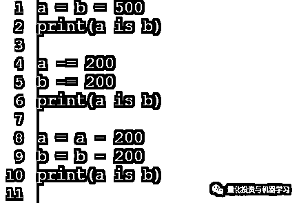

# 挑战 Man Group！顶级对冲基金的 10 道 Python 面试题

> 原文：[`mp.weixin.qq.com/s?__biz=MzAxNTc0Mjg0Mg==&mid=2653300724&idx=1&sn=2ddd2fc5558507930035e40867c717ec&chksm=802de5e1b75a6cf7e5a18f27b2c4d6c52ff52060b94e39f2f783b1b8b7c5685f91d6fa770f91&scene=27#wechat_redirect`](http://mp.weixin.qq.com/s?__biz=MzAxNTc0Mjg0Mg==&mid=2653300724&idx=1&sn=2ddd2fc5558507930035e40867c717ec&chksm=802de5e1b75a6cf7e5a18f27b2c4d6c52ff52060b94e39f2f783b1b8b7c5685f91d6fa770f91&scene=27#wechat_redirect)

量化投资与机器学习编辑部

如果你正在面试一家对冲基金公司，你可能需要看看我们今天为大家提供的题目。

Man Group 量化团队近期出了 10 道 Python 编程题，来考考大家的基本功究竟怎么样。

**请不要借助计算机****不要偷看答案****看看自己的真实水平到底如何**

假如面试时间是 30 分钟或者 1 小时，不管结果如何，这 10 道题目至少让你对自己的编程水平有一个大概的了解。

**文末有一个问卷，你可以看看其他小伙伴都答对了几道题**。

如果你全都答对了，那么恭喜你！你可以和 Man Group 搞 Python 的人喝杯下午茶了 

**题目会越来越难，请开始你的表演吧！**

***1***

**问题 1**

<<< 向左滑动查看

***2***

**问题 2**

<<< 向左滑动查看

***3***

**问题 3**

<<< 向左滑动查看

***4***

**问题 4**

<<< 向左滑动查看

***5***

**问题 5**

<<< 向左滑动查看

***6***

**问题 6**

<<< 向左滑动查看

***7***

**问题 7**

<<< 向左滑动查看

***8***

**问题 8**

<<< 向左滑动查看

***9***

**问题 9**

<<< 向左滑动查看

***10***

**问题 10**

<<< 向左滑动查看

**在没有看答案的情况下，你总共答对了几道题目呢？**

 **/mp/newappmsgvote?action=show&__biz=MzAxNTc0Mjg0Mg==&supervoteid=470065323#wechat_redirect** 

量化投资与机器学习微信公众号，是业内垂直于**Quant、MFE、Fintech、AI、ML**等领域的**量化类主流自媒体。**公众号拥有来自**公募、私募、券商、期货、银行、保险资管、海外**等众多圈内**18W+**关注者。每日发布行业前沿研究成果和最新量化资讯。

你点的每个“在看”，都是对我们最大的鼓励