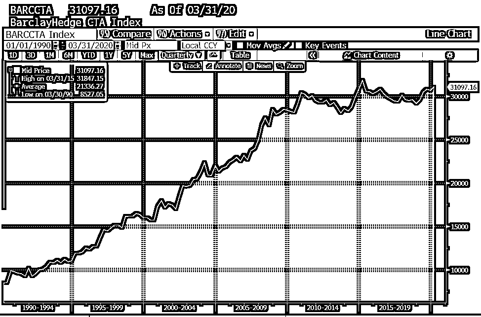
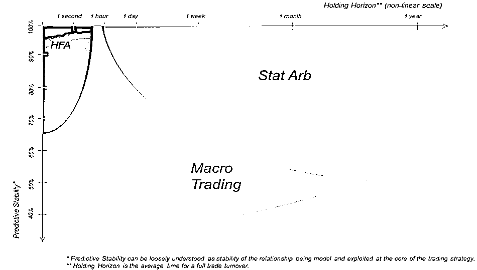
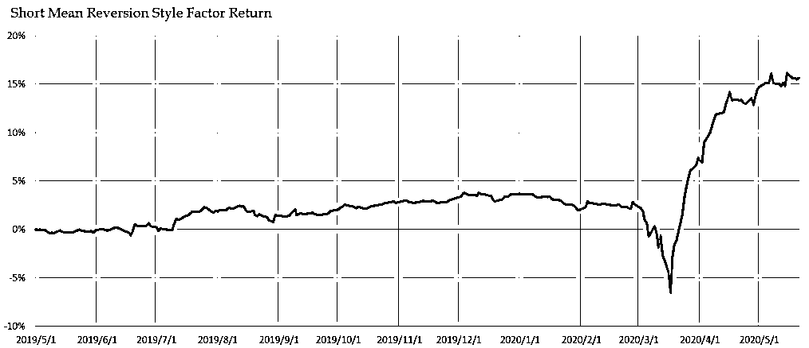

# 干货满满！华尔街对冲基金经理的实战分享

> 原文：[`mp.weixin.qq.com/s?__biz=MzAxNTc0Mjg0Mg==&mid=2653300560&idx=1&sn=25bcbcc79cc890bffa68690ed30e90cb&chksm=802de545b75a6c53e6f286254d8dd419ef64ca0cbc4dad2f8ee3e56a14d38a537195479fe8ff&scene=27#wechat_redirect`](http://mp.weixin.qq.com/s?__biz=MzAxNTc0Mjg0Mg==&mid=2653300560&idx=1&sn=25bcbcc79cc890bffa68690ed30e90cb&chksm=802de545b75a6c53e6f286254d8dd419ef64ca0cbc4dad2f8ee3e56a14d38a537195479fe8ff&scene=27#wechat_redirect)

文 | 投研团队     编辑 | 梵梵

在[《存活下来的幸存者：对冲基金风光的背后》](https://mp.weixin.qq.com/s?__biz=MzAxNTc0Mjg0Mg==&mid=2653300543&idx=2&sn=4bc7d4023aac684fa17c958216819c22&scene=21#wechat_redirect)中我们讲到对冲基金的历史与发展，最近，我们采访了在美国有着十几年对冲基金工作经验的老朋友 Vincent，带大家更近距离地观察华尔街资深基金经理眼中魔幻的 2020 年。Vincent  Zhang，卡内基梅隆大学金融工程硕士，纽约州立大学石溪分校计算机科学博士，曾任职纽约某大型多策略对冲基金公司研究部主管并管理资金规模逾 100 亿美元的对冲基金，擅长统计套利策略、股票多空策略、和全球宏观策略等。现在 Vincent 已成为独立基金经理人，成立了自己的团队，已先后发行了三支投资组合，第一支是全球宏观策略；第二支是美国市场统计套利策略，第三支是新兴市场统计套利策略，在今年三月美股大崩盘中，三支投资组合均获得正收益。Vincent 今年还在筹划发行欧洲的统计套利策略和美国的风险套利和事件驱动策略产品。从 08 年到今年 5 月这 10 来年期间，Vincent 任职的基金管理公司没有一年收益率为负，费后平均年回报率接近 15%，而且在过去的 18 个月中，也只有一个月收益略微为负。以下我们将以问答形式展现我们与 Vincent 的对话：

*   **疫情是冲击也是机会**

*   **主动投资和被动投资会长期共存**

*   **向多策略、多区域、跨市场和跨资产类别发展**

*   **个人实战经验分享**

**疫情对华尔街对冲基金的影响**

**是冲击也是机会** **问：能谈谈 3 月股灾对华尔街对冲基金的影响吗？**
**Vincent：**疫情期间很多对冲基金都受到巨大的冲击，不少基金大幅亏损甚至倒闭关门，但这同时也是种机遇。**对冲基金能赚多少钱依赖于两个因素：一是市场的波动，二是策略模型在样本外的预测准确率**。市场波动能给予对冲基金赚钱的大环境，如果策略模型在样本外的预测准确度高就能赚大钱，如果预测准确度低就会亏大钱。**很多股票多空策略、统计套利策略，即使对冲了市场风险的市场中性策略，仍有可能亏钱：**因为除了市场风险外，投资组合中还可能有其他的风险敞口，如规模敞口，价值敞口，动量敞口，行业敞口等；还有很多对冲基金策略具有同质化现象，如使用了同样的因子的投资组合，如果遇到大额赎回或被迫清盘，就会因为滚雪球效应导致亏钱。许多市场中性策略跑出来的实际效果，并不一定是真的达到了市场中性，即对冲了市场风险。比如做多 100 万再做空 100 万的投资组合，只是投资组合的资金额中性，市场中性应该是 beta 中性，才能使投资组合不受市场波动方向的影响。然而很多策略的 beta 中性，是用历史 beta 得出来的，而在市场波动剧烈的情况下得出的 beta 会不准，会出现 beta shrinkage 的现象，这时候投资组合就不再是风险中性了，大跌时完全可能出现重大亏损。我们在《股票因子的多与空》的最后部分，也对因子投资中的市场中性问题有过探讨。我们分析了几个常见股票因子的多头组合和空头组合，两者在市场风险上的暴露并不一致。假如按 1:1 的比例构造多空组合，仅仅只是资金额中性，并不能免疫市场风险。此外它们的市场 Beta 在时间维度上也存在波动，针对多头组合和空头组合分别使用动态的 Beta 对冲市场风险是更合理的选择。在我们的测试中，基于历史的动态 Beta 的确能大幅提升组合的对冲表现，但是 beta shrinkage 的出现会导致免疫失效。在极端环境（如次贷危机）下，这种因子对冲组合依然面临不小的市场尾部风险。因此，我们在对冲的时候还要考虑当时的市场情形，及时调整对冲比例。 **疫情危机也反映出，基金的策略库中应该既包含收益分布负偏的策略，又包含收益分布正偏的策略。**大部分做套利类型的基金（包括统计套利，事件套利，相对价值套利，以及风险套利等）的收益分布都是负偏的，即大部分时间赚小钱，极端情况下可能亏大钱。如长期资本管理公司 LTCM，连续四年收益净值曲线几乎直线上升，但在俄罗斯主权违约事件中直接亏掉了 90%。反之收益分布正偏策略在今年 3 月的危机中大获全胜，如 Universa Investment 和 LongTail Alpha 就取得了非常亮眼的表现。Universa 回报达 3600%，LongTail Alpha 也有 162%。收益分布正偏的策略主要用期权实现，就是平时每天稳定亏一点钱，但在危机来临的时候会大赚。加州公共退休基金（CalPERS）的基金管理人，自己的策略是收益分布是负偏的，买了 Universa Investment，但他在去年十二月底恰好卖出了，结果今年三月就亏了很多钱。因为他卖出的这个点特别巧合，所以他可能还会面临着投资人的诉讼。因此我投资哲学是，一个基金的投资组合既要包含有负偏的部分又应该包含有有正偏的部分，才是完整的。**本次危机还有一个重要的影响是风险平价策略基本退出历史舞台。**风险平价策略的构建依赖于资产之间的协方差矩阵，但在危机中，各大资产之间的相关性全部打破了，短期内出现同涨同跌现象。很多投资人都看到这一点，认为风险平价策略不再适合他们。另外，当基金挣了很多钱或亏了很多钱的时候，是否需要降杠杆，是否需要人为干预，都是基金经理需要事先有预案的，这能相对减小面对这种极端情况时的压力。我们有过相关的研究《桥水的【风险平价】与【全天候策略】探究》。风险平价策略通过引入杠杆机制，以期在达到风险平价的同时，组合总体收益不会显著地下降。但杠杆会增加资产组合永久性损失的几率：假如你控制不好头寸，或者是波动率上出现较大的计算错误，造成裸空头或者是裸多头，一个回调（暴涨或者是暴跌），都会有可能打爆你的仓位，导致 margin call，没有无限流动性的话，就只能平仓了，本次疫情将风险平价的问题显露出来。**主动投资的趋势**

**主动投资和被动投资会长期共存** **问：我们常说最近十年是主动投资失去的十年。最近这一轮大牛市，不管是巴菲特也好，还是传统的多因子选股策略也好，基本上都完全跑输大盘指数，巴菲特干脆让投资者买指数基金了。您觉得接下来主动基金的前景如何？**
**Vincent：****我的大观点是主动投资和被动投资会长期共存**，而且主动投资其实也分像贝莱德这样的资产管理类公司和我们这类的对冲基金公司。 虽然两种公司都是主动投资，但本质上很不一样，资产管理公司一般追求相对收益，而对冲基金追求的是风险调整后的绝对收益。有人说过去十年是对冲基金失去的十年，其实有几个方面需要注意一下:第一点，过去 10 年因为美联储长期的量化宽松证词，股市一路高歌猛进，但是如果看 08 年金融危机或者今年这样的行情下，可能主动投资的业绩都会好很多。所以仅仅选取过去十年这个时间段对于主动投资来说其实是不太公平的，如果是看过去 5 年，或过去 20 年，或再之前的 20 年，你都会得出不同的结果。投资风格各异，在任何一段特定的时期里，都会有不同的投资方式的收益率脱颖而出。第二点，对冲基金类的主动投资来说，会对冲掉很多风险。 其实不应该去跟大盘比。我们更多是追求业绩的长期稳定，所以在策略表现层面更多的会考虑夏普比率要高，而且会对冲很多市场风险，这是我们的一个优势。像今年，如果能正确对冲掉市场风险，其实是没什么损失的，但是如果没有对冲的话，损失会是很大的。第三点，主动投资和被动投资的目标客户很不一样。不同类型的公司和基金类型，面向的客户群体也是不同的，有一些面向大众，有一些面向高净值客户，他们有不同的市场需求，给市场带来了不同的价值。像我做的对冲基金就是为了给高净值客户带来稳定的收益，虽然我们会收取一定的费用，但是稳定的收益正是他们所需求的，他们想要的不是单车变摩托，而是每年百分之十几稳定的资产增值。**问: 接下来的时间里，主动投资会迎来春天吗？****Vincent：我觉得未来这段时间，对主动投资来说是比较好的环境。**过去 10 年是大盘涨了很多，主动投资的基金有很多没跑赢大盘（当然也有一些优秀的对冲基金依然提供了比大盘更高的收益率），但是今年的情况是不同的，主动投资，包括我们对冲基金其实是没亏这么多钱，还有很多其实收益率很好。今年 3 月份彭博出了篇文章说 “Finally, Hedge Funds Do Their Jobs.” 虽然是句玩笑话，但是事实上对冲基金确实今年跑赢了大盘。**另外，疫情会导致行业之间分化明显**，像生物医药行业和各种提供在线服务的行业成为了朝阳产业，而像旅游航空交通这些行业变成了夕阳产业，这些行业之间的表现差异性和区分度会加大，这样会使主动的做一些行业轮动策略更有价值，这就比投资被动的大盘指数 ETF 更好。所以我会比较看好未来 10 年主动投资基金的发展。再加上未来相当长一段时间资产的高波动率也将会是一个常态，这对做套利策略的基金会非常有利。但是话说回来，**对于大部分人，我还是会像巴菲特一样建议去投指数基金**，因为大部分人没有太多能力去做这样主动的配置，而且也没太多的条件去投，所以投指数基金其实是个不差的选择。而且由于很多人是配置他们的保险金账户或者是退休金账户，钱要到他 60 岁之后才会取出来。这样的话他就不会计较目前一个月或者一年的得失，更应该在意 30 年 40 年这么一个长期的过程。实际上只要你相信经济还在发展、社会还在进步，金融市场总市值也是会稳步增长的，3、40 年肯定是上升的一个趋势。所以投资 ETF 其实是比较好的一个选择，费用低，而且从 30 年长时间维度上来讲其实也是比较安全的。**但对于高净值客户，我建议配置一些对冲基金**，像我们的基金在过去十几年，业绩也是非常好的，过去 10 年没有一年为负，税后平均年回报率接近 15%，过去 18 个月，我们只有 1 个月略微为负，这样的业绩也是高净值客户希望得到的。**问：近几年许多 long only 量化多因子策略都跑输大盘，你对这一现象有什么看法?****Vincent：**这是可能的，但这涉及另一个关于 alpha 模型的问题，不管是 long only 还是 long/short，long only 可能跑输大盘，long/short 也可能跑输现金，这跟因子的选择或者 Alpha 模型构建的方法有关系，而且广为人知的因子会因为过度拥挤往往会失效，我在后面会讲如何建一个更好的模型。**问: 在最近的一两年，危机的来临总是极其迅速，市场的转向也是迅猛无比。比如本次 Covid-19 危机，大盘在 22 个交易日内下跌超过 30%创下了历史最快纪录，但紧接着在 1 个多月内已经上涨了超过 30%。大多数做趋势跟踪的 CTA 策略经常被来回打脸。如果接下来再次出现危机，你觉得 CTA 策略仍然能像以往那样捕捉到 Crisis Alpha 吗？CTA 策略在未来会有哪些值得关注的改良方向？ **资料来源：Bloomberg**Vincent：**从 Barclays 的 CTA 策略收益指数来看，之前的回报是非常好的，但是从 2010 年开始，净值已经趋于平缓，没有多少正回报了。我觉得传统基于长期趋势的 CTA 策略很难存活下来了，但是对于现在大多数提及的 CTA 策略，其实是包含了像价值，动量，波动率和其他因子结合起来的 CTA 策略。总体来说会好一点，但是广为人知的东西或方法，一般来说就很难赚钱了，所以还是很难存活下来。**关于 CTA 的改进方面，既然长期的趋势信号可能不太有效了，大家可以多关注中短期一些趋势反转或者趋势拐点的信息**。像在 3 月份来回打脸的情况下，盲目跟踪趋势肯定是要被打脸的，所以要做拐点预测，或者不光做趋势，还要将其他方面的信息加入模型当中，比如基本面信息、新闻、宏观信息，加入这些信息都可以改进 CTA 策略的表现。简单理解就是，多加些不同维度层面的因子到模型当中，不过这些因子的使用也不能一刀切，期货有很多类型，如股指期货、债券期货和商品期货， 同一则新闻对股票、债券、商品和外汇市场的影响都是不同的，不能直接把同样的方法照搬到不同的资产上。所以，构建趋势追踪策略还是要把握不同资产的特点，这就要看每个人自身的分析能力了。我们也曾在《如何在股灾中赚取超额收益？》中详细测试并谈到 CTA 策略：每一个策略都有不同的侧重点，管理型期货在股灾中超额收益的属性，不能被神化，也不能被忽略。管理型期货策略说到底还是属于“另类资产”，需要与其它的资产组合起来，通过大类资产的科学配比，发挥其黑天鹅事件的逆向属性。知其然，还要知其所以然。必须清楚地了解了策略的属性和构造之后，我们才能真正的用好这个策略。另外管理型期货策略普通投资人做起来是很难的，需要专业的管理人员进行配置。**问：对于目前疫情中后期这个时间段，您对做全球资产配置有什么建议呢?****Vincent：我个人觉得发达国家市场整体的疫情恢复情况会更可控，比较有保障一些，可以考虑多配置美元欧元资产，小币种资产要慎重。** 美元长期我是看涨的，虽然现在美国基准利率降为 0，但是如果长期来看，美国基准利率一直高于欧盟区。而且美国现在与以前不同了，现在美国已经成为最大产油国，造成了国际石油美元的萎缩，所以美元长期依然会有升值压力。**另外的话，尽量避免配置新兴市场的资产。**如果为了做好分散化，还可以配置些加密货币或者黄金这些资产，以及有良好现金流的资产，比如美国国债这类的资产，也可以多配资。如果配置股票的话，最好不要买整个大盘 ETF，可以配行业板块的 ETF，把握疫情后不同行业板块分化的行情。但是说实话，如果让个人投资者来考虑这么多问题还是比较困难，所以如果真有这种需求的话，我觉得可以交给专业投资人来管理。**问：你觉得中国市场怎么样，是否值得配置?****Vincent：**中国市场我比较看好，首先疫情恢复情况现在来看是最好的，各方面的风险压力比较小，其次中国的产业链比较全面，而且不同于美国第三产业比较发达的情况，中国的大头是制造业，而制造业受疫情的影响会比较小，所以中国的资产可以多配置些，但建议要密切关注中美贸易谈判走向。**如果让我提配置建议的话，我的地域配置优先级首选是中国，其次美国，然后是欧元区**，虽然比美国差一些，但是我觉得欧元区作为一个体系对风险的承受能力还是很强的，而且现在疫情也在逐步恢复。有人会问日本如何，我觉得如果要配置的话日本也可以，但日本一般不把它作为单独的一个大块，而是作为亚太市场的一部分。**问：关于全球战略资产配置，你会倾向通过运用宏观经济指标去做配置，还是根据行业层面的指标去做这方面的配置？****Vincent：**其实两种都可以，这两种正对应着两种不同的投资方法，通过宏观指标的配置方式是自上而下(top-down)的投资方式，而通过个股和行业指标去做配置的方式叫做自下而上(bottom-up)的投资方式。其实业界大部分人是做的是自下而上, 也就是选股选行业，做自上而下的人相对较少。我人为这两种方式有不同的应用场景，可以结合起来。**问：但是宏观经济指标数据频率比较低，你对 top-down 的这种投资方式有怎样的看法？****Vincent：**首先，做全球宏观策略可投资的资产数量确实比较少，美国市场中流动性比较好的标的, 包括股指，外汇，债券，以及大宗商品加起来可能也就几十个，不像做股票策略，在美国市场就有几千个标的，扩展到全球有上万个标的。其次，宏观经济数据频率比较低，数据深度比较浅，而且数据比较滞后，数据种类也没股票市场丰富；再次，宏观策略受政策影响比较大，有时可能需要更多的人为介入，因为面对一个数据缺失的复杂的场景，投资经理的判断有可能会比模型更加可靠。比如这次石油暴跌，基金经理自己是需要根据交易所提供的新信息，加入自己的判断去介入的。以上这些都是自上而下地做全球宏观策略的障碍。但是这也有好处，就是策略不会那么拥挤。在美国对冲基金里面，做股票的份额是最大的，因为股票会比较容易量化也比较容易做的稳定，做宏观策略的相对少些。**但宏观策略和股票基金的相关性非常低，如果能够将自上而下的宏观策略与自下而上的股票策略相结合，将会非常棒。****问: 贝莱德的 Andrew Ang 的观点是资产配置不应该是配置资产，而是配置宏观因子，你对他的思路有什么看法？****Vincent：**既然股票可以做多因子策略，资产配置应用同样的思路是完全合理的。但宏观风险因子比较分散，可能没有那么明显，不会像股票市场有几个显著的系统性风险。所以我个人觉得，用主成份分析(PCA)的方法对所有资产提取影响其收益的主要因素，效果可能并不明显。但是对于单一市场，如债券市场，利率水平，斜率和曲率等因子，对债券收益还是有不错的解释能力；在农产品上，如分析大豆与小麦的相关性，可能也可以构建出对商品期货农产品收益有一定解释力的因子，但 PCA 对整个宏观市场的解释能力有限，**因此我建议宏观因子配置还是要到细分的资产类别去做。****对冲基金的未来**

**多策略、多区域、跨市场和跨资产类别的**

**策略会有更大的发展** **问: 统计套利策略在高频交易公司越来越多的情况下，套利空间是否在逐渐缩窄?****Vincent：我的观点是高频交易跟统计套利是两个截然不同领域**。见下图，坐标有两个轴，横轴是持仓时长，纵轴是预测能力，颜色越深代表预测的稳定性有多高。 高频交易在黑色区域，持仓周期在秒级以下，但是预测的准确率非常高，而统计套利在绿色区域，持仓时长在一分钟以上到几个月左右的区间，但是预测稳定性不如高频交易。 资料来源：金融教材**高频交易的特点是利用市场的微观结构, 做速度套利，基本是无风险的，但最终结果是胜者通吃，且利润越来越薄。统计套利这块非常不一样，统计套利这块资金容量比较大**，我之前运行了 100 多亿美元的统计套利基金，容量较大，算法和预测的模型比较复杂，速度要求不是很高，并不需要每秒每毫秒去做套利。假如我预测了一小时或者几天或者几个月之后的一些事情，就不可能有很多人的预测都跟我一样。所以统计套利策略同质化的可能性不大，套利空间很难被完全抹平。统计套利策略更注重一些中期预测，从分钟到几个月。这个区间有很多信号，虽然很难有强信号，但我们会把很多弱信号整合成一个强信号，对股票未来走势进行预测。与此同时，我们还会做组合优化与风险控制，再做交易成本分析，然后再交易。从这个过程上看，统计套利跟高频交易是两个完全不同领域。**高频交易公司实际上在 2010 年左右发展已经遇到瓶颈了，到 2011 和 2012 年左右竞争达到白热化，大家在拼速度、拼设备，我们称之为军备竞赛**。这种激烈的竞争导致一些高频交易公司不得不开拓其他市场，很多高频交易公司试图进军统计套利市场，但是没有一家成功。举几个例子，进军统计套利市场有好几家，比较著名的一家叫 Knight Capital, 还有一家叫 Teza，还包括 Tower Rsearch，但是他们都失败了。我认为这是因为做高频交易跟统计套利的人，有着不同的思维方式和不同的风险承受程度。做高频交易的人没有资产组合的概念，没有风险的概念，也没有用资产组合分散风险的概念，不会做资产组合去优化。他们擅长拼速度拼硬件拼设备，同时风险承受程度也远远低于统计套利策略，做惯了无风险套利的人无法忍受哪怕是一天的亏损。所以当他们进军统计套利领域时，亏损了几天，就觉得难以忍受。然而在统计套利领域亏损几天还是比较常见的，但是只要一年 250 天里有一半以上时间挣钱（实际上远远高于一半的时间挣钱），再加上资金量大，最后组合的 PNL 是非常可观的。做高频交易跟做统计套利的需要的技能也是不一样的。对于高频交易策略来说，速度就是一切。举个例子，标普 500 指数期货在芝加哥交易所交易，而标普 500 现货的 ETF 在纽约交易所交易，两个产品的标的一样但是有价差，有人就想套利。芝加哥和纽约的距离很远，基本上依赖于光纤通道来传输报价。但光纤不是百分百的光速，而是只有 2/3 的光速，因为光纤信号在通道里要打折线，所以有的公司就思考，我能不能通过点到点的直线传播来基本达到光速来传递报价信息，这样的话就能比别人快，能第一时间知道这个价格我就能知道应该向哪个方向套利。所以七八年前就有公司专门花了一两年时间建了一条微波通道。建立方法也很简单，比如看纽约到芝加哥要经过一座，就在山顶上架一个微波中继站，要经过大楼，就租赁大楼的顶部加一个微波站。花了一两年时间，微波通道就打通了，因为是点到点，所以可达 99%的光速，这公司就赚大发了，导致其他人没有了套利空间。其他公司说那不行，我也要搞微波通道，所以后面就有公司甚至想直接买最先进的微波技术公司来获取速度优势，这样到最后，大家都在硬件设备上花钱，但设备开销很大，导致高频交易的利润空间越来越薄，也很难以持续下去。**高频交易拼的是速度，统计套利拼的是研究能力，拼的是投资或交易模型**。未来价格走向预测的好不好，就要看研究能力如何，这和高频交易是完全不同的。所以让高频交易公司去开发统计套利策略，去拼研究能力，这可能不是他们最擅长的。这就好比短道速滑和花样滑冰，两种都是滑冰，但两个是不一样的赛道。**统计套利的利润空间确实在缩窄，但这不是因为高频公司，而是因为近些年来的策略有同质化倾向。**因为各大对冲基金的基金经理和研究员的互相跳槽，导致各家所用的数据和策略比较类似，大家一起来分一块饼，每个人分到的也越来越少，那么套利的利润空间也在缩减。而解决方案就是要创新，开发新的模型、新的思路，跳出原有的框架做不一样的东西，把饼做大。随着这个领域的不断创新，以及未来资产的波动率的增加，我认为统计套利的利润空间也会回升。**问: 为什么在提取信号这块很多机器学习的方式不管用?****Vincent：**因为机器学习应用的好的场景是需要可预测性很强的。比如说用深度学习做图像识别，这个是汽车还是人，这些图像的特征提取相对明确，R-square 可以很高，而且今天的汽车和明天的汽车样子差不多，中国的汽车和美国的汽车也很类似。然而在金融市场上主要是弱信号，弱特征，每次的预测信号的 R-square 可能有 0.001 左右就不错了，市场数据看似相似但绝不重复。**所以金融市场没有强信号，做量化策略不能只看单一信号，单一信号通常是弱信号，我们需要要将很多微弱信号整合成一个较强的信号**，这样在预测能力上才能有实质提升。另外，我们不能否定机器学习在金融市场的应用。在很多情况下，机器学习依然能够帮助我们在金融市场进行信号挖掘和信息整合，我的意思是不能盲目套用，要了解其特点和局限性，并更好的利用它来为我们服务。**问: 您觉得对冲基金未来的趋势和挑战是什么？****Vincent：未来靠单一信号单一策略的时代已经过去，以后一定要向多策略、多区域、跨市场和跨资产类别发展**(multi-strategy, multi-region, cross markets and cross asset classes)。这些东西都要去不断地整合和分析才可能生存，这也是未来的一个趋势。**其实量化投资就是两个东西，数据和模型**。在数据方面，我觉得以后的趋势是去获取一些以前不常见的新数据，才能有新的 alpha 来源。例如供应链数据、卫星数据、传感器数据，图像甚至视频数据等等，包括现在经常听到的大数据。这些数据都可以拿来做金融市场的预测，以前不常用或者比较难用的，你都要去看看怎么去挖掘一些有用的信息出来。而模型方面，因为数据的复杂带来模型的复杂度，我觉得需要建立非线性模型，例如机器学习模型，他比较适合分析一些高维的非线性非结构化的数据。以前包括现在华尔街的主流模型多数还是线性模型，如大多数动量因子都是通过线性模型构建，但资产未来价格上涨与资产过去的价格的线性关系不一定十分完美。而挖掘基本面的数据就更需要非线性模型，比如公司的价值和分红与未来股价上涨显然并不是纯粹的线性关系。但是我还有一个观点是，**虽然我们面对着一个复杂的世界，但是一定要把它简单化，不要过度追求模型的复杂和花哨**，比如现在很多公司流行用深度学习这些东西，其实它未必适用于一些金融模型，我们可以做一些探索性的前沿尝试，但并不是说技术越先进模型越花哨就越好，一个成功的投资模型应该是一个简单的创新，它要能把握金融市场一些本质的运行规律，大道至简。**个人实战经验分享****问：在您十几年的从业经验中，有哪些策略研究的经验想跟同行们分享一下？**
**Vincent：**在美国，做宏观投资的和做股票套利的通常是两类不同的基金经理，能够两边同时做的比较少。我是两类都做，做个股我要看个股的基本面也要看技术面，还要看很多其他信息，但这些信息我可能不一定是拿自己肉眼去看，而是通过机器去帮我分析。**做股票统计套利，我主要关注股票和股票之间的关系；我做全球宏观时，就得看不同资产类别的收益**，当然我也会把股票套利研究方法去拓展到到一些宏观产品，如一些指数和指数成份股，来实现宏观策略。很多宏观投资经理不懂交易算法，比如他们有可能会预期资产增值 10%，但是后来发现涨了 3%就涨不上去了，其实这是算法交易在收割利润而造成的市场冲击。所以有宏观投资经理开玩笑说，现在 Global Macro(全球宏观)在向 Global Micro（全球微观）方向发展，不懂算法交易就很难理解很多市场行为。同样的，很多做量化套利的基金经理会执着于对微观的套利算法的研究而对宏观市场环境认识不足。在我看来，宏观和微观的市场研究缺一不可。我的策略是跨多种类型资产交易，涉及股票、债券、外汇期货、能源期货、工业金属和贵金属，还包括各种农产品期货，这是我比较有优势的一个方面。传统的华尔街基金里面，大部分做股票的基金经理基本只做股票，如基本面、多因子、多空策略，当然这种我也做，但是我现在除了做这些之外，也做了很多跨资产的策略。我在这个领域十多年，经历过几轮周期，也发现传统策略的不足。我既有计算机背景，又有金融背景，同时在金融背景里面我的背景也比较综合，而且美国市场、欧洲市场，亚太区市场和新兴市场都做过，这给了我非常有利的思维方式。虽然说宏观资产数量较少，但我还是可以把股票统计套利的思维方式应用在做全球宏观策略上，也可以把在新兴市场策略研究中获得的一些启发应用到美国市场中，这样我的策略构建就会与大多数传统策略不一样。而这样的话，即使是之前没有做过的新的市场，我也可以去适应它，有针对性地设计合适的投资策略。**问：进入一个新的市场，是不是得重新调整各种参数，这些参数和美国市场不一样吗？****Vincent：**每个市场有每个市场的特点，可能有些思维方式类似，但是照搬肯定不行。比如美国市场交易是 t+0 制，而中国市场是 t+1 制；美国市场是比较成熟的市场，有各种类型的玩家，以机构投资为主，机构投资中还有共同基金、对冲基金、养老基金还有外国投资者等等是非常成熟完善的市场，而中国的股市散户交易占比很大。而且美国是一个分散的市场，美国股票市场有 13 个交易所，而且美国证监会还要求订单一定要在全市场范围内的最优报价成交，此外美国还有很多场外市场和暗池， 都可以交易股票，而中国市场只有沪深两个主要交易场所，有些国家可能只有一个，而且中国还没有完善的做市商制度。市场微观结构不一样，交易规则不一样，所以交易策略也不能够一概而论，这非常考验经验和分析能力。 简单总结一下就是，**一是要因地制宜，另一个就是自己思维要开放**，作出跨界思考，这样去理解另一个事情的时候，就有一些独特的角度。要战胜市场一定要有创新，不能照搬过去的做法，或者从这个公司学到的策略照搬到另外一个公司，一定要形成自己独立的思考能力。**问：能否分享一下当市场出现危机时，您是怎么处理的？**下面这张图是短期的反转因子的滚动一年的回报率，中间的最大回撤正是发生在今年 3 月左右。

数据时间：2019.05.01-2020.05.01，MSCI

**我的第一个想法就是一定要活下去**，什么意思呢，比如说 3 月时你的统计套利策略亏了 5%， 怎么办？很多人说你不用管，等着反弹，但是作为一个优秀的基金管理人的话，可能就不应该这么想，5%的时候你并不知道是不是最坏情况了。5%的回撤对于统计套利策略来说已经非常大了，如果我们用了杠杆，5 倍杠杆是亏 25%左右，10 倍杠杆就是亏 50%。50%的亏损，这足以导致你的基金倒闭。面临重大回撤的时候，应该继续顶着压力运行组合，等反弹的一天吗？我会先止损，为什么？因为我要先活下去，杠杆后亏了百分之十几还是可以忍受的。我先止损，活下来后，再谈以后能不能挣钱。哪怕后面一直反弹，我也不会特别遗憾，毕竟活下来了。但如果继续等着反弹，可能还没有等到反弹的时候就死掉了，倒在了黎明前。如果回撤进一步加大，有可能就会面临着客户的巨额赎回，也就没有机会反弹了。所以我的建议是先活下去，然后再想怎么把亏损挽回过来。当然， 如果你运营的是自营资金的而且能够承受更高的风险的话，那是另外一回事。2008 年时文艺复兴也一度亏了很多钱，管理层开会讨论是要继续运行组合还是止损减头寸。当时很多人不赞成人为干预模型，认为肯定会反弹，但西蒙斯力排众议快速减仓。西蒙斯说现在回头看，他不后悔当初的的决定，哪怕让他再重新做一次抉择，他还是会减仓，虽然不减仓基金可能会有惊人的收益率，但是减仓保证了基金一定可以活下去。**还有一点想分享的是心态一定要平和**。挣钱的时候要注意控制风险，挣钱时你可能会觉得自己的投资水平超群，在策略研究和市场分析上放松了，说不定黑天鹅就在前方不远处；亏钱的时候你也不能方寸大乱，始终要知道自己做投资决策的依据是什么，并且要随时依据市场环境来做调整。做基金经理心态一定要平和，不然受不了这个压力。**写在最后**复杂的模型不一定等于好的模型，简约而不简单，才是真理。在千变万化的资本市场中，投资人也一定要找准自己的定位，对于大多数普通投资者来说，通过 ETF 进行投资和配置是一种成本低、操作性行强的投资选择。最后，感谢 Vincent 满满干货的分享，让我们在了解了华尔街一线基金经理眼中，在本次新冠疫情带来的全球资本市场大地震后，未来对冲基金策略发展的趋势。希望大家有所收获。

量化投资与机器学习微信公众号，是业内垂直于**Quant、MFE、Fintech、AI、ML**等领域的**量化类主流自媒体。**公众号拥有来自**公募、私募、券商、期货、银行、保险资管、海外**等众多圈内**18W+**关注者。每日发布行业前沿研究成果和最新量化资讯。

你点的每个“在看”，都是对我们最大的鼓励