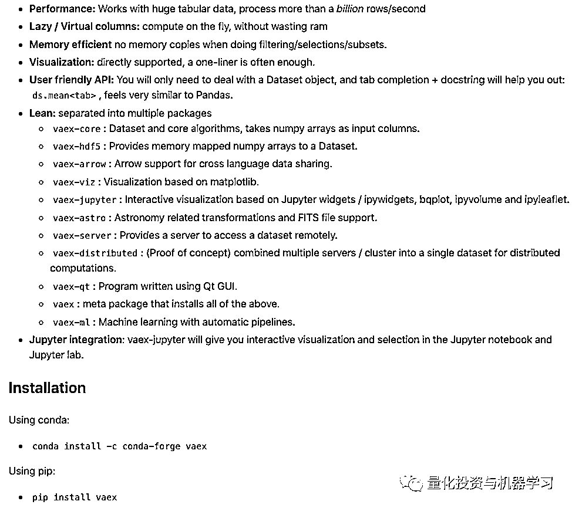
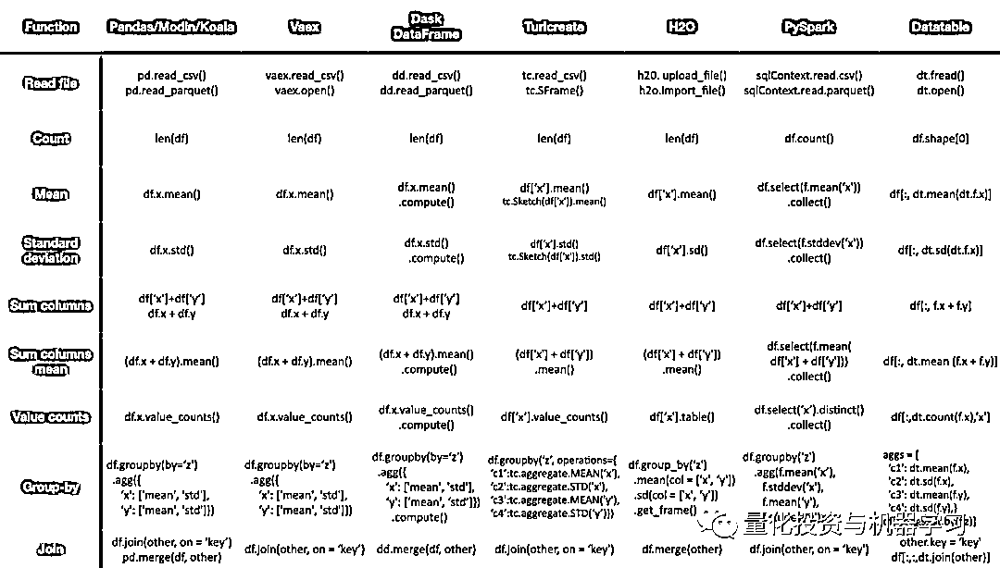
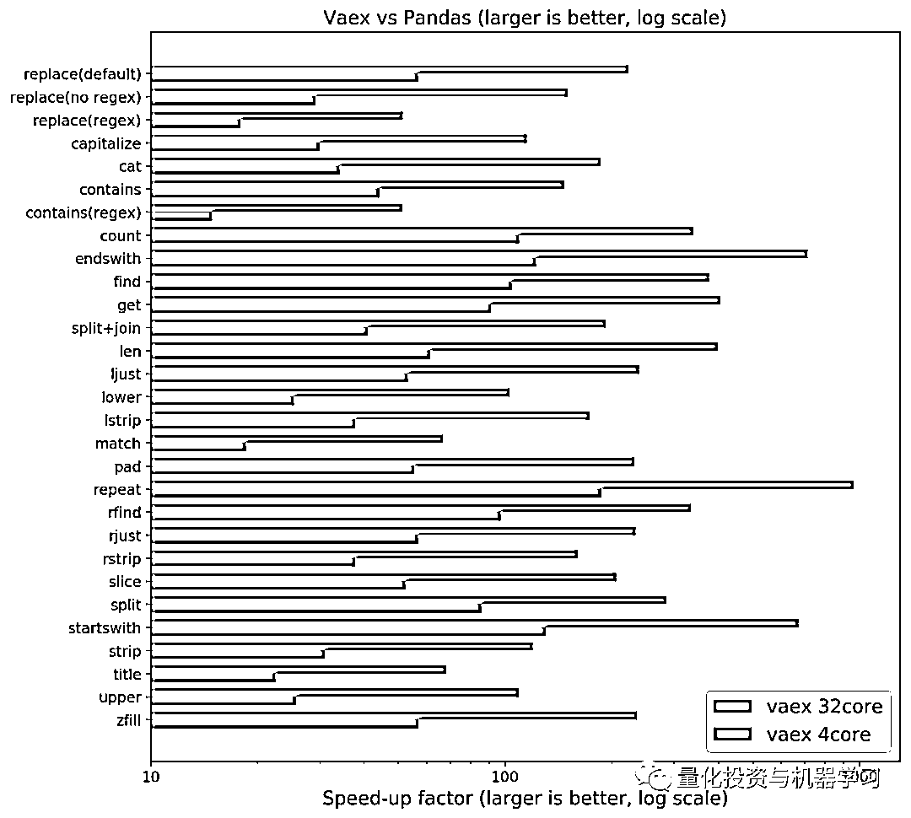
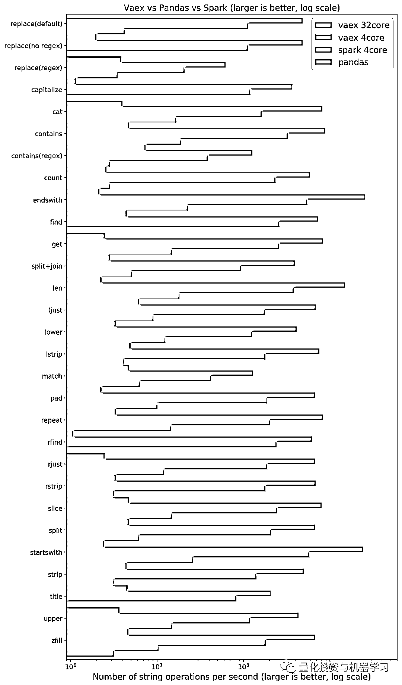
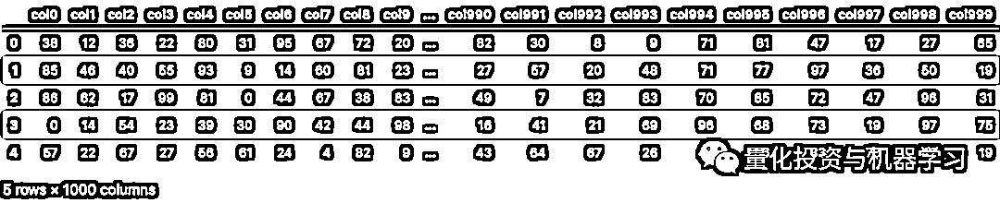
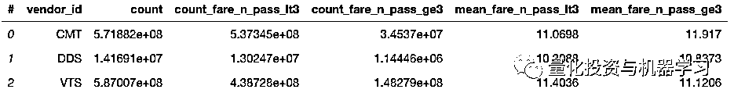
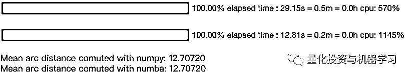
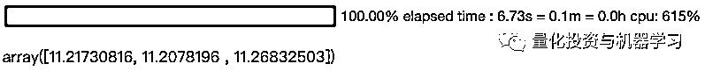
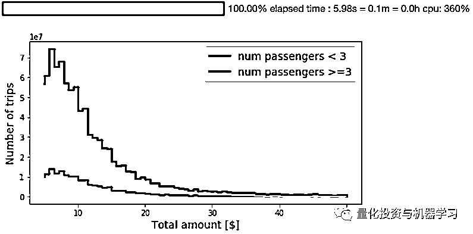
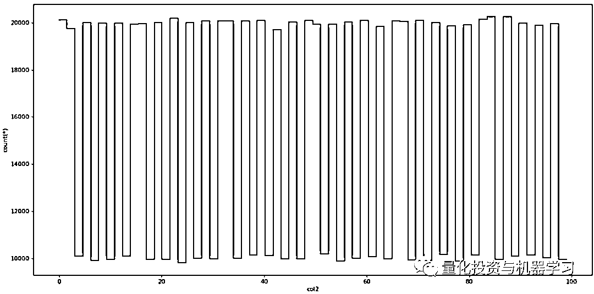

# 仅需 1 秒！搞定 100 万行数据：超强 Python 数据分析利器

> 原文：[`mp.weixin.qq.com/s?__biz=MzAxNTc0Mjg0Mg==&mid=2653300441&idx=1&sn=53926172a6739e2c7a33fe74c79e5489&chksm=802de4ccb75a6dda4fa8dbe08586540a8864791bf5593845a2ff368897b99b4e13d57cfc15e2&scene=27#wechat_redirect`](http://mp.weixin.qq.com/s?__biz=MzAxNTc0Mjg0Mg==&mid=2653300441&idx=1&sn=53926172a6739e2c7a33fe74c79e5489&chksm=802de4ccb75a6dda4fa8dbe08586540a8864791bf5593845a2ff368897b99b4e13d57cfc15e2&scene=27#wechat_redirect)


作者：Maarten、Roman、Jovan 

编译：1+1=6

**相关文章**

**[1、30 倍！使用 Cython 加速 Python 代码](http://mp.weixin.qq.com/s?__biz=MzAxNTc0Mjg0Mg==&mid=2653293723&idx=1&sn=8fcb3effaffd583882d5ffe13b330fe2&chksm=802dce8eb75a4798bcb14f9f9cb19b1333c2e31d78fc837448b8a4c8990da9ad083c7fe5ecee&scene=21#wechat_redirect)**

**2、[CuPy：将 Numpy 提速 700 倍！](http://mp.weixin.qq.com/s?__biz=MzAxNTc0Mjg0Mg==&mid=2653294102&idx=1&sn=5dc9d21b3497fe6e1c8df98ee61e02c7&chksm=802dcc03b75a4515a630076cbbe4d116ba1897f4fbb961b0811a888272f9e12953c3ca967c3c&scene=21#wechat_redirect)**

## **[3、71803 倍！](https://mp.weixin.qq.com/s?__biz=MzAxNTc0Mjg0Mg==&mid=2653294130&idx=1&sn=42756891c73ab8b1ecbd6395efef4aba&chksm=802dcc27b75a4531d81719002ac6e62affe4c8e19b56347200bff0502ea44f6edddbbfdffdba&token=607437153&lang=zh_CN&scene=21#wechat_redirect)[超强 Pandas 循环提速攻略](https://mp.weixin.qq.com/s?__biz=MzAxNTc0Mjg0Mg==&mid=2653294130&idx=1&sn=42756891c73ab8b1ecbd6395efef4aba&chksm=802dcc27b75a4531d81719002ac6e62affe4c8e19b56347200bff0502ea44f6edddbbfdffdba&token=607437153&lang=zh_CN&scene=21#wechat_redirect)**

**[4、10 个提高工作效率的 Pandas 小技巧](http://mp.weixin.qq.com/s?__biz=MzAxNTc0Mjg0Mg==&mid=2653293923&idx=2&sn=3c344ab8661a2d9d6b79caa6f253f35d&chksm=802dcf76b75a466080145f290dc01ddc5775906e16e04cec5d48a10f1356b37b2644fd67a38a&scene=21#wechat_redirect)**

**5、[CPU 靠边站！使用 cuDF 在 GPU 加速 Pandas](https://mp.weixin.qq.com/s?__biz=MzAxNTc0Mjg0Mg==&mid=2653294764&idx=1&sn=bcd1c5396ea631f2b15a64cf19fe0108&scene=21#wechat_redirect)** 

**6、[1000+倍！超强 Python『向量化』数据处理提速攻略](https://mp.weixin.qq.com/s?__biz=MzAxNTc0Mjg0Mg==&mid=2653296308&idx=1&sn=254bcaa023ac25e883a2b2b44293b3f3&scene=21#wechat_redirect)** 

**7、[Datatable：Python 数据分析提速高手！](https://mp.weixin.qq.com/s?__biz=MzAxNTc0Mjg0Mg==&mid=2653297525&idx=1&sn=c57fe41418041fcc10186f3b48bdbf53&scene=21#wechat_redirect)** 

*****1***** 

****前言****

**使用 Python 进行大数据分析变得越来越流行。这一切都要从 NumPy 开始，它也是今天我们在推文介绍工具背后支持的模块之一。** 

*****2*****

****Vaex****

****Vaex 是一种更快、更安全、总体上更方便的方法，可以使用几乎任意大小的数据进行数据研究分析**，只要它能够适用于笔记本电脑、台式机或服务器的硬盘驱动器。** ****

**https://vaex.readthedocs.io/en/latest/**

**Vaex 是一个开源的 DataFrame 库，它可以对表格数据集进行可视化、探索、分析，甚至机器学习，这些数据集和你的硬盘驱动器一样大。**它可以在一个 n 维网格上每秒计算超过 10 亿（10⁹）个对象的平均值、和、计数、标准差等统计信息**。可视化使用直方图、使用直方图、密度图和 3D 立体渲染进行可视化。为此，**Vaex 采用了内存映射、高效的外核算法和延迟计算等概念来获得最佳性能（不浪费内存）**。所有这些都封装在一个类似 Pandas 的 API 中。**

****GitHub：*****https://github.com/vaexio/vaex*****

****

*****3*****

****Vaex vs Dask、Pandas、Spark****

**Vaex 与 Dask 不同，但与 Dask DataFrames 相似，后者是在 Pandas DataFrame 之上构建的。这意味着 Dask 继承了 Pandas issues，比如数据必须完全装载到 RAM 中才能处理的要求，但 Vaex 并非如此。** 

****

****Vaex 不生成 DataFrame 副本，所以它可以在内存较少的机器上处理更大的 DataFrame。****

**Vaex 和 Dask 都使用延迟处理。唯一的区别是，**Vaex 在需要的时候才计算字段，而 Dask 需要显式地使用 compute 函数。****

****数据需要采用 HDF5 或 Apache Arrow 格式才能充分利用 Vaex。****

**1 亿行的数据集，对 Pandas 和 Vaex 执行相同的操作：**

****

**Vaex 在我们的四核笔记本电脑上的运行速度可提高约 190 倍，在 AWS h1.x8 大型机器上，甚至可以提高 1000 倍！最慢的操作是正则表达式。正则表达式是 CPU 密集型的，这意味着大部分时间花在操作上，而不是花在它们周围的所有 bookkeeping 上。**

**Apache Spark 是 JVM/Java 生态系统中的一个库，用于处理用于数据科学的大型数据集。如果 Pandas 不能处理特定的数据集，人们通常求助于 PySpark。如果你的工作是生成结果，而不是在本地甚至在集群中设置 Spark，那么这是一个额外的障碍。因此我们也对 Spark 进行了同样的基准操作：**

****

**Spark 的性能比 Pandas 更好，这是由于多线程的缘故。但 vaex 比 Spark 做得好得多。Spark 以每秒 1000 万串的速度运行（并且会随着内核和机器的数量增加）。Vaex 每秒可以处理 1 亿条字符串，并且会随着内核数量的增加而增加。在 32 核的机器上，我们每秒钟处理 10 亿个字符串。**

*****4*****

****Vaex 真的很快！****

**流程都一样：**

```py
`pip install vaex` 
```

**让我们创建一个 DataFrame，它有 100 万行和 1000 列：**

```py
`import vaex
import pandas as pd
import numpy as np
n_rows = 1000000
n_cols = 1000
df = pd.DataFrame(np.random.randint(0, 100, size=(n_rows, n_cols)), columns=['col%d' % i for i in range(n_cols)])
df.head()` 
```

****

**这个 DataFrame 占用了多少内存呢？**

```py
`df.info(memory_usage='deep')` 
```

**把它保存到磁盘，这样我们以后可以用 Vaex 读取它：**

```py
`file_path = 'big_file.csv'
df.to_csv(file_path, index=False)` 
```

**直接通过 Vaex 或直接读取 CSV，这速度将类似于 Pandas。在我们的电脑上，两者都需要大约 85 秒。**

**我们需要将 CSV 转换为 HDF5，才能看到 Vaex 的优点。**

**事实上，Vaex 只受可用磁盘空间的限制。如果你的数据不是内存映射文件格式（例如 CSV、JSON），则可以通过与 Vaex 结合 Pandas I/O 轻松地转换它。**

****我们可以将它转换为 HDF5 并用 Vaex 处理它！****

```py
`dv = vaex.from_csv(file_path, convert=True, chunk_size=5_000_000)` 
```

**上面的函数将自动创建一个 HDF5 文件并将其保存到硬盘。**

**检查一下 dv 类型：**

```py
`type(dv)
# output
vaex.hdf5.dataset.Hdf5MemoryMapped` 
```

**现在，让我们用 Vaex 处理**7.5GB 的数据集**——我们不需要读取它，因为我们在上面的 dv 变量中已经有了它。这里只是为了测试速度。**

```py
`dv = vaex.open('big_file.csv.hdf5')` 
```

****Vaex 需要不到 1 秒的时间来执行上面的命令**。但 Vaex 实际上并没有读取文件，因为延迟加载。**

**让我们通过计算 col1 的和来读取它。**

```py
`suma = dv.col1.sum()
suma
# array(49486599)`
```

**Vaex 用不到 1 秒的时间计算好了结果。这是使用了内存映射。**

*****5*****

****虚拟列****

**Vaex 在添加新列时创建一个**虚拟列**，虚列的行为与普通列一样，但是它们**不占用内存**。这是**因为 Vaex 只记得定义它们的表达式，而不预先计算值**。这些列仅在必要时才被延迟计算，从而保持较低的内存使用率。** 

```py
`dv['col1_plus_col2'] = dv.col1 + dv.col2
dv['col1_plus_col2']` 
```

****

****Vaex 在过滤数据时不会创建 DataFrame 副本，这是因为它属于一个浅拷贝（Shallow Copy）**。在创建过滤后的数据流时，Vaex 会创建一个二进制掩码，然后将其应用于原始数据，而不需要进行复制。这类过滤器的内存成本很低：**

****过滤 10 亿行数据流需要大约 1.2 GB 的 RAM。****

**与其他“经典”工具相比，这是可以忽略不计的，只需要 100GB 就可以读取数据，而对于过滤后的 dataframe，则需要另一个 100GB。**

```py
`dvv = dv[dv.col1 > 90]` 
```

*****6*****

****高性能聚合数据****

**列如 value_counts、groupby、unique 和各种字符串操作都使用了快速高效的算法，这些算法都是在 C++底层实现的。它们都以非核心方式工作，这意味着你可以处理比 RAM 更大的数据，并使用处理器的所有可用内核。例如，**对超过****10 亿行****执行 value_counts 操作只需****1 秒****！****

**有了 Vaex，你可以通过一个操作来完成，并且只需要一次数据传递！下面的 group-by 示例超过 11 亿行，只需要 30 秒。**

```py
`df.groupby(by='vendor_id', agg={'count': vaex.agg.count(),
                                'count_fare_n_pass_lt3': vaex.agg.count(selection='passenger_count<3'),
                                'count_fare_n_pass_ge3': vaex.agg.count(selection='passenger_count>=3'),
                                'mean_fare_n_pass_lt3': vaex.agg.mean('fare_amount', selection='passenger_count<3'),
                                'mean_fare_n_pass_ge3': vaex.agg.mean('fare_amount', selection='passenger_count>=3'),
                               })` 
```

****

*****7*****

****即时编译****

**只要虚拟列只使用 Numpy 或纯 Python 操作定义，Vaex 就可以通过 jitting 加速它的计算，或者通过 Numba 或 Pythran 进行即时编译。如果你的机器有支持 CUDA 的 NVIDIA 显卡，**Vaex 也支持通过 CUDA 加速。这对于加速计算开销很大的虚列的计算非常有用。****

**考虑下面的例子。我们已经定义了两个地理位置之间的弧距离，这个计算涉及到相当多的代数和三角学知识。平均值计算将强制执行这个计算消耗相当大的虚列。当使用 Numpy 执行时，只需要 30 秒（11 亿行）。当我们对 numba 预编译表达式执行同样的操作时，我们的执行时间大约快了 2.5 倍，至少在我们的测试电脑上是这样。如果有一个英伟达显卡，可以尝试一下！**

```py
`def arc_distance(theta_1, phi_1, theta_2, phi_2):
    temp = (np.sin((theta_2-theta_1)/2*np.pi/180)**2
           + np.cos(theta_1*np.pi/180)*np.cos(theta_2*np.pi/180) * np.sin((phi_2-phi_1)/2*np.pi/180)**2)
    distance = 2 * np.arctan2(np.sqrt(temp), np.sqrt(1-temp))
    return distance * 3958.8

df['arc_distance_numpy'] = arc_distance(df.pickup_longitude, 
                                        df.pickup_latitude, 
                                        df.dropoff_longitude, 
                                        df.dropoff_latitude)

df['arc_distance_numba'] = arc_distance(df.pickup_longitude, 
                                        df.pickup_latitude, 
                                        df.dropoff_longitude, 
                                        df.dropoff_latitude).jit_numba()

mean_numpy = df.arc_distance_numpy.mean(progress='widget')
mean_numba = df.arc_distance_numba.mean(progress='widget')
print(f'Mean arc distance comuted with numpy: {mean_numpy:.5f}')
print(f'Mean arc distance comuted with numba: {mean_numba:.5f}')` 
```

****

*****8*****

****Selections****

**Vaex 实现了一个叫做 Selections 的概念用来选择数据。例如：当你希望通过计算数据不同部分的统计数据而不是每次都创建一个新的引用 DataFrame 来分析数据时，这是非常有用的。使用选择的真正强大之处在于：**我们只需对数据进行一次传递，就可以计算出多次选择的统计量。****

```py
`select_n_passengers_lt3 = df.passenger_count < 3
select_n_passengers_ge3 = df.passenger_count >= 3

df.fare_amount.mean(selection=[None, select_n_passengers_lt3, select_n_passengers_ge3], progress='widget')` 
```

****

**这对于制作各种可视化图形也很有用。例如，我们可以使用.count 方法在不同的选择上创建两个直方图，只需对数据进行一次传递。非常有效！**

```py
`binned_dist_npass_lt3, binned_dist_npass_ge3 = df.count(binby=['total_amount'],
                                                        limits=[5, 50],
                                                        shape=64,
                                                        selection=[select_n_passengers_lt3, 
                                                                   select_n_passengers_ge3], 
                                                        progress='widget')

xvalues = np.linspace(5, 50, 64)
plt.figure(figsize=(8, 4))
plt.plot(xvalues, binned_dist_npass_lt3, drawstyle="steps-pre", label='num passengers < 3', lw=3)
plt.plot(xvalues, binned_dist_npass_ge3, drawstyle="steps-pre", label='num passengers >=3', lw=3)
plt.legend(fontsize=14)
plt.xlabel('Total amount [$]', fontsize=14)
plt.ylabel('Number of trips', fontsize=14)
plt.show()` 
```

**** 

*****9*****

****绘图****

****Vaex 将数据绘制成图表的速度也很快**。它具有特殊的绘图函数**plot1d、plot2d 和 plot2d_contour。**** 

```py
`dv.plot1d(dv.col2, figsize=(14, 7))` 
```

****

**量化投资与机器学习微信公众号，是业内垂直于**Quant、MFE、Fintech、AI、ML**等领域的**量化类主流自媒体。**公众号拥有来自**公募、私募、券商、期货、银行、保险资管、海外**等众多圈内**18W+**关注者。每日发布行业前沿研究成果和最新量化资讯。**

******你点的每个“在看”，都是对我们最大的鼓励**