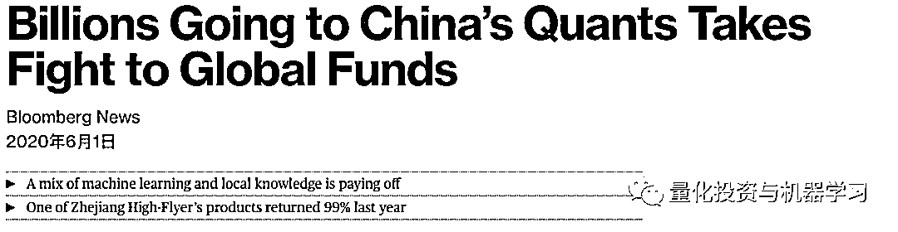
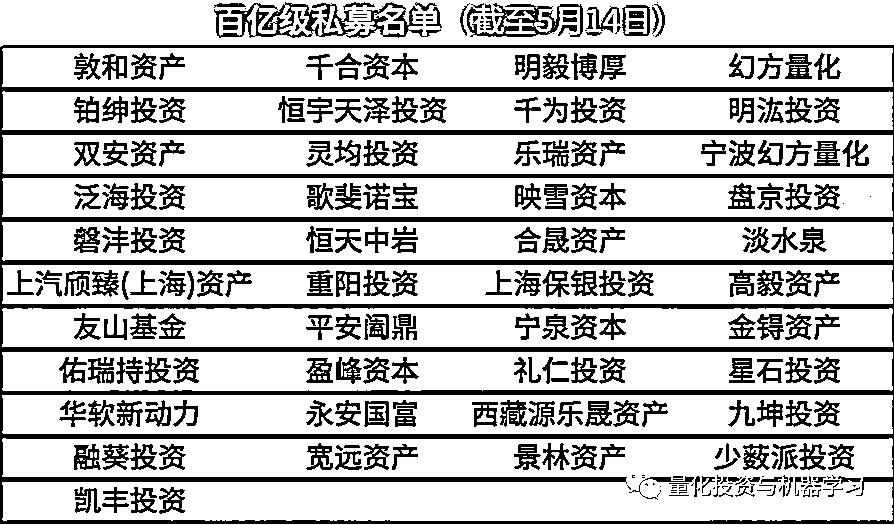
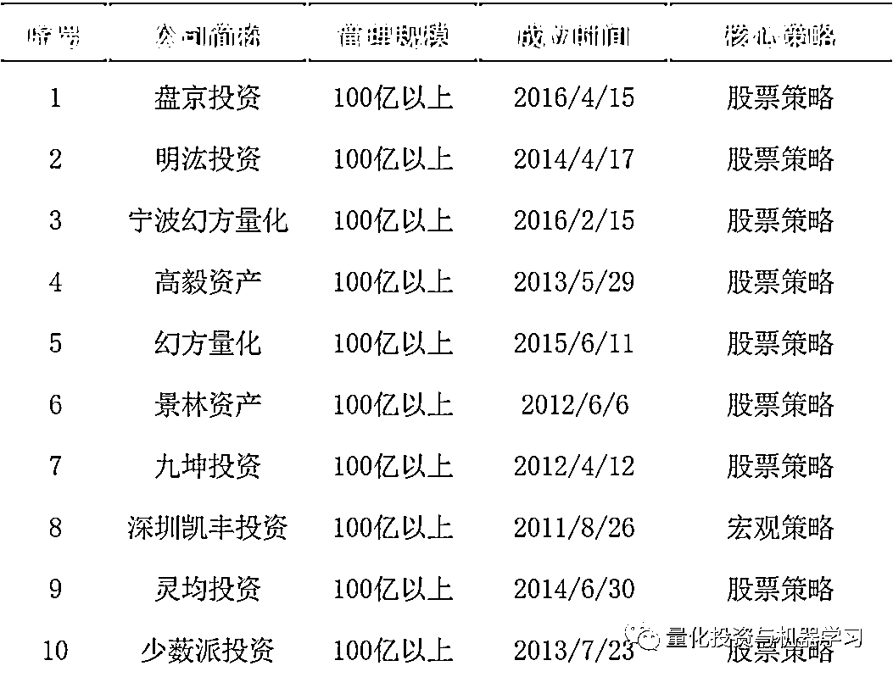
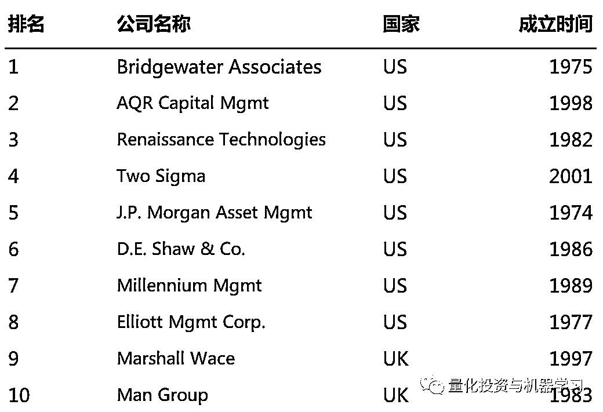
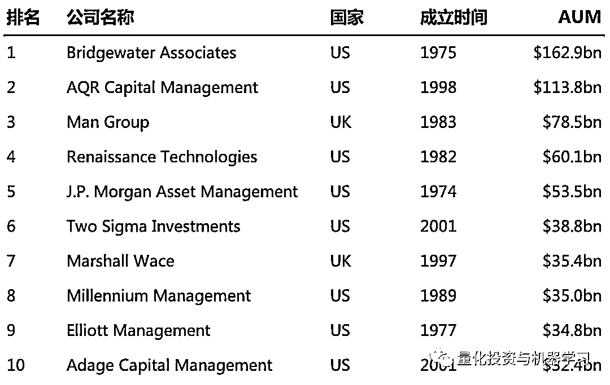
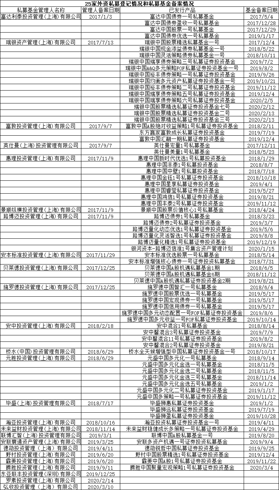
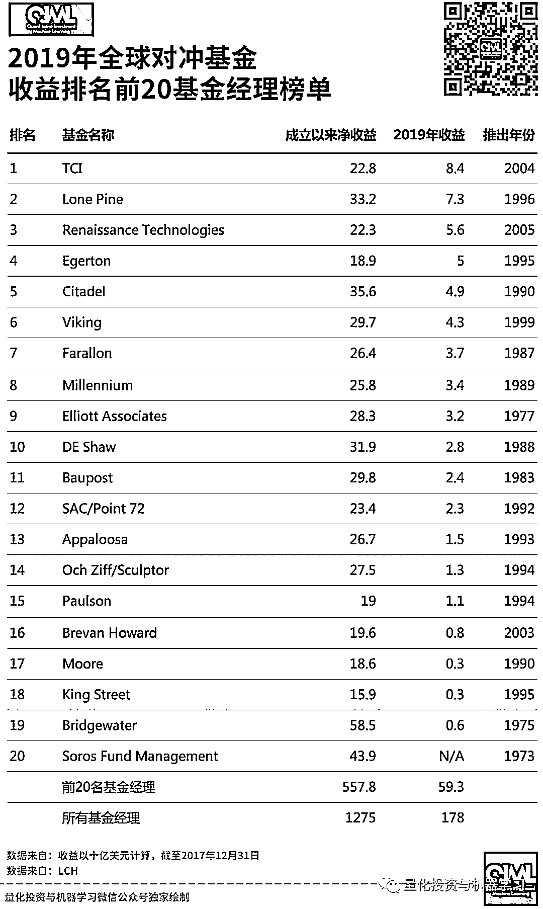
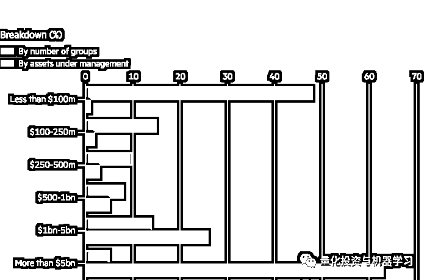
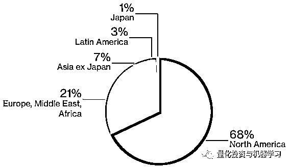

# 中国量化私募：竞争全球，背水一战！

> 原文：[`mp.weixin.qq.com/s?__biz=MzAxNTc0Mjg0Mg==&mid=2653300210&idx=1&sn=2e0a035b7fe7965bebf13e8ef374b4fd&chksm=802de7e7b75a6ef1e632d8b29846cf5b21f56c5c8096d6df1ca8389077f623b90909dac96f50&scene=27#wechat_redirect`](http://mp.weixin.qq.com/s?__biz=MzAxNTc0Mjg0Mg==&mid=2653300210&idx=1&sn=2e0a035b7fe7965bebf13e8ef374b4fd&chksm=802de7e7b75a6ef1e632d8b29846cf5b21f56c5c8096d6df1ca8389077f623b90909dac96f50&scene=27#wechat_redirect)

标星★**置顶**公众号     爱你们♥   量化投资与机器学习编辑部

祝各位 Quant 永葆童心

今天，彭博报道了一则关于中国对冲基金的新闻，这也是继前几日幻方建立 AI Lab 超级计算机“萤火一号”后，再次引起了海外对冲基金对中国量化私募圈的关注。

报道称，**幻方量化**正在缩小与美国公司 D.E.Shaw 和 Two Sigma 等老牌对冲基金之间的技术差距。**其规模不到 1 亿的机器学习策略在 2019 年暴涨 99%，今年上涨了 23%。**

 

当然幻方不是唯一的一家。**明汯投资**自 2018 年以来管理的资金增加了三倍多，AUM 达 400 亿人民币，成为中国最大的量化对冲基金。**因诺资产**自 2018 年以来资产规模增长了两倍，创始人徐书楠表示：在用机器学习升级模型后，他们的基金将 Alpha 提高了一倍以上。

根据私募排排网数据显示，截至 5 月 14 日，国内证券类百亿私募已经增至 41 家。同时，从知情人士处获悉，在 4 月份新增的这家百亿元级私募中，属于量化私募。

*图片来自：上海证券报

下图是来自私募拍拍网的百亿私募近三年收益前十排名表单（具体 AUM 我们暂时不能得到精确的数字）：

*图片来自：私募排排网

我们看到在百亿私募近三年收益中，**明汯投资、宁波幻方量化、幻方量化、九坤投资、灵均投资**五家量化私募全部入围榜单前十。

关于这几家公司的创始人和故事各位都应该有所了解。再此我们就不再介绍。

明汯投资创始人裘慧明表示：

不同交易策略的收益率不能完直接较，**但从客户的角度来看，我们产品的优势是实实在在的。**

根据私募排排网的数据显示，在中国的**26 家****外国资产管理公司占据**了约**0.3%的市场份额**，即**90 亿元人民币**。

*   Two Sigma 管理的资金大约为 1 亿人民币
*   贝莱德管理的资金大约为 10 亿人民币
*   D.E. Shaw 管理的资金大约为 10 亿元人民币

来自美国权威机构 Institutional Investors 最新的排名显示：

*图片来自：量化投资与机器学习公众号独家整理从 AUM 来看，根据 preqian 的 2019 最新数据显示：*图片来自：量化投资与机器学习公众号独家整理

截至今年 2 月 18 日，外资私募备案的中国私募基金数量达到 71 只之多。

*图片来自：中国基金报

外资私募在获取投顾资质上也有新的进展。基金业协会数据显示，全球最大的对冲基金桥水基金旗下桥水（中国）投资管理有限公司已于 1 月 13 日获得私募投顾资质，成为继富敦、路博迈、贝莱德、毕盛、安本标准、元胜之后，第 8 家可在中国提供投资顾问服务的私募机构。

随着我国经济快速发展，高净值客户群及资产规模巨大，并快速增长。又随着房地产投资属性的下降、资本市场的不断发展、资产管理咨询服务经验的累积，中国高净值人群投资方向发生变化，投资需求愈加强烈，这也成为他们的重要选择之一。

上海交通大学上海高级金融学院副院长、金融学教授严弘表示：

海外公司需要时间来适应。他们在当地的业绩记录很短，以及组建本地团队所需的时间，都限制了他们的发展。

幻方的陆政哲表示：

散户投资者主导的国内金融市场和很多交易限制是海外投资策略难以实施的因素之一，真正的竞争应是保持稳定的收益！

众多基金经理们一也致认为，**本土人才至关重要**，但吸引人才却很有挑战性。在过去的一段时间里，幻方一直在努力招聘深度学习科学家，提供高达 200 万元的薪水，**这样的薪酬可以跻身市场最优厚薪酬**的前 20%****。但考虑到像**腾讯和阿里等科技巨头的竞争**，这些职位的招聘进展缓慢。因为，一般像这样的人才可能先考虑 BAT 这样的大厂，然后再考虑其他吧。

在国外，像 Izzy Englander 的千禧年、格里芬的 Citadel 和科恩的 Point72 等大型美国对冲基金，在新冠肺炎危机中脱颖而出，成为业内最大赢家。

根据 Aurum 的数据显示，今年 3 月，管理逾 50 亿美元资产的对冲基金亏损 6.2%。这在一定程度上超过了 AUM 在 20 亿至 50 亿美元、10 亿至 20 亿美元、5 亿至 10 亿美元或不超过 5 亿美元的基金表现。这意味着，在截至 4 月底，**AUM 最大的对冲基金是 5 个类别中唯一赚钱的。**

*图片来自：HFR

但在国内，现阶段的格局还没有达到一种**寡头垄断阶段（马太效应）**，在走向这个过程中还存在不少变数。

最后引用**【FICC 与资产配置】**公众号的一段话：

外资私募管理人（WFOE）陆续进入国内，是否会对国内的量化格局形成冲击？拿股票高频策略这块来说，如果是纯依靠有效算力跟数据挖掘，国外很多私募在这一块的储备应该也不算差，是否存在后者追上的可能，值得观察。在期货高频领域，由于股指期货迟迟没有松绑，现在竞争已属于很激烈的阶段（Jump, Tower, Optiver 等早已在华开展业务），新的加入者是否会重塑格局？

原来很多做期货高频的团队，纷纷转向股票 T0 领域，但是纯股票 T0 很依赖流动性与波动性，能否重续辉煌值得期待。随着股票高频私募不少规模已突破百亿，交易拥挤会让他们降低交易频率或者加入基本面 alpha，是否对原有基本面 alpha 投顾造成冲击？**从技术上讲，期货高频转股票 T0，股票高频切入基本面 alpha 都比较容易，技术属于降维打击，能否在策略思想与逻辑上也有所突破还有待观察。 **

根据统计，亚洲地区虽然全球对冲基金行业只占一小部分，但**中国的收益率往往超过北美！**

  

*图片来自：Eurekahedge

** 愿中国量化私募越来越好！**

量化投资与机器学习微信公众号，是业内垂直于**Quant、MFE、Fintech、AI、ML**等领域的**量化类主流自媒体。**公众号拥有来自**公募、私募、券商、期货、银行、保险资管、海外**等众多圈内**18W+**关注者。每日发布行业前沿研究成果和最新量化资讯。

你点的每个“在看”，都是对我们最大的鼓励