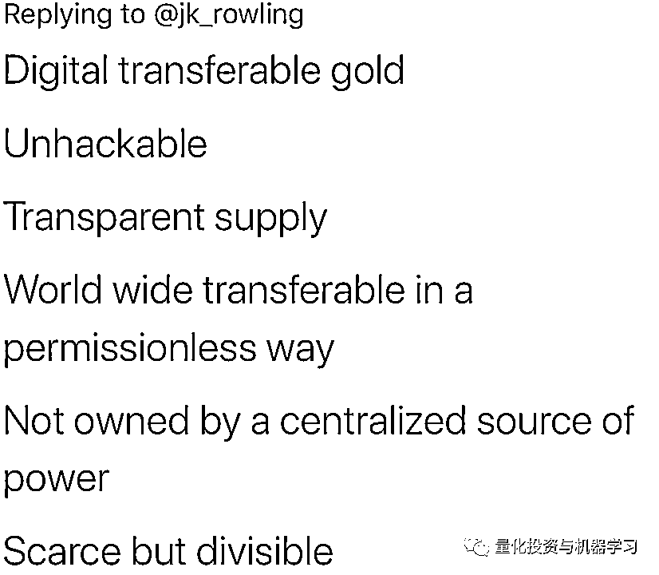

# J.K.罗琳进军比特币？哈利·波特很无语！

> 原文：[`mp.weixin.qq.com/s?__biz=MzAxNTc0Mjg0Mg==&mid=2653300054&idx=1&sn=a5ea51fa0ccac9c88fdd8af4fbcf83dd&chksm=802de743b75a6e554d813ba4335e99e9ef62b41decc2e794778eb04ee683d93d9a8c84202fc9&scene=27#wechat_redirect`](http://mp.weixin.qq.com/s?__biz=MzAxNTc0Mjg0Mg==&mid=2653300054&idx=1&sn=a5ea51fa0ccac9c88fdd8af4fbcf83dd&chksm=802de743b75a6e554d813ba4335e99e9ef62b41decc2e794778eb04ee683d93d9a8c84202fc9&scene=27#wechat_redirect)

标星★**置顶**公众号     爱你们♥   量化投资与机器学习编辑部独家报道

***1***

**发生了什么？**

事情是这样的，作家 Leigh Cuen 社交平台 Twitter 上发布了一条推文：

意思就是 J.K.罗琳可能请教她有关比特币的问题。

然后她又发了一条消息，貌似等待 J.K.罗琳进行回应：

J.K.罗琳由此，发布了以下这条推文：

瞬间，评论区直接炸开了锅，很多大佬为此留言，看得出都是哈利波特的忠粉！

****@马斯克****的回应：

看来，除了造车、造火箭，马斯克也屯了点币，哈哈！

**@Bitcoin**的回应：**巫师们仍然需要相信古灵阁，比特币解决了这个问题！**注：@Bitcoin 是最古老、最受欢迎的 Twitter 账户之一

J.K.罗琳直接回复说：**我不相信这！**

直接把她给整蒙了，古灵阁和比特币有什么鬼关系？

以后魔法世界都用比特币交易了？币安，火币和 OKex 你们赶紧搞个代理，以后就是魔法界的**魔币一哥！**

在这里给大家普及一下**什么是古灵阁：**

**古灵阁（Gringotts bank）**是哈利·波特中由妖精经营的魔法世界里唯一一家银行，可以存钱或是租用金库。而且也是全世界最安全的地方（当然除了霍格沃茨），因为银行的一些金库必须要古灵阁的妖精才能打开的。假如你想进去偷取一些不属于你的财产，你将要小心，不属于你的财产可能会带给你厄运。

**@孙宇晨**也来蹭热度，这位用 3153 万人民币拍下巴菲特午餐的 90 后，可谓争议颇多。

他回应道：**邓布利多不明白，但是哈利波特对此很着迷！小编真是跪了···**

你是觉得邓布利多年纪大了不懂吗？邓布利多表示很生气，想用变形术把你改整没了

先让斯内普先教育一下你，霍格沃兹可不允许学生看不起老师

***2***

**我们需要一个简洁的解释**

不过，只用了几个小时，J.K.罗琳就得出结论：**比特币和加密货币太混乱了，让她无法理解。**

正如 J.K.罗琳所指出的那样，很多人解释比特币到底是什么时，使用了相当乏味的隐喻：

确实，比特币很难向普通人描述，尤其是考虑到大多数人对现有金融体系的运作几乎一无所知。

与此同时，解释比特币和加密货币的基础知识也很重要。最糟糕的事情就是贬低个人智商，或者暗示他们不可能理解——很多人对 J.K.罗琳采取了这种毫无意义的方式：

这让 J.K.罗琳甚至觉得自己再也无法登录 Twitter 了！她说：有一天你会在街上看到一个老妇人，她正试图用一本《哈利波特》的书换一个土豆······，看的让人心生怜悯。

很多网友立马对那些 diss 者进行辩论，同时对 J.K.罗琳表示安慰：

在这里，小编也想对 J.K.罗琳说：比特币确实上非常复杂，而 Twitter 并不是解释它的最佳媒介，请不要在意网上的言论，那些都是浮云，嘴上的功夫别往心里去，我们可以用简洁、有说服力的方式更好地传达其基本原理。哈利·波特永远在我们心中永恒！

即使比特币最基本的 meme（指在同一个文化氛围中，人与人之间传播的思想、行为或者风格）。“数字黄金”对普通人来说也不一定意味着什么。当然，他们知道黄金是有价值的，但这并不能解释什么是比特币。它需要一些额外的上下文来解释稀缺性和“价值储存”的概念，这样的隐喻才有意义。

一名回复者直接整了一堆专业词汇：

事实上，这些术语对 99%的公众来说毫无意义，J.K.罗琳对上面这条推特的困惑回应就证明了这一点。

通过这件事情，我们也可以从侧面看出，币圈如何与外部世界的沟通还是有待加强，我们从 J.K.罗琳这篇帖子的留言总结出一些观点：

*   真的**很难用简洁易懂的方式解释**什么是比特币。

*   当加密人员试图解释这些基本概念时，他们几乎总**用很多专业用语而不是很贴切的真实场景来解释。**

*   还有很多人在留言中插入或推销自己的产品，降低了其可信度，这更**加深了加密货币是骗人的成见。**

为了让加密货币真正地进入主流，并为公众所接受，币圈需要致力于做好投资者的指导与教育。是的，这些概念可能很难解释，而且学习曲线很高。但如果币圈用这样的排外语言会使得这项工作更加困难。

如果把有影响力的公众人物吓得远远的，这并不是一个让大众接受的好办法！

***3***

**说在最后**

《哈利波特》开播已经 18 年了，J.K.罗琳带给了我们太多的回忆。当年坐在电影院的我们，已经升学、工作、恋爱、成家，背上房租或房贷，或许还有了自己的孩子。

**但只要我们等待猫头鹰的归来，魔法世界就永远存在！**

**比特币在**你们**面前就是个 ZZ！**

量化投资与机器学习微信公众号，是业内垂直于**Quant、MFE、Fintech、AI、ML**等领域的**量化类主流自媒体。**公众号拥有来自**公募、私募、券商、期货、银行、保险资管、海外**等众多圈内**18W+**关注者。每日发布行业前沿研究成果和最新量化资讯。

你点的每个“在看”，都是对我们最大的鼓励