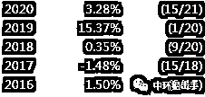

# 中国公募量化：谁来拯救？

> 原文：[`mp.weixin.qq.com/s?__biz=MzAxNTc0Mjg0Mg==&mid=2653299897&idx=1&sn=12ce93f40c4a54fbb9e813600d6238b6&chksm=802de6acb75a6fbada12da72d65df2dc066fdfd720ae25483c50cd90e8c419f5e980e12201cb&scene=27#wechat_redirect`](http://mp.weixin.qq.com/s?__biz=MzAxNTc0Mjg0Mg==&mid=2653299897&idx=1&sn=12ce93f40c4a54fbb9e813600d6238b6&chksm=802de6acb75a6fbada12da72d65df2dc066fdfd720ae25483c50cd90e8c419f5e980e12201cb&scene=27#wechat_redirect)

标星★**置顶**公众号     爱你们♥   

***1***

**前言**

昨天，戴老板的新文《量化投资发展史：野蛮、乱象、科学》刷爆了很多本来不怎么关心量化投资的投资人的朋友圈。本文稍微补充一点文中并没有提到的一些量化人的故事。

同时，上交所称将研究引入单次 T+0 交易。

笔者作为一个曾经也做过几年量化的老人，想简单说说自己的看法。

***2***

**《量化投资发展史》的一些补充**

戴老板昨天的新文章，写的确实是好，大历史观下的国内量化界众多风云人物和其故事都被娓娓道来。

首先提到了 2 位国内公募量化领域的先驱者，光大保德信的常昊总和上投摩根的吕俊总。两位都是非常优秀的投资人，后来都从公募奔私，现在分别在尚雅投资和从容投资。

不过有意思的是，如果看这两家公司的官网，分别对他们的投资理念有所介绍，关键词都是**价值投资**。 

随后是金融危机之后，知名的 BGI 三剑客（李、黎、田）先后回国，成为了公募量化的扛把子。也将 BGI 那套多因子的做法，发展成了公募量化和券商金工的正道，以致于后来私募里的 WorldQuant 派的武功绝学在公募界竟然几乎无人知晓。

不过其中漏了另外几个后来也是非常重要的人物，其中一个就是在 2009 年 12 月加入易方达基金，负责指数与量化投资工作的刘震。刘总于 1995 年开始其在华尔街的职业生涯，先后在华尔街最著名的定量对冲基金公司 D.E. Shaw、美国银行、Sagamore Hill、UBS 以及 Brevan Howard 等知名金融机构担任要职。

后来，刘总去了币圈，如今也是币圈的一方大佬。

同时期的私募界，也是风风火火，WorldQuant 堪称中国量化私募界的黄埔军校。“培养”出了后来九坤的姚总、王总，灵均的马总，还有后来的涵德等等等等。

另一边，其他量化海龟派也在茁壮成长，其中的明星人物可能就是先是在锐天，后来在衍复的高总。关于高总的新闻，笔者只想说高总水平很高，其他的可以移步知乎继续深入了解：

不得不提的是，此时华人量化界，有一位中科大的校友居总，用其强大的统计套利策略，以滚动三年年均 30%的收益夺得了 2015 年 Barron 的对冲基金排名的世界第一。

***3***

**小市值因子的崩塌**

随着 15 年的股灾，对量化界来说，最大的变化，除了股指期货被各种阉割，就是小市值因子的崩塌。

小市值崩塌后的量化有多难，可以从一个曾经拿过 5 年期金牛奖的量化公募的规模变化里看出，“眼看他起朱楼，眼看他宴宾客，眼看他楼塌了”。当然，左总基金近来表现不错，希望可以再振雄风，重现辉煌。

而股指期货的限仓，对量化界又是另一种痛苦。不少笔者熟识的私募老板们偷偷用起了账户组，和各种神奇的锁仓手法。而此时的公募量化对冲界，不仅一时半会儿发不出新的量化对冲公募（直到 19 年末才缓过神来），还使得现有产品被迫面临了尴尬处境。

后来拿了 5 年期金牛奖的杜总，当时一度面临着现金比例超过 90%的囧境。哪像现在**春风得意马蹄疾，规模直上一百亿。**

***4***

**科创板红利**

2019 年 7 月 22 日，科创板正式开市。大量的公募、私募早早地参与了这场打新盛宴。

最厉害的莫过于广发对冲套利，7 月业绩中的这一跳高达 6.62%，给大量基金套利者们带来了狂欢，也助攻其获得了当年的**Wind 同类排名第一。**

而此时的私募，却有不少陷入了违规的窘境，著名的量化**私募九章幻方有 82 只产品被限制一年。**

而随着科创板不断有新股上市，其网下配售机制对公募来说堪称一场救赎，其中的受益最多的，可能就是量化对冲类的公募产品终于可以开始有一些好看的曲线了。

而在基金评价界，大家也都有遵守着一条不成文的规则，打新收益不会被排除在外。以致于现在流传着大量券商卖方的基金推荐文，大家用着类似的 Brinson 框架或其变种，把业绩归为了择时、行业选择、风格选择和选股能力等几大类。而**打新收益，往往会被归为选股能力。**

虽然，在做财务分析的时候，大家都知道有一项科目叫做，非经常性损益。不知是蠢还是坏？

***5***

**海外量化好 == 公募量化好 ？**

戴老板的文中有一句话：“1970 年量化投资在海外全部投资中占比为零。待到 2009 年，量化投资在美国全部投资中占 30%以上。2018 年全球熊市中，最赚钱的 20 家对冲基金中，有一半以上是量化基金。美国量化经历了几十年的时间，才从幕后走到台前。” 

给人一种，似乎在海外，量化已经成了主流的感觉，业绩好，规模大。

殊不知，那些知名的国外量化机构大奖章、DEShaw、Citadel、Two Sigma 等等，**都是量化对冲基金，不是公募量化**。最接近公募量化的，可能就是 AQR 了，但是其业绩，真的，不想多说什么。

最令笔者震惊的是，笔者也不知道为什么**竟然有不少人说自己想做中国的 AQR，不知道投资人知道了 AQR 真正的业绩之后作何感想。**

***6***

**国内公募量化最大的几个问题**

相比于量化私募，公募量化给人一贯的感觉就是，业绩不太行，规模又做不了主动基金那么大，究其原因主要就是下面几条：

*   手续费太贵，私募和散户是万 1~万 1.5，而公募通常是是万 8。

*   私募和散户可以在有底仓的情况下做 T0，而公募被限制了日内反。

*   私募和散户可以随意在可转债上做 T0，而公募被限制了日内反向。

*   私募和散户在贴水大时可以买入股指期货或者廉价的期权，而公募对期货比例有严格限制，甚至不允许使用期权，最搞笑的是很多时候大部分指数增强基金根本跑不赢纯持有股指期货。

*   私募老板和散户可以保守自己的交易系统的秘密，而公募通常被要求强制提交策略代码，通常公募量化策略代码除了作者以外，往往有好几个人可以看到，任何一人的离职对量化策略来说都是灾难。

说完问题，说说**公募量化出路：**

*   做更多的指数业务，或者类似分级基金等的创新业务；通过 ETF 等做大规模，是很多目前成功的量化公募基金的做法。

*   转型价值投资，不一定非要放弃量化的能力，但起码价值投资可以对保护个人知识产权。毕竟买入一个股票专业的投资人员可以编出 10 个借口而不告诉别人真正的原因，而你如果是量化公募你可能必须交出代码。

*   奔私，实力强的量化专家通常会自立门户，哪怕没法成立私募，做个股市圈甚至币圈的牛散也不是难事。

**未来的中国量化界，必然是广阔天地，大有可为。而公募量化，则是道阻且长。**

免责声明

本文仅作为作者记录个人想法，不构成投资建议，不承担任何投顾责任。未经本人事先书面同意，禁止使用、复制、再传播或重新出版本文件的任何部分。本文件所含的信息和意见基于被认为可靠和善意的来源处获得的信息，但不承担任何错误或疏漏责任。所有此等信息和观点如有变动，恕不另行通知。本文件中的很多评论都基于当前的预期，并被认为是“前瞻性声明”。实际的未来结果可能被证明不同于当前的预期。所表达的意见反映了本人在编纂本文件时的判断，无需承担因新信息、未来事件或其他情况而导致的更新或更改前瞻性声明的义务。建议您谨慎对待本文件。

量化投资与机器学习微信公众号，是业内垂直于**Quant、MFE、Fintech、AI、ML**等领域的**量化类主流自媒体。**公众号拥有来自**公募、私募、券商、期货、银行、保险资管、海外**等众多圈内**18W+**关注者。每日发布行业前沿研究成果和最新量化资讯。

你点的每个“在看”，都是对我们最大的鼓励