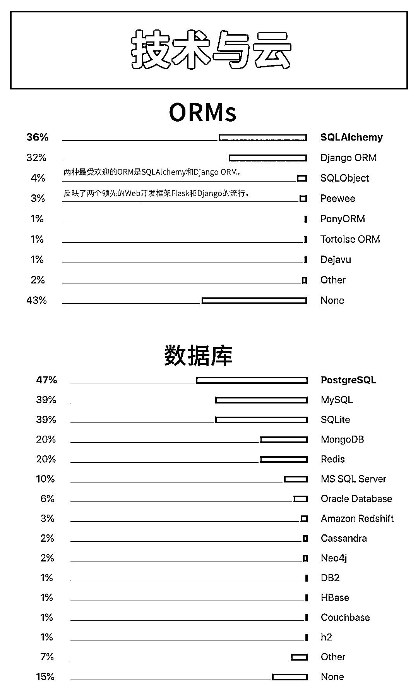

# 完整中文版 | 2019 Python 官方年度报告强势来袭！

> 原文：[`mp.weixin.qq.com/s?__biz=MzAxNTc0Mjg0Mg==&mid=2653299833&idx=1&sn=b40ba983188193a1569012b1cfbb7579&chksm=802de66cb75a6f7ad92361e77c6747dfdf874fec3f2b411279ada2723df9728be188ae7107ed&scene=27#wechat_redirect`](http://mp.weixin.qq.com/s?__biz=MzAxNTc0Mjg0Mg==&mid=2653299833&idx=1&sn=b40ba983188193a1569012b1cfbb7579&chksm=802de66cb75a6f7ad92361e77c6747dfdf874fec3f2b411279ada2723df9728be188ae7107ed&scene=27#wechat_redirect)

标星★**置顶**公众号     爱你们♥   

**量化投资与机器学习编辑部独家编制**

每年 Python 官方都会做一次年度报告，如果你想**了解 Python 的现状、趋势与未来**，可以说没有比这份报告更有用的信息了。

今年，**来自**全球**150 多个国家及地区的 24000 名 Python 开发者参与了此次调查。**

公众号将为大家**完整翻译**此次报告，希望能够帮助国内的 Python 爱好者们找到方向与热点，也希望你们能够努力前行！

此次报告大概分为如下几个部分：

*   Python 基本使用情况 

*   使用 Python 的目的 

*   Python 版本使用情况 

*   Python 框架、库和云技术

*   Python 开发工具

*   Python 职业发展与就业 

**32 张高清大图，带你领略 Python 的魅力！**

量化投资与机器学习微信公众号，是业内垂直于**Quant、MFE、Fintech、AI、ML**等领域的**量化类主流自媒体。**公众号拥有来自**公募、私募、券商、期货、银行、保险资管、海外**等众多圈内**18W+**关注者。每日发布行业前沿研究成果和最新量化资讯。

你点的每个“在看”，都是对我们最大的鼓励