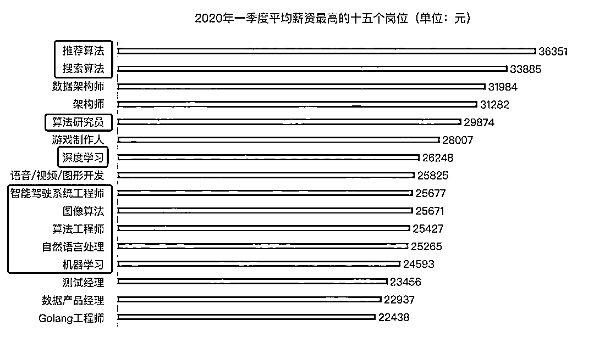
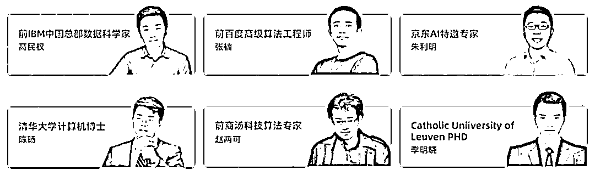

# 百度、滴滴、阿里的 AI 项目到底有多牛?

> 原文：[`mp.weixin.qq.com/s?__biz=MzAxNTc0Mjg0Mg==&mid=2653299784&idx=1&sn=7591d074d2cf2c40022496c4a7fd0b6c&chksm=802de65db75a6f4b0c9c5cf42ccf28ea7c8300e9913708a9b22300c6368d5acefb6daabc381b&scene=27#wechat_redirect`](http://mp.weixin.qq.com/s?__biz=MzAxNTc0Mjg0Mg==&mid=2653299784&idx=1&sn=7591d074d2cf2c40022496c4a7fd0b6c&chksm=802de65db75a6f4b0c9c5cf42ccf28ea7c8300e9913708a9b22300c6368d5acefb6daabc381b&scene=27#wechat_redirect)

标星★**置顶**公众号     爱你们♥   

今年受疫情影响，很多行业都受到了重大打击，比如餐饮、旅游、房地产等，但是总的来说，互联网／IT 行业的影响是相对较小的。 

前段时间，Boss 直聘发布了**《2020 年一季度人才吸引力报告》**，发现一个很有意思的现象。在高薪岗位榜单十五强里面，AI 相关的岗位占了 9 个，而且**前两名都是 AI 岗。**    

标红的都是 AI 相关的岗位

疫情发生以来，**AI 在疫情监控、体温检测、病毒检测、复工复产**等方面都发挥了重要作用。不少人问：人工智能会不会影响甚至颠覆我所在的行业？

我认为可以从三个方面判断：一是这个行业本身会产生大量的生产或者服务数据。二是数据要足够丰富和复杂。三是行业要有钱。

其实，与其去纠结 AI 是否会颠覆你的行业，如果有条件的话，不如直接入局 AI。俗话说**站在风口上猪也能飞起，选择比努力更重要！**

关注我的很多粉丝，有很多人对入行 AI 岗、算法岗感兴趣，所以我深度体验了一圈市面上的 AI 相关培训课程，决定推荐大家由后厂理工学院推出的**《人工智能核心能力培养计划》**。

这项计划有**计算机视觉、自然语言处理、数据挖掘与商业分析**三大方向，内容涵盖了从基础理论到最新的高级知识，并且具有足够的项目实战训练，认真参与这项培养计划，你能成为**具备实战能力的中高级 NLP／CV／BI 方向算法工程师**。

**扫码立即咨询课程**

之所以愿意推荐给我的粉丝们，最看重的一点就是**企业真实项目**。这些培养计划都是直接对标的一线大厂真实项目，培养过程中会模拟大厂真实项目的操作环境。

有大厂背书的真实项目，不仅可以写进简历，还能练就真刀真枪的能力，工作后直接派上用场。

除了项目来自大厂，**授课老师也很资深**，都来自国际名校（清华大学、佛罗里达大学、浙江大学）且均具备世界知名企业（阿里巴巴、商汤科技、IBM 中国实验室）的实际工作经验。

             

后厂理工学院这项计划已经开展一年多了，这个项目旨在帮助有一定编程基础的小伙伴，在 4-6 个月内找到一份人工智能、机器学习、深度学习、数据科学家、算法工程师等工作，**拿到年薪 30 万+的 Offer。**

通过这个项目**实现 AI 入行并升职涨薪的 1000+学员**，遍布全世界，其中不乏国内外知名企业的算法岗位或者国外名校的 AI Phd，Master 的 Offer。

**《人工智能核心能力培养计划》**现在还推出了“**上一节课，返一节课钱**”计划，只要你做到课程要求，就上一节课给你返一节课钱。能做出这个承诺，后厂是有这个自信的，除了课程本身的质量、真实的大厂项目实战、资历深厚的导师，还有他们提供的**5 大方面的服务：**

1、你的简历上会多一些大厂认可、含金量高的名企实训项目；

2、获得 OMO 社群进入资格，高端 AI 同窗校友人脉社区，结识 AI 大咖；

3、一线大厂名师亲自带你完成项目，并且建立深厚友谊；

4、“陪伴式”教学，助教、班主任全程贴心辅导；

5、大厂绿色通道和内推服务，帮你敲开互联网名企大门，让你在就业环境如此严峻的情况下依然拿到 30 万+高薪 offer。

这个项目真心不错，强烈推荐给有需求的同学！

**扫码立即咨询课程**