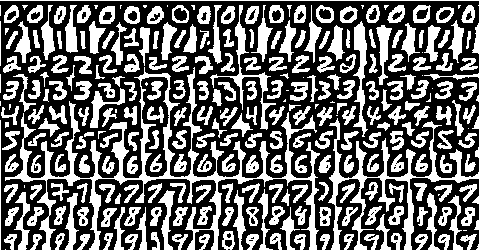

# 你在打王者农药，有人却用 iPhone 来训练神经网络

> 原文：[`mp.weixin.qq.com/s?__biz=MzAxNTc0Mjg0Mg==&mid=2653299488&idx=1&sn=9fd32d276d7397e1096eb972491a170c&chksm=802de135b75a6823486d520961659b3829e4112e272ceea61d41af60e0e91c51a635d95d5835&scene=27#wechat_redirect`](http://mp.weixin.qq.com/s?__biz=MzAxNTc0Mjg0Mg==&mid=2653299488&idx=1&sn=9fd32d276d7397e1096eb972491a170c&chksm=802de135b75a6823486d520961659b3829e4112e272ceea61d41af60e0e91c51a635d95d5835&scene=27#wechat_redirect)

标星★**置顶**公众号     爱你们♥   作者：Jacopo Mangiavacchi 机器之心编译 | 机器之心编辑部

***1***

**前言**

**你知道吗？在 iOS 设备上也可以直接训练 LeNet 卷积神经网络，而且性能一点也不差，iPhone 和 iPad 也能化为实实在在的生产力。**  
机器学习要想在移动端上应用一般分为如下两个阶段，第一个阶段是训练模型，第二个阶段是部署模型。常规的做法是在算力强大的 GPU 或 TPU 上对模型进行训练，之后再使用一系列模型压缩的方法，将其转换为可在移动端上运行的模型，并与 APP 连通起来。Core ML 主要解决的就是最后的模型部署这一环节，它为开发者提供了一个便捷的模型转换工具，可以很方便地将训练好的模型转换为 Core ML 类型的模型文件，实现模型与 APP 数据的互通。

以上是常规的操作。然而，随着 iOS 设备计算性能的提升，坊间不断产生一些 iPad Pro 算力超过普通笔记本的言论。于是乎，就出现了这么一位「勇者」，开源了可以直接在 iOS 设备上训练神经网络的项目。项目作者在 macOS、iOS 模拟器和真实的 iOS 设备上进行了测试。用 60000 个 MNIST 样本训练了 10 个 epoch，在模型架构与训练参数完全相同的前提下，使用 Core ML 在 iPhone 11 上训练大概需要 248 秒，在 i7 MacBook Pro 上使用 TensorFlow 2.0 训练需要 158 秒（仅使用 CPU 的情况下），但准确率都超过了 0.98。**当然，在 248 秒和 158 秒之间还有非常大的差距，但进行此项实验的目的并不是比速度，而是为了探索用移动设备或可穿戴设备在本地进行训练的可行性，因为这些设备中的数据往往比较敏感，而且涉及隐私，本地训练可以提供更好的安全性**。

*项目地址：https://github.com/JacopoMangiavacchi/MNIST-CoreML-Training*

***2***

**MNIST 数据集**

在这篇文章中，作者介绍了如何使用 MNIST 数据集部署一个图像分类模型，值得注意的是，这个 Core ML 模型是在 iOS 设备上直接训练的，而无需提前在其他 ML 框架中进行训练。作者在这里使用了一个很有名的数据集——MNIST 手写数字数据集。它提供了 60000 个训练样本和 10000 个测试样本，都是从 0 到 9 的 28x28 手写数字黑白图像。

***3***

**LeNet CNN 架构**

如果你想了解 CNN 的细节和优势，从 LeNet 架构着手是一个再好不过的起点。LeNet CNN+MNIST 数据集的组合是机器学习「训练」的标准组合，简直相当于深度学习图像分类的「Hello, World」。

这篇文章主要着眼于如何在 iOS 设备上直接为 MNIST 数据集构建和训练一个 LeNet CNN 模型。接下来，研究者将把它与基于著名的 ML 框架（如 TensorFlow）的经典「Python」实现方法进行比较。

***4***

**在 Swift 中为 Core ML 的训练准备数据**

在讨论如何在 Core ML 中创建及训练 LeNet CNN 网络之前，我们可以先看一下如何准备 MNIST 训练数据，以将其正确地 batch 至 Core ML 运行中去。在下列 Swift 代码中，训练数据的 batch 是专门为 MNIST 数据集准备的，只需将每个图像的「像素」值从 0 到 255 的初始范围归一化至 0 到 1 之间的「可理解」范围即可。

***5***

**为 Core ML 模型（CNN）训练做准备**

处理好训练数据的 batch 并将其归一化之后，现在就可以使用 SwiftCoreMLTools 库在 Swift 的 CNN Core ML 模型中进行一系列本地化准备。在下列的 SwiftCoreMLTools DSL 函数构建器代码中，还可以查看在相同的情况中如何传递至 Core ML 模型中。同时，也包含了基本的训练信息、超参数等，如损失函数、优化器、学习率、epoch 数、batch size 等等。

使用 Adam 优化器训练神经网络，具体参数如下：

接下来是构建 CNN 网络，卷积层、激活与池化层定义如下：

再使用一组与前面相同的卷积、激活与池化操作，之后输入 Flatten 层，再经过两个全连接层后使用 Softmax 输出结果。

***6***

**得到的 CNN 模型**

刚刚构建的 Core ML 模型有两个卷积和最大池化嵌套层，在将数据全部压平之后，连接一个隐含层，最后是一个全连接层，经过 Softmax 激活后输出结果。

***7***

**基准 TensorFlow 2.0 模型**

为了对结果进行基准测试，尤其是运行时间方面的训练效果，作者还使用 TensorFlow 2.0 重新创建了同一 CNN 模型的精确副本。
下方的的 Python 代码展示了 TF 中的同一模型架构和每层 OutPut Shape 的情况：

可以看到，这里的层、层形状、卷积过滤器和池大小与使用 SwiftCoreMLTools 库在设备上创建的 Core ML 模型完全相同。

***8***

**比较结果**

在查看训练执行时间性能之前，首先确保 Core ML 和 TensorFlow 模型都训练了相同的 epoch 数（10），用相同的超参数在相同的 10000 张测试样本图像上获得非常相似的准确度度量。
从下面的 Python 代码中可以看出，TensorFlow 模型使用 Adam 优化器和分类交叉熵损失函数进行训练，测试用例的最终准确率结果大于 0.98。

Core ML 模型的结果如下图所示，它使用了和 TensorFlow 相同的优化器、损失函数以及训练集和测试集，可以看到，其识别准确率也超过了 0.98。

推荐阅读：《Swift loves TensorFlow and Core ML》https://heartbeat.fritz.ai/swift-loves-tensorflow-and-core-ml-8adb52838931 参考链接：https://www.zhihu.com/question/60737205/answer/180687657

量化投资与机器学习微信公众号，是业内垂直于**Quant、MFE、Fintech、AI、ML**等领域的**量化类主流自媒体。**公众号拥有来自**公募、私募、券商、期货、银行、保险资管、海外**等众多圈内**18W+**关注者。每日发布行业前沿研究成果和最新量化资讯。

你点的每个“在看”，都是对我们最大的鼓励