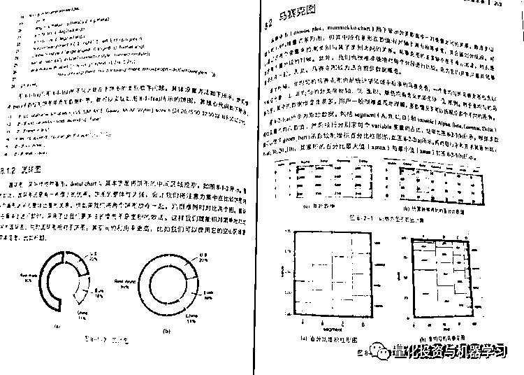
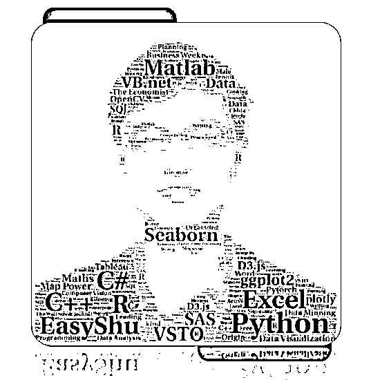
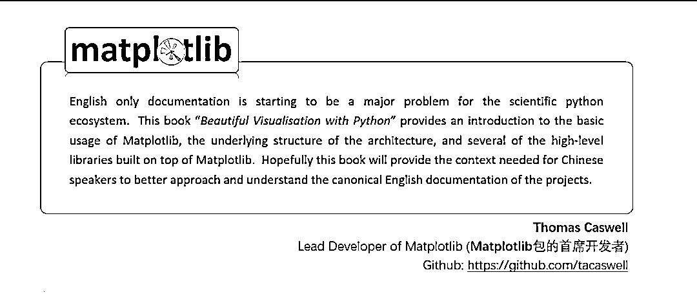
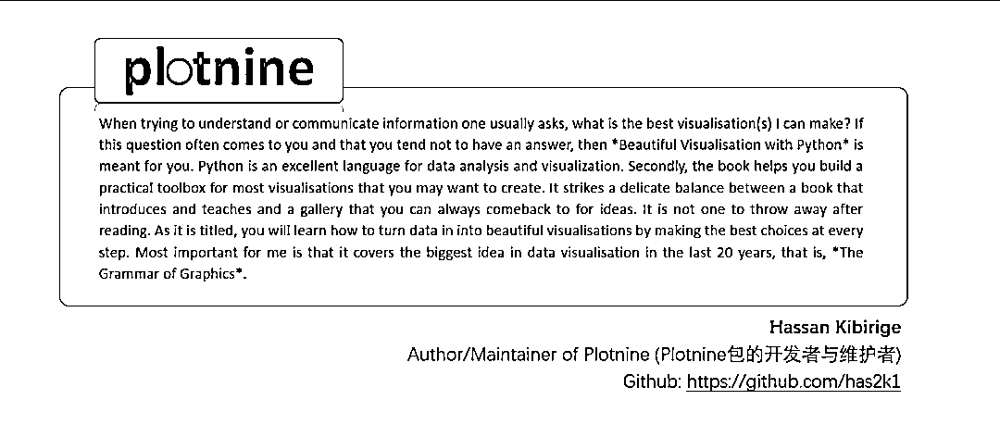

# 免费赠书活动：年度重磅《Python 数据可视化之美》

> 原文：[`mp.weixin.qq.com/s?__biz=MzAxNTc0Mjg0Mg==&mid=2653299376&idx=1&sn=cb8baec65219bd43b7fd1ae9aa3c3812&chksm=802de0a5b75a69b332a5946220c4f2d692c020d6588c720fce998d61e4d2f51a2ee2df39a36e&scene=27#wechat_redirect`](http://mp.weixin.qq.com/s?__biz=MzAxNTc0Mjg0Mg==&mid=2653299376&idx=1&sn=cb8baec65219bd43b7fd1ae9aa3c3812&chksm=802de0a5b75a69b332a5946220c4f2d692c020d6588c720fce998d61e4d2f51a2ee2df39a36e&scene=27#wechat_redirect)

**标星★****置顶****公众号     **爱你们♥   

***1***

**编辑部的话**

为了感谢各位忠实读者对公众号长期以来的支持，量化投资与机器学习微信公众号与电子工业出版社合作，**免费**为大家赠送相关书籍。本期：

**送 5 本**！

本期赠送的书籍是：

**只要你想画的图，这本书都可以帮你搞定！**

**全彩**

***2***

**人生苦短，我用 Python！**

现在 python 语言越来越流行，尤其是在机器视觉、机器学习与深度学习等领域。但是数据可视化一直是其短板，特别相比较 R 语言而言。 

所以很有必要系统性地介绍 Python 的绘图语法系统，包括最基础也最常用的 matplotlib 包、常用于统计分析的 seaborn、最新出现类似 R ggplot2 语法的 plotnine 以及用于地理空间数据可视化的 basemap 包。本书主要介绍如何使用 Python 中的 matplotlib、Seaborn、plotnine、Basemap 等包绘制专业图表。

本书首先介绍 Python 语言编程的基础知识，以及 NumPy 和 Pandas 的数据操作方法；再对比介绍 matplotlib、Seaborn 和 plotnine 的图形语法。本书系统性地介绍了使用 matplotlib、Seaborn 和 plotnine 绘制类别对比型、数据关系型、时间序列型、整体局部型、地理空间型等常见的二维和三维图表的方法。另外，本书也介绍了商业图表与学术图表的规范与差异，以及如何使用 matplotlib 绘制 HTML 交互页面动画。

***3***

**作者简介**

张杰，数据分析-工业设计狮；程序猿；科研狗；简称：狮猿狗。EasyShu 微信公众号联合主创；著有 15 篇 SCI(E)和 SSCI 学术论文；出版专著《Excel 数据之美：科学图表与商业图表的绘制》和《R 语言数据可视化之美：专业图表绘制指南》；第 11 届和第 12 届中国 R 会议数据可视化演讲嘉宾；学术研究方向为工业设计、颜色科学、机器视觉、数据分析与可视化等。

**很荣幸新书还拿到了 Python 的 matplotlib 和 plotnine 两大数据可视化包开发者（Thomas 和 Hassan）的推荐语:**

***4***

****免费赠送规则****

此次赠送活动，公众号将为所有读者**赠送 5 本****《Python 数据可视化之美》。**

**规则如下：**

**扫描下方二维码**，在截止日后，系统会自动抽取 5 位幸运粉丝。

中奖用户，届时请发送中奖截图至

官方微信：**zxlgglr**   或

官方邮箱：***lhtzjqxx@163.com***

**活动截止日期****2020 年 5 月 28 日 18:00**

量化投资与机器学习微信公众号，是业内垂直于**Quant、MFE、Fintech、AI、ML**等领域的**量化类主流自媒体。**公众号拥有来自**公募、私募、券商、期货、银行、保险资管、海外**等众多圈内**18W+**关注者。每日发布行业前沿研究成果和最新量化资讯。

你点的每个“在看”，都是对我们最大的鼓励