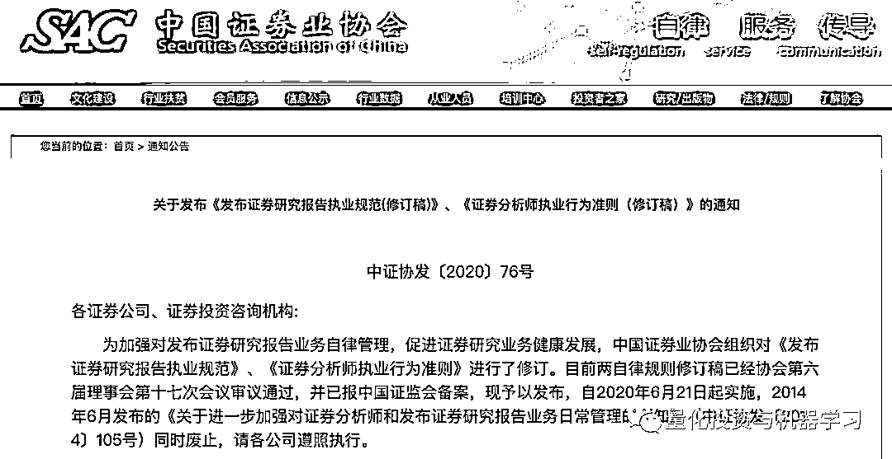

# 券商研报不能再乱写、乱发、乱转载了!

> 原文：[`mp.weixin.qq.com/s?__biz=MzAxNTc0Mjg0Mg==&mid=2653299335&idx=1&sn=f6bec72815308e9d1aac926a2e6a8edd&chksm=802de092b75a698499cd152f608781e931b26ac4ed5fefda46f91d6206464d1b12817b672e92&scene=27#wechat_redirect`](http://mp.weixin.qq.com/s?__biz=MzAxNTc0Mjg0Mg==&mid=2653299335&idx=1&sn=f6bec72815308e9d1aac926a2e6a8edd&chksm=802de092b75a698499cd152f608781e931b26ac4ed5fefda46f91d6206464d1b12817b672e92&scene=27#wechat_redirect)

标星★**置顶**公众号     爱你们♥   

近日，中证协发布了《发布证券研究报告执业规范（修订稿）》、《证券分析师执业行为准则（修订稿）》两份行业自律规则。

中证协在修订说明中指出，协会自 2012 年发布两项自律规则后，随着证券市场发展、证券公司业务变化，两自律规则一些规定不适应行业发展需要，同时证券研究业务发展面临一些新问题需要研究解决。如分析师使用新媒体工具的规范，分析师考核评价，加强研究报告质量控制等问题。

公众号总结了几点我们常关注的：

**1、合规审查更严格**

拟发布的主要内容应当经所在部门负责人或公司分管高管人员签批同意，并报合规部门备案。

研报发布前，机构要对重要敏感信息可能对市场产生的影响进行审慎评估，不得基于个别数据夸大或臆测行业或市场整体风险。

**2、研报标题要三思**

研报应**避免使用****夸大、低俗、诱导性、煽动性的**标题或者用语。

**3、引用数据要谨慎**

证券分析师引用信息和数据来源时，应**对引用信息和数据来源进行核实，审慎使用。**

**4、研报不能乱分享**

分析师建立的微信群、微信公众号、微博、云共享平台等**一定要报备！**

**合规人员也将进入微信群等，对聊天内容进行随时抽查！**

**5、转载研报勿删减**

要求授权转发或刊载研究报告、评论意见的媒体机构注明研究报告的发布人和发布日期、评论意见的发表者和发布时间，提示使用研究报告或评论意见的风险等，要求媒体机构不得自行对公司所提供材料的标题或者内容作实质性修改。

量化投资与机器学习微信公众号，是业内垂直于**Quant、MFE、Fintech、AI、ML**等领域的**量化类主流自媒体。**公众号拥有来自**公募、私募、券商、期货、银行、保险资管、海外**等众多圈内**18W+**关注者。每日发布行业前沿研究成果和最新量化资讯。

你点的每个“在看”，都是对我们最大的鼓励