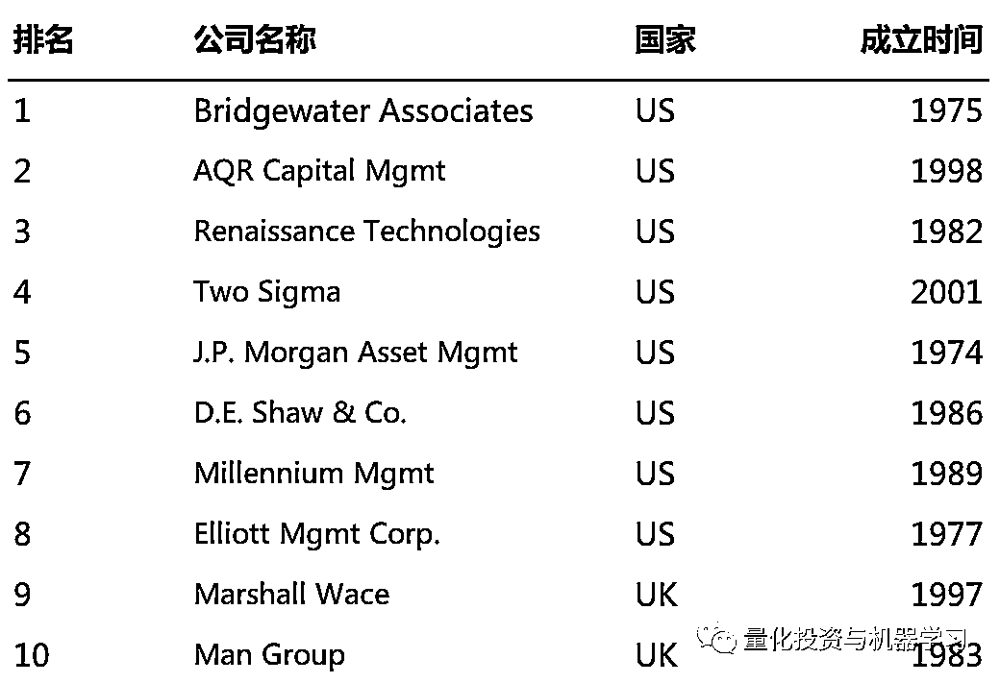
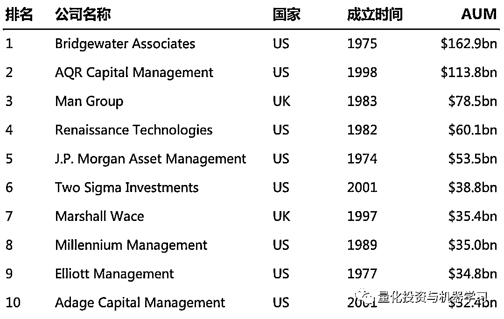
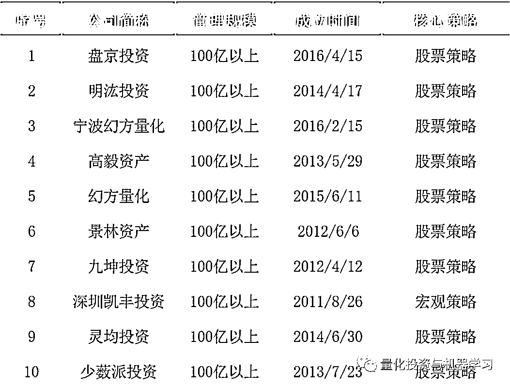

# 「马太效应」愈加显著，对冲基金何去何从？

> 原文：[`mp.weixin.qq.com/s?__biz=MzAxNTc0Mjg0Mg==&mid=2653299250&idx=1&sn=5a5b2fe8e017cb3f8a4ba5c82d469a86&chksm=802de027b75a6931c9a7e97d2e3612978e760b1a110897d307633353e2ad9e11a6135008885a&scene=27#wechat_redirect`](http://mp.weixin.qq.com/s?__biz=MzAxNTc0Mjg0Mg==&mid=2653299250&idx=1&sn=5a5b2fe8e017cb3f8a4ba5c82d469a86&chksm=802de027b75a6931c9a7e97d2e3612978e760b1a110897d307633353e2ad9e11a6135008885a&scene=27#wechat_redirect)

**标星★****置顶****公众号     **爱你们♥   

公众号编辑部综合报道

<mpsearch class="js_mpsearch appmsg_search_iframe js_uneditable custom_select_card" data-keywords="%5B%7B%22label%22%3A%22%E5%AF%B9%E5%86%B2%E5%9F%BA%E9%87%91%22%7D%2C%7B%22label%22%3A%22%E6%9C%BA%E5%99%A8%E5%AD%A6%E4%B9%A0%22%7D%2C%7B%22label%22%3A%22%E9%87%8F%E5%8C%96%E6%8A%95%E8%B5%84%22%7D%2C%7B%22label%22%3A%22Quant%22%7D%2C%7B%22label%22%3A%22%E9%A2%84%E6%B5%8B%22%7D%5D" data-w="286" data-ratio="1.5664335664335665" data-parentclass="appmsg_search_iframe_wrp"></mpsearch>

***1***

**全球**

Izzy Englander 的千禧年、格里芬的 Citadel 和科恩的 Point72 等大型美国对冲基金，在新冠肺炎危机中脱颖而出，成为业内最大赢家。

在今年有所斩获之后，他们现在处业界的领先地位。它们的收益反映了一个日益突出的现象：**对冲基金行业正日益集中于少数 AUM 更大的参与者。**

根据 Aurum 的数据显示，今年 3 月，管理逾 50 亿美元资产的对冲基金亏损 6.2%。这在一定程度上超过了 AUM 在 20 亿至 50 亿美元、10 亿至 20 亿美元、5 亿至 10 亿美元或不超过 5 亿美元的基金表现。这意味着，在截至 4 月底，**AUM 最大的对冲基金是 5 个类别中唯一赚钱的。**

*图片来自：HFR

多年来，拥有庞大资产基础的对冲基金公司的主导地位一直在逐步提提升，**因为谨慎的机构投资者提出了越来越高的要求，以及遵守监管规定的成本越来越高**，这样一来，就挤垮了 AUM 较小的基金。根据 HFR 的数据显示，目前该行业约三分之二的资产由约 5%的基金经理管理，而略低于一半的公司是 AUM 不到 1 亿美元的小型机构。

与此同时，新基金的发行数量也一直在稳步下降。

HFR 表示，2011 年有超过 1100 只新基金推出，但去年只有 480 只，这是自 2000 年以来的最低水平。发行数量减少，但往往规模更大。近年来，大型初创对冲基金公司像 ExodusPoint 资本，该公司于 2017 年由 Millennium 校友 Michael Gelband 出资 80 亿美元创办；还有 D1 Capital Partners，该公司由维京全球投资前掌门人 Daniel Sundheim 创立，于 2017 年以 40 亿美元启动，已于 2019 年 10 月 10 日在香港注册了一家子公司。

新基金发行减少，反映出交易员越来越倾向于加入一家知名公司，而不愿独自承担创业的商业风险。大型平台可以让交易员有更多时间专注于市场。

在最近的经济低迷时期，许多大的对冲基金都稳住了投资者的资本，甚至还赚了钱。截止今年 4 月底：

*   Citadel 的旗舰基金 Wellington：上涨 10%

*   Point72：上涨 1.8%

*   千禧年：上涨 3.7%

*   ExodusPoint：上涨约 3%

*   ···

所有这些基金通常都加大杠杆为他们赢得赌注。然而，他们也以严格的风险参数而著称，交易员在这些参数下操作，并通过迅速降低风险和解散表现不佳的团队来限制损失。

*图片来自：ARL

例如，在 3 月份由新冠肺引发的剧烈市场波动期间，Millennium 关闭了几个交易部门以应对亏损，至少有四名投资组合经理离开了 Citadel 等等···

Citadel、Millennium、D.E. Shaw、Baupost 和 TCI 等几家大型对冲基金今年从投资者那里筹集了数十亿美元资金，突显出投资者对行业巨头的兴趣。

看看下面两张图，截止 4 月底全球对冲基金概况（按策略、规模）：

***2***

**全球对冲基金排名**

来自美国权威机构 Institutional Investors 最新的排名显示：

*图片来自：量化投资与机器学习公众号独家整理从 AUM 来看，根据 preqian 的 2019 最新数据显示：*图片来自：量化投资与机器学习公众号独家整理

我们看到桥水、AQR、文艺复兴、千禧年、Two Sigma 等都榜上有名。这么多年过去了，这些大机构经历了无数市场风云变幻，但依旧屹立不倒！

***3***

**国内私募情况**

根据私募排排网数据显示，截至 5 月 14 日，国内证券类百亿私募已经增至 41 家。同时，从知情人士处获悉，在 4 月份新增的这家百亿元级私募中，属于量化私募。

*图片来自：上海证券报

下图是来自私募拍拍网的百亿私募近三年收益前十排名表单（具体 AUM 我们暂时不能得到精确的数字）：

*图片来自：私募拍拍网

我们看到在百亿私募近三年收益中，**明汯投资、宁波幻方量化、幻方量化、九坤投资、灵均投资**五家量化私募全部入围榜单前十。

**资金往往以“逐利”为天性**，私募头部效应愈发明显最直接的原因在于头部私募普遍拥有良好业绩表现。同时在市场资金簇拥下，不少头部私募管理规模快速滚大。

因为现在的私募基金行业是存量市场，小型机构的业绩拼不过大型机构，也没有足够的收入可以像头部机构一样进行持续投入，无法形成正向循环。不过在未来，随着市场深度进一步加深，衍生品市场更加活跃，小机构有更市场化的竞争环境，相信中国优秀的小型私募基金管理人也会非常大的提升空间。

量化投资与机器学习微信公众号，是业内垂直于**Quant、MFE、Fintech、AI、ML**等领域的**量化类主流自媒体。**公众号拥有来自**公募、私募、券商、期货、银行、保险资管、海外**等众多圈内**18W+**关注者。每日发布行业前沿研究成果和最新量化资讯。

你点的每个“在看”，都是对我们最大的鼓励