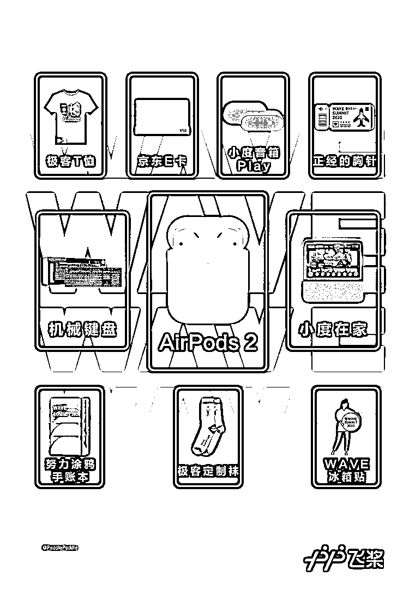

# 百度飞桨全流程工具最新发布！零门槛 AI 开发平台全面升级

> 原文：[`mp.weixin.qq.com/s?__biz=MzAxNTc0Mjg0Mg==&mid=2653299214&idx=1&sn=41a99465285f759d64bca4b23da91fd5&chksm=802de01bb75a690dcb0d3466343340ac8dc01c11f1ceb1257a369dc9c1c2cbc71ab7a06fbc0f&scene=27#wechat_redirect`](http://mp.weixin.qq.com/s?__biz=MzAxNTc0Mjg0Mg==&mid=2653299214&idx=1&sn=41a99465285f759d64bca4b23da91fd5&chksm=802de01bb75a690dcb0d3466343340ac8dc01c11f1ceb1257a369dc9c1c2cbc71ab7a06fbc0f&scene=27#wechat_redirect)

从 1936 年 5 月,艾伦·图灵在《论数字计算在决断难题中的应用》里提出了“图灵机”模型设想 ，到 1997 年的 5 月，“深蓝”国际象棋超级计算机击败了棋王卡斯帕罗夫，成为首台打败国际象棋世界冠军的电脑……历史上的 5 月，记录着人工智能技术一次又一次的历史性跨越。 

今年五月我们也将迎来深度学习领域的一场盛会—— WAVE SUMMIT2020 深度学习开发者峰会，下面就让小编来带大家看看这场盛会有哪些 AI 技术干货吧~

* * *

**百度 AI 最强天团分享深度学习产业落地经验**

小编自认为也是一个爱学习求上进的好青年，总想去听听技术大会自我提升一下，但每次一看动辄几千一万的票价总是被贫穷限制了梦想，但老天还是眷顾勤奋的人的，哈哈哈。为了让更多的开发者了解深度学习技术，这次**“WAVE SUMMIT 2020” 深度学习开发者峰会**使用的是线上直播的方式，也是说所有人都能免费看哦~听说还请来了**百度首席技术官&深度学习技术及应用国家工程实验室主任王海峰、百度集团副总裁&深度学习技术及应用国家工程实验室副主任吴甜**等 7 位大咖在线分享，豪华阵容堪称顶配！这么好的机会，你们怎么能错过。

听说这次直播分享的内容也是干货十足，各位小伙伴能够首次听到百度飞桨框架的整体设计理念，还能看到飞桨全流程工具的最新发布，着实是了解深度学习框架平台的好机会！小编还注意到这次议程中有量子计算相关的发布，感觉相当高大上，到时候会发布什么前沿科技呢？（一脸期待）除了这些硬核内容，这次大会针对我们小白开发者也很友好，有零门槛 AI 开发平台 EasyDL 带来的全新升级内容。小编看到大会上还将宣布飞桨携手全球开发者共成长的支持计划，听说是个超乎想象的大福利哦~**（迫不及待掏出手机注册报名了）**

* * *

**百度 AI 战疫、蔬菜分拣、水果识别黑科技解密**

人工智能技术在本次战疫过程中也起到了非常重要的作用，在直播中大家可以看到百度在这次疫情当中的一些 AI 技术场景应用的开源模型和工程实现，技术也是有温度的呢~还有更精彩的是自动分拣蔬菜的机器人、能自动识别水果的电子秤，除了这些黑科技，还有 AI 大赛冠军的经验分享，快看看吧说不定下一个冠军就是你啦。

* * *

** AirPods 2、机械键盘、小度音箱任性抽** 

本次峰会除了众多技术干货以外还有丰富奖品任性抽，前 5000 名注册用户有机会参与抽取 **AirPods 2 代耳机**等奖品；登录互动赚取积分，兑换充满极客范的手账本、主题 T 恤衫等；加入大会官方社群（方式见文末）还有机械键盘、小度音箱等专享福利，看得小编立马点击**"阅读原文"**直达官网注册报名，疫情过后干瘪的钱包终于有救了！**（小编第二次迫不及待掏出手机注册报名了）**

* * *

**二次元头像生成、避障挑战游戏乐趣多**

热爱动漫和二次元女神的各位宅男们，是否也渴望拥有属于一个自己的二次元头像和女神肩并肩，P 在一起你们就同框了哦~赶快注册上传照片，让大家一起欣赏你的盛世美颜吧！参与方式：进入官网 wavesummit.com.cn 点击互动大厅即可参与。**（小编第三次迫不及待掏出手机注册报名）**

除了二次元头像生成，还有人脸识别避障飞桨破浪，使用人脸跟踪小船，在大海中乘风破浪吧。

* * *

**连续 4 天 AI 课程放送，带你提前轻松入门深度学习** 

在峰会召开前的一周，5 月 16 日-19 日，技术爱好者和开发者们还能提前开启深度学习的知识盛宴，“百度架构师手把手带你零基础入门深度学习”系列入门课程，“Python 小白逆袭 AI 大神”、“Easy DL 一站式模型训练与部署实战”等热门精选课，保证峰会前的“热身”学习充实而受用，重点是这些课程都是免费的！**（小编第四次迫不及待掏出手机注册报名）**

* * *

**官网流程提前看，赶快报名吧**

* * *

**防走失专区，去哪找组织？**

为了避免大家走失，小编为大家提前找到了"组织"，扫码下方二维码关注百度飞桨官方公众号，发送口令**“峰会”**，即可加入峰会官方微信群：加入峰会社群的开发者，有机会获取小度音箱、机械键盘等专享礼品。

亦可加入**官方 QQ 群，群号：801216424**，同样有专属福利哦！

**点击”阅读原文“，直达官网报名！**