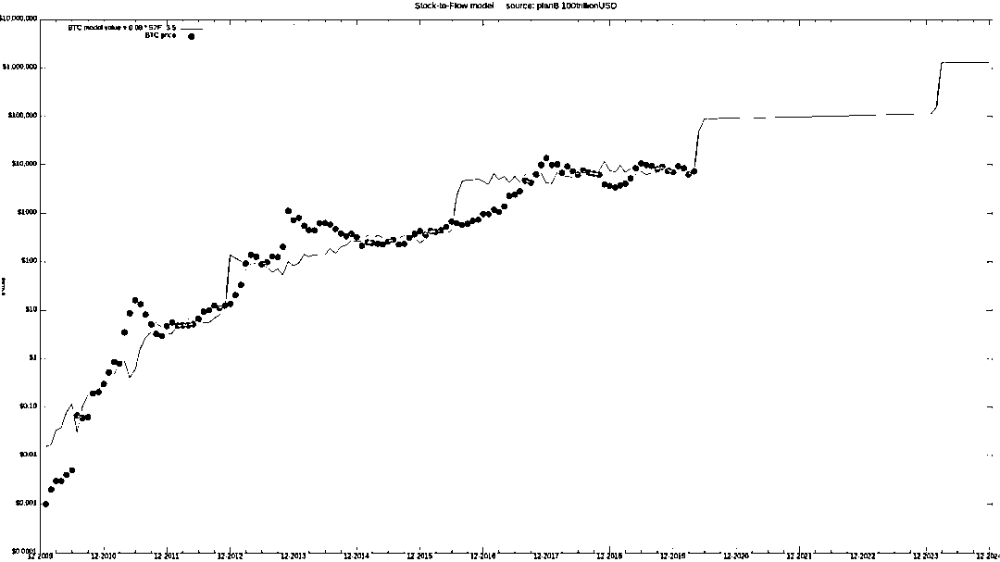
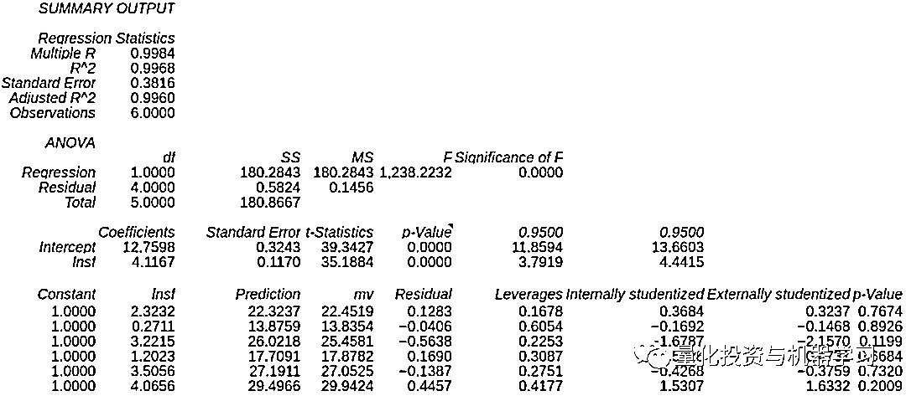
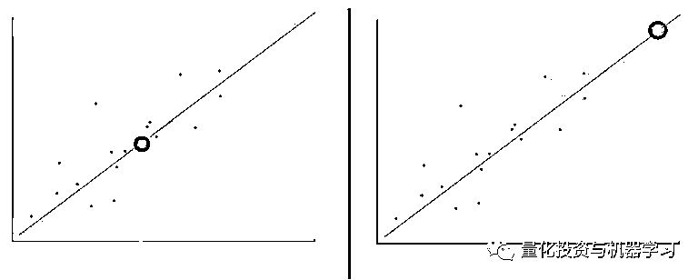

# 比特币 S2FX 模型：与资产模型的邂逅

> 原文：[`mp.weixin.qq.com/s?__biz=MzAxNTc0Mjg0Mg==&mid=2653299093&idx=1&sn=b6c478cd8b8ec195f7f50bac007a76aa&chksm=802de380b75a6a962e6dcee64976c6fdf1a6d9c41649aaeb5083d57f23cab67dcbd3cb9a5ca9&scene=27#wechat_redirect`](http://mp.weixin.qq.com/s?__biz=MzAxNTc0Mjg0Mg==&mid=2653299093&idx=1&sn=b6c478cd8b8ec195f7f50bac007a76aa&chksm=802de380b75a6a962e6dcee64976c6fdf1a6d9c41649aaeb5083d57f23cab67dcbd3cb9a5ca9&scene=27#wechat_redirect)

**标星★****置顶****公众号     **爱你们♥   

作者：PlanB      编译：1+1=6

***1***

**前言**

昨天的推文中，我们介绍了 S2F（Stock-to-Flow）模型：

 

在今天的推文中，我们将 S2F 与资产模型进行融合。

原始的 BTC S2F 模型是基于月度 S2F 和价格数据的。由于数据点是按时间顺序索引的，因此它是一个时间序列模型。

当前 S2F 模型

在今天的推文中，我们通过删除时间并向模型中添加其他资产（白银、黄金）来巩固当前 S2F 模型的基础。我们将这种新模型称为 BTC S2F 交叉资产（S2FX）模型。S2FX 模型可以用一个公式对不同的资产进行估值，比如白银、黄金和 BTC。

首先，我们将给大家介绍一下关于**相变**的概念，因为它引入了一种新的思考 BTC 和 S2F 的方法。它解释了为什么 S2FX 模型很重要。然后，我们将解释 S2FX 模型是如何工作的和它的价值！

***2***

**相变**

相变是理解 S2FX 模型的一个重要视角。物理学的解释是：指物质在外部参数（如温度、压力、磁场等等）连续变化之下，从一种相（态）忽然变成另一种相，最常见的是冰变成水和水变成蒸气。在相变过程中，物质会得到完全不同的性质，过渡阶段通常是不连续的。相变的三个例子是：

*   水

*   美元

*   BTC

**水**

相变的经典例子是水。水以四种不同的状态存在：固态、液态、气态和电离态。它都是水，但水在每一相都有完全不同的性质。

**美元**

在金融领域。美元已从金币过度到以黄金为支撑的纸币，再到没有任何支撑的纸币。尽管我们一直称它为美元，但美元在这三个阶段有完全不同的性质。

**BTC**

BTC 也是如此。Nic Carter 和 Hasu 在他们 2018 年的研究中展示了 BTC 的是如何随着时间变而变化的。

水、美元和 BTC 中的相变例子为 BTC 和 S2F 提供了一个新的视角。重要的是不仅要考虑连续时间序列，而且要考虑具有突变的阶段。在开发 S2FX 模型的过程中，我们将每个阶段的 BTC 视为一种全新的资产，其具有完全不同的属性。下一步是确定和量化 BTC 相变。

***3***

**BTC S2FX 模型**

下图显示了 BTC S2F 每月和原始 S2F 模型中使用的价格数据点。可以直观地识别出四个团簇。

量化这些团簇可以通过最小化每月 BTC 数据与集群之间的距离来完成。我们使用一个遗传算法（最小化绝对距离）来量化四个集群。后面的研究可以集中在不同的聚类算法（如 k-means 等）。

1、BTC 概念证明（S2F 1.3，市值 100 万美元）2、BTC 支付（S2F 3.3，市值 5800 万美元）3、BTCE-Gold（S2F 10.2，市值 56 亿元）4、BTC 金融资产（S2F 25.1，市值 1140 亿美元）

像水和美元一样，这四个 BTC 集群代表了四种不同的资产，每一种资产都有不同的特征。S2F 1.3 仅 100 万美元市值的 BTC 概念证明与 S2F 25.1 的金融资产（1140 亿美元市值）是两个完全不同的资产。

将 BTC 集群的相变视角作为不同的资产，我们现在可以将白银、黄金等其他资产添加到模型中。这使得它成为一个真正的跨资产模型。对于白银和黄金，我们使用 Jan Nieuwenhuijs 在 2019 年 12 月分析得出的库存和流量数据（*https://www.voimagold.com/insight/how-much-silver-is-above-ground*）。

5、白银（S2F 33.3，市价 5610 亿美元）6、黄金（S2F 58.3，市值 1008.8 亿美元）

上图展示了四个量化的 BTC 集群（加上 BTC 每月原始数据）、白银和黄金。它们形成一条完美的直线。

我们使用回归分析来制作 S2FX 模型。请注意，与原始 S2F 模型的一个很大的区别是：**我们使用银和黄金 S2F 和市值数据来做回归分析**。S2FX 模型显示，S2F 与这六种资产的市价（低 p 值 F 检验和低 p 值系数）之间存在显著的正相关关系（99.7% R2）。

利用 S2FX 模型公式可以估计下一个 BTC 阶段/集群的市值（2020-2024 年 BTC S2F 将为 56）:

市值=exp(12.7598) * 56 ^ 4.1167 = $5.5T

**这意味着 BTC 价格（2020-2024 年为 1900 万 BTC）为 28.8 万美元！**

BTC 价格预测明显高于原始研究中的$55K。请但注意，S2FX 模型只是第一步，还没有被其他人复制和检验。

虽然有 6 个观测值比较低，但是，我们认为 S2FX 模型的结果是相关的且 S2FX 模型是一个有效的假设，就像 S2F 模型一样。**未来的研究可以集中在增加更多的资产分析**。但是，大多数资产的 S2F 值都很低（≤1），因此没有什么意义。相反，钻石有很高的 S2F，但有一个非常复杂的估价（粗加工、切割、不同颜色和亮度等）。

**S2FX 模型允许插值，而不是在原来的 S2F 模型外推**。原始的 S2F 模型所做的预测超出了模型所使用的数据范围。新的 S2FX 模型做出的预测在公式推导中使用的数据在其范围内。

插值（左）和外推（右）数据用蓝色表示，黑线表示模型，红点表示预测。

**科普：**

插值法：是根据已知数据点来预测未知数据点，假如你有 n 个已知条件，就可以求一个 n-1 次的插值函数 P(x)，使得 P(x)接近未知原函数 f(x)，并由插值函数预测出你需要的未知点值。而又 n 个条件求 n-1 次 P(x)的过程，实际上就是求 n 元一次线性方程组。

外推法：类型包括趋势外推法、线性外推法、指数曲线法和生长曲线法。经济上的外推法，是利用一些相关的业务指标的增长量来推算增加值的增长速度，如交通运输业。

***4***

**结论**

在本文中，我们通过删除时间并向模型中添加其他资产（白银和黄金）来巩固当前 S2F 模型的基础。我们将这种新模型称为 BTC ZHI。**S2FX 模型可以用一个公式对不同的资产进行估值，比如白银、黄金和 BTC。**

*   S2FX 模型公式对数据（99.7% R2）有很好的拟合性。

*   S2FX 模型估计下一个 BTC 阶段/集群的市场价值为$5.5T（2020-2024 年 BTC S2F 将为 56）。这意味着 BTC 价格（2020-2024 年为 1900 万 BTC）为 28.8 万美元。

*   结合 S2F 研究，S2FX 模型为 BTC 过渡到第五阶段提供了一种新的思路。

量化投资与机器学习微信公众号，是业内垂直于**Quant、MFE、Fintech、AI、ML**等领域的**量化类主流自媒体。**公众号拥有来自**公募、私募、券商、期货、银行、保险资管、海外**等众多圈内**18W+**关注者。每日发布行业前沿研究成果和最新量化资讯。

你点的每个“在看”，都是对我们最大的鼓励