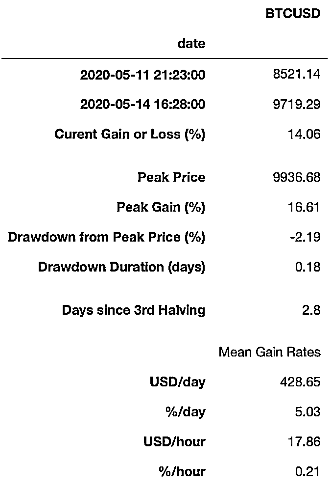
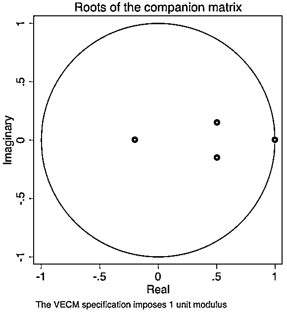

# 比特币像个醉汉，S2F 模型是它回家的路！

> 原文：[`mp.weixin.qq.com/s?__biz=MzAxNTc0Mjg0Mg==&mid=2653299045&idx=1&sn=0aeea2db5a149bdbfa0791a08423b2c4&chksm=802de370b75a6a6618dcbc71a4baef12258f187e8ca65fa3959a3ffd82e161c646c793761e4b&scene=27#wechat_redirect`](http://mp.weixin.qq.com/s?__biz=MzAxNTc0Mjg0Mg==&mid=2653299045&idx=1&sn=0aeea2db5a149bdbfa0791a08423b2c4&chksm=802de370b75a6a6618dcbc71a4baef12258f187e8ca65fa3959a3ffd82e161c646c793761e4b&scene=27#wechat_redirect)


**标星★****置顶****公众号     **爱你们♥   

作者：Pawel 、Nick、PlanB

编译：1+1=6

***1***

**前言**

比特币减半是其创始人中本聪（Satoshi Nakamoto）在比特币白皮书中设置的一项机制。在比特币代码中规定每开采 210000 个区块，矿工得到的比特币奖励就减少一半。2012 年 11 月 28 日，比特币首次减半，每一区块开采奖励降至 25 枚比特币；2016 年 7 月 9 日，比特币第二次减半，奖励降至 12.5 枚比特币。北京时间 2020 年 5 月 12 日 03:25，第三次减半将从 12.5 枚比特币变为每个区块奖励 6.25 枚比特币。

截止今天发文。比特币奖励将从 6.25 枚降到 3.125 枚还剩大约 2148 天：


在过去两次比特币价格下跌之后，对比特币价格上涨的分析似乎遵循了 Plan B 提出的**库存流量比模型（Stock-to-Flow，简称 S2F）**，这个指标量化了比特币的稀缺性。

注：Plan B 是 Twitter 上一位有名的加密资产分析师。

**S2F = Stock/Flow**

Stock 是指现有的库存和储备。Flow 是年产生产量。人们也常用供应增长率这个指标，也就是 flow/stock。请注意，S2F=1/供应增长率。

**S2F 模型**S2F 模型指可用资产或储备资产的数量除以每年生产的数量，Stock-to-Flow 比率是一个重要的指标，因为 S2F 中较高的指标值反映了资产每年通货膨胀发生率的降低。一般来说，库存流量比越高，说明稀缺性越大。

让我们来看看 S2F 的数值。


黄金拥有最高的 S2F，它达到 62，它需要花费 62 年才能生产出当前的黄金库存。白银排第二位，S2F 是 22。高的 S2F 让它们变成货币商品。

比特币当前有 1750 万代币的库存，供应量为 70 万/年，也就是它的 S2F 为 25。这让比特币可以归入黄金和白银这样的货币商品类别。比特币当前的市值为 700 亿美元。

比特币的供应是固定的。新比特币通过新区块产生。当矿工发现能满足有效区块所需要 PoW 哈希时，大约每 10 分钟产生一个新区块。每个区块的第一个交易，称为 coinbase，包含找到区块的矿工的区块奖励。区块奖励包括人们支付的交易手续费和新生代币（称为补贴）。“补贴”从 50 比特币开始，每 210,000 区块（大约 4 年）减半。（补贴也就是矿工的区块奖励，当前奖励为 12.5btc，到现在的 6.25btc。）

这就是为什么“减半”对于比特币货币供应和 S2F 很重要。减半导致供应增长率（比特币的背景下通常称为“货币通胀”）变成梯状，而不是平滑变化。


***2***

**S2F 和价值**

在 2019 年 3 月，我们做了一个实验。统计比特币从 2009 年 12 月到 2019 年 2 月的月度 S2F 和价值，总计有 111 个数据点。用 Python/PRC/bitcoind 直接从比特币区块链中查询每月的区块数。实际的区块数量跟理论的数量相差很大，因为区块并非完全按照每 10 分钟产出一次，例如 2009 年区块的数量明显要少很多。

用每月区块数量和已知的区块补贴，你可以算出生产量和库存。我们通过任意忽略 S2F 计算中的前 100 万个代币（7 个月）来修正丢失的代币。对丢失代币数量更准确的估计调整会是未来研究的主题。

比特币价格数据从不同来源均可获得，但是从 2010 年 7 月开始。我们添加了首次已知的比特币价格（2009 年 10 月，1 美元 1309 个 BTC，2010 年 3 月 BitcoinMarket 第一个引用价格为 0.003 美元，2010 年 5 月 2 个匹萨饼 41 美元，用 10,000 个 BTC 购买），同时还有插入值。

我们已经有黄金的数据点，S2F 为 62，市值为 8.5 万亿美元；白银的 S2F 为 22，市值为 3080 亿美元，我将它作为基准。

**模型**

S2F VS 市值 的第一个散点图显示，最好使用对数值或轴来表示市值，因为它跨越了 8 个数量级（从 1 万美元到 1000 亿美元）。使用 S2F 的对数值或轴也可以很好地显示 In（SF）和 In（市值）之间的线性关系。请注意，我们使用自然对数，而不是常用对数，这会产生类似的结果。


对数据进行线性回归确认了肉眼可见的结果：S2F 和市值之间存在统计学上的明显关系。（95% R2， F 2.3E-17 的显著性，斜率 2.3E-17 的 p 值）。S2F 和市值之间的关系是偶然产生的，这种可能性几乎为零。当然，其他因素也会影响价格，例如监管、黑客攻击等，这就是为什么 R2 并不总是 100%的原因，并非所有点都落在直的黑线上。然而，其中的主导因素似乎是 S2F 衡量的稀缺性。

有意思的是，黄金和白银处于完全不同的市场，它们跟比特币 S2F 模型符合，这为模型提供了额外的信心。请注意，2017 年 12 月牛市高峰期比特币 S2F 是 22，比特币市场价值是 2300 亿美元，跟白银非常接近。

由于减半对 S2F 有大的冲击，我们在图表中将下次减半前的月份进行颜色叠加，深蓝是减半的月份，红色是刚刚减半之后的月份。下一次减半是 2020 年 5 月份。当前的 S2F 为 25，将升至 50，很接近于黄金的 S2F62。

在 2020 年 5 月减半之后预估的市场价值会是 1 万亿美元，相当于 55000 美元的比特币价格。这非常壮观。我们在前几天见证了这个预测结果，模型真可以！

人们会问，支撑 1 万亿美元市值的钱从哪里来？我们的回答是：白银、黄金、负利率的国家（欧洲、日本、美国也将进入这一行列）、通货膨胀国家（委内瑞拉等）、亿万富翁和百万富翁们对量化宽松的对冲、发现过去十年表现最佳的投资品的机构投资者等。

我们还能直接用 S2F 模拟比特币价格。当然公式有不同的参数。但结果是相同的。95%的 R2 和在 2020 年 5 月减半后 S2F 为 50，其预估的比特币价格是 55000 美元。

***3***

**幂律和分形**

同样非常有意思的是，还有幂律关系的迹象。

线性回归函数：

**ln(市值) = 3.3 * ln(S2F)+14.6......**

可以写为幂律函数：

**市值= exp(14.6) * S2F ^ 3.3**

95% R2 超过 8 个数量级的幂律的可能性增加了如下的可信度：S2F 捕获比特币价值，它是主要驱动因素。幂律关系中，一个量的相对变化给另外一个量的带来成比例增长的变化，而与这些变量的初始大小无关。每次减半，比特币 S2F 翻倍，市场价值增加 10 倍，这是一个常数因子。

幂律非常有意思，因为它们可以揭示看似随机复杂系统的属性的潜在规律性。复杂系统通常具有这样的特性：其中不同规模大小的现象之间的变化与我们正在观察的规模大小无关。这种自相似的属性是幂律关系的基础。我们在比特币中也可以看到：2011、2014、2018 年的四次崩溃看上去很相似，下降了 80%，但规模完全不同，分别是 10 美元、1000 美元、10,000 美元的不同量级。如果你不使用对数刻度，你不会看到；尺度方差和自相似性与分形相关。实际上，上面的幂律函数中的参数 3.3 是“分形维数”。

***4***

**代码研究**

我们在这里为大家提供了**一段代码，可以定期运行一下来检查自第三次减半事件以来实际比特币价格的统计数据**，基于 Python 完成。

```py
import ccrypto as cc
import numpy as np
import pandas as pd
import matplotlib.dates as mdates
from IPython.display import display
import matplotlib.pyplot as plt

grey7 = (.7, .7, .7)

halving_ts = pd.read_pickle('2020btc.df')
halving = halving_ts[halving_ts.index == pd.to_datetime('2020-05-11 21:23')]

now = cc.getCryptoSeries('BTC', freq='m', ohlc=False, exch='Coinbase')
now = now[now.index == now.index[-1]] 
```


公众号使用已经保存好的 BTC 数据（*2020btc.df*，2020-05-11 至今 2020-05-14，1 分钟）请在文末获取。 

接下来，我们将从 *cryptocompare.com*中获取最新的 1 分钟 BTC 价格。 


给定所需的输入时间序列，我们构造一个包含两个关键量的 DataFrame：

```py
gain = pd.concat([halving, now])

gain_pct = np.round(100*(now.values[0][0]/halving.values[0][0]-1),2)
gain.loc[gain.shape[0]+1] = [gain_pct]
gain.rename(index = {gain.index[-1] : "Curent Gain or Loss (%)"}, inplace=True)

gain.loc[gain.shape[0]+1] = ""
gain.rename(index = {gain.index[-1] : ""}, inplace=True) 

tday = (gain.index[1] - gain.index[0]) / pd.Timedelta('1 days')
thrs = (gain.index[1] - gain.index[0]) / pd.Timedelta('1 hour')
gain_usd = gain.iloc[1] - gain.iloc[0]
highest = halving_ts.max()  
peak_gain = (highest[0] / halving.values[0][0] - 1) * 100
dd = 100*(now.values[0][0] / highest - 1); dd = dd.values  
ddd = ((now.index - halving_ts.index[np.argmax(halving_ts)]) 
 / pd.Timedelta('1 days'))[0]  

gain.loc[gain.shape[0]+1] = [np.round(highest,2)[0]]
gain.rename(index = {gain.index[-1] : "Peak Price"}, inplace=True)
gain.loc[gain.shape[0]+1] = [np.round(peak_gain,2)]
gain.rename(index = {gain.index[-1] : "Peak Gain (%)"}, inplace=True)
gain.loc[gain.shape[0]+1] = [np.round(dd,2)[0]]
gain.rename(index = {gain.index[-1] : "Drawdown from Peak Price (%)"}, inplace=True)
gain.loc[gain.shape[0]+1] = [np.round(ddd,2)]
gain.rename(index = {gain.index[-1] : "Drawdown Duration (days)"}, inplace=True)
gain.loc[gain.shape[0]+1] = ""
gain.rename(index = {gain.index[-1] : ""}, inplace=True)
gain.loc[gain.shape[0]+1] = [np.round(tday,2)]
gain.rename(index = {gain.index[-1] : "Days since 3rd Halving"}, inplace=True)
gain.loc[gain.shape[0]+1] = ""
gain.rename(index = {gain.index[-1] : ""}, inplace=True)
gain.loc[gain.shape[0]+1] = "Mean Gain Rates"
gain.rename(index = {gain.index[-1] : ""}, inplace=True)
gain.loc[gain.shape[0]+1] = [np.round((gain_usd/tday)[0],2)]
gain.rename(index = {gain.index[-1] : "USD/day"}, inplace=True)
gain.loc[gain.shape[0]+1] = [np.round((gain_pct/tday),2)]
gain.rename(index = {gain.index[-1] : "%/day"}, inplace=True)
gain.loc[gain.shape[0]+1] = [np.round((gain_usd/thrs)[0],2)]
gain.rename(index = {gain.index[-1] : "USD/hour"}, inplace=True)
gain.loc[gain.shape[0]+1] = [np.round((gain_pct/thrs),2)]
gain.rename(index = {gain.index[-1] : "%/hour"}, inplace=True)

display(gain) 
```

以下是代码返回的详细信息：



从这个表格中我们可以得出一个有吸引力的结论，那就是平均日增长率。假设你在你的投资组合中只拥有 1 个 BTC，从 2020 年 5 月 11 日晚上开始，你每天赚大约 400 美元或每小时专 18 美元！如果这些利率能保持在同样的水平，那么从现在开始的 6.8 年内，你就能赚到第一个 100 万美元（也包括 2024 年的减半）。对 S2F 模型可以好好看看。

我们再做一些可视化：

```py
btc_m = halving_ts[halving_ts.index >= '2020-05-11 21:21']
gnl_m = 100 * (btc_m.shift(-1) / halving.values[0][0] - 1).dropna()

plt.figure(figsize=(12,5))
plt.grid()
plt.plot(gnl_m, label='1-min resolution')
plt.title('Current BTC gain/loss since 2020 Bitcoin Halving = %.2f%%' % gain.iloc[2,0])
plt.ylabel('Gain/Loss (%)', fontsize=12)
plt.legend()
plt.gcf().autofmt_xdate()
myFmt = mdates.DateFormatter('%Y-%m-%d %H:%M')
plt.gca().xaxis.set_major_formatter(myFmt)
plt.savefig("bitcoin.png", bbox_inches='tight') 
```


代码本身可以在许多方面进行改进和扩展，例如绘制随时间推的美元/日平均收益的变化，这将是非常有趣的。如果我们能看到一个月、六个月和一年后的比特币价格，那将是非常有趣的！

请好好利用 S2F 模型，再次我们想引用 Nick 的一篇文章，来**证明比特币的价值是否存在 Stock-to-Flow 的关系。供大家参考学习！**

我们对所提出的对数模型的统计有效性（最小二乘假设）、各变量的平稳性以及潜在的虚假关系都进行了检验。建立了一个向量误差修正模型（VECM），并与 Stock-to-Flow 模型进行了比较。

尽管这些模型中，有些在 Akaike 信息标准方面超过了原始模型，但它们都未能对 Stock-to-Flow 是比特币价值的一个重要非虚假预测因素的假设进行否定。

*   零假设（H0）：比特币的价值是比特币 Stock-to-Flow 的函数

*   备选假设（H1）：比特币的价值不是比特币 Stock-to-Flow 的函数

S2F 模型的作者通过在比特币市值的自然对数和 Stock-to-Flow 的自然对数上拟合一个普通最小二乘（OLS）回归来检验 H0。对于这两个变量中的对数转换，除了对数模型可以用幂律表示外，没有其他的方法或任何已知的推理可以表示。

我们直接看看一些重要的结果：

当比特币的价值过低时，它很快就会上升回到 lnSF 。系数[D lnSF]L. ce1 估计值为 0.028，意味着当比特币价值过低时，它会向均衡方向调整。


协整方程随时间的估计

在上图中，我们可以看到协整方程是趋向于零的。虽然它在形式上可能不是静止的，但它确实在接近平稳状态。

具有 K 个内生变量和 r 个协整方程的 VECM 伴随矩阵具有 Kr 单位特征值。如果过程是稳定的，则剩余 r 特征值的系数严格小于 1。由于特征值的系数没有总分布，因此很难确定系数与另一个系数是否接近。



伴随矩阵的根

特征值图显示，剩余特征值都不接近单位圆。稳定性检查并不能说明我们的模型是存在指定错误的。


脉冲响应函数

上图表明，Stock-to-Flow 价值的正交冲击，对比特币的价值具有永久性影响。

这就是我们的底线。Stock-to-Flow 不是一个随机变量，它是一个随时间变化的已知值的函数。Stock-to-Flow 不会受到冲击，即它的价值可以由提前计算得到精确值。然而，这个模型提供了非常有力的证据，证明了在 Stock-to-Flow 与比特币价值之间存在着一种基本的非虚假关系。

在这项研究中，作者没有考虑任何混淆变量。鉴于上述证据，任何混淆都不太可能对我们的结论产生重大影响——我们不能拒绝 H0。我们不能说 Stock-to-Flow 与比特币价值之间没有关系。如果是这样的话，就不存在协整方程了。

用一个比喻来说明这一点：如果我们把比特币的价值看作一个醉汉，那么 Stock-to-Flow 并不是他真正的跟班狗，而更像是他走的路。醉汉会在路上到处游荡，有时会停下来、滑倒、错过一个拐弯处、甚至在路上抄近路等；但总的来说，他会沿着这条路的方向回家。

简而言之：

**比特币像个醉汉，而 Stock-to-Flow 就是他回家的路。**

**参考文献**

*   Popper, Karl (1959). The Logic of Scientific Discovery (2002 pbk; 2005 ebook ed.). Routledge. ISBN 978–0–415–27844–7.

*   Murray, M. (1994). A Drunk and Her Dog: An Illustration of Cointegration and Error Correction. The American Statistician,48(1), 37–39\. doi:10.2307/2685084

*   https://github.com/100trillionUSD/bitcoin

*   Johansen, S. 1988\. Statistical analysis of cointegration vectors. Journal of Economic Dynamics and Control 12: 231–254.

*   Johansen, S. 1991\. Estimation and hypothesis testing of cointegration vectors in Gaussian vector autoregressive models. Econometrica 59: 1551–1580.

*   Johansen, S. 1995\. Likelihood-Based Inference in Cointegrated Vector Autoregressive Models. Oxford: Oxford University Press.

*   Becketti, S. 2013\. Introduction to Time Series Using Stata. College Station, TX: Stata Press.

量化投资与机器学习微信公众号，是业内垂直于**Quant、MFE、Fintech、AI、ML**等领域的**量化类主流自媒体。**公众号拥有来自**公募、私募、券商、期货、银行、保险资管、海外**等众多圈内**18W+**关注者。每日发布行业前沿研究成果和最新量化资讯。

你点的每个“在看”，都是对我们最大的鼓励