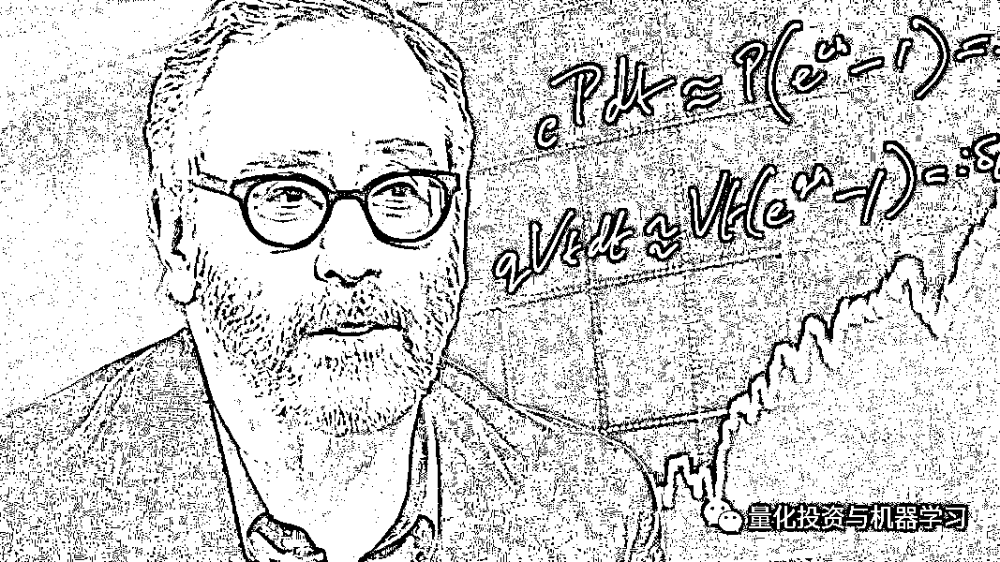

# 最新！彭博亿万富翁榜：量化大佬谁第一？

> 原文：[`mp.weixin.qq.com/s?__biz=MzAxNTc0Mjg0Mg==&mid=2653298931&idx=1&sn=43418812163e90a7568d6043b4447f0d&chksm=802de2e6b75a6bf0b752da47cee96eed3e3d3d700c272150c59241494f32166fdf9402a879f7&scene=27#wechat_redirect`](http://mp.weixin.qq.com/s?__biz=MzAxNTc0Mjg0Mg==&mid=2653298931&idx=1&sn=43418812163e90a7568d6043b4447f0d&chksm=802de2e6b75a6bf0b752da47cee96eed3e3d3d700c272150c59241494f32166fdf9402a879f7&scene=27#wechat_redirect)

**标星★****置顶****公众号     **爱你们♥   

量化投资与机器学习编辑部独家报道

<mpsearch class="js_mpsearch appmsg_search_iframe js_uneditable custom_select_card" data-keywords="%5B%7B%22label%22%3A%22%E6%9C%BA%E5%99%A8%E5%AD%A6%E4%B9%A0%22%7D%2C%7B%22label%22%3A%22%E9%87%8F%E5%8C%96%E6%8A%95%E8%B5%84%22%7D%2C%7B%22label%22%3A%22Quant%22%7D%2C%7B%22label%22%3A%22%E9%A2%84%E6%B5%8B%22%7D%5D" data-w="286" data-ratio="1.5664335664335665" data-parentclass="appmsg_search_iframe_wrp"></mpsearch>

**文末附前 100 名排行榜单，不要错过！**

***1***

**金融榜单**

彭博亿万富翁指数榜（**共 500 位**）每天会更新。在最新的排名中，我们先来看看关于**金融**行业的排名：

****如需获取****高清原图****，****后台回复 ****BF44****

不负众望，西蒙斯老爷子在 500 位的排名中为 44 名。在金融行业（总共 44 个）排名中**位居榜首！**可谓实至名归。

西蒙斯

西蒙斯老爷子的$21.0B 占世界上最富有的 500 个人的总财富的 0.39%

下图是西蒙斯从 12 年到目前为止，净资产历史收益图：

西蒙斯

**相关阅读：**

  

同时，在前段时间，文艺复兴正在重组董事团队，这些董事最终将接替创始西蒙斯，执掌全球最赚钱的对冲基金之一。根据提交给监管机构的文件，文艺复兴将董事会的成员数量增加了一倍（10 人），并将西蒙斯的儿子 Nathaniel Simons 提升为联席董事长。

  进前 100 的还有 4 位，分别是：

*   **Abby Johnson（#53）**

*   **Steve Schwarzman - 苏世民（#55）**

*   **Ken Griffin - 格里芬（#60）**

*   **Ray Dalio - 达里奥（#71）**

他们分别是任职于：

*   **富达基金（FRM）**

*   **黑石集团（Blackstone）**

*   **城堡（Citadel）**

*   **桥水（Bridgewater Associates）**

都是顶级的公司顶级的大佬，不得不佩服大佬们的赚钱能力！

其中：

**格****里芬**，通过他的多策略基金赚了将近 15 亿美元。

这还不包括他的做市业务 Citadel Securities，该业务创造了数十亿美元的收入。

格里芬

**史****蒂文• 科恩**，排名 148 名，也很厉害了！如果不熟悉他的朋友一定知道《Billions》这部剧。最近第五季也上了。快来第一时间收看：

**** **** 

**SAC 的创始人 Steve Cohen（史蒂文• 科恩，现为 Point72 首席执行官）。其旗下基金被称为美国最赚钱的基金之一，其近 20 年内高达 30%的年均收益率一度被认为投资传奇。而在被控内幕交易后，该基金被迫对外部投资者关闭，并缴纳 18 亿美元天价罚款及和解金。**Billions 中的****主角鲍比·阿克塞尔罗德的原型正是科恩。**** 

****

**剧中鲍比的原型：科恩**

**经历了多重内幕交易丑闻之后，SAC 进行转型。将公司更名为**Point72 资产管理公司**，作为认罪协议的一部分，科恩同意他的公司将不再为外部投资者管理资金。Point72 正式成为一家家族理财室，其资本绝大部分是科恩本人的，还有少量来自员工。**

**新公司的名字可能源自 SAC 的地址 72 Cummings PointRoad。公司在网站宣布，Point72.com 所代表的是道德、卓越、机遇、创新和领导力。公司使命是通过提供卓越的风险收益回报力争成为资产管理界的翘楚；同时坚持最高的道德标准，并向业内的优秀人士提供机遇。**

****

***图片来自：网络**

**在 Piont72 成立的当年，公司便获得了不菲收益，远超其他对冲基金表现。据纽约时报报道，2014 年 4 月以 100 亿美元启航的 Point72 总收益达到 25-30 亿美元。虽然这部分收益未剔除运营成本，但短短 8 个月内就有如此强劲表现还是证明科恩宝刀未老。**

****达****里奥**，近期不是特别好。看看他的净资产就知道了：**

****

****达****里奥**旗下最著名的**Pure Alpha II 基金**遭受了自 2000 年以来的首次亏损，跌了**0.5%！**因为自 1991 年 12 月桥水成立以来，除了 3 年以外的所有年份都实现了盈利。**

****

**今年在股票、债券、大宗商品和等出现大幅逆转后，**其旗舰基金今年下跌约****20%****。**** 

****

**达里奥说：“我们很失望，因为我们本应该在这次交易中赚钱，而不是像 2008 年那样赔钱。”**

**2008 年，Pure Alpha 给投资者带来了很好的收益，在标普 500 指数下跌 37%的一年里，该指数上涨了 9.4% 。 在 2018 年，Pure Alpha 的表现略好于市场。**

**Pure Alpha 策略的结构还为投资者提供了不同程度的波动性。客户通常会将一只 Pure Alpha 基金叠加在他们选择的 Beta 策略上，比如叠加在标普 500 指数上或全天候上。覆盖策略涉及使用衍生工具复制或抵消一个资产类别或市场风险敞口。** 

**同时，桥水还持有股票指数的看跌期权，这有助于缓冲损失。**

****

**详情请看：**

**** 

****相关阅读：****

**** **** 

# ****I****zzy Englander**，千禧年传世人物。如果你想去他哪里办公，可以看看下面的介绍：**

**** 

****D****avid Shaw**的排名虽然靠后，但是这位哥伦比亚大学前计算机科学教授管理的 D. E. Shaw 规模逾 500 亿美元。而且他本身很严谨、很聪明！** 

**** 

***图片来自：网络**

**如今，D.E.Shaw 在量化投资与传统基本面策略（如选股）结合方面处于领先地位。这种共生关系被资产管理公司戏称为：**Quantamental**（它是 Quantitative 和 Fundamental 两者的结合，就是**“量化”+“基本面”**的意思，简称**量本投资**）。**

*****2*****

****总榜第一名****

**以上是金融行业的一些情况。在最新的榜单中，**总排名中第一的为杰夫·贝佐斯，亚马逊的创始人**。**

****

****

**下图展示了其个人净资产从 12 年开始到现在的表现。真像 15 年的牛市一样。一路飙升！**

****

**亚马逊**

*****3*****

****中国地区榜****

**在中国地区的富豪榜单中，总共有 66 位上榜。其中**第一名**为：**马云。****

****

****

**其次为腾讯的小马哥、拼多多的黄峥。** 

****

*****4*****

****总榜前 100 名****

****

******如需获取****高清原图****，****后台回复 ****BB100******

**量化投资与机器学习微信公众号，是业内垂直于**Quant、MFE、Fintech、AI、ML**等领域的**量化类主流自媒体。**公众号拥有来自**公募、私募、券商、期货、银行、保险资管、海外**等众多圈内**18W+**关注者。每日发布行业前沿研究成果和最新量化资讯。**

******你点的每个“在看”，都是对我们最大的鼓励**