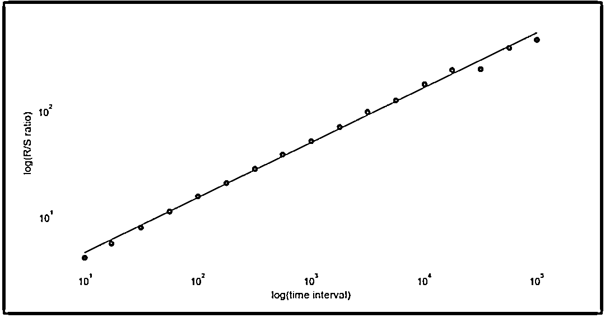

# 分形数学助力股市预测

> 原文：[`mp.weixin.qq.com/s?__biz=MzAxNTc0Mjg0Mg==&mid=2653298708&idx=1&sn=825b246a5d30f88607a9e9f748192834&chksm=802de201b75a6b17554d0c12487dd3195b2a86ce8a4bda8bf4bbcecafe2b9c59f4496b2c88e0&scene=27#wechat_redirect`](http://mp.weixin.qq.com/s?__biz=MzAxNTc0Mjg0Mg==&mid=2653298708&idx=1&sn=825b246a5d30f88607a9e9f748192834&chksm=802de201b75a6b17554d0c12487dd3195b2a86ce8a4bda8bf4bbcecafe2b9c59f4496b2c88e0&scene=27#wechat_redirect)


**标星★****置顶****公众号     **爱你们♥   

作者：Marco    编译：1+1=6

<mpsearch class="js_mpsearch appmsg_search_iframe js_uneditable custom_select_card" data-keywords="%5B%7B%22label%22%3A%22%E6%9C%BA%E5%99%A8%E5%AD%A6%E4%B9%A0%22%7D%2C%7B%22label%22%3A%22%E9%87%8F%E5%8C%96%E6%8A%95%E8%B5%84%22%7D%2C%7B%22label%22%3A%22Quant%22%7D%2C%7B%22label%22%3A%22%E9%A2%84%E6%B5%8B%22%7D%5D" data-w="286" data-ratio="1.5664335664335665" data-parentclass="appmsg_search_iframe_wrp"></mpsearch>

***1***

**前言**

在金融市场中，投资者最常用的两种交易策略是动量和均值回归策略。如果股票表现出动量（或如下图所示的趋势行为），那么如果其上一时期已经上涨（下跌），则其当前时期的价格更有可能上涨（下跌）。


相比之下，均值回归股票的价格围绕其历史均值随机波动，并显示出回归的趋势。当存在均值回归时，如果当前期间价格上升（下降），则下一个价格更可能下降（上升）。


请注意，由于这两种机制在不同的时间框架内发生（趋势行为通常在较大的时间范围内发生），因此它们可以并经常共存。

在这两种机制下，当前价格均包含有关未来价格的有用信息。实际上，交易策略只能在资产价格呈趋势或均值回归的情况下产生利润，因为否则，价格遵循的是所谓的随机游走：


***2***

**均值回归时间序列**

股票价格很少显示均值回归行为。在绝大多数情况下，它们遵循随机游走（但是，它们相应的收益是均值回归的，并且在零附近随机波动）。但是，可以通过组合不同的股票以建立协整投资组合来合成均值回归的价格系列。在本文中，我们将重点介绍一种基于 Hurst 指数的强大分析方法，该方法与价格时间序列的分形指数有关。**Hurst 指数提供了一种测量金融时间序列偏离随机游走的方法。可以帮助投资者确定采用哪种策略。** 

**平稳性**

假设给定股票的价格 S(t)呈现出均值回归行为。这种行为可以描述为下面的随机微分方程（SDE）：


分别是 t 时刻的股票价格，t 时刻的布朗运动，均值的回归率θ，均值μ及其波动率σ。根据此 SDE，t + 1 时刻的价格变化与 t 时刻的价格与均值之差成正比。如我们所见，如果价格小于（大于）均值，则价格变化更有可能为正（负）。该 SDE 的一个众所周知的特殊情况是所谓的 Ornstein-Uhlenbeck 过程。

DF 检验和 ADF 检验是（非）平稳性最著名的两个检验。

**DF 检验和 ADF 检验**

ADF 检验是 DF 检验的扩展，因此让我们首先了解后者。它可以说明如下。考虑以下给出的简单模型：


其中 S(t)是随时间变化的股票价格，ρ是系数，最后一项是误差项。这里的原假设是ρ= 1。由于在原假设下 S(t)和 S(t-1)都是非平稳的，因此违反了中心极限定理。

如下定义第一个差和参数δ：


回归模型可以方便地重写为：


DF 然后检验假设（技术上为原假设）


DF 检验背后的逻辑可以通过以下方式进行启发式理解。如果 S(t)是平稳的，它倾向于返回到某个恒定的均值（或者可能是确定性演变的趋势），这意味着较大的值可能会跟随较小的值。反之亦然。这使得该系列的当前值成为该指标的有力预测指标跟随值，我们将使δ<0。如果 S(t)是非平稳的，则将来的变化不依赖于当前值（例如，如果该过程是随机游走，则当前值不会影响下一个）。

ADF 检验遵循类似的程序，但适用于更复杂、更完整的模型，其模型如下：


这里，α是实常数，β是时间趋势的系数（漂移项），δs 是差值的系数：


其中 p 是过程的滞后顺序，最后一项是误差。这里的检验统计量是：


分母是回归拟合的标准误差。Dickey 和 Fuller 还列出了该检验统计量的分布。与 DF 检验一样，我们期望γ<0。

**代码实现**

以下的 Python 代码说明了 ADF 检验在苹果股票价格中的应用。尽管股票价格很少意味着回归，但股票对数收益通常是。下面的 Python 代码获取对数差异，绘制结果并应用 ADF 检验。

```py
import numpy as np
import pandas as pd
import pandas_datareader as pdr
from statsmodels.tsa.stattools import adfuller
pd.core.common.is_list_like = pd.api.types.is_list_like
import matplotlib.pyplot as plt
from datetime import datetime
import time
%matplotlib inline

start, end = datetime(2016, 1, 1), time.strftime("%x")
aapl = pdr.DataReader(['AAPL'],
                      'yahoo',
                      start,
                      end)
aapl.columns = [col[0].lower().replace(' ', '_')
                for col in aapl.columns]

aapl_close = aapl[['close']]
aapl_close = aapl_close.apply(lambda x: np.log(x) - np.log(x.shift(1)))
aapl_close.dropna(inplace=True)

_ = aapl_close.plot(figsize=(20, 10),
                    linewidth=3,
                    fontsize=14)

result = adfuller(aapl_close['close'].values)
print('Augmented Dickey-Fuller test statistic: {}'.format(result[0]))
print('p-value: {}'.format(result[1]))
print('Critical Values:')
for key, value in result[4].items():
    print('\t{}: {}'. format(key, value)) 
```

图如下：


ADF 检验的输出为：

```py
Augmented Dickey-Fuller test statistic: -28.653611206757994
p-value: 0.0
Critical Values:
 1%: -3.4379766581448803
 5%: -2.8649066016199836
 10%: -2.5685626352082207 
```

通常，我们更有可能拒绝原假设，因为原假设是非平稳的（序列具有单位根），而 ADF 检验统计数据的“负”更大。上述检验证实了对数回归序列确实是平稳的这一假设。结果表明，-28.65 左右的统计值在-1％时小于-3.438，这是我们可以拒绝原假设的显著性水平。

***3***

**Hurst 指数**

有另一种方法可以研究过程中均值回归或趋势行为的存在。可以通过分析序列的扩散速度并将其与随机游走的扩散速度进行比较来完成。此过程将使我们想到 Hurst 指数的概念，正如我们将看到的，它与分形指数紧密相关。 

尽管 Hurst 指数的应用可以在数学的多个领域中找到，但我们这里的重点将仅集中在两个领域，即**分形和长记忆过程**。

**分形**

分形的一个例子是下图所示的 Sierpinski 三角形：


衡量表面粗糙度的“分形维数”与 H 具有以下简单关系，


我们看到大的 Hurst 指数与小的分形维数相关，即与更平滑的曲线或曲面相关联。另外一个例子如下所示。可以清楚地看到，随着 H 的增加，曲线的确变得更平滑。


分形具有称为自相似性的属性。在工程学和应用数学的多个分支中发生的一种自相似性称为统计自相似性。在显示这种自相似性的数据集中，任何子部分在统计上都与整个集合相似。统计自相似性最著名的例子可能是在在海岸线上被发现的。


1967 年，分形几何学领域的先驱之一 Benoit Mandelbrot 在《科学》杂志上发表了一篇开创性的论文，题为《英国海岸有多长？统计自相似性和分数维》，他讨论了分形的性质，例如自相似性和分数维。

**长相关性**

当过程具有长相关性时，就会发生一种重要的偏离随机游走的现象。这些过程显示出很高的持久性：过去的事件与将来的事件不存在显著的相关性，即使它们相距甚远。Granger，Joyeux 和 Hosking 构思的一个示例由以下分数差分时间序列给出：


其中 L 是通常的滞后算子，指数 d 是非整数，ϵ是一个误差项。使用简单的二项式展开式，可以用伽玛函数表示该方程式：


比较简单的 AR(1)过程的自相关函数，我们发现后者的自相关函数的衰减率比前者的自相关函数慢得多。例如，对于τ〜25 的滞后：


而分数差分过程的自相关函数的对应值为〜-0.17。

## **Hurst 指数的源起**

虽然关于 Hurst 指数的估计方法来自于分形数学和混沌理论，但 Hurst 指数最早却奇怪地出现在水文学领域，它主要涉及水的分布、水质及其相对于土地运动。Hurst 原始论文如下：


tandfonline.com/doi/pdf/10.1080/02626665609493644

***4***

**Hurst 指数与反常扩散**

## **要了解价格序列的本质，一个方法是分析它的扩散速度**。扩散是一个被广泛使用的概念，它描述了某个对象（可能是一个想法、资产的价格等）从某一点扩散出去且该点是该对象浓度较高的地方。


三种扩散方式

研究方差如何依赖于后续测量之间的差异：


在这个表达式中，τ是两次测量之间的时间间隔，x 是价格 s(t)的一般函数。这个函数通常为对数价格：


众所周知，股票价格收益的方差很大程度上取决于衡量它的频率。高频率的测量表明，在 1 分钟的间隔内，与每日的测量有很大的不同。

如果股票价格遵循（并非总是如此，特别是每日收益）一个几何随机漫步或相一个几何布朗运动或 GBM，方差会随着滞后τ线性变化。


收益是正态分布的。然而，当与纯随机游走有小的偏差时，给定滞后τ方差不再与其成正比时，它获得一个反常指数：


反常指数与 Hurst 指数成正比

参数 H 是 Hurst 指数。均值回归股票和趋势股票的特征都是：


满足这个方程的日收益率不具有正态分布。相反，这种分布有更肥的尾部和更高的峰值。

Hurst 指数可以用来区分三种可能的市场机制：

*   如果 H<0.5。则时间序列为均值回归或具有平稳性。与几何布朗运动相关的正常扩散相比，对数价格波动率以较慢的速度增加。

*   如果 H>0.5。则序列显示趋势特行为，其特征是存在持久行为，如长期正自相关。

*   H=0.5。对应于一个几何布朗运动。

因此，**Hurst 指数衡量的是一个时间序列的持续性水平，可以用来识别市场状态**：如果在某个时间尺度上，Hurst 指数发生变化，这可能标志着从均值回归到动量机制的转变，或者相反。

以下是每种情况的例子：


在下一幅图中，我们可以看到 Hurst 指数是如何随时间变化的，这表明了机制的变化。


Hurst 指数随时间变化的四个不同的金融时间序列

**自相关性**

股票价格 S(t)的自相关函数定义如下：


衰减非常缓慢的自相关过程称为长记忆过程。这样的过程对过去的事件有一些记忆（过去的事件对未来的事件有衰减的影响）。长记忆过程的特点是自相关函数ρ(τ)幂律衰减：


α和 Hurst 指数之间的关系：


注意，当 H 趋向于 1 时，衰变变得越来越慢，因为指数α趋于 0，表示“持久性行为”。通常情况下，一开始看起来是随机的过程，但实际上是长记忆过程，在开区间内有 Hurst 指数：


这些过程通常被称为分数/分形布朗运动（fBm），它是布朗运动的一种推广。

***5***

**使用方差估计 Hurst 指数注意的几点问题**

为了获得方差τ的依赖。必须对多个滞后重复相同的计算，并提取结果的对数图的斜率。正如我们现在看到的，H 值很大程度上取决于我们对滞后的选择。

使用标普 500 指数 SPY，并估计不同滞后的 Hurst 指数。首先运行以下代码，它的滞后时间范围为 2 到 20：

```py
import numpy as np
import pandas as pd
import pandas_datareader as pdr
from statsmodels.tsa.stattools import adfuller
pd.core.common.is_list_like = pd.api.types.is_list_like
import matplotlib.pyplot as plt
from numpy import cumsum, log, polyfit, sqrt, std, subtract
from datetime import datetime
import time
%matplotlib inline

start, end = datetime(2000, 1, 1), datetime(2019, 1, 1)
spy = pdr.DataReader(['^GSPC'],
                      'yahoo',
                       start,
                       end)
spy.columns = [col[0].lower().replace(' ', '_')
                for col in spy.columns]

spy_close = spy[['adj_close']]

_ = spy_close.plot(figsize=(20, 10),
                    linewidth=3,
                    fontsize=14)

from numpy import cumsum, log, polyfit, sqrt, std, subtract
import seaborn as sns
sns.set();
spy_close = spy[['adj_close']].copy()
lag1, lag2  = 2, 20
lags = range(lag1, lag2)
tau = [sqrt(std(subtract(spy_close[lag:], spy_close[:-lag]))) for lag in lags]
m = polyfit(log(lags), log(tau), 1)
hurst = m[0]*2
print( 'hurst = ',hurst[0]) 
```

H 值如下：

```py
hurst =  0.43733191005891303 
```

正如前面所解释的，H 值表明了一个均值回归机制，把范围修改到 300-400：

```py
hurst =  0.6107941846903405 
```

这个 H 值表示趋势状态的存在。因此，我们看到，**滞后的选择强烈影响 hurst 指数的值**。这意味着这个时间序列既不是纯粹的均值回归，也不是趋势，**而是根据短时间间隔或长时间间隔的测量来改变行为状态的。这是一个很重要的结论！**

***6***

**长相关和 R/S**

Mandelbrot 在 1971 年发现了股票收益长期异常行为的存在。


Benoit Mandelbrot 分形几何领域的创始人之一

Mandelbrot 使用了**R/S 分析法**，也称**重标极差分析法**（Rescaled Range Analysis），是水文学家 Hurst 在大量实证研究的基础上提出的一种方法，后经过 Mandelbrot 等多人的努力逐步得以完善。其通常用来分析时间序列的分形特征和长期记忆过程。R/S 统计量是一个数列偏离其平均值的部分和的范围，这个范围被标准差重新调整过。Mandelbrot 和其他人指出，使用 R/S 统计方法与其他方法相比，如自相关分析、方差比和谱分解，可以得到更好的结果，尽管它确实存在缺点，如对短期依赖的敏感性等。

更多研究请看：


http://www.jonathankinlay.com/Articles/Long%20Memory%20and%20Regime%20Shifts%20in%20Asset%20Volatility.pdf

可以得到 R/S 统计量如下。例如，考虑以下长度为 n 的股票收益时间序列：


R/S 统计量与这些和的最大值和最小值之间的差成正比，其中 k ∈[1，n ] 


分母σ(n)是最大似然标准差估计量。R/S 的距离与观测值 n 之间有如下关系：


其中，H 是 Hurst 指数。 这种缩放行为首先被 Mandelbrot 和 Wallis 用来发现长期依赖的存在。由于 R/S 的范围与观测次数之间是多项式关系，因此可以用一个简单的 log-log 图来计算 H 的值。


在下图中，Hurst 指数估计在 0.53 左右，大约相当于随机游走。

```py
import numpy as np
import matplotlib.pyplot as plt
from hurst import compute_Hc, random_walk
import seaborn as sns
sns.set();
%matplotlib inline
np.random.seed(42)
random_changes = 1. + np.random.randn(99999) / 1000.
series = np.cumprod(random_changes)  
H, c, result = compute_Hc(series, kind='price', simplified=True)

plt.rcParams['figure.figsize'] = 10, 5
f, ax = plt.subplots()
_ = ax.plot(result[0], c*result[0]**H)
_ = ax.scatter(result[0], result[1])
_ = ax.set_xscale('log')
_ = ax.set_yscale('log')
_ = ax.set_xlabel('log(time interval)')
_ = ax.set_ylabel('log(R/S ratio)')

print("H={:.3f}, c={:.3f}".format(H,c)) 
```



Hurst 库来自：

https://github.com/Mottl/hurst

量化投资与机器学习微信公众号，是业内垂直于**Quant、MFE、Fintech、AI、ML**等领域的**量化类主流自媒体。**公众号拥有来自**公募、私募、券商、期货、银行、保险资管、海外**等众多圈内**18W+**关注者。每日发布行业前沿研究成果和最新量化资讯。

你点的每个“在看”，都是对我们最大的鼓励