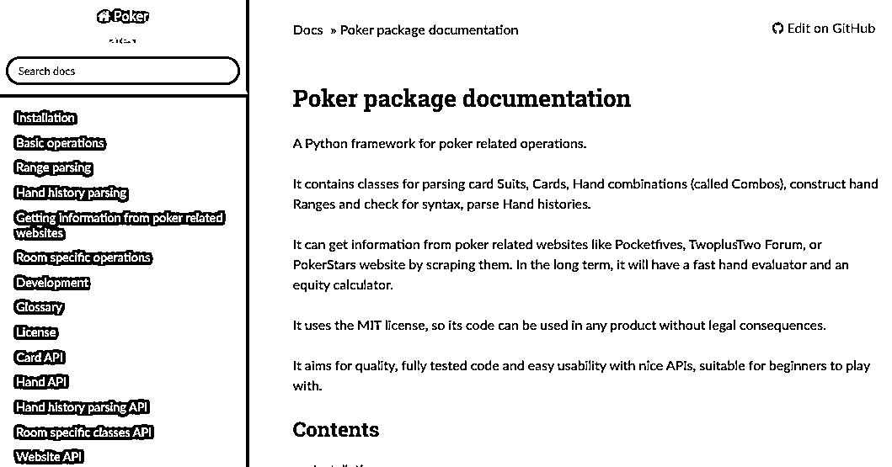

# All in 凉凉！德州赔率怎么算？我用 Python 来搞定

> 原文：[`mp.weixin.qq.com/s?__biz=MzAxNTc0Mjg0Mg==&mid=2653298420&idx=1&sn=49af96e61072df862ee1012dcf788a81&chksm=802ddce1b75a55f7c33aae2744cfb1a0d49af36bde68e9f2dd27f632282b3b593937570da3cb&scene=27#wechat_redirect`](http://mp.weixin.qq.com/s?__biz=MzAxNTc0Mjg0Mg==&mid=2653298420&idx=1&sn=49af96e61072df862ee1012dcf788a81&chksm=802ddce1b75a55f7c33aae2744cfb1a0d49af36bde68e9f2dd27f632282b3b593937570da3cb&scene=27#wechat_redirect)


**标星★****置顶****公众号     **爱你们♥   

编译：1+1=6

***1***

**介绍 **

在今天的推文中，公众号将向大家展示如何在 Python 中表示基本的扑克元素，例如“手牌”和“组合牌”（Hands、Combos），以及如何计算扑克赔率，即在无限注德州扑克中获胜/平局/失败的可能性。我们将使用**Poker 包**来表示手牌、组合和区间。



https://poker.readthedocs.io/en/latest/index.html

首先导入相关库文件：

```py
from poker import Range
from poker.hand import Combo

import holdem_calc
import holdem_functions

import numpy as np
import pandas as pd
import matplotlib.pyplot as plt
from IPython.core.display import display, HTML

hero_odds = []
hero_range_odds = [] 
```

***2***

**翻牌（Flop）**

**K♠、J♣**

我们将使用 poker.hand 来构造我们的手牌：

```py
hero_hand = Combo('KsJc')
print(hero_hand) 
```

我们不清楚翻牌前发生的事情以及我们的位置。我们只知道翻牌前有加注，而翻牌后只剩下两名玩家：我们自己和另外一个人。

我们现在领先了。翻牌出现了：

**Q♣、****10****♠****、J**♠****

是的，顺子！

假设没我们有事先了解对方的牌型，让我们计算翻牌后的赔率：

```py
flop = ["Qc", "Th", "9s"] 
board = flop
villan_hand = None 
exact_calculation = True 
verbose = True 
num_sims = 1 
read_from_file = None 

odds = holdem_calc.calculate_odds_villan(board, exact_calculation, 
                            num_sims, read_from_file , 
                            hero_hand, villan_hand, 
                            verbose, print_elapsed_time = True) 
```

Holdem_calc 中的函数 calculate_odds_villan 计算出特定的德州扑克某手牌获胜的概率。通过运行蒙特卡罗方法可以估算出该概率，也可以通过模拟所有可能的手牌来精准计算。快速计算翻牌后的精准赔率，因此在这里我们不需要蒙特卡罗近似值。这是我们的赔率：

```py
hero_odds.append(odds[0]['win'])

odds[0]
{'tie': 0.04138424018164999,
 'win': 0.9308440557284221,
 'lose': 0.027771704089927955} 
```

此时，我们感觉还不错。与随机牌相比，我们只有 2.77％的机会输，获胜的机会超过 93％，这很乐观。


考虑到翻牌前有加注，对反很可能会有一些东西。我们称这种可能的手牌为一个区间。这是我们根据几个因素（包括对反的举止、位置、赌注大小等）做出的推论。该推论导致我们假设对反可能拥有一组手牌：

*   **一对 7 或更好** 

*   **A /10 或更好**

*   **K/J 或更好**

我们可以使用 Class Range 来表示该区间，如下所示：

```py
villan_range = Range('77+, AT+, KJ+')
display(HTML(villan_range.to_html()))
print("#combo combinations:" + str(len(villan_range.combos))) 
```


144

这使我们对手的牌组合从 51*52–1=2651 减少到 144 种组合。现在假设对手的区间来计算我们的赔率。

```py
items = [holdem_calc.calculate_odds_villan(board, exact_calculation, 
                            num_sims, read_from_file , 
                            hero_hand, villan_hand, 
                            verbose, print_elapsed_time = False) for villan_hand in villan_range.combos]

odds = {}
[odds.update({odd_type: np.mean([res[0][odd_type] for res in items if res])}) for odd_type in ["tie", "win", "lose"]] 
```

```py
hero_range_odds.append(odds['win'])

odds
{'tie': 0.11423324150596878,
 'win': 0.8030711151923272,
 'lose': 0.08269564330170392} 
```

在给定假定的区间内，我们的获胜几率从 93％下降至 80％。但是，损失 8.2％的可能性仍然很低，但是我们应该打赌吗？我们绝对希望对手继续比赛并且不弃牌。但是他在翻牌后有一手好牌的可能性有多大？让我们看看如果我们继续玩到最后，他下一手牌的几率有多大。

```py
for hand_ranking in holdem_functions.hand_rankings:
    print(hand_ranking +": " + str(np.mean([res[1][1][hand_ranking] for res in items if res])))

High Card: 0.06978879706152433
Pair: 0.3662891541679421
Two Pair: 0.23085399449035812
Three of a Kind: 0.09733700642791548
Straight: 0.18498112437506373
Flush: 0.0040608101214161816
Full House: 0.04205693296602388
Four of a Kind: 0.004560759106213652
Straight Flush: 2.0406081012141617e-05
Royal Flush: 5.101520253035404e-05 
```

如果我们继续玩到河牌（第五张公共牌），对反就有很好的机会做出：

*   **一对（36％）**

*   **两对（23％）**

他极有可能命中：

*   **顺子（18％）**

*   **一盘-暗三条（9.7％）**

*   **满堂-三条+一对（4％）**

由于对反很有可能拥有合理的手牌，因此我们决定下高注，大约底池的 2/3。

***3***

**转牌（Turn）**

回合了来：

**2♦**

平局！

```py
turn= ["2d"]
board = flop + turn
villan_hand = None

odds = holdem_calc.calculate_odds_villan(board, exact_calculation, 
                            num_sims, read_from_file , 
                            hero_hand, villan_hand, 
                            verbose, print_elapsed_time = True)
hero_odds.append(odds[0]['win'])

print(odds[0])

Time elapsed:  0.5410661697387695
{'tie': 0.0233201581027668, 'win': 0.9677206851119895, 'lose': 0.008959156785243741} 
```

假设对手的牌是随机的，那么我们现在有 96％的获胜几率。


但是，考虑到我们假定的对手区间，我们的获胜几率现在从翻牌时的 80％上升到 86％。我们再次下注，对手跟注，河牌来了。

```py
items = [holdem_calc.calculate_odds_villan(board, exact_calculation, 
                            num_sims, read_from_file , 
                            hero_hand, villan_hand, 
                            verbose, print_elapsed_time = False) for villan_hand in villan_range.combos]

odds = {}
[odds.update({odd_type: np.mean([res[0][odd_type] for res in items if res])}) for odd_type in ["tie", "win", "lose"]]

hero_range_odds.append(odds['win'])
odds
{'tie': 0.10123966942148759,
 'win': 0.8615702479338843,
 'lose': 0.0371900826446281} 
```

***4***

**河牌（River）**

**K♣**

河牌的梅花 K 使顺子更容易被对手抓住。所以这对我们来说是个坏消息。

现在，我们对随机牌的胜算从 96％降至约 87％。但是我仍然只是以 1.2% 的极低概率输掉了比赛。


好吧，还有另外一个因素。对手在翻牌和河牌都跟我们下了大赌注。他可能有比我们想像的更好的牌。那么，我们应该调整我们的假设区间。

现在，我们认为对手不再拥有 77 或 88 的组合，否则，鉴于我们的高赌注，他不会走那么远。我们认为他可能要搭配 99 或更好的一对，才能与 99、10 或 QQ 配对。他可能还会有 JJ、KK 或者 AA。由于所谓的隐含赔率，我们决定保留 Ace 10 或更好和 King Jack 或更好的组合。**隐含赔率是对如果你打出一笔钱可以从投注中赢取多少钱的估计**。因此，对手可能希望打一场平局。因此，我们将对手的更新区间定义如下：

```py
villan_range = Range('99+, AT+, KJ+') 
display(HTML(villan_range.to_html()))
print("#combo combinations:" + str(len(villan_range.combos))) 
```


现在，对手的组合数从 144 降低了 132。让我们计算更新后的赔率。

```py
tems = [holdem_calc.calculate_odds_villan(board, exact_calculation, 
                            num_sims, read_from_file , 
                            hero_hand, villan_hand, 
                            verbose, print_elapsed_time = False) for villan_hand in villan_range.combos]

odds = {}
[odds.update({odd_type: np.mean([res[0][odd_type] for res in items if res])}) for odd_type in ["tie", "win", "lose"]]

hero_range_odds.append(odds['win'])
odds
{'tie': 0.12, 'win': 0.72, 'lose': 0.16} 
```

现在，我们有 72％的胜算（从 86％下降），失利几率从 3.7％增加到 16％。我们决定检查一下，对手全押，下注大约底池的 70％。

一个基本和标准的河牌策略：

1、用你最薄弱的资产作为河牌虚张声势。

2、用你最强的资产作为**价值押注（Value Bet）**。

3、**用中的摊牌价值（Show down value，简称 SDV）**检查牌局，以期达到摊牌。

```py
for hand_ranking in holdem_functions.hand_rankings:
    print(hand_ranking +": " + str(np.mean([res[1][1][hand_ranking] for res in items if res])))

High Card: 0.0
Pair: 0.5066666666666667
Two Pair: 0.08
Three of a Kind: 0.13333333333333333
Straight: 0.28
Flush: 0.0
Full House: 0.0
Four of a Kind: 0.0
Straight Flush: 0.0
Royal Flush: 0.0 
```

根据赔率直方图，我们可以将对手的可能手分为 3 种类型：

1、虚张声势：他持有（高牌，对子）的几率为 60.66％。

2、SDV：他持有（两对）的几率为 0.8％。

3、最强持牌：他持有（三张相同的牌-顺子）的几率为 41.33％。

对手的全押是有道理的。所以在这里，所以我认为他要么是在虚张声势，比如因为错过了一场平局，要么就是在胡说八道，这是一个价值押注。虚张声势或价值押注的基本策略有时被称为两极化押注。 这就是对手在做的事。

回顾每种类型的概率（虚张声势、SDV、价值押注），我们基本上应该至少赢得 60.66％，这是一个保守的衡量标准，因为对手可能会价值押注三倍。但是我们应该跟注吗？

这是另一个称为**底池赔率（Pot Odds）**的概念。你可能会经常听大家常说到。跟注的成败比是 3:1，遭遇对手 1.5:1 的全下，Pot Odds 在德州扑克里都是以比例的形式出现。

**池赔率是指相对于底池大小进行下注的价格，它是期望回报与面临风险的比例的数学表达式。数学公式就是：**

**风险 : 回报**

举个例子：底池 Pot $80，对手加注$40，此时的 Pot Odds 就是 40:(40+80)=3:1，意思是你要跟注$40，风险$40 你才能赢得$120 的回报。


总而言之，如果我们赢得底池的概率大于底池限注价格和底池大小之间的比率，我们应该跟注。

那么对于这把牌局： 

**1、胜算 ≥ 60.66％（保守）**

**2、跟注价格 = 0.7 * 底池大小**

**3、跟注后底池大小 =（1 + 0.7 + 0.7）* 底池大小**

**4、底池赔率 = 跟注价格  跟注后底池大小 = 29％**

我们获胜的机会至少是底池赔率的两倍。因此，我们继续跟注。结果如何？对手是：

**A、J**

呵呵！

***4***

**结语**

下面，我们向读者展示了我们的获胜几率是如何从翻牌变成转牌，然后是河牌（假设对手玩家随机出牌）。

```py
df_odds = pd.DataFrame(
{"board" : ["flop","turn", "river"],
"hero_odds" : hero_odds,
"hero_range_odds" : hero_range_odds,
}

index = [1, 2, 3])
In [22]:
ax = plt.gca()
df_odds.plot(kind='line',x='board',y='hero_odds', marker='o', ax=ax)
df_odds.plot(kind='line',x='board',y='hero_range_odds',color='red' ,marker='o', ax=ax)
plt.show() 
```


我们观察到，即使最终结果不利于我们，我们还是最有可能赢得这一平手牌。这就是为什么扑克玩家说：

**你应该专注于做出的决定，而不是所取得的结果！**

当然，本文中的所有分析都假设了一些区间和基本的扑克策略，这些策略构成了我们在玩游戏时的思维模型，并用 Python 实现。这手牌有很多玩法。我们也犯了一些错误。例如，在翻牌前加注的情况下，低估了对反持有 A、J 的机会。

希望大家在牌桌上有更好的表现！ 

**牌品见人品！**

量化投资与机器学习微信公众号，是业内垂直于**Quant、MFE、Fintech、AI、ML**等领域的**量化类主流自媒体。**公众号拥有来自**公募、私募、券商、期货、银行、保险资管、海外**等众多圈内**18W+**关注者。每日发布行业前沿研究成果和最新量化资讯。

你点的每个“在看”，都是对我们最大的鼓励