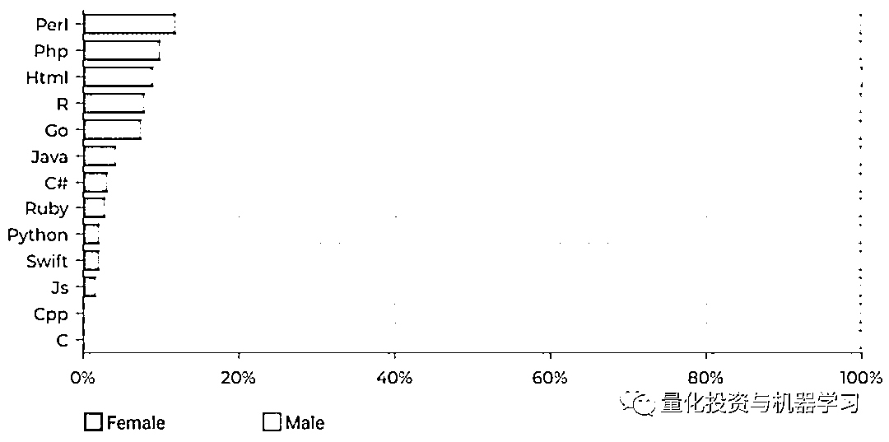
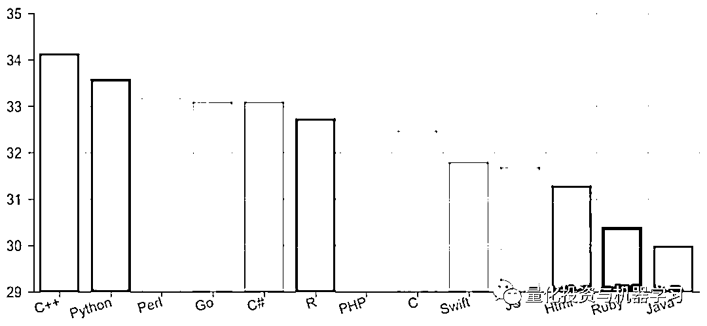
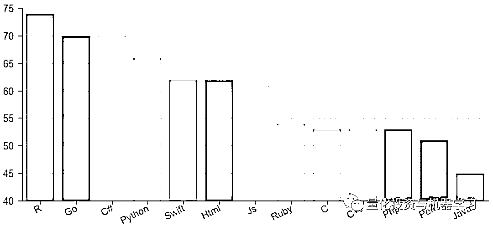
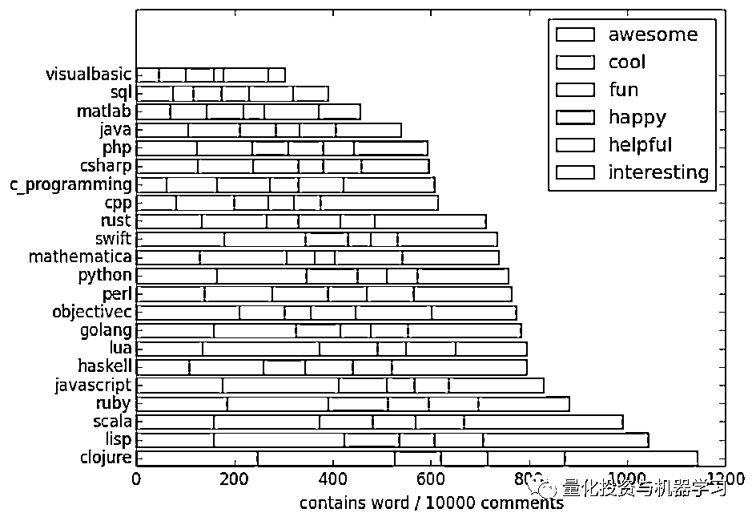
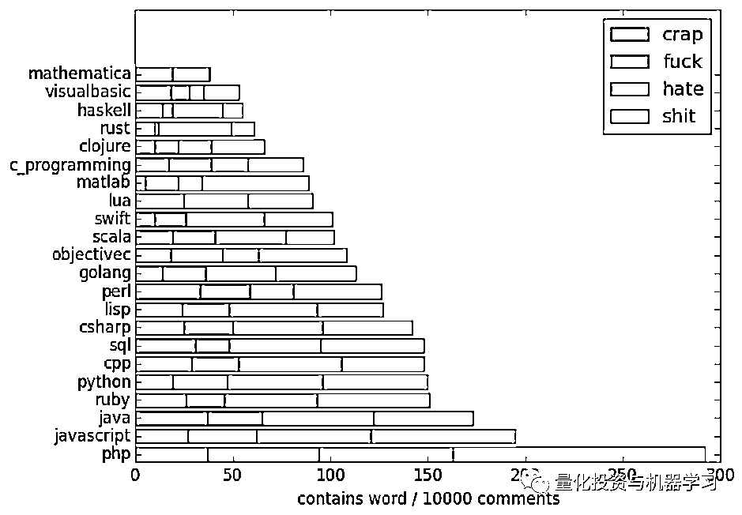
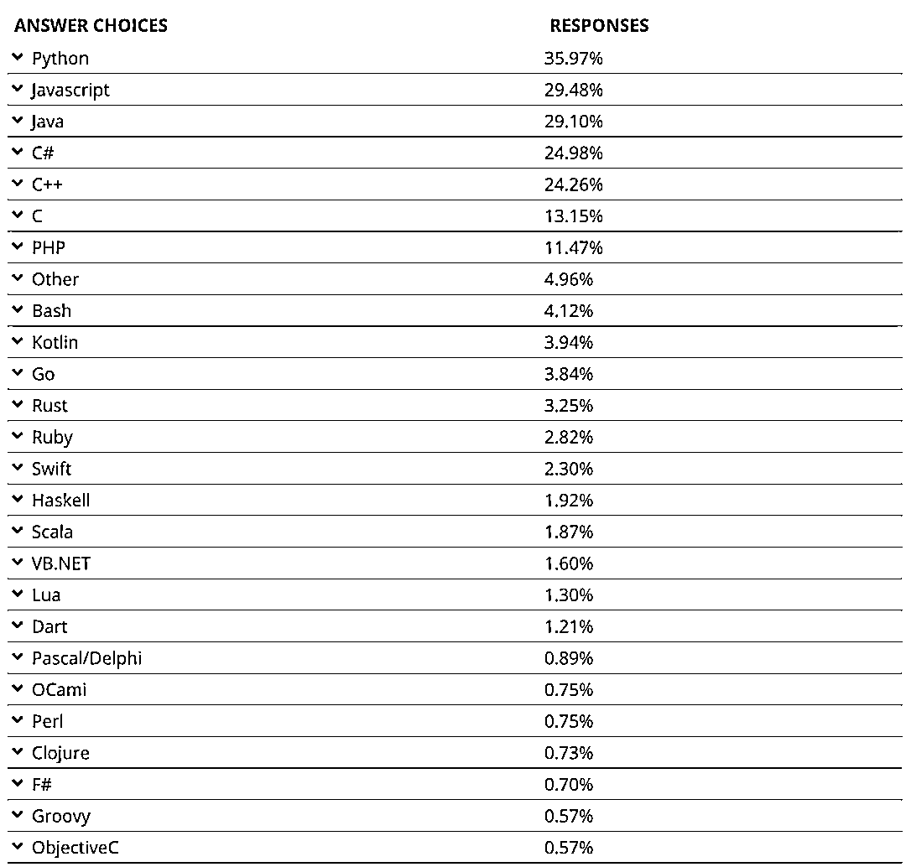
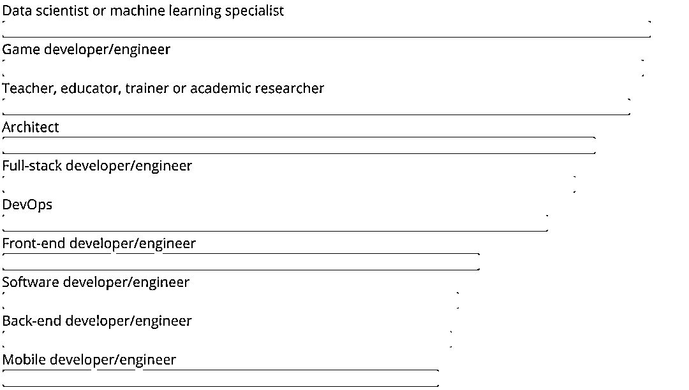
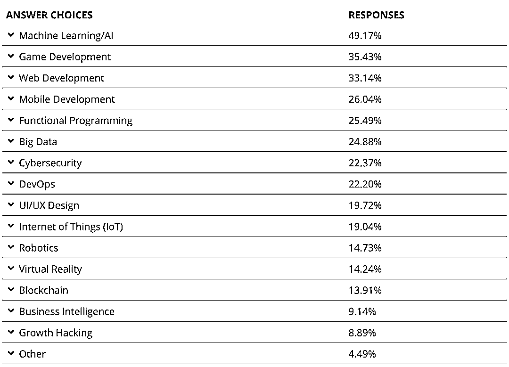

# 最幸福的编程语言：第一名竟然是它！PHP 受尽吐槽~

> 原文：[`mp.weixin.qq.com/s?__biz=MzAxNTc0Mjg0Mg==&mid=2653298233&idx=1&sn=0eaa9312302073f17a78724337f8de22&chksm=802ddc2cb75a553aefbc3a6e00aea56f6a3f1f5289a6b5951a7c622cfb04dd33ee5fe26c0c3d&scene=27#wechat_redirect`](http://mp.weixin.qq.com/s?__biz=MzAxNTc0Mjg0Mg==&mid=2653298233&idx=1&sn=0eaa9312302073f17a78724337f8de22&chksm=802ddc2cb75a553aefbc3a6e00aea56f6a3f1f5289a6b5951a7c622cfb04dd33ee5fe26c0c3d&scene=27#wechat_redirect)

**标星★****置顶****公众号     **爱你们♥   

来自：Quant 最爱

IT 界有很好梗，比如：

今天，我们通过 Github 和来自开发者调查的数据给大家揭秘，哪门编程语言让最让开发者快乐最幸福！

***1***

**数据来源**

Github 提供了 25 个最受欢迎的库列表，并显示了前 5 个贡献者。我们将使用 Eigencoder 应用程序，它可以从每个存储库中检测 30-80 张个人资料照片，并对其进行分析。

***2***

**性别**

人脸 API 具有从面部结构检测性别的能力。这里的结果是相当片面的。AI 和 Webdev 语言至少有一些女性的的存在。

***3***

**年龄**

这个年龄指标很有意思。老一辈编程人员使用较老的语言，但 Java 拥有最年轻的开发人员。

***4***

**微笑程度**

每个程序员都有他不喜欢的语言，Face API 使用 0 到 1 之间的值测量他们头像的微笑的程度。

从下图看，**R 语言最让开发人员快乐和幸福**，紧随其后的是 Go、C#和 Python。

***5***

**评论分析**

我们通过分析每种编程语言开发者使用的评论来进行分类：

**让开发者最快乐的编程语言**

**Clojure**

**让开发者最抱怨的编程语言**

**PHP**

Mathematical 的开发人员似乎最轻松。

这也和 CodinGame 的调查如出一辙，在下面这张**开发者最害怕的编程语言**图中，PHP、Java 和 Javascript 榜上有名，且 PHP 又是第一名，哈哈

PHP 说：**任凭你们随便排名，反正我东方不败。**

这两三种编程语言似乎使开发者产生了两级分化：

**要么特别喜欢，要么特别讨厌**

开发者最害怕的编程语言

我们还将着眼于每个具体行业开发者的幸福水平。根据 CodinGame 的调查，第一名是：

**数据科学家 / 机器学习专家**

这也在情理之中，从下面这张图就可以看出，开发者最感兴趣的方向第一名就是：

**机器学习 / 人工智能**

如果你觉得你是统计中的一个例外，欢迎在**留言**处吐槽哦！

量化投资与机器学习微信公众号，是业内垂直于**Quant、MFE、Fintech、AI、ML**等领域的**量化类主流自媒体。**公众号拥有来自**公募、私募、券商、期货、银行、保险资管、海外**等众多圈内**18W+**关注者。每日发布行业前沿研究成果和最新量化资讯。

你点的每个“在看”，都是对我们最大的鼓励