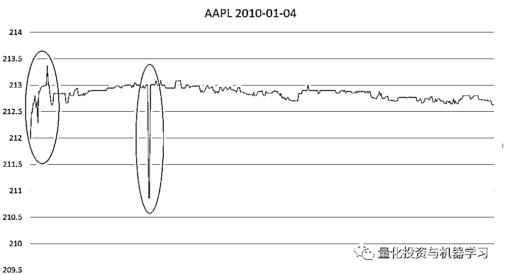

# 如何识别损坏的 Tick 数据，今天教你来修复！

> 原文：[`mp.weixin.qq.com/s?__biz=MzAxNTc0Mjg0Mg==&mid=2653298221&idx=1&sn=61fb5c005ac58566776dbf0c6df7a69d&chksm=802ddc38b75a552e5e3af52cddc4ef43feef80816cdc1a152278e26ce6beb7a0a70cabbf0441&scene=27#wechat_redirect`](http://mp.weixin.qq.com/s?__biz=MzAxNTc0Mjg0Mg==&mid=2653298221&idx=1&sn=61fb5c005ac58566776dbf0c6df7a69d&chksm=802ddc38b75a552e5e3af52cddc4ef43feef80816cdc1a152278e26ce6beb7a0a70cabbf0441&scene=27#wechat_redirect)

**标星★****置顶****公众号     **爱你们♥   

作者：Ryan     编译：1+1=6

**未经允许，禁止转载**

Tick 数据是市场微观结构分析中最有用的数据。可是，Tick 数据也是最容易受数据损坏影响，因此在用于任何形式的分析之前必须要进行清洗和调整。

***1***

**数据损坏的原因是什么？**

由于数据量大，Tick 数据特别容易受到数据损坏，有些股票的数据可以达到每天 10 个 Tick，这使得错误检测非常具有挑战性。通常情况下，**是信号中断或信号延迟导致了损坏的或无序的数据。**

***2***

**定义损坏数据**

在生成数据过滤器之前，我们首先需要指定什么是构成 Tick 损坏的因素。一个常见的错误是，仅仅因为测试数据与其附近的数据点不一致（偏差特别大），从而排除有效数据（事实上，这些 Tick 在模拟交易中往往最有用，因为它们提供了市场方向的信息，或者它们本身就是交易机会）。  

因此，需要在数据**完整性**和**完全性之间进行权衡**，权衡的基础是分析对损坏数据的敏感程度。

***3***

****使用什么工具对数据进行检查、清洗****

很少有现成的工具来清理时间序列数据，而且由于 Excel 的内存问题，它并不适合（在大多数系统中，Excel 无法有效地处理超过 100 万行的表格，且这些表格可能只有几周的时间序列数据）。OpenRefine（以前是 GoogleRefine）等工具通常更适合于结构化数据。  

**自定义 Python 脚本可能是最灵活和最有效的方法，也是在时间序列数据集在的机器学习中最常用的方法。**

**损坏数据的测试类型**

有许多类型的 Tick，每一种类型需要不同的测试：

*   **0 或负的价格/成交量**

这是最简单的测试方法，只要 Tick 的价格或成交量为 0 或者负，可以立即丢弃。

*   **同时观察**

对于同一个时间戳，常常可以观察到多个 Tick。由于建模 Tick 数据的超高频模型通常需要对每个时间戳进行单个的观察，因此需要执行某种形式的聚合。**对于 b****id/ask 数据，我们将使用最高 bid 和最低 ask（前提是 bid 仍然小于或等于 ask），并将 bid 和 ask 的成交量合并起来。**

Trade 数据更有问题，因为它不容易聚合。我们通常倾向于**将成交量进行合并，然后使用单一的成交量加权价格。**

***4***

**bid/ask 反弹**

bid/ask 的价格反弹，实际上所发生的情况是 bid/ask 报价保持不变，而交易员在 bid/ask 报价时卖出，给人以价格在交易记录数据上变动的印象。

bid/ask 价的反弹是许多分析师只使用 bid/ask 价格序列而忽略 Trade Tick 数据的主要原因。然而，如果 Trade Tick 数据是必要的，那么消除反弹的一个方法是只**接受 Trade Tick 变动幅度大于前一个 Tick 的 bid/ask 变动幅度**（这就是为什么有必要同时使用 Trade Tick 数据波动幅度和 bid/ask 波动幅度的主要原因）。

在上面的图中，可以在高亮的红色区域看到 bid-as 价格的反弹。在 bid-ask 反弹期间，价格似乎会随着 bid-ask 报价的执行而上下波动；然而，这种模式可以通过没有趋势的重复价格清楚地识别出来。

***5***

**低成交量 Tick**

虽然低成交量的 Tick 不一定是一个错误，但它们包含的信息很少，通常被认为是噪音并被删除。

***6***

**数据缺失**

系统中断和网络中断可能导致 Tick 不被记录。虽然缺失的信息如果从未被记录下来是无法弥补的，但分析人员可能仍然希望记录下可能存在缺失时间段，因为它可能会给出一些人为的信号，例如价格或成交量的突然变动，而实际上这种变动是较为平缓的。

Tick 数据的一个特点是，这些数据通常具有时间集群性，其中有大段时间的不频繁交易，然后有较短时间的频繁交易，并产生大量的 Tick。考虑到 Tick 分布的不均匀性，测试 Tick 缺失并非易事；**一种可能的方法是生成缺失长度和缺失标记的分布，这些长度和标记超过其平均值的三倍标准偏差（与收益率不同，缺失数据相对呈正态分布）。**

***7***

**异常值**

清除异常值是清理过程中最具挑战性的部分，也是最需要判断的部分。缺乏经验的分析师往往会将损坏数据门槛设置得很低，排除任何看似不正常的数据，并删除对理解市场结构至关重要的有效数据。去除异常值有几好几种方法，我们采纳的是 Brownlees 和 Gallo 在其一篇论文中的方法：

大家可以下载论文自行查看。但是这个过程需要进行一些测试，因为分析人员必须评估有多少 Tick 可能是错误的（一般来说，我们认为所有 Tick 中只有不到 2%是错误的）。

在上面这张 2010 年 1 月苹果股价的走势图中，一个异常值用红色标出，而非异常值用黑色标出。主要的区别在于波动性与周边 Tick 之间的差异——非异常值出现在高波动期，而异常值出现在低波动期，显然与附近的 Tick 不一致。

***8***

**最终结果**

最终的结果应该是一个没有明显错误和遗漏的数据集。最后的测试通常是使用图表工具绘制数据走势图。它需要经验的研究员来直观地进行识别，当然，即使是没有经验的分析人员也能够识别明显的错误，比较图像很直观。

后面我们会带来更多关于 Tick 数据的文章。

量化投资与机器学习微信公众号，是业内垂直于**Quant、MFE、Fintech、AI、ML**等领域的**量化类主流自媒体。**公众号拥有来自**公募、私募、券商、期货、银行、保险资管、海外**等众多圈内**18W+**关注者。每日发布行业前沿研究成果和最新量化资讯。

你点的每个“在看”，都是对我们最大的鼓励