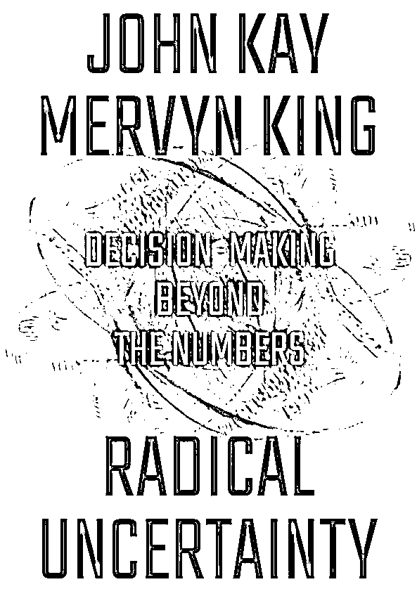
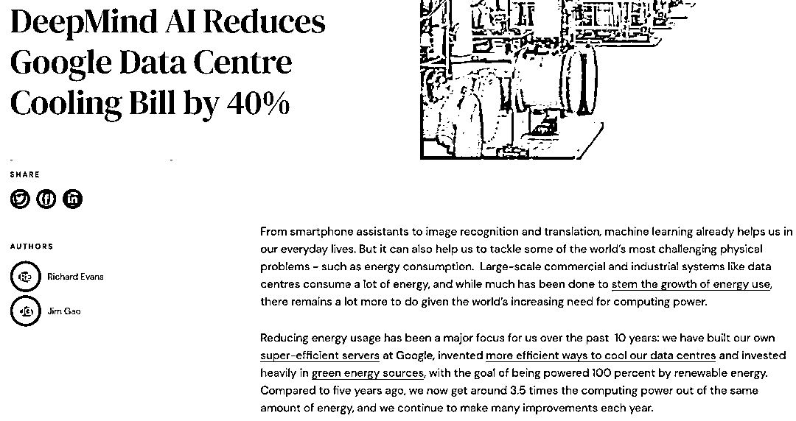

# 什么时候『不用』机器学习做预测？

> 原文：[`mp.weixin.qq.com/s?__biz=MzAxNTc0Mjg0Mg==&mid=2653298211&idx=1&sn=ff1011957a7631f9d911e3865bf95914&chksm=802ddc36b75a5520c5b11f2ccdbbc33c6d0d37cfecb240f74fad1ec917aa473383b70152be6a&scene=27#wechat_redirect`](http://mp.weixin.qq.com/s?__biz=MzAxNTc0Mjg0Mg==&mid=2653298211&idx=1&sn=ff1011957a7631f9d911e3865bf95914&chksm=802ddc36b75a5520c5b11f2ccdbbc33c6d0d37cfecb240f74fad1ec917aa473383b70152be6a&scene=27#wechat_redirect)

**标星★****置顶****公众号     **爱你们♥   

作者：Pease     编译：1+1=6

**未经允许，禁止转载**

***1***

**前言**

2007 年的高盛暂停了旗下 3 只在法国巴黎银行基金的赎回（人们普遍认为这是金融危机的开端）。几天后，高盛首席财务官 David Viniar 向英国《金融时报》表示：“我们看到连续几天出现了 25 个标准差的波动。”从字面上看，这种可能性非常低，让我们感觉不足以发生这样的事件。

在上述情况下，使用算法决策/机器学习要么表现不佳，要么非常不合适。公众号推荐给大家一本书，书名是《Radical Uncertainty—decision making for an unknowable future》，作者是 Mervyn King 和 John Kay。这可能会给大家很多启发让你联想到机器学习在预测中的作用。

***2***

**不同的推理方式**

**演绎推理**

比如：我住在上海，上海在中国，所以我住在中国。

**归纳推理**

比如：对过去选举结果的分析表明，选民在有利的经济条件下会支持现任政党。在 2016 年的美国总统大选中，他们的经济状况既非有利也非不利。因此，选举将是势均力敌的。这种推理使用过去发生的事件来推断未来可能的结果。

**溯因推理**

指用假设的理论去与经验相对照，以证明理论的正确性。

这些类型的推理对应于以下机器的复杂程度：

演绎推理——事实上，演绎推理是所有计算机代码的基础。例如，如果“a”等于“b”，“b”等于“c”，那么逻辑上“a”等于“c”。

归纳推理——机器学习通过使用过去的数据对未来进行推断。

溯因推理——计算机在这方面做得很差，因为通常不清楚要使用哪些数据，而且可用的数据很可能是不完整的。

几乎可以这样定义，**历史数据只在一定程度上对特定事件的响应有用。** 

***3***

**平稳性**

机器学习模型的一个关键假设是“平稳性”——也就是说，被建模对象的潜在概率分布不会改变。简而言之，这意味着系统无法对当前对其未来状态的预测做出反应。

在构建金融模型时，假设是不可避免的，因此，我们的目标在于如何做出假设，使模型不因预期目标而失效。在讨论机器学习模型时，我们经常提倡的一条格言是奥卡姆剃刀。奥卡姆剃刀（Ockham’s Razor）认为，在两种预测精度相当的模型中选择参数较少和/或假设较少的模型，这样可以更广范围的去应用。**许多实践者误解了这一观点，认为“越简单的模型越好”。****这是不对的****。**

******解读：******

奥卡姆剃刀定律（Occam's Razor, Ockham's Razor）又称“奥康的剃刀”，它是由 14 世纪英格兰的逻辑学家、圣方济各会修士奥卡姆的威廉（William of Occam，约 1285 年至 1349 年）提出。这个原理称为“如无必要，勿增实体”，即**“简单有效原理”**。正如他在《箴言书注》2 卷 15 题说“切勿浪费较多东西去做，**用较少的东西，同样可以做好的事情**。

只有当模型具有相同的预测精度时，越简单越好。如果不是这样，简单的模型往往是不充分并且不适合所有数据。不幸的是，**我们认为研究人员喜欢用“越简单的模型越好”的论点来逃避危险的假设，这些假设使他们的模型更容易处理、更优雅，但也更错误**。计算金融（Computational Finance）的好处在于，它允许我们创建和处理更棘手、不那么优雅、但也更现实和更准确的模型。

在金融危机之前，银行使用 VaR 模型来计算风险。些模型始于上世纪 80 年代，有两个关键的输入参数：特定资产的日收益率和不同资产之间收益率的协方差。利用这两个数据，我们可以构建一个概率分布，详细描述单日资产组合在某一天的最大可能亏损概率分布。那么这两个值是怎么计算出来的？当然是历史数据！

然而，这些历史数据来自银行尚未遭受严重亏损的时期。同样，2007 年以前，抵押贷款违约主要是个人行为（如失业），因此两者之间没有相关性。然而，当贷款依赖于房价上涨时，房价的任何下跌都可能导致许多的违约。因此，在某些情况下，被认为协方差低的资产最终会有很高的协方差。这个系统只在一定条件下是恒定的。

当然，在很多情况下，平稳性的假设都是成立的。例如，考虑一个机器学习算法，它可以查看肿瘤图像并预测肿瘤癌变的可能性。肿瘤当然不会对算法做出的预测做出反应，并在未来采取更好的“伪装”。

这并不是说机器学习在非平稳环境中没有用处，它们肯定有用。然而，在**解释这些模型的结果时需要格外小心。以下是一些防止模型失败的建议方法：**

1、对模型性能的持续监控。

2、良好的判断力。《Radical Uncertainty》的作者提出了一个很好的判断，他建议你问一个简单的问题：**“这里发生了什么？”**。以高盛为例，这意味着要认识到，在金融危机的环境下，它们的资产关联度远高于其模型所假定的水平，因此它们的模型价值有限。

因此，你要知道这样一句话：

**模型环境越不稳定，对机器学习就要越警惕！**

***4***

**决策的重要性**

比如：我们的不公平感部分来自于对个人做出错误决定的后果。当然，我们都是独一无二的，但很少有人反对 Netflix 的不公正推荐。毕竟，不推荐一部好电影的成本是相当低的。然而，我们可能会对被自动算法筛选拒之门外感到更不舒服。虽然我不是这个职位的理想应聘者，但我认为我肯定是一个合适的人选。为什么我被拒绝呢?

一个事件越独特，我们就越能用叙述的方式向对方解释这个事件。例如，特朗普赢得 2016 年总统大选是对希拉里的政治回应。这些解释不能被有意义地描述为最优的，实际上可能有许多自相矛盾的解释。另一方面，机器学习从历史相关性的角度进行解释，因此很难解释和创建一个关于事件的叙述。

当然，这并不是说机器学习不能用于重要的决策和独特的事件。然而，情况越是如此，我们就越应该**重视可解释****性，并对模型的局限性进行正确的判断。**

因此，你要记住：

**一个决策越重要，一个事件越独特****对机器学习就要越警惕！**

***5***

**案例**

下面用一些机器学习的例子来说明我们所说的在实际工作中的应用：

**1、一种癌症肿瘤检测算法。**该问题是平稳的，但决策的重要性很高。 需要小心使用可解释性。

**2、数据中心（Data Centre）优化。**环境是平稳的，每个决策的重要性很低。所以机器学习可以发挥很好的作用。类似下面这篇文章：

https://deepmind.com/blog/article/deepmind-ai-reduces-google-data-centre-cooling-bill-40

**3、Netflix 推荐算法。**非平稳的环境（人们的偏好随时间变化），但决策成本很低。机器学习可以很好的应用。

**4、临床试验预测。**非平稳环境（新的试验设计规范、更高的护理标准），决策成本高。可解释性是必须的，所以机器学习应该谨慎使用。

**5、股价预测。**非平稳的环境（低信噪比和非平稳的价格分布），决策的重要性高（需要对买卖进行把控）。所以机器学习应该谨慎使用。

***6***

**总结**

总之，当你遇到机器学习的问题时，你应该问自己 2 个问题：

*   **模型环境是平稳的吗？**

*   **每个模型的预测有多重要和独特？**

最后，如果上述任何一种情况都适用，那么就有必要不断地提出《Radical Uncertainty》作者提出的问题：“这里发生了什么？”。

我们以这句话作为今天推文的结束语：

**真的很难预测，尤其对未来的预测！**

量化投资与机器学习微信公众号，是业内垂直于**Quant、MFE、Fintech、AI、ML**等领域的**量化类主流自媒体。**公众号拥有来自**公募、私募、券商、期货、银行、保险资管、海外**等众多圈内**18W+**关注者。每日发布行业前沿研究成果和最新量化资讯。

你点的每个“在看”，都是对我们最大的鼓励