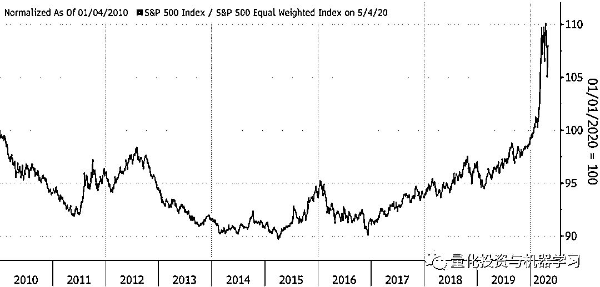
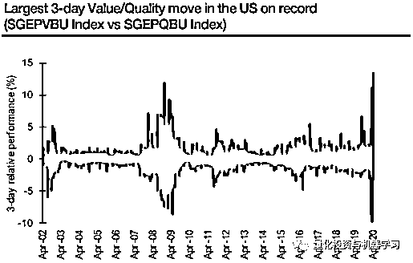
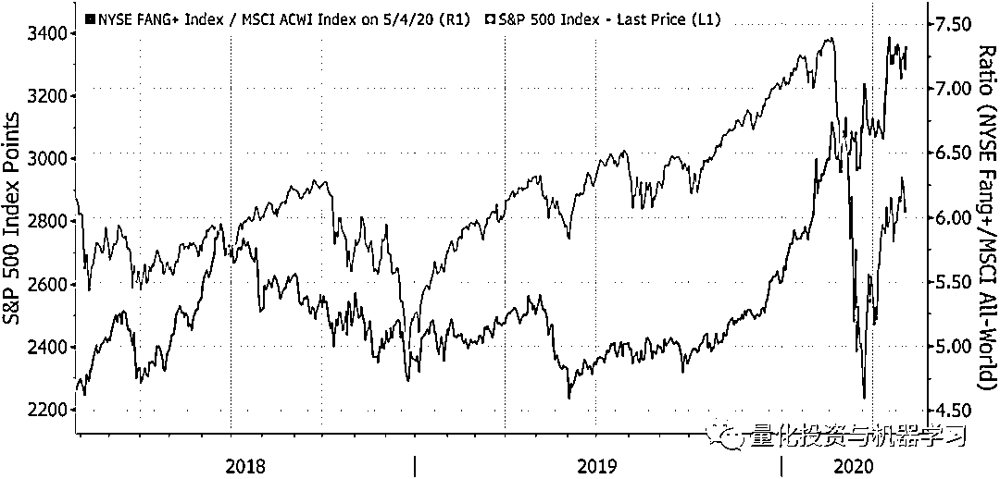
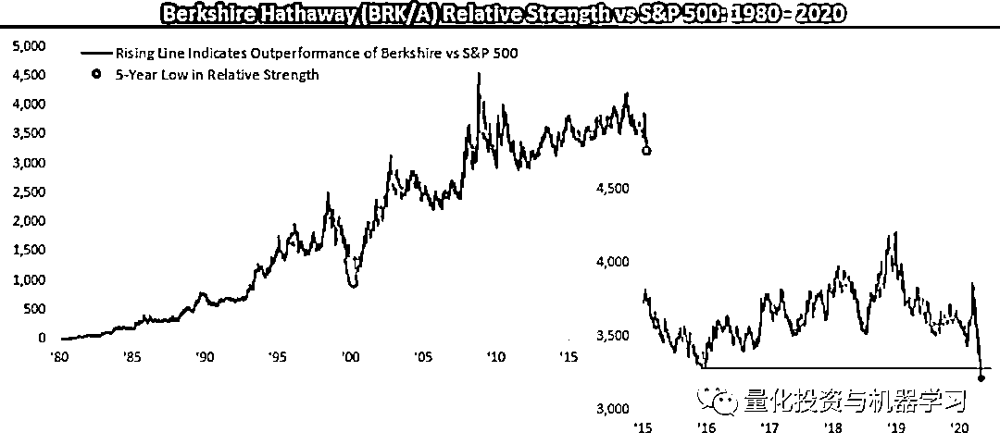
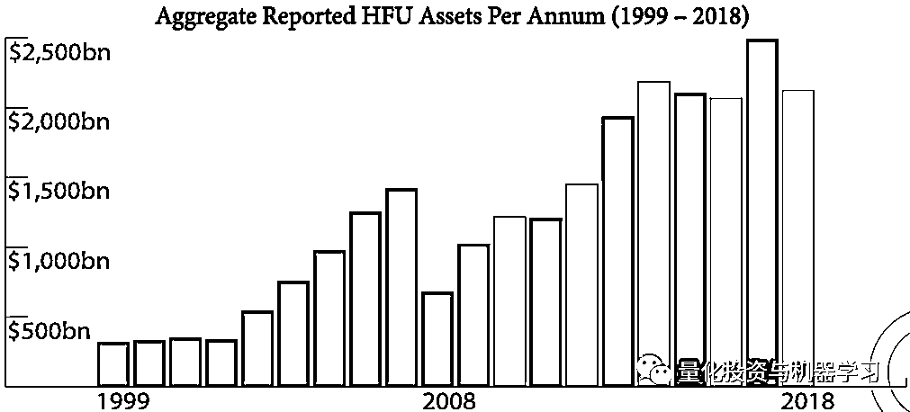
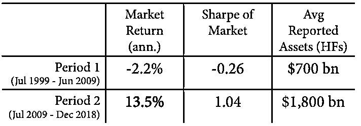
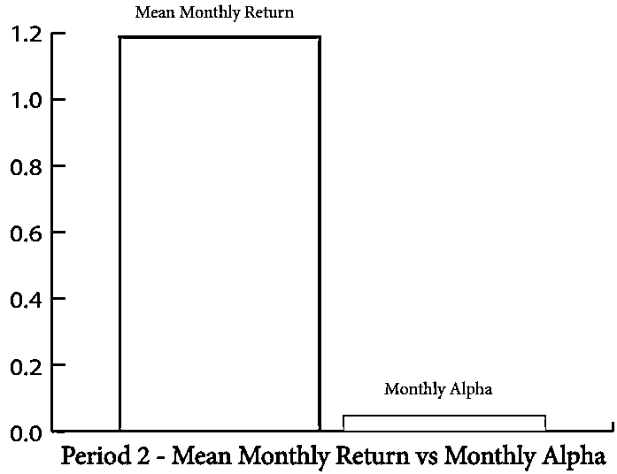
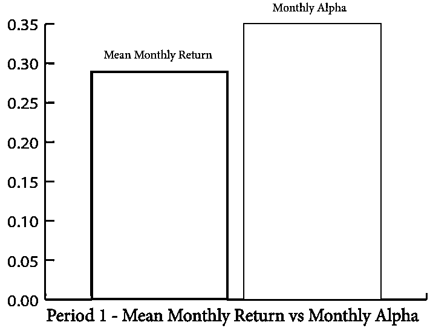
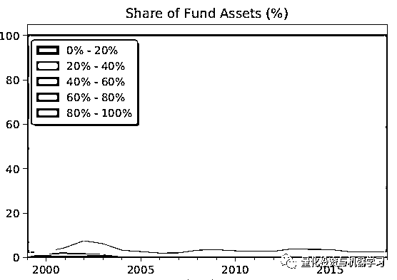
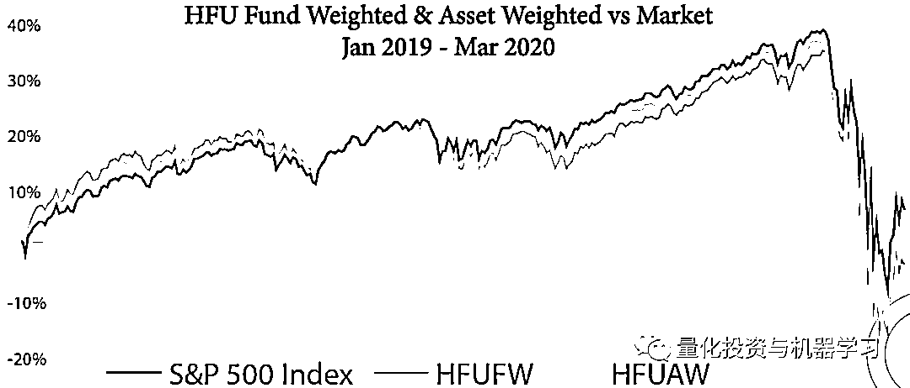

# 对冲基金已不是巴菲特那个时代了！

> 原文：[`mp.weixin.qq.com/s?__biz=MzAxNTc0Mjg0Mg==&mid=2653298207&idx=1&sn=26bae1b68bf8027e7ec6639f478d3e7f&chksm=802ddc0ab75a551cafb8ae04b9afc766de29e8012b22ccf889f1eda38ee80245235f73fe7b97&scene=27#wechat_redirect`](http://mp.weixin.qq.com/s?__biz=MzAxNTc0Mjg0Mg==&mid=2653298207&idx=1&sn=26bae1b68bf8027e7ec6639f478d3e7f&chksm=802ddc0ab75a551cafb8ae04b9afc766de29e8012b22ccf889f1eda38ee80245235f73fe7b97&scene=27#wechat_redirect)

**标星★****置顶****公众号     **爱你们♥   

作者：John     编译：1+1=6 **未经允许，禁止转载**

2010-2020 这十年刚刚过去四个多月，但对于任何试图战胜市场的人来说，这已经是一个可怕的十年了。下表展示了标普 500 指数的表现，其中每个成份股占指数的 0.2% 。当这条线向下倾斜时，意味着整体指数表现比平均股票差，这也创造了一个靠运气击败市场的好机会。当指数上升时，它比一般股票表现更好（这意味着实际上大公司占主导地位）。

*图片来自：彭博

这看起来很极端，因为确实如此。在这样的环境下，股市已经准备好迎接奇怪的逆转，但是把握好时机几乎是不可能的。下图来自 SG Cross 资产研究公司首席量化策略师 Andrew Lapthorne。该图显示，与近有记录以来（20 年），与资产负债状况良好的优质公司相比，价值股刚刚经历了最好的 3 天涨势。之所以会出现这种情况，是因为价值此前遭到了恶性抛售，而投资者大举买入了最不可能破产的股票：

*图片来自：SG Cross

最主要的罪魁祸首是 FAANGs（Facebook、Amazon、Microsoft、Apple 和 Google 的母公司 Alphabet）。本周一，大型互联网股的主导地位再次发挥作用，标普 500 指数收盘上涨。下跌股票的数量几乎与上涨股票的数量相等。这是 FAANGs 造成的差异。

这是一个长期的趋势，但在过去的 7 个月左右时间，它已经进入了一个新的阶段。下图始于 2018 年 1 月市场见顶时，随后经历了两次大幅回调。从那时到去年秋天，标普 500 指数没有取得任何重大进展，纽交所 NYSE Fang+指数整体上也没有超过全球股市。从那以后，标普指数开始暴涨暴跌，并呈现出 v 型复苏。而 Fangs 几乎在每一步上都比它做得更好：

*图片来自：彭博

上周末，我们在线上收听了巴菲特得股东大会，股神巴菲特在首次于线上举行的伯克希尔哈撒韦股东大会上承认，自己看错了航空股，坐拥巨额现金储备的伯克希尔因此亏本清仓了所有航空股股票，且目前没有发现任何有吸引力的投资标的。巴菲特没有介入市场，部分原因在于美联储对金融市场危机处理得很好，减少了企业向伯克希尔哈撒韦求援的机会。

简单来说，在 3 月底美国信贷市场即将陷入冻结的时候，美联储采取的强有力行动意味着遇到困难的公司不再那么需要转向伯克希尔哈撒韦寻求融资，债券发行量也美联储迅速行动之后达到了很高的水平。

也就是说，由于美联储为企业提供了流动性，因此，伯克希尔哈撒韦不再需要这么做。

周一的市场反应非常消极。对许多人来说，危机冲击了市场，但巴菲特却找不到利用机会的方法，这种想法让许多人感到震惊。正如来自 Bespoke Investment Group 的研究表明（下图），这是自互联网泡沫即将破裂以来，伯克希尔哈撒韦 20 年来与标普 500 指数相比表现最糟糕的一次表现。

*图片来自：Bespoke

事实证明，这是买入伯克希尔股票的大好时机。这一次比较棘手。由于互联网巨头的存在，市场看起来并没有那么好，而巴菲特肯定无法在这样的水平上大举投资。但如果他真的觉得在当前的估值水平上没有什么其他的吸引力，这就意味着，在伯克希尔开始兑现承诺之前，美联储将不得不让市场下跌很长一段时间。

巴菲特有一些问题，因为他实际上已经变成了一个信号的机器。事实上，他放弃了他一贯轻松自在的态度，但在很大程度上，他的动机是相当直接的——如果他有信心能产生巨的大收益，他就会配置伯克希尔的现金，否则他就会让它原封不动。

对冲基金经理希望吸引基金，并产生超额收益，从而产生业绩费用。在过去的十年里，他们在前者中获得了巨大的成功，而在后者中惨败（费用）。

Epsilon 的一研究报告篇显示，**对冲基金通过长期选股所产生的 Alpha 在 20 年内是有意义的。不幸的是，对于现在的投资者来说，这种价值已经随着时间的推移而减少了**。这可能是整体市场环境的作用，也可能是对冲基金行业相对规模增长的作用。下面这张图显示了股票对冲基金的基金总额，正如 Epsilon 的团队所研究的那样：

*图片来自：Epsilon

该研究还探讨了**对冲基金最高预期收益的头寸表现与其他投资组合头寸之间的动态关系**。从表面上看，它们是所持资产的圣杯，但实际上，**它们与其它投资组合的表现几乎没有什么不同。**

该分析涵盖了 20 年的数据和近 1500 名基金经理。同时，Epsilon 将 20 年分为两个 10 年的时间段：

*   第一阶段（1999 年 7 月至 2009 年 6 月）

*   第二阶段（2009 年 7 月至 2018 年 12 月）

前者见证了美国经历了两次熊市。与此同时，对冲基金的足迹要小得多（例如一组基金经理在第一时期的平均资产规模为 7000 亿美元，而在第二时期的资产规模为 2 万亿美元）。基金经理在第一时期的表现相当不错，无论是绝对收益还是相对收益。根据三因子模型，基金经理每年产生大约 350-400 个基点（3.5% - 4%）的 Alpha。这种 Alpha 出现在市场产生负绝收益的时期。

*图片来自：Epsilon

第二阶段更具挑战性。这一时期可以被描述为一个无节制的牛市，市场的高夏普比率就证明了这一点。正如上面提到的，在这 10 年里，对冲基金的足迹要大得多。

图片来自：Epsilon

第二阶段可以被描述为一个通过 Beta 进行投资的绝佳时期：遵循指数和被动策略，巨大的经济收益仅仅是通过市场暴露产生的。这对主动管理者来说是一个巨大的障碍，他们很难推动不同的结果，而在这一时期产生的 Alpha 绝对数量显著下降。

图片来自：Epsilon

总结：从 1999 年开始的 10 年里，对冲基金行业或多或少仍是由巴菲特在上世纪 60 年代管理过的那种机会主义投资工具组成。在接下来的十年里，它们演变成了更大、更机构化，最终变得更慢、更笨拙。

请注意，这些收益是在对冲基金收取过高费用之前的。部分问题在于，随着基金规模的扩大，它们往往会持有更多的股票，并向综合指数靠拢。下图按照基金的活跃股票或不同于直接持有其基准指数的投资组合比例来衡量基金。对冲基金经理比共同基金更加活跃，但随着时间的推移，他们的活跃程度在稳步下降。

这使他们陷入了可怕的境地。市场上有句老话，没有人会因为持有 IBM 股票而被解雇。 但是没有一家对冲基金会被雇佣来持有 FAANGs 的股票。在指数基金中，投资这些公司的成本要低得多。例如，如果一位基金经理真的相信微软，那么除非他准备下一个大赌注，将 10%或更多的资金投入一只股票，否则就没有必要采取行动。但与避免 FAANGs 的动机相反，一个事实是，今年赚钱的最佳方式是持有 FAANGs。

研究最重要的结果是：**作为一个整体，对冲基金经理能够通过他们的长期股票投资组合产生统计上显著的 Alpha。**

Epsilon 发现，如果不根据基金经理的规模进行调整，其年化 Alpha 约为每年 1.1%至 1.6%。我们把所有对冲基金的规模加权组合称为：HFUAW。在这一综合指数中，资产规模较大的公司比资产规模较小的公司权重更大。

当平等对待每一位基金经理时，不管他们投资组合的市值如何，对冲基金 Alpha 的收益率接近 2.5%。我们把所有对冲基金的基金加权组合称为：HFUFW。在这一综合指数中，大型基金的表现相对较差。

简而言之前者可被视为与标普 500 cap-weighted 等同，后者可被视为与标普 500 equal-weighted 等同。

为了进一步证实这一与规模相关的发现，Epsilon 将基金分为两部分：较大的基金和较小的基金。Epsilon 测量了两个部分的性能和 Alpha。与规模较大的基金相比，规模较小的基金产生了超过 60 个基点的超额年度收益。

图片来自：Epsilon

另一方面，大型对冲基金在 FAANGs 储备了更多的资金。不管怎样，每个人都认为这是一个极其困难的市场。除了巴菲特和对冲基金行业外还有高盛的 David Kostin。他在上周明确地指出了这个困境：

*五家最大的公司加起来占标普 500 指数市值的 20%，为 30 多年来最高度的集中。尽管该指数仅比历史高点低 14%，但标普 500 指数成份股的中位数仍比历史高点低 23%。*

*最终，狭窄的市场宽度总是以同样的方式得到解决。通常情况下，小幅上涨会导致股市大幅下跌，因为少数几家市场领军企业最终无法产生足够的盈利实力，以证明提高的估值和投资者拥挤度是合理的。狭窄的反弹会导致大规模撤资。在这种情况下，例如 2000 年的 5 只股，会让市场领先者会赶上较弱的同行。在另一些情况下，经济前景的改善和信心的增强有助于落后的企业赶上市场领先者。在这两种情况下，市场领先者的相对优势最终都会让位于表现不佳。*

量化投资与机器学习微信公众号，是业内垂直于**Quant、MFE、Fintech、AI、ML**等领域的**量化类主流自媒体。**公众号拥有来自**公募、私募、券商、期货、银行、保险资管、海外**等众多圈内**18W+**关注者。每日发布行业前沿研究成果和最新量化资讯。

你点的每个“在看”，都是对我们最大的鼓励